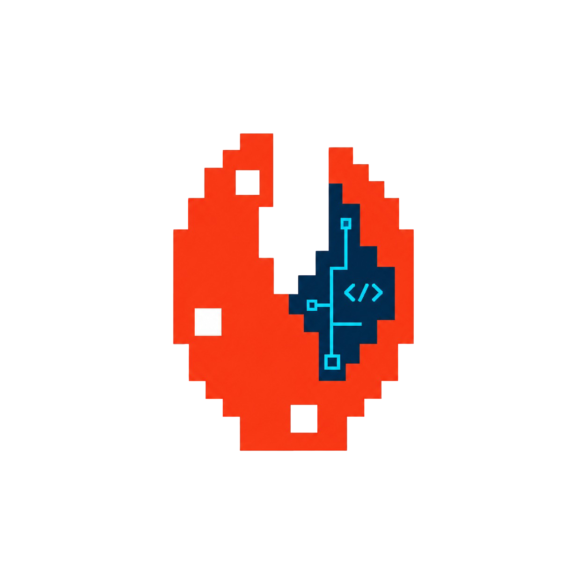

# nllclw

<p align="center">
  
</p>

`nllclw` is a tiny local AI assistant written in Zig `0.16`. It talks to
OpenAI-compatible Chat Completions providers, keeps local memory, runs a
capability-gated tool loop, and ships as a standalone binary with no runtime
dependency on provider SDKs, `curl`, Node, Python, or a shell.

The default build uses Zig stdlib adapters only. The optional `shell_exec` tool
exists only in the explicit `-Dshell-tool=true` build.

Start here:
[download](#download-a-release) · [quick start](#getting-started) · [docs](docs/README.md) ·
[configuration](docs/en/configuration.md) · [security](docs/en/security.md) ·
[development](docs/en/development.md)

## Overview

`nllclw` is a compact Zig codebase for studying and extending a local AI
assistant.

The core agent concepts stay visible: provider calls, streaming, tools, memory,
channels, config loading, local state, and safety boundaries.

## Project Fit

Use `nllclw` when you want:

- a small Zig codebase that shows the whole assistant loop;
- a single binary with no default runtime dependency on Node, Python, `curl`, or
  a shell;
- OpenAI-compatible providers without a provider SDK;
- local memory, filesystem tools, scheduling, WebSocket, and Telegram in a
  conservative default runtime;
- a starting point for your own assistant rather than a large plugin platform.

## Download a Release

Prebuilt binaries are attached to
[GitHub Releases](https://github.com/nullclaw/nllclw/releases). Download the
asset for your OS and CPU, make it executable on Unix-like systems, then run:

```sh
./nllclw --help
./nllclw init
```

Release tags are date-based, for example `v2026.6.1`. The `nullbuilder` release
workflow is configured to build Linux, macOS, Windows, Android, and source
archive assets. Linux, macOS, and Android assets use `.bin`; Windows assets use
`.zip`; the source archive includes the release tag in its name. The workflow
also publishes a container image to GitHub Container Registry when GitHub
Actions runners are available:

```sh
docker run --rm ghcr.io/nullclaw/nllclw:v2026.6.1 --help
```

While the repository is private, GitHub release assets and GHCR images require
access to `nullclaw/nllclw`.

## Getting Started

Download the latest binary from
[GitHub Releases](https://github.com/nullclaw/nllclw/releases/latest), extract
it, make it executable on Unix-like systems, then run:

```sh
./nllclw --help
```

Run the setup wizard once. It writes user config outside the repository:

```sh
./nllclw init
```

The wizard uses numbered menus for provider, optional token cap, assistant
style, local capability profile, Telegram, WebSocket, and web search.

Ask a question:

```sh
./nllclw "what are you?"
```

Start the terminal chat loop:

```sh
./nllclw
```

Start Telegram polling after configuring Telegram in `init`:

```sh
./nllclw telegram
```

Useful first checks:

```sh
./nllclw status
./nllclw doctor
./nllclw memory list
./nllclw schedule list
```

Configuration priority is:

1. OS environment variables.
2. `config.json` in the user config directory.
3. `.env` in the user config directory.

Default state files live under the platform user state directory, not beside
the binary and not in the current project. For normal use, prefer the
`config.json` created by `nllclw init`; use OS env for one-off overrides or CI,
and `nllclw init --env` only if you prefer a global `.env` file.

To build from source instead of using a release binary, install Zig `0.16.0`
from the [official Zig downloads page](https://ziglang.org/download/), then run:

```sh
git clone https://github.com/nullclaw/nllclw.git
cd nllclw
zig build --release=small
./zig-out/bin/nllclw --help
```

See [docs/en/getting-started.md](docs/en/getting-started.md) and
[docs/en/configuration.md](docs/en/configuration.md) for full setup details.

## Use Cases

Common uses:

- ask quick questions from the command line;
- keep a lightweight terminal chat session;
- store durable facts and recall them later;
- inspect or edit local project files with explicit tool gates;
- create simple user-defined macro tools;
- schedule local or Telegram-delivered tasks;
- expose a loopback WebSocket channel for a custom UI;
- study a complete AI-agent implementation without a large framework.

Example prompts:

```sh
./zig-out/bin/nllclw "summarize this repository architecture"
./zig-out/bin/nllclw "remember that this project uses Zig 0.16"
./zig-out/bin/nllclw "list the source files and explain the main modules"
./zig-out/bin/nllclw "create a daily reminder to review open tasks"
```

## Tool Surface

Tools are local capabilities that the model can call through the Chat
Completions tool-call flow. Local non-network tools are enabled by default.
Web search needs a configured search provider. Shell execution is absent from
the default binary.

Common tools:

| Area | Tools |
|---|---|
| Diagnostics | `get_time`, `get_diagnostics` |
| Memory | `memory_store`, `memory_recall`, `memory_list`, `memory_forget` |
| Filesystem | `list_dir`, `read_file`, `write_file`, `edit_file` |
| Scheduling | `cron_set`, `cron_list`, `cron_delete` |
| Search | `web_search` when a provider is configured |
| User tools | `create_tool`, `list_user_tools`, `delete_user_tool`, saved macros |
| Shell | `shell_exec` only in a shell-enabled build |

Tool gates are plain config:

```sh
NLLCLW_TOOLS=on
NLLCLW_FILE_READ=on
NLLCLW_FILE_WRITE=off
NLLCLW_SCHEDULE_TOOLS=on
NLLCLW_SEARCH_BRAVE_KEY=...
```

Build the optional shell tool explicitly:

```sh
zig build -Dshell-tool=true
NLLCLW_SHELL=on ./zig-out/bin/nllclw "run uname and explain the result"
```

The tool loop is bounded by `NLLCLW_TOOL_MAX_ROUNDS`, and every tool output is
capped by `NLLCLW_TOOL_OUTPUT_MAX_BYTES`. See [docs/en/tools.md](docs/en/tools.md)
for the full registry, argument validation, filesystem policy, and tool flow.

## Runtime Anatomy

The runtime is deliberately split into small pieces:

| Module | Responsibility |
|---|---|
| `src/main.zig` | Process entrypoint. |
| `src/runtime.zig` | Composition root for config, adapters, memory, channels, and tools. |
| `src/agent.zig` | Channel-neutral assistant loop. |
| `src/chat.zig` | Chat Completions JSON and SSE codecs. |
| `src/providers.zig` | OpenAI/OpenRouter/compatible endpoint and header presets. |
| `src/config/` | Config sources, mapping, parsing, and validation. |
| `src/channels/` | CLI, terminal, Telegram, WebSocket, heartbeat, and daemon orchestration. |
| `src/tools/` | Product tools exposed to the model. |
| `src/adapters/` | Stdlib-backed implementations of ports. |

Request flow:

```text
channel -> runtime -> agent -> provider
                 |        |
                 |        +-> tool registry -> local tool -> tool result
                 +-> memory/config/adapters
```

The same runtime powers argv prompts, stdin prompts, the interactive terminal,
Telegram, WebSocket, heartbeat, and daemon mode. That keeps channels small and
makes extension points easier to find.

Read [docs/en/architecture.md](docs/en/architecture.md) for diagrams and deeper
module notes.

## Security & Ops

The default binary is local-first and conservative:

- no shell execution exists unless built with `-Dshell-tool=true`;
- user config and state live outside the repository and downloaded binary;
- filesystem tools accept only CWD-relative UTF-8 paths;
- secret-like paths such as `.env`, `.ssh`, `.aws`, private keys, and
  `config.json` are denied;
- tool outputs are bounded and must be valid text;
- WebSocket mode requires a token even on loopback;
- Telegram mode accepts only the configured chat id or username allowlist;
- Telegram polling uses a local lock to reject a second local poller;
- daemon schedules are committed only after the scheduled prompt completes.

Operational commands:

```sh
./zig-out/bin/nllclw status
./zig-out/bin/nllclw doctor
./zig-out/bin/nllclw heartbeat
./zig-out/bin/nllclw daemon
./zig-out/bin/nllclw uninstall
```

Read [docs/en/security.md](docs/en/security.md) before enabling filesystem writes,
remote WebSocket binds, Telegram delivery, or the optional shell tool.

## Build a Small Local Dashboard

Use the token-protected WebSocket channel for chat, status, diagnostics, memory
views, or project-specific controls.

Start the local channel:

```sh
NLLCLW_WS_TOKEN=change-me ./zig-out/bin/nllclw websocket
```

Default endpoint:

```text
ws://127.0.0.1:8765/ws?token=change-me
```

Minimal browser client:

```js
const socket = new WebSocket("ws://127.0.0.1:8765/ws?token=change-me");

socket.addEventListener("message", (event) => {
  console.log(JSON.parse(event.data));
});

socket.addEventListener("open", () => {
  socket.send(JSON.stringify({ type: "status" }));
  socket.send(JSON.stringify({
    type: "chat",
    prompt: "Show runtime diagnostics and summarize current capabilities."
  }));
});
```

Supported message types include `chat`, `status`, `ping`, and `close`. Remote
binds require `NLLCLW_WS_ALLOW_REMOTE=on` and should sit behind a trusted local
or reverse proxy. See [docs/en/channels.md](docs/en/channels.md) for the full protocol.

## Build Your Own Tool

Use a small, explicit tool shape:

1. Add a focused module in `src/tools/<name>.zig`.
2. Define a `chat.ToolDefinition`.
3. Implement a small client struct with only the dependencies it needs.
4. Parse exact JSON arguments with the local registry helpers or `std.json`.
5. Validate inputs before touching the filesystem, network, or state.
6. Return owned UTF-8 text capped by `NLLCLW_TOOL_OUTPUT_MAX_BYTES`.
7. Register the handler in `src/tools/catalog.zig` behind a config gate.
8. Add useful tests near the tool.

Tiny sketch:

```zig
pub fn handler(self: *Client) registry.Handler {
    return .{
        .definition = definition,
        .ptr = self,
        .run_fn = run,
    };
}
```

Use `src/tools/time.zig`, `src/tools/diagnostics.zig`, and
`src/tools/memory.zig` as starting points. Use [docs/en/tools.md](docs/en/tools.md)
and [docs/en/development.md](docs/en/development.md) before adding stateful or
networked capabilities.

## Development Commands

Common development commands:

```sh
zig fmt build.zig build.zig.zon $(find src -name '*.zig' -type f | sort)
zig build test --summary all
zig build test --summary all -Dshell-tool=true
zig build --release=small
./zig-out/bin/nllclw --help
git diff --check
```

Portability-sensitive changes should also build these targets:

```sh
zig build -Dtarget=x86_64-windows --release=small
zig build -Dtarget=x86_64-linux --release=small
zig build -Dtarget=aarch64-linux --release=small
zig build -Dtarget=aarch64-macos --release=small
zig build -Dtarget=wasm32-wasi --release=small
```

The project is stdlib-only by default. Prefer Zig stdlib APIs, keep adapters in
`src/adapters/`, keep product tools in `src/tools/`, and keep channel loops in
`src/channels/`.

## Extension Points

The main extension points are:

- add providers in `src/providers.zig` or use `compatible`;
- add channels under `src/channels/`;
- add tools under `src/tools/` and register them in the catalog;
- add storage or HTTP implementations under `src/adapters/`;
- keep config validation in `src/config/`;
- keep model-facing JSON/SSE behavior in `src/chat.zig`;
- keep security rules close to the capability they protect.

These boundaries keep changes localized as capabilities grow.

## Documentation Map

| Topic | Document |
|---|---|
| Language index | [docs/README.md](docs/README.md) |
| English docs hub | [docs/en/README.md](docs/en/README.md) |
| Install release binary or build from source | [docs/en/installation.md](docs/en/installation.md) |
| Configure and run | [docs/en/getting-started.md](docs/en/getting-started.md) |
| Configuration reference | [docs/en/configuration.md](docs/en/configuration.md) |
| Architecture | [docs/en/architecture.md](docs/en/architecture.md) |
| Context files | [docs/en/context.md](docs/en/context.md) |
| Memory | [docs/en/memory.md](docs/en/memory.md) |
| Tools | [docs/en/tools.md](docs/en/tools.md) |
| Channels | [docs/en/channels.md](docs/en/channels.md) |
| Security model | [docs/en/security.md](docs/en/security.md) |
| Benchmarks | [docs/en/benchmarks.md](docs/en/benchmarks.md) |
| Localization guide | [docs/en/localization.md](docs/en/localization.md) |
| Development | [docs/en/development.md](docs/en/development.md) |

## Current Snapshot

- ReleaseSmall binary: `899,784 bytes (878.7 KiB)`.
- Stripped binary: `813,760 bytes (794.7 KiB)`.
- Tests: `385/385` default, `390/390` with `-Dshell-tool=true`.
- Source: `70` Zig files including `build.zig`, `20,903` Zig LOC.

Reproduction commands and measurement notes are in
[docs/en/benchmarks.md](docs/en/benchmarks.md).

## Requirements

- Zig `0.16.0`
- An OpenAI-compatible provider key for real completions

The package metadata pins the minimum compiler in [build.zig.zon](build.zig.zon).
