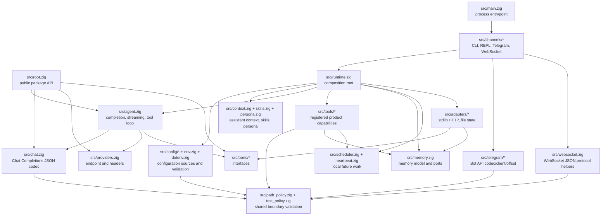
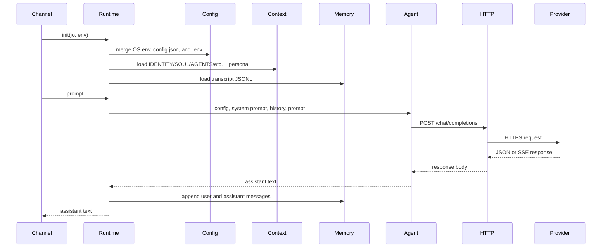
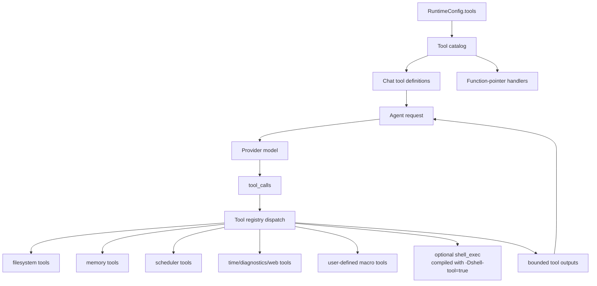
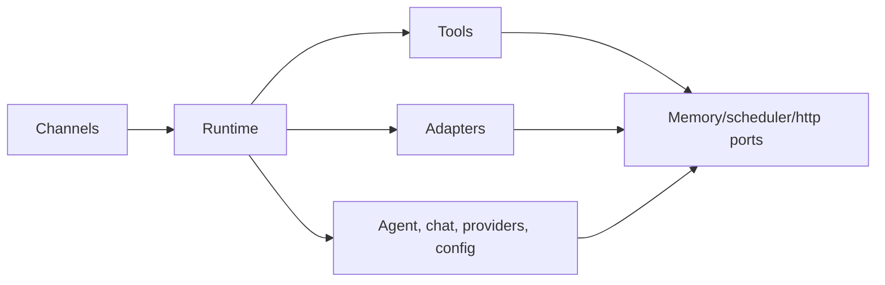

# Architecture

`nllclw` هو AI assistant مضغوط مبني كحزمة Zig مع executable واحد. الهدف التصميمي
الرئيسي هو إبقاء agent engine قابلاً للاختبار مع شحن binary صغير standalone.

## Goals

- أبق provider wire contract بسيطاً: OpenAI-compatible Chat Completions.
- أبق runtime dependencies explicit: default build يستخدم Zig stdlib فقط.
- أبق local capabilities خلف capability gates وسهلة audit.
- أبق channels thin: CLI وREPL وTelegram وWebSocket وheartbeat وdaemon كلها تستدعي
  runtime وagent engine نفسيهما.
- أبق public package API صغيراً بما يكفي للتعليم.

## Layer Map



## Request Flow

يتعامل engine نفسه مع argv prompts وstdin prompts وREPL turns وTelegram messages
وWebSocket prompts وheartbeat tasks وdue schedules.



## Tool Loop Flow

Tools هي product capabilities وليست infrastructure adapters. توجد في `src/tools/`
وتُعرض للmodel فقط عبر `src/tools/catalog.zig`.



يكرر agent هذه الحلقة حتى يحدث أحد ثلاثة أشياء:

- يعيد model assistant content بلا tool calls;
- يصل `NLLCLW_TOOL_MAX_ROUNDS`;
- يحدث provider error أو malformed provider response أو allocation failure أو
  fatal dispatch error آخر.

تُعاد non-fatal tool failures إلى model كرسائل `tool error: ...` tool حتى يستطيع
model التعافي أو اختيار arguments مختلفة أو شرح failure. ما زالت allocation failures
تُجهض turn.

تُعطل streaming عمداً عندما تكون tools مفعلة. يحتاج assistant إلى complete model
response لمعرفة tool calls التي يجب تشغيلها.

يتحقق `src/chat.zig` من كل request string كنص UTF-8 بلا binary control bytes قبل
JSON encoding. هذا يحافظ على Chat Completions fields كJSON strings بدلاً من أن
تتحول arbitrary byte slices إلى arrays. في SSE، تكون `[DONE]` terminal؛ تُتجاهل
chunks اللاحقة.

## Module Responsibilities

| Path | Responsibility |
|---|---|
| `src/main.zig` | Minimal executable entrypoint وprocess exit. |
| `src/root.zig` | Stable public API: config وchat types وHTTP port وstreaming sink و`complete`. |
| `src/runtime.zig` | Composition root للعمل الشبيه بCLI: config وHTTP adapter وmemory adapter وcontext وtools. |
| `src/agent.zig` | Channel-neutral one-turn assistant engine وstreaming وtool loop. |
| `src/chat.zig` | JSON request/response codec لChat Completions، بما في ذلك tools وSSE chunks. |
| `src/providers.zig` | Provider presets وcompatible-provider endpoint validation. |
| `src/config/*` | Typed runtime config وsource collection وvalidation وowned copies. |
| `src/channels/*` | User I/O orchestration لCLI وREPL وTelegram وWebSocket وdaemon commands. |
| `src/tools/*` | Tool definitions وlocal capabilities وuser-defined macro tools. |
| `src/skills.zig` | Compact `skills/*.md` index لتحميل local skill عند الطلب. |
| `src/persona.zig` | Runtime presentation modes appended إلى system prompt. |
| `src/memory.zig` | Transcript/fact models وJSONL parsers وmemory store ports. |
| `src/adapters/*` | Concrete stdlib adapters للports. |
| `src/ports/*` | Function-pointer interfaces لحدود قابلة للاختبار. |
| `src/telegram/*` | Telegram Bot API wire helpers. |
| `src/websocket.zig` | Testable WebSocket JSON message/event helpers. |

## Public Package API

يستورد consumers package module باسم `nllclw`. السطح المصدّر صغير:

```zig
const nllclw = @import("nllclw");

const cfg: nllclw.Config = .{
    .provider = .openrouter,
    .api_key = "...",
    .model = "openai/gpt-chat-latest",
};

const text = try nllclw.complete(allocator, http_client, cfg, "hello");
```

يعرض public API:

- `ProviderKind`
- `PersonaKind`
- `Config`
- chat request/tool types
- `HttpClient`, `HttpResponse`, `HttpHeader`, `HttpStatusCode`
- `Diagnostic`
- `ToolOptions`, `ToolHandler`, `ToolRunError`, `CompleteOptions`
- `StreamError`, `StreamSink`
- `complete` و`completeWithOptions`

تبقى runtime-only details مثل تحميل `config.json`/`.env` وfile memory وTelegram
polling وstdlib HTTP adapter خارج public root. Public tool handler هو فقط
function-pointer abstraction اللازم ل`ToolOptions`; تبقى built-in product tools
ومخازنها file-backed داخلية.

## Dependency Direction

اتجاه dependency explicit:



لا يعرف core code شيئاً عن process env أو `config.json` أو `.env` أو filesystem
paths أو Telegram polling أو `std.http.Client`. تُجمع تلك التفاصيل في `runtime.zig`
والchannels.

## Memory Ownership

يتبع الكود أسلوب Zig في explicit ownership:

- Functions التي allocate تعيد owned slices وتوثق ownership عبر أنماط
  `defer`/`deinit` قرب call sites.
- Long-lived runtime state مملوكة ل`Runtime` وتُحرر في `Runtime.deinit`.
- Parsed config قد يكون borrowed من source buffers أو copied إلى `config.Owned`
  من أجل runtime storage.
- Tool outputs مملوكة للagent حتى تُرسل إلى model ثم تُحرر بعد loop.

## Cross-Platform Runtime Model

الbinary الافتراضي مقصود أن يعمل حيث يستطيع Zig وZig standard library دعم target:

- no `curl`;
- no provider SDK;
- no package dependencies in `build.zig.zon`;
- no shell process in the default build;
- `std.http.Client` for HTTPS;
- `std.Io` for files, stdin/stdout/stderr, and timers.

Optional shell tool هو build flavor منفصل:

```sh
zig build -Dshell-tool=true
```

هذا flavor ليس default لأنه يستطيع launch `sh` أو `cmd.exe` عندما يكون enabled at runtime.
