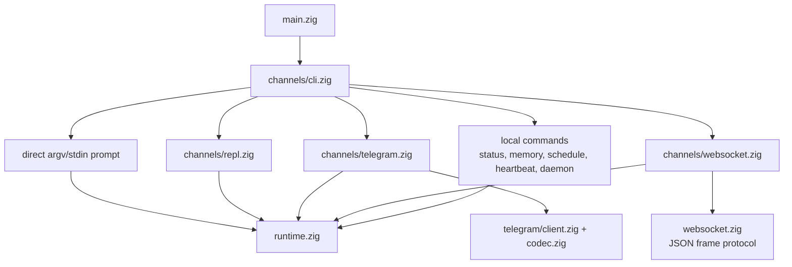
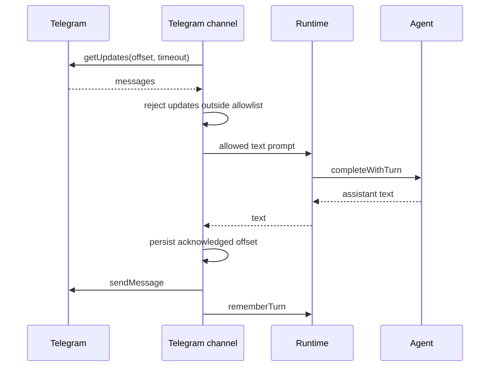
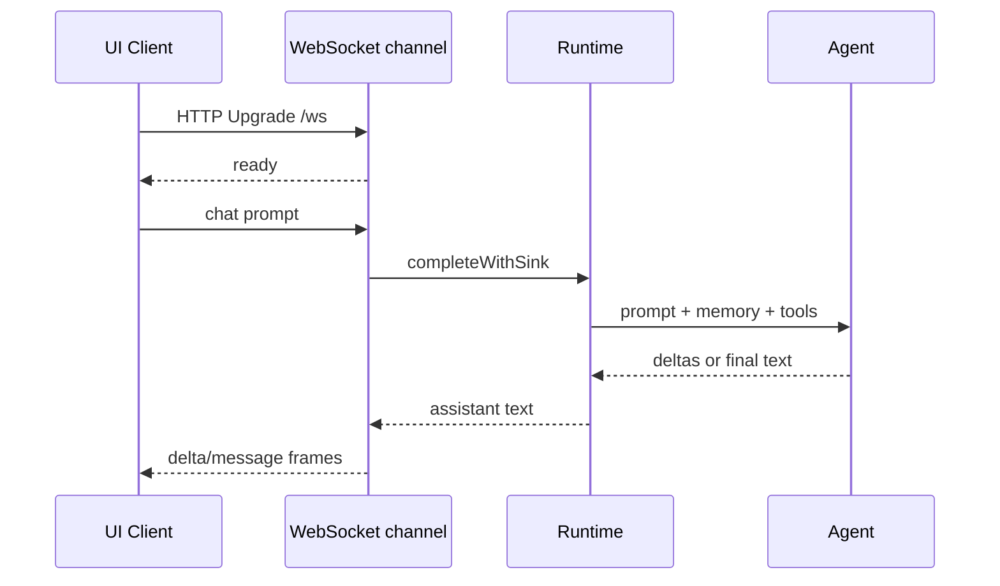

# Channels

Channels هي الطرق user-facing للتحدث مع runtime وagent engine نفسيهما. تقوم بparse
input، وتملك channel-specific I/O، وتفوض completions إلى `runtime.zig`.

## Channel Map



## Direct CLI

Prompt من argv:

```sh
nllclw "explain this repository in one paragraph"
```

Prompt من stdin:

```sh
printf 'summarize this text\n' | nllclw
```

`NLLCLW_STREAM=on` هو default:

```sh
NLLCLW_STREAM=on
```

Tool loop مفعّل أيضاً افتراضياً، وtool output non-streaming لأن agent يجب أن يفحص
complete tool calls قبل dispatch local functions. لpure streaming chat، اضبط
`NLLCLW_TOOLS=off`.

Direct slash commands تُعالج محلياً:

```sh
nllclw /settings
nllclw /diag memory
nllclw /persona technical
```

هذه commands لا تستدعي model.

## Interactive REPL

عندما يكون stdin هو TTY ولا يوجد prompt، يبدأ `nllclw` حلقة terminal chat صغيرة:

```sh
nllclw
```

Exit commands:

```text
:q
:quit
exit
```

كل turn يستخدم runtime memory وtool configuration نفسيهما كما في direct CLI mode.

## Telegram

يستخدم Telegram mode Bot API long polling:

```sh
NLLCLW_TELEGRAM_TOKEN=123456:bot-token
NLLCLW_TELEGRAM_CHAT_ID=123456789
nllclw telegram
```

يمكن أن يكون `NLLCLW_TELEGRAM_CHAT_ID` أيضاً private-chat أو public-chat Telegram
username، مع `@` أو بدونه، مثل `@donprus` أو `donprus`.

Security properties:

- `NLLCLW_TELEGRAM_CHAT_ID` required;
- تُتجاهل messages خارج configured chat id أو username allowlist;
- local nonblocking lock يوقف process ثانياً `nllclw telegram` على same state
  directory قبل أن يصل إلى Bot API polling;
- يجب أن يكون accepted message text valid UTF-8 بلا binary control bytes;
  malformed text updates تُتجاهل بينما يتقدم polling offset;
- يُخزن last acknowledged update id في user state directory;
- restarts تواصل من stored offset ولا replay handled messages.
- model-backed messages rate-limited بواسطة `NLLCLW_TELEGRAM_RATE_LIMIT_PER_MINUTE`
  (default `20`, `0` disables); local slash commands ليست rate-limited.

إذا كانت machine أو deployment أو binary أقدم آخر يستخدم `getUpdates` بالفعل
لbot token نفسه، يعيد Telegram HTTP `409`. يطبع `nllclw` hint محدداً لذلك conflict.

Flow:



## WebSocket

يبدأ WebSocket mode local RFC6455 server لcustom browser أو desktop أو mobile UIs:

```sh
NLLCLW_WS_TOKEN=change-me nllclw websocket
```

Default bind settings:

```sh
NLLCLW_WS_HOST=127.0.0.1
NLLCLW_WS_PORT=8765
NLLCLW_WS_PATH=/ws
```

Default bind address هو loopback-only، لكن channel لا يزال يتطلب `NLLCLW_WS_TOKEN`
حتى لا تستطيع random browser pages التحدث إلى local agent. تتطلب Remote binds
الاثنين:

```sh
env NLLCLW_WS_HOST=0.0.0.0 \
  NLLCLW_WS_ALLOW_REMOTE=on \
  NLLCLW_WS_TOKEN=change-me \
  nllclw websocket
```

يمكن لloopback browser clients تمرير token كquery parameter:

```js
const socket = new WebSocket("ws://127.0.0.1:8765/ws?token=change-me");

socket.addEventListener("message", (event) => {
  const message = JSON.parse(event.data);
  console.log(message.type, message.content ?? message.message);
});

socket.addEventListener("open", () => {
  socket.send(JSON.stringify({
    type: "chat",
    prompt: "Explain this repository in one paragraph."
  }));
});
```

Query authentication يقبل exactly one `token` parameter. Duplicate token
parameters مرفوضة لأنها ambiguous.

يجب أن تستخدم remote clients exactly one bearer token header. يجب أن تتصل
browser-based remote UIs عبر trusted local أو reverse proxy يحقن هذا header.

```text
Authorization: Bearer change-me
```

Client messages:

```json
{ "type": "chat", "prompt": "hello" }
{ "type": "status" }
{ "type": "ping" }
{ "type": "close" }
```

تُقبل Plain text frames كchat prompts لsimple clients. يجب أن تكون Text frames
valid UTF-8 بلا binary control bytes.
JSON command frames هي exact objects؛ unknown fields مرفوضة، ولا يجوز أن تحتوي
إلا `chat`/`message` frames على `prompt`.
يتعامل server مع active WebSocket client واحد في كل مرة. يمكن لadditional clients
الاتصال بعد disconnect للactive client.

Server messages:

```json
{ "type": "ready", "version": 1, "channel": "websocket" }
{ "type": "delta", "content": "partial text" }
{ "type": "message", "content": "final text" }
{ "type": "status", "content": "nllclw: ok ..." }
{ "type": "pong", "content": "pong" }
{ "type": "error", "message": "request failed" }
```

تُصدر `delta` frames فقط عندما يكون `NLLCLW_STREAM=on` و`NLLCLW_TOOLS=off`. مع
tools enabled، يجب على model إكمال tool-call planning قبل أن يرسل channel
ال`message` النهائية.

Flow:



## Local Commands

Local commands لا تسأل model إلا إذا كان command يشغّل task صراحة:

```sh
nllclw status
nllclw doctor
nllclw memory list
nllclw memory get project.goal
nllclw memory forget project.goal
nllclw memory reset
nllclw schedule list
nllclw schedule delete 1
```

يطبع `status` quick health line. يطبع `doctor` full diagnostics report.

## Shared Slash Commands

تشترك REPL وTelegram وdirect CLI في slash parser نفسه:

| Command | Effect |
|---|---|
| `/start`, `/help` | Show local command help. |
| `/settings` | Show quick runtime status. |
| `/diag [scope]` | Show diagnostics for `quick`, `runtime`, `memory`, `rates`, `time`, or `all`. |
| `/persona [mode]` | Show or set runtime persona: `neutral`, `friendly`, `technical`, `witty`. |
| `/stop` | Pause Telegram intake for the current process. Other channels report that it is Telegram-only. |
| `/resume` | Resume Telegram intake. Other channels report that it is Telegram-only. |
| `/chatid` | Print Telegram chat id and username fields when available. Other channels report that it is Telegram-only. |

Persona changes هي runtime-only للprocess الحالي. لاختيار startup persona، اضبط
`NLLCLW_PERSONA`.

## Heartbeat

يقرأ `nllclw heartbeat` الملف `HEARTBEAT.md` ويحول pending items إلى prompt واحد.
لا يُعد actionable إلا conservative task syntax:

- unchecked markdown task lines;
- lines starting with `TODO:`.

```sh
nllclw heartbeat
```

إذا لم يوجد pending task، يطبع command رسالة قصيرة وينهي بنجاح.

## Daemon

يكرر `nllclw daemon` ما يلي:

1. claims due scheduled tasks من user state directory;
2. runs each claimed task through the normal runtime;
3. commits only completed schedule entries;
4. periodically runs heartbeat prompts.

```sh
NLLCLW_DAEMON_INTERVAL_SECONDS=60
NLLCLW_HEARTBEAT_INTERVAL_SECONDS=1800
nllclw daemon
```

Daemon محلي وfile-backed. لا ينسق عبر multiple machines.

تستخدم Claimed schedules local lease. إذا فشل provider execution أو destination
preflight أو delivery، لا يُcommit task؛ يصبح eligible again بعد انتهاء lease.

عندما يُنشأ schedule من Telegram، يكون default `cron_set` هو `channel=telegram`
وcurrent chat id. يرسل daemon completed scheduled result إلى ذلك chat باستخدام
`NLLCLW_TELEGRAM_TOKEN`. لا تزال Local schedules تكتب إلى stdout.
