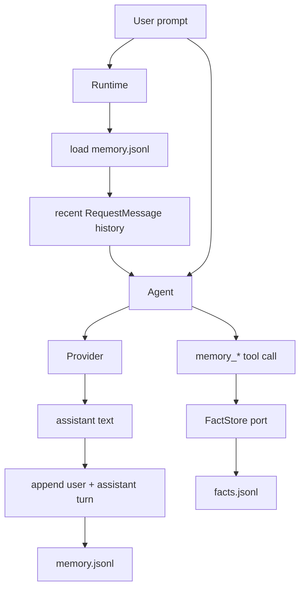
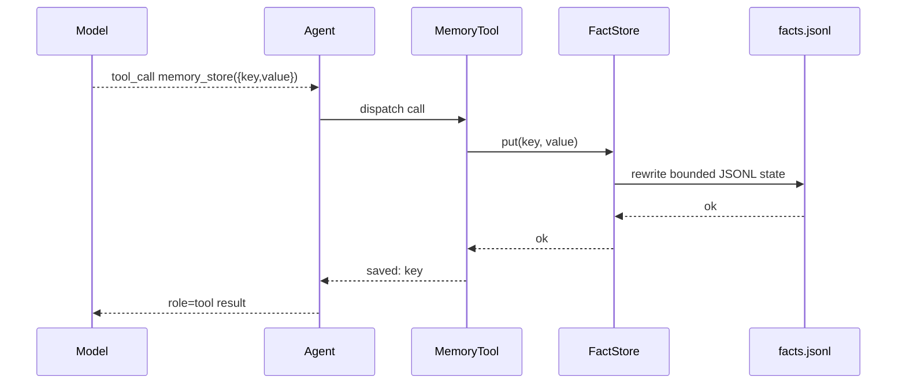

# Memory

لدى `nllclw` نظاما memory:

1. transcript memory، التي تحفظ آخر user/assistant turns;
2. durable fact memory، التي تخزن keyed facts عبر explicit tools.

كلاهما JSONL files في user state directory افتراضياً، وليس بجانب الbinary أو في
المشروع الحالي.

## Overview



## Transcript Memory

Transcript memory مفعّلة افتراضياً:

```sh
NLLCLW_MEMORY=on
# Default: user state dir/memory.jsonl
NLLCLW_MEMORY_MAX_MESSAGES=20
```

يجب أن تكون `NLLCLW_MEMORY_MAX_MESSAGES` على الأقل 2 لأن transcript appends تخزن
كأزواج user/assistant.

كل line هو JSON object واحد:

```json
{"role":"user","content":"remember that this project uses Zig 0.16"}
{"role":"assistant","content":"Got it."}
```

عند بدء turn:

1. يفتح `runtime.zig` configured transcript store.
2. يقرأ `memory.zig` JSONL lines.
3. تؤدي invalid roles أو invalid JSON أو invalid UTF-8 أو binary control bytes إلى memory error.
4. تُحتفظ فقط بأحدث `NLLCLW_MEMORY_MAX_MESSAGES` entries.
5. تُحوّل entries إلى Chat Completions request messages.

بعد successful assistant response، يضيف `Runtime.appendMemory` user prompt وassistant
text. إذا فشل append، يظل assistant answer المنتج مطبوعاً ويبلغ channel warning.

Transcript snapshots capped عند 256 KiB، وهي limit نفسها المستخدمة عند تحميل
JSONL file. تُرفض oversized turns قبل atomic replace، لذلك لا يمكن لsuccessful
write أن ينشئ transcript يعجز next startup عن قراءته.

## Durable Fact Memory

Fact memory مخصصة لstable key/value facts. تكون available عبر default local tool
loop عندما:

```sh
NLLCLW_MEMORY=on
NLLCLW_TOOLS=on
```

Defaults:

```sh
# Default path: user state dir/facts.jsonl
NLLCLW_MEMORY_MAX_FACTS=64
```

يجب أن تكون `NLLCLW_MEMORY_MAX_FACTS` من 1 إلى 1024.

كل line هو JSON object واحد:

```json
{"key":"project.language","value":"Zig 0.16"}
{"key":"user.prefers","value":"direct, pragmatic answers"}
```

Fact keys:

- يجب ألا تكون empty;
- محدودة إلى 64 bytes;
- قد تحتوي letters وdigits و`_` و`-` و`.`;
- deduplicated by key، وتفوز newest value.

Fact values:

- يجب ألا تكون empty;
- يجب أن تحتوي non-whitespace text;
- يجب أن تكون valid UTF-8;
- يجب ألا تحتوي ASCII control bytes;
- محدودة إلى 2048 bytes;
- يجب أن fit داخل `NLLCLW_TOOL_OUTPUT_MAX_BYTES` عند إرجاعها بواسطة `memory_recall`.

يستخدم fact JSONL snapshot نفس 256 KiB read/write cap مثل transcript memory. إذا
تجاوزت facts retained كثيرة تلك file limit، يفشل write بدلاً من إنشاء facts file
غير قابلة للقراءة.

## Memory Tools

| Tool | Purpose |
|---|---|
| `memory_store` | Store أو update fact حسب key. |
| `memory_recall` | Read fact by key. |
| `memory_list` | List known fact keys. |
| `memory_forget` | Delete fact by key. |

Tool flow:



## CLI Memory Commands

تعمل هذه commands على durable facts:

```sh
nllclw memory list
nllclw memory get project.language
nllclw memory forget project.language
nllclw memory reset
```

يمسح `memory reset` كلاً من transcript memory وfact memory.

## Privacy and Safety Notes

- توجد memory files افتراضياً في user state directory.
- تُمنع `.nllclw-*` files من filesystem tools حتى لا يستطيع model قراءة أو تعديل
  memory files الخاصة به عبر `read_file` أو `write_file` أو `edit_file`.
- Memory غير encrypted. لا تخزن secrets فيها.
- يجب استخدام fact memory لتفضيلات user/project durable، وليس لسجلات conversation الخام.
