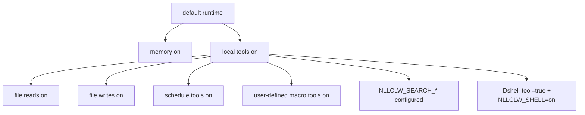

# Security Model

`nllclw` هو local AI assistant وليس sandbox. يعتمد safety model على local-only
defaults صغيرة، وexplicit external capability gates، وbounded local outputs،
وprovider/config validation دقيق.

## Default Posture

Default build:

- no package dependencies;
- no external runtime programs;
- no `curl`;
- no shell execution;
- local tools enabled;
- filesystem tools enabled with relative-path and secret-path protections;
- scheduler tools enabled for local JSONL schedules;
- user-defined macro tools enabled and stored in local JSONL;
- web search disabled unless a search provider is configured;
- Telegram disabled unless launched explicitly and configured with an allowlist.
- WebSocket disabled unless launched explicitly; default bind is loopback-only.

Memory مفعّلة افتراضياً لأنها تكتب فقط JSONL files محلية في user state directory.
يمكن تعطيلها عبر:

```sh
NLLCLW_MEMORY=off
```

عطّل كل tools عبر:

```sh
NLLCLW_TOOLS=off
```

## Capability Gates



يتلقى model local tool definitions افتراضياً. لا يزال external web search وshell
execution يتطلبان explicit setup.

## Provider-Key Handling

- تأتي API keys من OS env أو `config.json` أو `.env`.
- OS env يoverride file config، و`config.json` يoverride `.env`.
- Completion provider keys تُرسل فقط ك`Authorization: Bearer ...`.
- Search provider keys تُرسل مع auth header الموثق لكل provider: bearer auth لTavily
  وFirecrawl، و`X-Subscription-Token` لBrave Search، و`x-api-key` لExa.
- Header values ترفض ASCII control bytes.
- Provider model names ترفض invalid UTF-8 وcontrol bytes قبل بناء request JSON.
- Chat request content strings وassistant response text وtool-call argument strings
  ترفض invalid UTF-8 وbinary control bytes؛ تبقى normal newlines وcarriage returns
  وtabs valid text هناك. Request metadata مثل model names وroles وtool-call ids
  وfunction names وparameter names تكون additionally single-line.
- Provider response roles، عندما تكون present، يجب أن تكون `assistant`.
- Provider وTelegram diagnostic messages التي تكون empty أو too large أو تحتوي
  control bytes لا تُطبع كtrusted single-line errors.
- Raw diagnostic response bodies تُطبع فقط عندما تكون valid text وتكون capped في terminal output.
- Default state files موجودة في user state directory. Configured state paths
  للmemory وmacro tools وschedules يجب أن تكون relative `.jsonl` paths بUTF-8 صالح،
  بلا control bytes، وب`/` separators، وبلا Windows-reserved filename characters أو
  device names، وبلا empty أو `.` أو `..` أو trailing-space أو trailing-dot path components.
- تُفتح local state files وlock files الخاصة بها بلا اتباع terminal symlinks.
  تستخدم writes atomic replace وprivate file permissions عندما يعرضها host platform.
- Durable fact memory values ترفض ASCII control bytes قبل تخزينها أو طباعتها عبر
  CLI/tool recall paths.
- User-defined macro tool descriptions وactions ترفض ASCII control bytes قبل
  تخزينها أو إرسالها مرة أخرى كmodel-facing tool schema/output.
- Scheduled actions ترفض ASCII control bytes قبل تخزينها أو طباعتها عبر schedule listing.
- Model-facing tool outputs ترفض invalid UTF-8 وbinary control bytes.
- `.env` و`config.json` و`.nllclw-*` paths ممنوعة من filesystem tools.
- user-defined macro tools مخزنة افتراضياً في user state directory.
- لا تلصق real keys في prompts أو context files.

## Compatible Provider Safety

يجب أن تستخدم compatible providers HTTPS افتراضياً:

```json
{
  "provider": "compatible",
  "base_url": "https://example.com/v1",
  "api_key": "...",
  "model": "..."
}
```

يسمح بHTTP فقط لexact loopback hosts وفقط عند تفعيله explicitly:

```json
{
  "provider": "compatible",
  "base_url": "http://127.0.0.1:11434/v1",
  "allow_http_base_url": true,
  "api_key": "ollama",
  "model": "llama3.2"
}
```

Remote HTTP URLs مرفوضة.

## Filesystem Tool Boundary

Filesystem tools ليست sandbox كاملة، لكنها تفرض conservative local boundary:

- relative paths only;
- valid UTF-8, control-free paths no longer than 512 bytes;
- no `..`;
- no absolute POSIX paths;
- no absolute or drive-qualified Windows paths;
- no empty, `.`, or `..` path components, except that `list_dir` accepts
  literal `.` for the current directory;
- no symlink traversal for opened path components;
- no Windows-reserved filename characters, device names, trailing spaces, or
  trailing dots;
- no `.env`, `config.json`, `.nllclw-*`, `.git`, `.ssh`, `.gnupg`, `.aws`, `.npmrc`;
- no common private-key filenames or suffixes;
- UTF-8 text only, without binary control bytes;
- output-size caps;
- atomic writes.

شغّل file tools فقط داخل دليل تكون فيه هذه permissions منطقية.

## Telegram Boundary

Telegram mode هو default-deny:

- `NLLCLW_TELEGRAM_TOKEN` required;
- تُتحقق Telegram tokens ك`<bot-id>:<secret>` قبل وضعها في Bot API URLs;
- `NLLCLW_TELEGRAM_CHAT_ID` required;
- messages خارج configured chat id أو username allowlist ignored;
- local nonblocking lock يرفض process ثانياً `nllclw telegram` يستخدم same state directory;
- يُخزن last processed update محلياً لتجنب replay بعد restart.
- model-backed messages rate-limited بواسطة `NLLCLW_TELEGRAM_RATE_LIMIT_PER_MINUTE`.

## WebSocket Boundary

WebSocket mode مخصص افتراضياً لlocal custom UIs:

- يبدأ فقط عندما يُطلق `nllclw websocket`;
- default bind هو `127.0.0.1:8765`;
- `NLLCLW_WS_TOKEN` required حتى لloopback binds;
- `NLLCLW_WS_PATH` يجب أن يكون single-line valid UTF-8 بلا query أو fragment syntax;
- non-loopback bind addresses تتطلب `NLLCLW_WS_ALLOW_REMOTE=on`;
- loopback browser clients يمكنها تمرير token ك`?token=...`;
- loopback query authentication يقبل exactly one `token` parameter;
- remote clients يجب أن تستخدم exactly one `Authorization: Bearer ...` header;
- model-backed chat messages rate-limited بواسطة `NLLCLW_WS_RATE_LIMIT_PER_MINUTE`.
- built-in server يتعامل مع active client واحد في كل مرة.

لا تعرض WebSocket port على untrusted network بلا reverse proxy وtransport security.
Built-in channel هو plain `ws://`، وليس TLS termination.

## Shell Tool Boundary

Default binary لا يتضمن `shell_exec`.

لجعل shell execution ممكناً، يجب أن يتحقق الشرطان:

```sh
zig build -Dshell-tool=true
NLLCLW_SHELL=on
```

يجب التعامل مع shell tool كأنه يمنح model local command execution. استخدمه فقط في
trusted environments.

## Practical Checklist

قبل استخدام default local capabilities:

1. شغّل داخل dedicated project directory.
2. أبق secrets خارج prompts وcontext files.
3. اضبط `NLLCLW_FILE_WRITE=off` إذا لم تكن file mutation مطلوبة.
4. استخدم default no-shell binary ما لم تكن command execution مطلوبة.
5. استخدم `NLLCLW_TOOL_OUTPUT_MAX_BYTES` لإبقاء tool output bounded.
6. استخدم `nllclw status` لquick health line أو `nllclw doctor` لfull diagnostics.
