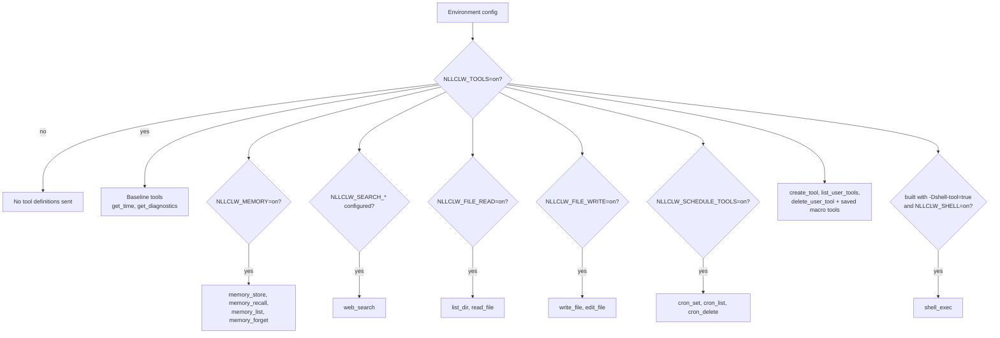
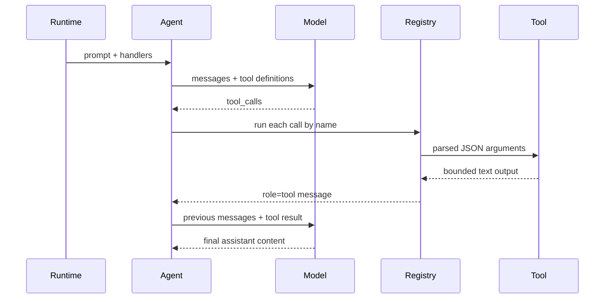

# Tools

تسمح tools للmodel بأن يطلب من `nllclw` تنفيذ local actions. Local tools التي لا
تحتاج external services مفعّلة افتراضياً. لا يزال external web search وoptional shell
execution يتطلبان explicit setup.

## Capability Model



Default binary لا يحتوي `shell_exec`. ابنِه explicitly:

```sh
zig build -Dshell-tool=true
```

ثم فعّله at runtime:

```sh
NLLCLW_TOOLS=on
NLLCLW_SHELL=on
```

لتعطيل كل tools:

```sh
NLLCLW_TOOLS=off
```

## Tool Loop



يحد `NLLCLW_TOOL_MAX_ROUNDS` من عدد assistant/tool exchange rounds الممكن قبل أن
يعيد agent `ToolRoundLimit`.

Built-in tool arguments هي exact JSON objects. Invalid JSON وmissing required
fields وunknown fields وinvalid field types وvalidation failures تعيد tool error
ليتعامل معها model.

## Available Tools

| Tool | Gate | Effect |
|---|---|---|
| `get_time` | `NLLCLW_TOOLS=on` default | يعيد local time باستخدام `NLLCLW_TIMEZONE_OFFSET_MINUTES`. |
| `get_diagnostics` | `NLLCLW_TOOLS=on` default | يبلغ runtime capability/config status. |
| `web_search` | `NLLCLW_TOOLS=on` وconfigured `NLLCLW_SEARCH_*` provider | يستدعي selected search provider عبر HTTP port. |
| `memory_store` | `NLLCLW_TOOLS=on`, `NLLCLW_MEMORY=on` defaults | يخزن durable fact. |
| `memory_recall` | `NLLCLW_TOOLS=on`, `NLLCLW_MEMORY=on` defaults | يقرأ durable fact. |
| `memory_list` | `NLLCLW_TOOLS=on`, `NLLCLW_MEMORY=on` defaults | يعرض durable fact keys. |
| `memory_forget` | `NLLCLW_TOOLS=on`, `NLLCLW_MEMORY=on` defaults | يحذف durable fact. |
| `list_dir` | `NLLCLW_FILE_READ=on` default | يعرض CWD-relative directory. |
| `read_file` | `NLLCLW_FILE_READ=on` default | يقرأ UTF-8 CWD-relative file. |
| `write_file` | `NLLCLW_FILE_WRITE=on` default | يكتب UTF-8 CWD-relative file atomically. |
| `edit_file` | `NLLCLW_FILE_WRITE=on` default | يستبدل first exact text match في file. |
| `cron_set` | `NLLCLW_SCHEDULE_TOOLS=on` default | يضيف local scheduled task. |
| `cron_list` | `NLLCLW_SCHEDULE_TOOLS=on` default | يعرض scheduled tasks. |
| `cron_delete` | `NLLCLW_SCHEDULE_TOOLS=on` default | يحذف scheduled task. |
| `create_tool` | `NLLCLW_TOOLS=on` default | ينشئ persistent user-defined macro tool. |
| `list_user_tools` | `NLLCLW_TOOLS=on` default | يعرض saved macro tools. |
| `delete_user_tool` | `NLLCLW_TOOLS=on` default | يحذف saved macro tool. |
| saved macro tools | `NLLCLW_TOOLS=on` default | تعيد saved action text كي ينفذه model عبر built-in tools. |
| `shell_exec` | optional shell build plus `NLLCLW_SHELL=on` | يشغّل shell command مع timeout وcombined output cap وUTF-8 text output بلا binary control bytes. |

## User-Defined Tools

User-defined tools هي macro tools وليست generated code. يخزن `create_tool` name
وdescription وnatural-language action في `NLLCLW_USER_TOOLS_PATH` (default
`user-tools.jsonl` في user state directory).
في turns لاحقة، تُعلن saved tools كnormal tool definitions. عندما يستدعي model
إحداها، يعيد `nllclw` saved action text ويواصل model tool loop نفسه مستخدماً
built-in tools.

Example:

```text
create_tool(name="daily_brief", description="Prepare a daily brief", action="Search for current project news, summarize it, and store the summary in memory.")
```

قد تحتوي tool names فقط letters وdigits وunderscores. الأسماء التي collide مع
built-in tools مرفوضة. Descriptions وactions تكون trimmed وbounded وvalid UTF-8
text بلا ASCII control bytes. User-tool JSONL file capped عند 128 KiB في read وwrite،
وتُفتح بلا اتباع terminal symlinks، ويجب أن fit saved action داخل
`NLLCLW_TOOL_OUTPUT_MAX_BYTES` عند wrapped كtool result.

## Web Search Providers

`web_search` هي tool واحدة تختار provider عبر `NLLCLW_SEARCH_PROVIDER`. يختار default
`auto` mode أول configured key بهذا الترتيب: Tavily، Brave Search، Exa، Firecrawl،
ثم DuckDuckGo فقط عند explicit enable.
Explicit key-based providers تتطلب matching `NLLCLW_SEARCH_*_KEY`.
يجب ألا تحتوي search keys ASCII control bytes.
Queries تكون trimmed وvalid UTF-8 وcontrol-free وبحد أقصى 512 bytes.
Provider result text يُنسق كvalid UTF-8 بلا binary control bytes؛ ordinary tabs
وnewlines داخل result fields تُطبّع إلى spaces.
تُتجاهل empty provider result objects، وتعيد valid empty provider response
`no results` بدلاً من synthetic placeholder row. DuckDuckGo nested related-topic
groups تُسطّح إلى small bounded depth.

| Provider | Env | Notes |
|---|---|---|
| `tavily` | `NLLCLW_SEARCH_TAVILY_KEY=...` | POSTs to Tavily Search. |
| `brave` | `NLLCLW_SEARCH_BRAVE_KEY=...` | GETs Brave Web Search with `X-Subscription-Token`. |
| `exa` | `NLLCLW_SEARCH_EXA_KEY=...` | POSTs Exa Search with `x-api-key`. |
| `firecrawl` | `NLLCLW_SEARCH_FIRECRAWL_KEY=...` | POSTs Firecrawl Search with bearer auth. |
| `duckduckgo` | `NLLCLW_SEARCH_DUCKDUCKGO=on` or `NLLCLW_SEARCH_PROVIDER=duckduckgo` | No-key Instant Answer fallback، وليس full web SERP API. |

Examples:

```sh
NLLCLW_TOOLS=on
NLLCLW_SEARCH_PROVIDER=auto
NLLCLW_SEARCH_BRAVE_KEY=...
```

```sh
NLLCLW_TOOLS=on
NLLCLW_SEARCH_PROVIDER=duckduckgo
```

## Scheduled Delivery

يقبل `cron_set` الحقلين `channel` و`chat_id` للتسليم. في Telegram turns يصبح current
chat هو default destination، لذلك يستطيع prompt مثل "remind me here tomorrow" إنشاء
Telegram schedule بلا كشف chat id في model-facing user text.

Scheduled actions تكون trimmed، ويجب أن تكون valid UTF-8 بلا ASCII control bytes،
ومحدودة إلى 2048 bytes. Schedule JSONL file capped عند 128 KiB في read وwrite؛
تُرفض oversized snapshots قبل atomic replacement.
يقبل `cron_set` فقط timing fields المطابقة ل`type`: `interval_*` لperiodic schedules،
و`delay_*` لone-shot schedules، و`hour`/`minute` لdaily schedules.
لا يcommit daemon schedule إلا بعد اكتمال scheduled prompt ونجاح أي configured
delivery؛ failed أو blocked deliveries تعيد المحاولة بعد انتهاء local lease.

Supported destinations:

| Channel | Behavior |
|---|---|
| `local` | Daemon يكتب result إلى stdout. |
| `telegram` | Daemon يرسل result إلى stored Telegram chat id باستخدام `NLLCLW_TELEGRAM_TOKEN`. |

## Filesystem Safety Model

Filesystem tools محافظة:

- paths must be relative to the current working directory;
- paths must be valid UTF-8, control-free, and at most 512 bytes;
- absolute POSIX paths are rejected;
- absolute or drive-qualified Windows paths are rejected;
- empty, `.`, and `..` components are rejected, except that `list_dir` accepts
  literal `.` for the current directory;
- denied components include `.env`, `.env.*`, `config.json`, `.nllclw-*`,
  `.git`, `.ssh`, `.gnupg`, `.aws`, `.npmrc`, `id_rsa`, `id_ed25519`;
- denied Windows device names include `CON`, `PRN`, `AUX`, `NUL`, `CONIN$`,
  `CONOUT$`, `COM1` through `COM9`, and `LPT1` through `LPT9`, including with
  extensions;
- Windows-reserved filename punctuation (`<`, `>`, `:`, `"`, `|`, `?`, `*`) is
  rejected for portable behavior;
- path components ending in a space or dot are rejected for portable behavior;
- denied suffixes include `.pem`, `.key`, `.p12`, `.pfx`;
- intermediate directories are opened without following symlinks;
- terminal files are opened without following symlinks;
- reads and writes require valid UTF-8 text without binary control bytes;
- `list_dir` emits names in sorted order and omits denied, non-UTF-8, or
  control-character entry names;
- writes use atomic replacement and private file permissions where supported;
- output is capped by `NLLCLW_TOOL_OUTPUT_MAX_BYTES`.

هذا local safety boundary وليس sandbox. شغّل `nllclw` فقط في أدلة ترتاح لمنحها
enabled capabilities.

## Adding a Tool

Preferred shape:

1. أضف focused module في `src/tools/<name>.zig`.
2. عرّف `chat.ToolDefinition`.
3. نفّذ small client struct يملك فقط dependencies التي يحتاجها.
4. Parse JSON arguments باستخدام `std.json.parseFromSlice`.
5. أعد owned text output capped بواسطة `NLLCLW_TOOL_OUTPUT_MAX_BYTES`.
6. سجّل handler في `src/tools/catalog.zig` خلف explicit config gate إذا كان يقرأ
   أو يغير local state.
7. أضف tests للsuccess وinvalid JSON/arguments وbounds وdenied access.

لا تضع infrastructure adapters في `src/tools/`. إذا احتاج tool إلى persistence أو
HTTP، فعرّف port أو أعد استخدامه وinject عبر catalog.
