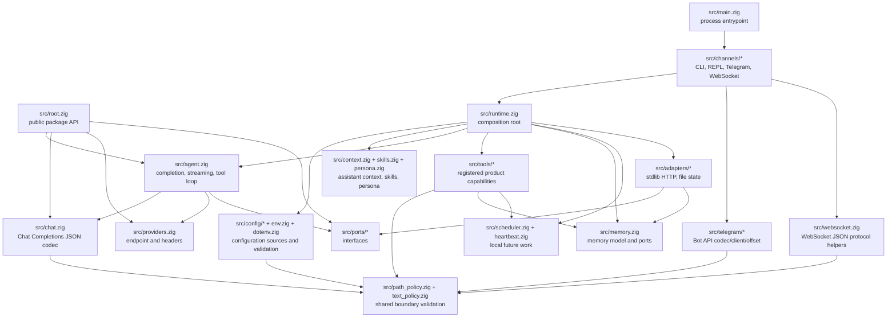
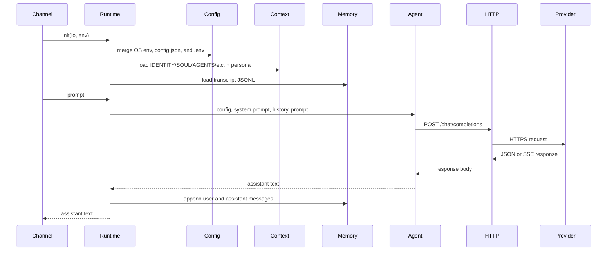
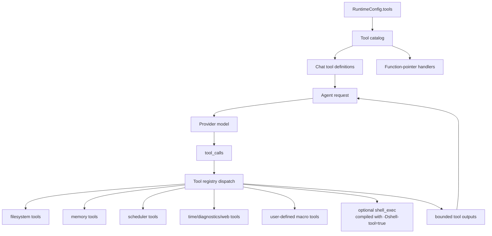
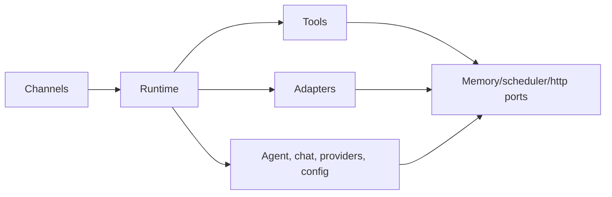

# Architecture

`nllclw` একটি compact AI assistant, যা Zig package এবং একটি executable হিসেবে
নির্মিত। প্রধান design goal হলো agent engine testable রাখা, তবু ছোট standalone
binary ship করা।

## Goals

- Provider wire contract simple রাখুন: OpenAI-compatible Chat Completions।
- Runtime dependencies explicit রাখুন: default build শুধু Zig stdlib ব্যবহার করে।
- Local capabilities capability-gated এবং audit করা সহজ রাখুন।
- Channels thin রাখুন: CLI, REPL, Telegram, WebSocket, heartbeat এবং daemon একই
  runtime এবং agent engine call করে।
- Public package API শেখানোর মতো ছোট রাখুন।

## Layer Map



## Request Flow

একই engine argv prompts, stdin prompts, REPL turns, Telegram messages, WebSocket
prompts, heartbeat tasks এবং due schedules handle করে।



## Tool Loop Flow

Tools হলো product capabilities, infrastructure adapters নয়। এগুলো `src/tools/`-এ
থাকে এবং model-এর কাছে শুধু `src/tools/catalog.zig` দিয়ে exposed হয়।



Agent এই loop repeat করে যতক্ষণ না তিনটির একটি ঘটে:

- model tool calls ছাড়া assistant content return করে;
- `NLLCLW_TOOL_MAX_ROUNDS` পৌঁছায়;
- provider error, malformed provider response, allocation failure, বা অন্য fatal
  dispatch error ঘটে।

Non-fatal tool failures model-এ `tool error: ...` tool messages হিসেবে ফেরত যায়,
যাতে model recover করতে পারে, ভিন্ন arguments নিতে পারে, বা failure ব্যাখ্যা করতে
পারে। Allocation failures এখনও turn abort করে।

Tools enabled থাকলে streaming ইচ্ছাকৃতভাবে disabled। কোন tool calls চালাতে হবে তা
জানতে assistant-এর complete model response দরকার।

`src/chat.zig` JSON encoding-এর আগে প্রতিটি request string UTF-8 text হিসেবে
validate করে, binary control bytes ছাড়া। এতে Chat Completions fields JSON strings
থাকে, arbitrary byte slices arrays-এ degrade হয় না। SSE-তে `[DONE]` terminal; পরের
chunks ignored হয়।

## Module Responsibilities

| Path | Responsibility |
|---|---|
| `src/main.zig` | Minimal executable entrypoint এবং process exit। |
| `src/root.zig` | Stable public API: config, chat types, HTTP port, streaming sink, `complete`। |
| `src/runtime.zig` | CLI-like operation-এর composition root: config, HTTP adapter, memory adapter, context, tools। |
| `src/agent.zig` | Channel-neutral one-turn assistant engine, streaming এবং tool loop। |
| `src/chat.zig` | Chat Completions-এর JSON request/response codec, tools এবং SSE chunks সহ। |
| `src/providers.zig` | Provider presets এবং compatible-provider endpoint validation। |
| `src/config/*` | Typed runtime config, source collection, validation এবং owned copies। |
| `src/channels/*` | CLI, REPL, Telegram, WebSocket এবং daemon commands-এর user I/O orchestration। |
| `src/tools/*` | Tool definitions, local capabilities এবং user-defined macro tools। |
| `src/skills.zig` | On-demand local skill loading-এর compact `skills/*.md` index। |
| `src/persona.zig` | System prompt-এ appended runtime presentation modes। |
| `src/memory.zig` | Transcript/fact models, JSONL parsers এবং memory store ports। |
| `src/adapters/*` | Ports-এর concrete stdlib adapters। |
| `src/ports/*` | Testable boundaries-এর function-pointer interfaces। |
| `src/telegram/*` | Telegram Bot API wire helpers। |
| `src/websocket.zig` | Testable WebSocket JSON message/event helpers। |

## Public Package API

Consumers package module `nllclw` নামে import করে। Exported surface ছোট:

```zig
const nllclw = @import("nllclw");

const cfg: nllclw.Config = .{
    .provider = .openrouter,
    .api_key = "...",
    .model = "openai/gpt-chat-latest",
};

const text = try nllclw.complete(allocator, http_client, cfg, "hello");
```

Public API expose করে:

- `ProviderKind`
- `PersonaKind`
- `Config`
- chat request/tool types
- `HttpClient`, `HttpResponse`, `HttpHeader`, `HttpStatusCode`
- `Diagnostic`
- `ToolOptions`, `ToolHandler`, `ToolRunError`, `CompleteOptions`
- `StreamError`, `StreamSink`
- `complete` এবং `completeWithOptions`

Runtime-only details যেমন `config.json`/`.env` loading, file memory, Telegram
polling এবং stdlib HTTP adapter public root-এর বাইরে থাকে। Public tool handler
শুধু `ToolOptions`-এর প্রয়োজনীয় function-pointer abstraction; built-in product
tools এবং তাদের file-backed stores internal থাকে।

## Dependency Direction

Dependency direction explicit:



Core code process env, `config.json`, `.env`, filesystem paths, Telegram polling,
বা `std.http.Client` সম্পর্কে জানে না। এই details `runtime.zig` এবং channels assemble করে।

## Memory Ownership

Code Zig-এর explicit ownership style অনুসরণ করে:

- Allocate করা functions owned slices return করে এবং call sites-এর কাছে
  `defer`/`deinit` patterns দিয়ে ownership document করে।
- Long-lived runtime state `Runtime` own করে এবং `Runtime.deinit`-এ release হয়।
- Parsed config source buffers থেকে borrowed হতে পারে বা runtime storage-এর জন্য
  `config.Owned`-এ copied হতে পারে।
- Tool outputs model-এ ফেরত পাঠানো পর্যন্ত agent-এর owned থাকে এবং loop-এর পরে freed হয়।

## Cross-Platform Runtime Model

Default binary এমন সব target-এ run করার জন্য যেখানে Zig এবং Zig standard library
support করতে পারে:

- no `curl`;
- no provider SDK;
- no package dependencies in `build.zig.zon`;
- no shell process in the default build;
- `std.http.Client` for HTTPS;
- `std.Io` for files, stdin/stdout/stderr, and timers.

Optional shell tool একটি separate build flavor:

```sh
zig build -Dshell-tool=true
```

ওই flavor default নয় কারণ runtime-এ enabled হলে এটি `sh` বা `cmd.exe` launch করতে পারে।
