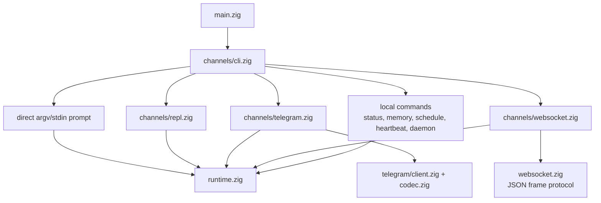
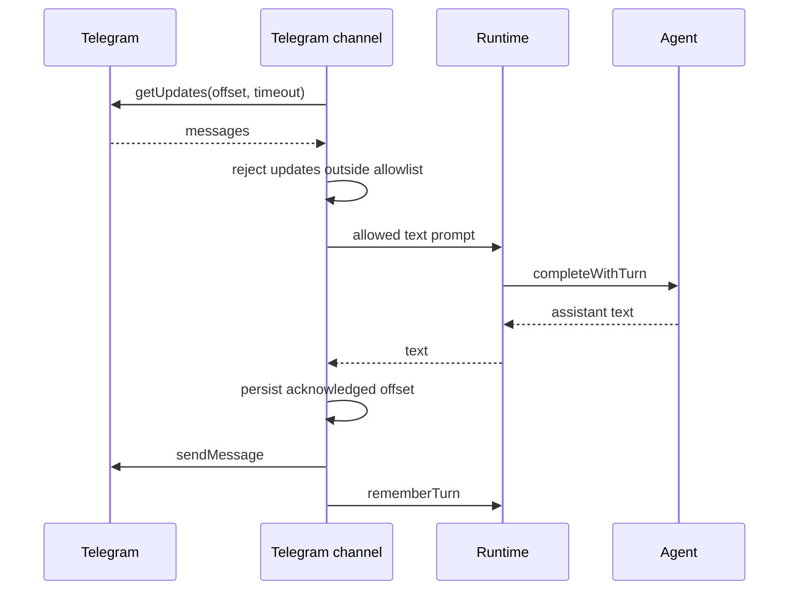
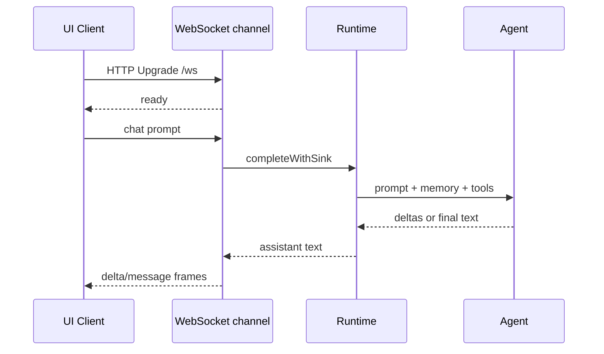

# Channels

Channels হলো একই runtime এবং agent engine-এর সঙ্গে কথা বলার user-facing পদ্ধতি।
এগুলো input parse করে, channel-specific I/O own করে, এবং completions `runtime.zig`-এ delegate করে।

## Channel Map



## Direct CLI

argv থেকে prompt:

```sh
nllclw "explain this repository in one paragraph"
```

stdin থেকে prompt:

```sh
printf 'summarize this text\n' | nllclw
```

`NLLCLW_STREAM=on` default:

```sh
NLLCLW_STREAM=on
```

Tool loop-ও defaultভাবে on, এবং tool output non-streaming, কারণ local functions
dispatch করার আগে agent-কে complete tool calls inspect করতে হয়। Pure streaming
chat-এর জন্য `NLLCLW_TOOLS=off` set করুন।

Direct slash commands locally handled:

```sh
nllclw /settings
nllclw /diag memory
nllclw /persona technical
```

এই commands model call করে না।

## Interactive REPL

stdin TTY হলে এবং prompt না থাকলে `nllclw` ছোট terminal chat loop start করে:

```sh
nllclw
```

Exit commands:

```text
:q
:quit
exit
```

প্রতিটি turn direct CLI mode-এর মতো একই runtime memory এবং tool configuration ব্যবহার করে।

## Telegram

Telegram mode Bot API long polling ব্যবহার করে:

```sh
NLLCLW_TELEGRAM_TOKEN=123456:bot-token
NLLCLW_TELEGRAM_CHAT_ID=123456789
nllclw telegram
```

`NLLCLW_TELEGRAM_CHAT_ID` private-chat বা public-chat Telegram username-ও হতে পারে,
`@` সহ বা ছাড়া, যেমন `@donprus` বা `donprus`।

Security properties:

- `NLLCLW_TELEGRAM_CHAT_ID` required;
- configured chat id বা username allowlist-এর বাইরে messages ignored;
- local nonblocking lock একই state directory-তে দ্বিতীয় `nllclw telegram` process
  Bot API polling-এ পৌঁছানোর আগে stop করে;
- accepted message text valid UTF-8 হতে হবে, binary control bytes ছাড়া;
  malformed text updates skipped হয়, কিন্তু polling offset এগোয়;
- last acknowledged update id user state directory-তে stored;
- restarts stored offset থেকে continue করে এবং handled messages replay করে না।
- model-backed messages `NLLCLW_TELEGRAM_RATE_LIMIT_PER_MINUTE` দিয়ে rate-limited
  (default `20`, `0` disables); local slash commands rate-limited নয়।

আরেক machine, deployment, বা older binary একই bot token-এর জন্য `getUpdates` already
use করলে Telegram HTTP `409` return করে। `nllclw` ওই conflict-এর জন্য specific hint print করে।

Flow:



## WebSocket

WebSocket mode custom browser, desktop, বা mobile UIs-এর জন্য local RFC6455 server start করে:

```sh
NLLCLW_WS_TOKEN=change-me nllclw websocket
```

Default bind settings:

```sh
NLLCLW_WS_HOST=127.0.0.1
NLLCLW_WS_PORT=8765
NLLCLW_WS_PATH=/ws
```

Default bind address loopback-only, কিন্তু channel এখনও `NLLCLW_WS_TOKEN` require
করে যাতে random browser pages local agent-এর সঙ্গে কথা বলতে না পারে। Remote binds
দুইটিই require করে:

```sh
env NLLCLW_WS_HOST=0.0.0.0 \
  NLLCLW_WS_ALLOW_REMOTE=on \
  NLLCLW_WS_TOKEN=change-me \
  nllclw websocket
```

Loopback browser clients token query parameter হিসেবে pass করতে পারে:

```js
const socket = new WebSocket("ws://127.0.0.1:8765/ws?token=change-me");

socket.addEventListener("message", (event) => {
  const message = JSON.parse(event.data);
  console.log(message.type, message.content ?? message.message);
});

socket.addEventListener("open", () => {
  socket.send(JSON.stringify({
    type: "chat",
    prompt: "Explain this repository in one paragraph."
  }));
});
```

Query authentication exactly one `token` parameter accept করে। Duplicate token
parameters ambiguous হিসেবে rejected।

Remote clients exactly one bearer token header ব্যবহার করতে হবে। Browser-based
remote UIs trusted local বা reverse proxy দিয়ে connect করা উচিত, যা এই header inject করে।

```text
Authorization: Bearer change-me
```

Client messages:

```json
{ "type": "chat", "prompt": "hello" }
{ "type": "status" }
{ "type": "ping" }
{ "type": "close" }
```

Plain text frames simple clients-এর chat prompts হিসেবে accepted। Text frames
valid UTF-8 হতে হবে, binary control bytes ছাড়া।
JSON command frames exact objects; unknown fields rejected, এবং শুধু
`chat`/`message` frames `prompt` রাখতে পারে।
Server এক সময়ে এক active WebSocket client handle করে। Active client disconnect
করার পরে additional clients connect করতে পারে।

Server messages:

```json
{ "type": "ready", "version": 1, "channel": "websocket" }
{ "type": "delta", "content": "partial text" }
{ "type": "message", "content": "final text" }
{ "type": "status", "content": "nllclw: ok ..." }
{ "type": "pong", "content": "pong" }
{ "type": "error", "message": "request failed" }
```

`delta` frames শুধু `NLLCLW_STREAM=on` এবং `NLLCLW_TOOLS=off` হলে emitted। Tools
enabled থাকলে channel final `message` পাঠানোর আগে model-কে tool-call planning
complete করতে হয়।

Flow:



## Local Commands

Command explicitly task run না করলে local commands model-কে জিজ্ঞাসা করে না:

```sh
nllclw status
nllclw doctor
nllclw memory list
nllclw memory get project.goal
nllclw memory forget project.goal
nllclw memory reset
nllclw schedule list
nllclw schedule delete 1
```

`status` quick health line print করে। `doctor` full diagnostics report print করে।

## Shared Slash Commands

REPL, Telegram, এবং direct CLI একই slash parser share করে:

| Command | Effect |
|---|---|
| `/start`, `/help` | Local command help দেখায়। |
| `/settings` | Quick runtime status দেখায়। |
| `/diag [scope]` | `quick`, `runtime`, `memory`, `rates`, `time`, বা `all`-এর diagnostics দেখায়। |
| `/persona [mode]` | Runtime persona দেখায় বা set করে: `neutral`, `friendly`, `technical`, `witty`। |
| `/stop` | Current process-এর Telegram intake pause করে। Other channels জানায় যে এটি Telegram-only। |
| `/resume` | Telegram intake resume করে। Other channels জানায় যে এটি Telegram-only। |
| `/chatid` | Available হলে Telegram chat id এবং username fields print করে। Other channels জানায় যে এটি Telegram-only। |

Persona changes current process-এর runtime-only। Startup persona বেছে নিতে
`NLLCLW_PERSONA` set করুন।

## Heartbeat

`nllclw heartbeat` `HEARTBEAT.md` read করে এবং pending items একটি prompt-এ পরিণত করে।
শুধু conservative task syntax actionable হিসেবে considered:

- unchecked markdown task lines;
- `TODO:` দিয়ে শুরু lines।

```sh
nllclw heartbeat
```

Pending task না থাকলে command একটি short message print করে successfully exits।

## Daemon

`nllclw daemon` বারবার:

1. user state directory থেকে due scheduled tasks claim করে;
2. প্রতিটি claimed task normal runtime দিয়ে run করে;
3. শুধু completed schedule entries commit করে;
4. periodically heartbeat prompts run করে।

```sh
NLLCLW_DAEMON_INTERVAL_SECONDS=60
NLLCLW_HEARTBEAT_INTERVAL_SECONDS=1800
nllclw daemon
```

Daemon local এবং file-backed। এটি multiple machines-এর across coordinate করে না।

Claimed schedules local lease ব্যবহার করে। Provider execution, destination
preflight, বা delivery fail করলে task committed হয় না; lease expire হলে এটি আবার
eligible হয়।

Telegram থেকে schedule created হলে `cron_set` defaultভাবে `channel=telegram` এবং
current chat id ব্যবহার করে। Daemon completed scheduled result সেই chat-এ
`NLLCLW_TELEGRAM_TOKEN` দিয়ে ফেরত পাঠায়। Local schedules এখনও stdout-এ write করে।
