# Assistant Context Files

`nllclw` current working directory থেকে local markdown instruction files load করে
সেগুলো system prompt-এ append করতে পারে। এটি repository বা project-কে identity,
operating rules, user preferences, tool policy এবং heartbeat tasks define করার
একটি lightweight উপায় দেয়।

এটি `skills/*.md` files-ও index করে। Skills compact summary হিসেবে advertised হয়;
full file পরে `read_file` দিয়ে শুধু তখন loaded হয় যখন task তার সঙ্গে match করে।
প্রতিটি summary line inline title এবং description cap করে, যাতে বড় skill file
system prompt index dominate করতে না পারে।

## Load Order

Files present থাকলে এই order-এ loaded হয়:

1. `IDENTITY.md`
2. `SOUL.md`
3. `USER.md`
4. `AGENTS.md`
5. `MEMORY.md`
6. `TOOLS.md`
7. `HEARTBEAT.md`
8. `BOOTSTRAP.md`
9. `skills/*.md` summary, sorted by filename

```mermaid
flowchart LR
    Base["built-in system prompt"] --> Identity["IDENTITY.md"]
    Identity --> Soul["SOUL.md"]
    Soul --> User["USER.md"]
    User --> Agents["AGENTS.md"]
    Agents --> Memory["MEMORY.md"]
    Memory --> Tools["TOOLS.md"]
    Tools --> Heartbeat["HEARTBEAT.md"]
    Heartbeat --> Bootstrap["BOOTSTRAP.md"]
    Bootstrap --> Skills["skills/*.md summary"]
    Skills --> Persona["runtime persona"]
    Persona --> Final["final system prompt"]
```



Files trusted local instructions হিসেবে treated হয়। এগুলো remote service থেকে
fetched হয় না।

প্রতিটি context file valid UTF-8 markdown হতে হবে, binary control bytes ছাড়া, এবং
16 KiB-এর বেশি নয়। Invalid bytes provider JSON-এ embed না হয়ে startup fail করে।
Skill files-ও valid UTF-8 markdown হতে হবে, binary control bytes ছাড়া, এবং 8 KiB-এর
বেশি নয়।

## Runtime Persona

`NLLCLW_PERSONA` এবং `/persona` system prompt-এ ছোট final style instruction যোগ করে।
Supported modes:

- `neutral`: direct and balanced;
- `friendly`: warm but concise;
- `technical`: precise, assumption-aware engineering tone;
- `witty`: light wit without sacrificing usefulness.

Persona শুধু presentation control করে। এটি `SOUL.md`, `TOOLS.md`, memory policy,
safety boundaries, বা provider configuration override করে না।

## File Roles

| File | Role |
|---|---|
| `IDENTITY.md` | Stable assistant identity এবং high-level project role। |
| `SOUL.md` | Behavioral constitution: tone, priorities, এবং non-negotiable rules। |
| `USER.md` | Private local user preferences। Git দ্বারা ignored। |
| `AGENTS.md` | Coding agents-এর সঙ্গে shared canonical repository-level instructions। |
| `MEMORY.md` | Human-maintained long-term notes। JSONL runtime memory থেকে separate। |
| `TOOLS.md` | Human-readable tool policy এবং available capability notes। |
| `HEARTBEAT.md` | `nllclw heartbeat` এবং daemon mode-এর local recurring work/task source। |
| `BOOTSTRAP.md` | Private local startup/bootstrap notes। Git দ্বারা ignored। |
| `skills/*.md` | Compact skill index হিসেবে advertised optional task-specific instructions। |

Separate tool-specific instruction files maintain করার বদলে shared agent guidance-এর
জন্য `AGENTS.md` ব্যবহার করুন।

## Runtime Memory vs Markdown Memory

দুটি distinct concept আছে:

| Mechanism | File | Written by | Purpose |
|---|---|---|---|
| Markdown context | `MEMORY.md` | Humans বা normal file edits | Curated project/user notes যা system prompt-এ included। |
| Transcript memory | user state dir `memory.jsonl` | Runtime | Recent user/assistant turns যা chat history হিসেবে পাঠানো হয়। |
| Fact memory | user state dir `facts.jsonl` | Memory tools | Durable key/value facts যা model store বা recall করতে পারে। |

JSONL memory systems-এর জন্য [memory.md](memory.md) দেখুন।

## Trust Model

Context files assistant steer করতে পারে। আপনি যদি এসব files prompt influence করতে
দিতে রাজি না হন, untrusted directory-তে `nllclw` চালাবেন না।

Recommended practice:

- shared project instructions যেমন `IDENTITY.md`, `SOUL.md`, `AGENTS.md`,
  `MEMORY.md`, এবং `TOOLS.md` commit করুন;
- private local preference files `USER.md` এবং `BOOTSTRAP.md` হিসেবে রাখুন;
- সব context files-এ secrets এড়িয়ে চলুন।

## Heartbeat Tasks

`HEARTBEAT.md` context file এবং local task source দুটোই। Heartbeat parser
conservative: শুধু unchecked markdown tasks এবং `TODO:` lines prompts হয়।

Example:

```md
- [ ] Review pending schedule items.
TODO: Summarize new memory facts.
```

একটি heartbeat pass চালান:

```sh
nllclw heartbeat
```

Due schedules সহ heartbeat বারবার চালান:

```sh
nllclw daemon
```

## Skills

`skills/`-এর নিচে markdown files তৈরি করুন:

```md
# Deploy
Use this skill for deployment checks and release verification.
```

Startup-এ `nllclw` এরকম summary যোগ করে:

```text
- Deploy: Use this skill for deployment checks and release verification. (read with read_file: skills/deploy.md)
```

Full skill local থাকে এবং শুধু তখন read হয় যখন model সিদ্ধান্ত নেয় যে এটি relevant
এবং file-read tools enabled।

Skill filenames এবং contents valid UTF-8 markdown হতে হবে, binary control bytes
ছাড়া। Skill summaries title এবং description whitespace collapse করে এক compact
line বানায়। Hidden files, non-`.md` files, nested paths, এবং 32-এর বেশি skill
files ignored হয়।
