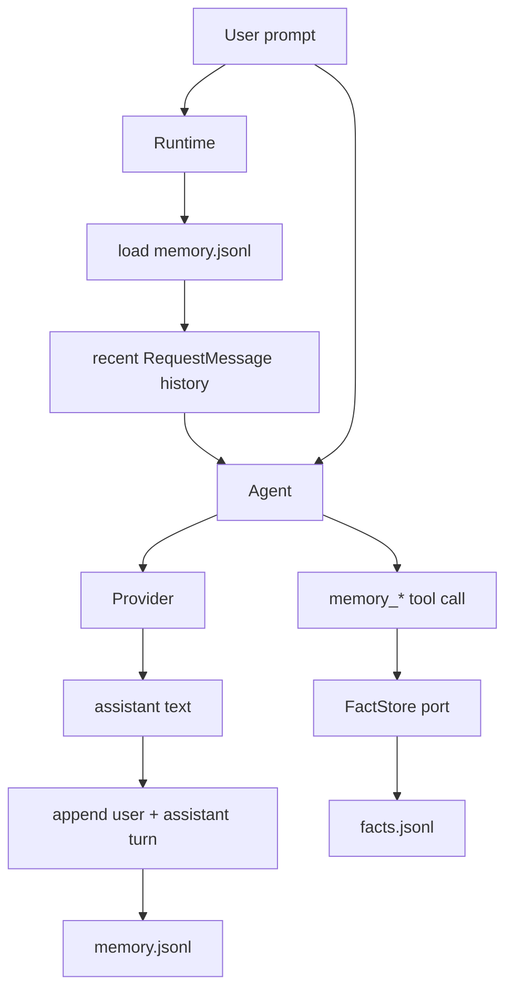
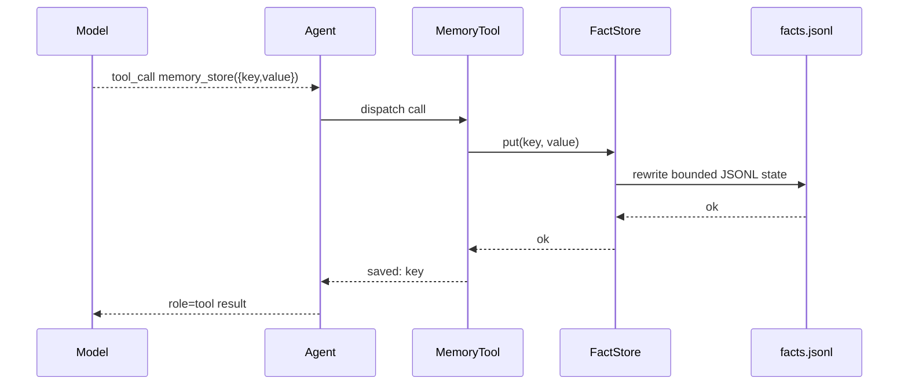

# Memory

`nllclw`-এর দুটি memory systems আছে:

1. transcript memory, যা সাম্প্রতিক user/assistant turns রাখে;
2. durable fact memory, যা explicit tools-এর মাধ্যমে keyed facts store করে।

দুটিই defaultভাবে user state directory-তে JSONL files, binary-এর পাশে বা current
project-এ নয়।

## Overview



## Transcript Memory

Transcript memory defaultভাবে enabled:

```sh
NLLCLW_MEMORY=on
# Default: user state dir/memory.jsonl
NLLCLW_MEMORY_MAX_MESSAGES=20
```

`NLLCLW_MEMORY_MAX_MESSAGES` অন্তত 2 হতে হবে, কারণ transcript appends
user/assistant pairs হিসেবে stored হয়।

প্রতি line একটি JSON object:

```json
{"role":"user","content":"remember that this project uses Zig 0.16"}
{"role":"assistant","content":"Got it."}
```

একটি turn startup-এ:

1. `runtime.zig` configured transcript store খুলে।
2. `memory.zig` JSONL lines parse করে।
3. Invalid roles, invalid JSON, invalid UTF-8, বা binary control bytes memory error তৈরি করে।
4. শুধু newest `NLLCLW_MEMORY_MAX_MESSAGES` entries retained হয়।
5. Entries Chat Completions request messages-এ converted হয়।

Successful assistant response-এর পরে `Runtime.appendMemory` user prompt এবং
assistant text append করে। Append fail করলে already produced assistant answer
তবুও printed হয় এবং channel warning report করে।

Transcript snapshots 256 KiB-এ capped, JSONL file load করার সময়ও একই limit ব্যবহৃত
হয়। Oversized turns atomic replace-এর আগে rejected হয়, তাই successful write এমন
transcript তৈরি করতে পারে না যা next startup read করতে পারবে না।

## Durable Fact Memory

Fact memory stable key/value facts-এর জন্য। এটি default local tool loop-এর মাধ্যমে
available যখন:

```sh
NLLCLW_MEMORY=on
NLLCLW_TOOLS=on
```

Defaults:

```sh
# Default path: user state dir/facts.jsonl
NLLCLW_MEMORY_MAX_FACTS=64
```

`NLLCLW_MEMORY_MAX_FACTS` 1 থেকে 1024-এর মধ্যে হতে হবে।

প্রতি line একটি JSON object:

```json
{"key":"project.language","value":"Zig 0.16"}
{"key":"user.prefers","value":"direct, pragmatic answers"}
```

Fact keys:

- non-empty হতে হবে;
- 64 bytes পর্যন্ত limited;
- letters, digits, `_`, `-`, এবং `.` থাকতে পারে;
- key অনুযায়ী deduplicated, newest value wins।

Fact values:

- non-empty হতে হবে;
- non-whitespace text থাকতে হবে;
- valid UTF-8 হতে হবে;
- ASCII control bytes থাকতে পারবে না;
- 2048 bytes পর্যন্ত limited;
- `memory_recall` দ্বারা returned হলে `NLLCLW_TOOL_OUTPUT_MAX_BYTES`-এর মধ্যে fit করতে হবে।

Fact JSONL snapshot transcript memory-এর মতো একই 256 KiB read/write cap ব্যবহার
করে। যদি অনেক retained facts সেই file limit ছাড়িয়ে যায়, unreadable facts file
তৈরি করার বদলে write fail করে।

## Memory Tools

| Tool | Purpose |
|---|---|
| `memory_store` | Key দিয়ে fact store বা update করুন। |
| `memory_recall` | Key দিয়ে fact read করুন। |
| `memory_list` | Known fact keys list করুন। |
| `memory_forget` | Key দিয়ে fact delete করুন। |

Tool flow:



## CLI Memory Commands

এই commands durable facts-এ operate করে:

```sh
nllclw memory list
nllclw memory get project.language
nllclw memory forget project.language
nllclw memory reset
```

`memory reset` transcript memory এবং fact memory দুটোই clear করে।

## Privacy and Safety Notes

- Memory files defaultভাবে user state directory-তে থাকে।
- `.nllclw-*` files filesystem tools থেকে denied, যাতে model `read_file`,
  `write_file`, বা `edit_file` দিয়ে নিজের memory files read বা edit করতে না পারে।
- Memory encrypted নয়। এতে secrets store করবেন না।
- Fact memory durable user/project preferences-এর জন্য ব্যবহার করুন, raw
  conversation logs-এর জন্য নয়।
