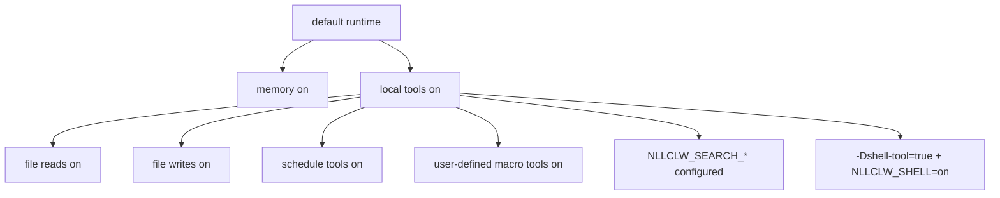

# Security Model

`nllclw` একটি local AI assistant, sandbox নয়। এর safety model ছোট local-only
defaults, explicit external capability gates, bounded local outputs এবং careful
provider/config validation-এর উপর ভিত্তি করে।

## Default Posture

Default build:

- no package dependencies;
- no external runtime programs;
- no `curl`;
- no shell execution;
- local tools enabled;
- filesystem tools enabled with relative-path and secret-path protections;
- scheduler tools enabled for local JSONL schedules;
- user-defined macro tools enabled and stored in local JSONL;
- search provider configured না থাকলে web search disabled;
- Telegram disabled যদি না explicitly launched এবং allowlist দিয়ে configured হয়।
- WebSocket disabled যদি না explicitly launched হয়; default bind loopback-only।

Memory defaultভাবে enabled কারণ এটি শুধু user state directory-তে local JSONL
files লেখে। Disable করতে:

```sh
NLLCLW_MEMORY=off
```

সব tools disable করতে:

```sh
NLLCLW_TOOLS=off
```

## Capability Gates



Model defaultভাবে local tool definitions পায়। External web search এবং shell
execution এখনও explicit setup require করে।

## Provider-Key Handling

- API keys OS env, `config.json`, বা `.env` থেকে আসে।
- OS env file config override করে, এবং `config.json` `.env` override করে।
- Completion provider keys শুধু `Authorization: Bearer ...` হিসেবে পাঠানো হয়।
- Search provider keys প্রতিটি provider-এর documented auth header দিয়ে পাঠানো হয়:
  Tavily এবং Firecrawl-এর জন্য bearer auth, Brave Search-এর জন্য
  `X-Subscription-Token`, এবং Exa-এর জন্য `x-api-key`।
- Header values ASCII control bytes reject করে।
- Request JSON build হওয়ার আগে provider model names invalid UTF-8 এবং control bytes reject করে।
- Chat request content strings, assistant response text, এবং tool-call argument
  strings invalid UTF-8 এবং binary control bytes reject করে; normal newlines,
  carriage returns, এবং tabs সেখানে valid text। Request metadata যেমন model names,
  roles, tool-call ids, function names, এবং parameter names additionally single-line।
- Provider response roles present থাকলে `assistant` হতে হবে।
- Provider এবং Telegram diagnostic messages empty, too large, বা control bytes
  থাকলে trusted single-line errors হিসেবে printed হয় না।
- Raw diagnostic response bodies শুধু valid text হলে printed হয় এবং terminal output-এ capped।
- Default state files user state directory-তে থাকে। Memory, macro tools, এবং
  schedules-এর configured state paths relative `.jsonl` paths হতে হবে, valid UTF-8,
  no control bytes, `/` separators, no Windows-reserved filename characters বা
  device names, এবং no empty, `.`, `..`, trailing-space, বা trailing-dot path components।
- Local state files এবং তাদের lock files terminal symlinks follow না করে opened হয়।
  Writes atomic replace এবং host platform expose করলে private file permissions ব্যবহার করে।
- Durable fact memory values store বা CLI/tool recall paths দিয়ে print হওয়ার আগে
  ASCII control bytes reject করে।
- User-defined macro tool descriptions এবং actions store বা model-facing tool
  schema/output হিসেবে ফেরত পাঠানোর আগে ASCII control bytes reject করে।
- Scheduled actions store বা schedule listing-এ print হওয়ার আগে ASCII control bytes reject করে।
- Model-facing tool outputs invalid UTF-8 এবং binary control bytes reject করে।
- `.env`, `config.json`, এবং `.nllclw-*` paths filesystem tools থেকে denied।
- user-defined macro tools defaultভাবে user state directory-তে stored।
- Prompts বা context files-এ real keys paste করবেন না।

## Compatible Provider Safety

Compatible providers defaultভাবে HTTPS ব্যবহার করতে হবে:

```json
{
  "provider": "compatible",
  "base_url": "https://example.com/v1",
  "api_key": "...",
  "model": "..."
}
```

HTTP শুধু exact loopback hosts-এর জন্য এবং explicitly enabled হলে allowed:

```json
{
  "provider": "compatible",
  "base_url": "http://127.0.0.1:11434/v1",
  "allow_http_base_url": true,
  "api_key": "ollama",
  "model": "llama3.2"
}
```

Remote HTTP URLs rejected।

## Filesystem Tool Boundary

Filesystem tools full sandbox নয়, কিন্তু conservative local boundary enforce করে:

- relative paths only;
- valid UTF-8, control-free paths no longer than 512 bytes;
- no `..`;
- no absolute POSIX paths;
- no absolute or drive-qualified Windows paths;
- no empty, `.`, or `..` path components, except that `list_dir` accepts
  literal `.` for the current directory;
- no symlink traversal for opened path components;
- no Windows-reserved filename characters, device names, trailing spaces, or
  trailing dots;
- no `.env`, `config.json`, `.nllclw-*`, `.git`, `.ssh`, `.gnupg`, `.aws`, `.npmrc`;
- no common private-key filenames or suffixes;
- UTF-8 text only, without binary control bytes;
- output-size caps;
- atomic writes.

File tools শুধু এমন directory-তে চালান যেখানে এই permissions অর্থপূর্ণ।

## Telegram Boundary

Telegram mode default-deny:

- `NLLCLW_TELEGRAM_TOKEN` required;
- Telegram tokens Bot API URLs-এ যাওয়ার আগে `<bot-id>:<secret>` হিসেবে validated;
- `NLLCLW_TELEGRAM_CHAT_ID` required;
- configured chat id বা username allowlist-এর বাইরে messages ignored;
- same state directory ব্যবহার করা দ্বিতীয় `nllclw telegram` process local
  nonblocking lock reject করে;
- restart-এর পরে replay এড়াতে last processed update locally stored।
- model-backed messages `NLLCLW_TELEGRAM_RATE_LIMIT_PER_MINUTE` দিয়ে rate-limited।

## WebSocket Boundary

WebSocket mode defaultভাবে local custom UIs-এর জন্য intended:

- এটি শুধু `nllclw websocket` launched হলে start হয়;
- default bind `127.0.0.1:8765`;
- loopback binds-এর জন্যও `NLLCLW_WS_TOKEN` required;
- `NLLCLW_WS_PATH` single-line valid UTF-8 হতে হবে, query বা fragment syntax ছাড়া;
- non-loopback bind addresses require `NLLCLW_WS_ALLOW_REMOTE=on`;
- loopback browser clients token `?token=...` হিসেবে pass করতে পারে;
- loopback query authentication exactly one `token` parameter accept করে;
- remote clients exactly one `Authorization: Bearer ...` header ব্যবহার করতে হবে;
- model-backed chat messages `NLLCLW_WS_RATE_LIMIT_PER_MINUTE` দিয়ে rate-limited।
- built-in server এক সময়ে এক active client handle করে।

Reverse proxy এবং transport security ছাড়া WebSocket port untrusted network-এ expose
করবেন না। Built-in channel plain `ws://`, TLS termination নয়।

## Shell Tool Boundary

Default binary `shell_exec` অন্তর্ভুক্ত করে না।

Shell execution সম্ভব করতে দুই conditions true হতে হবে:

```sh
zig build -Dshell-tool=true
NLLCLW_SHELL=on
```

Shell tool-কে model-কে local command execution দেওয়ার সমতুল্য ধরে নিন। শুধু
trusted environments-এ ব্যবহার করুন।

## Practical Checklist

Default local capabilities ব্যবহার করার আগে:

1. Dedicated project directory-তে run করুন।
2. Prompts এবং context files থেকে secrets দূরে রাখুন।
3. File mutation না চাইলে `NLLCLW_FILE_WRITE=off` set করুন।
4. Command execution required না হলে default no-shell binary ব্যবহার করুন।
5. Tool output bounded রাখতে `NLLCLW_TOOL_OUTPUT_MAX_BYTES` ব্যবহার করুন।
6. Quick health line-এর জন্য `nllclw status` বা full diagnostics-এর জন্য `nllclw doctor` ব্যবহার করুন।
