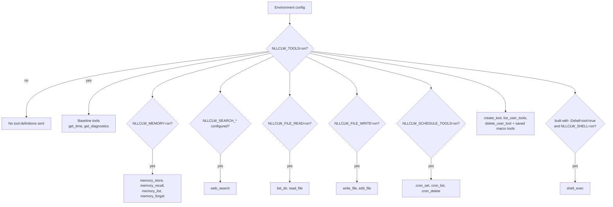
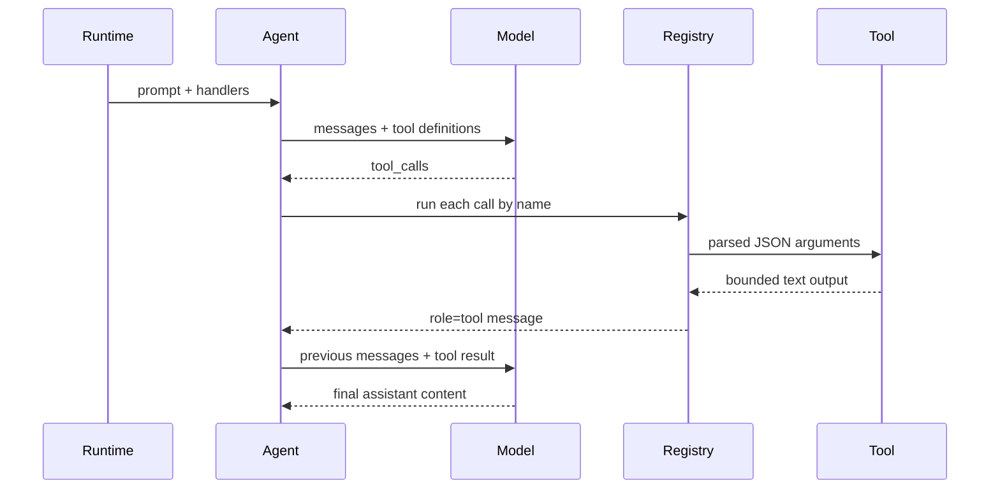

# Tools

Tools model-কে `nllclw` দিয়ে local actions করাতে দেয়। External services দরকার
নেই এমন local tools defaultভাবে enabled। External web search এবং optional shell
execution এখনও explicit setup require করে।

## Capability Model



Default binary-তে `shell_exec` নেই। Explicitly build করুন:

```sh
zig build -Dshell-tool=true
```

তারপর runtime-এ enable করুন:

```sh
NLLCLW_TOOLS=on
NLLCLW_SHELL=on
```

সব tools disable করতে:

```sh
NLLCLW_TOOLS=off
```

## Tool Loop



`NLLCLW_TOOL_MAX_ROUNDS` limit করে agent `ToolRoundLimit` return করার আগে কত
assistant/tool exchange rounds হতে পারে।

Built-in tool arguments exact JSON objects। Invalid JSON, missing required fields,
unknown fields, invalid field types, এবং validation failures model handle করার জন্য
tool error return করে।

## Available Tools

| Tool | Gate | Effect |
|---|---|---|
| `get_time` | `NLLCLW_TOOLS=on` default | `NLLCLW_TIMEZONE_OFFSET_MINUTES` ব্যবহার করে local time return করে। |
| `get_diagnostics` | `NLLCLW_TOOLS=on` default | Runtime capability/config status report করে। |
| `web_search` | `NLLCLW_TOOLS=on` এবং configured `NLLCLW_SEARCH_*` provider | Selected search provider HTTP port দিয়ে call করে। |
| `memory_store` | `NLLCLW_TOOLS=on`, `NLLCLW_MEMORY=on` defaults | Durable fact store করে। |
| `memory_recall` | `NLLCLW_TOOLS=on`, `NLLCLW_MEMORY=on` defaults | Durable fact read করে। |
| `memory_list` | `NLLCLW_TOOLS=on`, `NLLCLW_MEMORY=on` defaults | Durable fact keys list করে। |
| `memory_forget` | `NLLCLW_TOOLS=on`, `NLLCLW_MEMORY=on` defaults | Durable fact delete করে। |
| `list_dir` | `NLLCLW_FILE_READ=on` default | CWD-relative directory list করে। |
| `read_file` | `NLLCLW_FILE_READ=on` default | UTF-8 CWD-relative file read করে। |
| `write_file` | `NLLCLW_FILE_WRITE=on` default | UTF-8 CWD-relative file atomically write করে। |
| `edit_file` | `NLLCLW_FILE_WRITE=on` default | File-এর first exact text match replace করে। |
| `cron_set` | `NLLCLW_SCHEDULE_TOOLS=on` default | Local scheduled task যোগ করে। |
| `cron_list` | `NLLCLW_SCHEDULE_TOOLS=on` default | Scheduled tasks list করে। |
| `cron_delete` | `NLLCLW_SCHEDULE_TOOLS=on` default | Scheduled task delete করে। |
| `create_tool` | `NLLCLW_TOOLS=on` default | Persistent user-defined macro tool তৈরি করে। |
| `list_user_tools` | `NLLCLW_TOOLS=on` default | Saved macro tools list করে। |
| `delete_user_tool` | `NLLCLW_TOOLS=on` default | Saved macro tool delete করে। |
| saved macro tools | `NLLCLW_TOOLS=on` default | Saved action text return করে যাতে model built-in tools দিয়ে execute করতে পারে। |
| `shell_exec` | optional shell build plus `NLLCLW_SHELL=on` | Timeout, combined output cap, এবং binary control bytes ছাড়া UTF-8 text output সহ shell command run করে। |

## User-Defined Tools

User-defined tools macro tools, generated code নয়। `create_tool` name, description,
এবং natural-language action `NLLCLW_USER_TOOLS_PATH`-এ store করে (default user
state directory-তে `user-tools.jsonl`)।
পরের turns-এ saved tools normal tool definitions হিসেবে advertised হয়। Model যখন
একটি call করে, `nllclw` saved action text return করে এবং model built-in tools দিয়ে
same tool loop continue করে।

Example:

```text
create_tool(name="daily_brief", description="Prepare a daily brief", action="Search for current project news, summarize it, and store the summary in memory.")
```

Tool names শুধু letters, digits এবং underscores রাখতে পারে। Built-in tools-এর সঙ্গে
collide করা names rejected। Descriptions এবং actions trimmed, bounded, valid UTF-8
text, ASCII control bytes ছাড়া। User-tool JSONL file read এবং write দুটিতেই 128 KiB
cap, terminal symlinks follow না করে opened হয়, এবং saved action tool result হিসেবে
wrapped হলে `NLLCLW_TOOL_OUTPUT_MAX_BYTES`-এর মধ্যে fit করতে হবে।

## Web Search Providers

`web_search` এক tool, provider `NLLCLW_SEARCH_PROVIDER` দিয়ে selected। Default
`auto` mode এই order-এ first configured key বেছে নেয়: Tavily, Brave Search, Exa,
Firecrawl, তারপর DuckDuckGo শুধু explicitly enabled হলে।
Explicit key-based providers তাদের matching `NLLCLW_SEARCH_*_KEY` require করে।
Search keys ASCII control bytes রাখতে পারবে না।
Queries trimmed, valid UTF-8, control-free, এবং সর্বোচ্চ 512 bytes।
Provider result text valid UTF-8 হিসেবে formatted, binary control bytes ছাড়া;
result fields-এর ordinary tabs এবং newlines spaces-এ normalized।
Empty provider result objects skipped হয়, এবং valid empty provider response
synthetic placeholder row-এর বদলে `no results` return করে। DuckDuckGo nested
related-topic groups small bounded depth পর্যন্ত flattened হয়।

| Provider | Env | Notes |
|---|---|---|
| `tavily` | `NLLCLW_SEARCH_TAVILY_KEY=...` | Tavily Search-এ POST করে। |
| `brave` | `NLLCLW_SEARCH_BRAVE_KEY=...` | `X-Subscription-Token` সহ Brave Web Search GET করে। |
| `exa` | `NLLCLW_SEARCH_EXA_KEY=...` | `x-api-key` সহ Exa Search POST করে। |
| `firecrawl` | `NLLCLW_SEARCH_FIRECRAWL_KEY=...` | Bearer auth সহ Firecrawl Search POST করে। |
| `duckduckgo` | `NLLCLW_SEARCH_DUCKDUCKGO=on` বা `NLLCLW_SEARCH_PROVIDER=duckduckgo` | No-key Instant Answer fallback, full web SERP API নয়। |

Examples:

```sh
NLLCLW_TOOLS=on
NLLCLW_SEARCH_PROVIDER=auto
NLLCLW_SEARCH_BRAVE_KEY=...
```

```sh
NLLCLW_TOOLS=on
NLLCLW_SEARCH_PROVIDER=duckduckgo
```

## Scheduled Delivery

`cron_set` delivery-এর জন্য `channel` এবং `chat_id` accept করে। Telegram turns-এ
current chat default destination হয়, তাই "remind me here tomorrow" ধরনের prompt
model-facing user text-এ chat id expose না করেই Telegram schedule তৈরি করতে পারে।

Scheduled actions trimmed, valid UTF-8 হতে হবে, ASCII control bytes ছাড়া, এবং
2048 bytes পর্যন্ত limited। Schedule JSONL file read এবং write দুটিতে 128 KiB cap;
oversized snapshots atomic replacement-এর আগে rejected।
`cron_set` শুধু তার `type`-এর সঙ্গে match করা timing fields accept করে: periodic
schedules-এর জন্য `interval_*`, one-shot schedules-এর জন্য `delay_*`, এবং daily
schedules-এর জন্য `hour`/`minute`।
Daemon schedule commit করে শুধু scheduled prompt complete এবং configured delivery
successful হওয়ার পরে; failed বা blocked deliveries local lease expire হওয়ার পরে retry করে।

Supported destinations:

| Channel | Behavior |
|---|---|
| `local` | Daemon result stdout-এ write করে। |
| `telegram` | Daemon stored Telegram chat id-তে `NLLCLW_TELEGRAM_TOKEN` ব্যবহার করে result পাঠায়। |

## Filesystem Safety Model

Filesystem tools conservative:

- paths current working directory-এর relative হতে হবে;
- paths valid UTF-8, control-free, এবং সর্বোচ্চ 512 bytes হতে হবে;
- absolute POSIX paths rejected;
- absolute বা drive-qualified Windows paths rejected;
- empty, `.`, এবং `..` components rejected, তবে `list_dir` current directory-এর জন্য
  literal `.` accept করে;
- denied components-এর মধ্যে `.env`, `.env.*`, `config.json`, `.nllclw-*`,
  `.git`, `.ssh`, `.gnupg`, `.aws`, `.npmrc`, `id_rsa`, `id_ed25519`;
- denied Windows device names-এর মধ্যে `CON`, `PRN`, `AUX`, `NUL`, `CONIN$`,
  `CONOUT$`, `COM1` through `COM9`, এবং `LPT1` through `LPT9`, extensions সহ;
- Windows-reserved filename punctuation (`<`, `>`, `:`, `"`, `|`, `?`, `*`)
  portable behavior-এর জন্য rejected;
- space বা dot দিয়ে শেষ হওয়া path components portable behavior-এর জন্য rejected;
- denied suffixes-এর মধ্যে `.pem`, `.key`, `.p12`, `.pfx`;
- intermediate directories symlinks follow না করে opened;
- terminal files symlinks follow না করে opened;
- reads এবং writes valid UTF-8 text require করে, binary control bytes ছাড়া;
- `list_dir` sorted order-এ names emit করে এবং denied, non-UTF-8, বা
  control-character entry names omit করে;
- writes atomic replacement এবং supported হলে private file permissions ব্যবহার করে;
- output `NLLCLW_TOOL_OUTPUT_MAX_BYTES` দিয়ে capped।

এটি local safety boundary, sandbox নয়। Enabled capabilities grant করতে আপনি
স্বচ্ছন্দ এমন directories-তেই `nllclw` run করুন।

## Adding a Tool

Preferred shape:

1. `src/tools/<name>.zig`-এ focused module যোগ করুন।
2. `chat.ToolDefinition` define করুন।
3. শুধু প্রয়োজনীয় dependencies own করে এমন small client struct implement করুন।
4. `std.json.parseFromSlice` দিয়ে JSON arguments parse করুন।
5. `NLLCLW_TOOL_OUTPUT_MAX_BYTES` দিয়ে capped owned text output return করুন।
6. Tool local state read বা mutate করলে handler `src/tools/catalog.zig`-এ explicit
   config gate-এর পেছনে register করুন।
7. Success, invalid JSON/arguments, bounds, এবং denied access-এর tests যোগ করুন।

Infrastructure adapters `src/tools/`-এ রাখবেন না। Tool persistence বা HTTP চাইলে
port define বা reuse করুন এবং catalog দিয়ে inject করুন।
