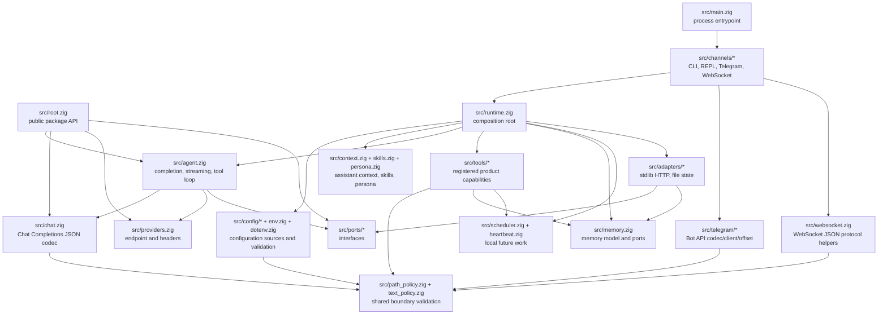
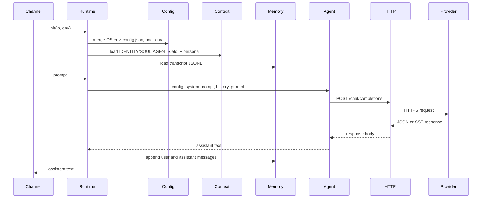
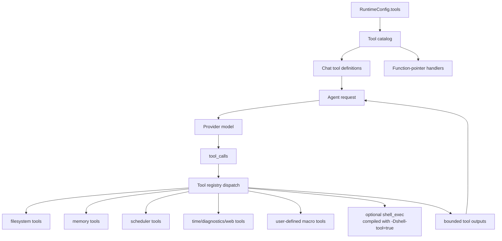
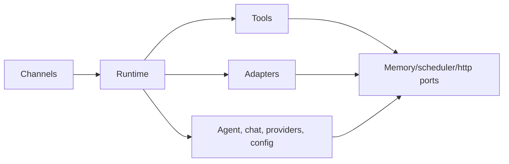

# Architecture

`nllclw` is a compact AI assistant built as a Zig package plus one executable.
The main design goal is to keep the agent engine testable while still shipping a
small standalone binary.

## Goals

- Keep the provider wire contract simple: OpenAI-compatible Chat Completions.
- Keep runtime dependencies explicit: default build uses only Zig stdlib.
- Keep local capabilities capability-gated and easy to audit.
- Keep channels thin: CLI, REPL, Telegram, WebSocket, heartbeat, and daemon all call the
  same runtime and agent engine.
- Keep the public package API small enough to teach from.

## Layer Map



## Request Flow

The same engine handles argv prompts, stdin prompts, REPL turns, Telegram
messages, WebSocket prompts, heartbeat tasks, and due schedules.



## Tool Loop Flow

Tools are product capabilities, not infrastructure adapters. They live in
`src/tools/` and are exposed to the model only through `src/tools/catalog.zig`.



The agent repeats this loop until one of three things happens:

- the model returns assistant content with no tool calls;
- `NLLCLW_TOOL_MAX_ROUNDS` is reached;
- a provider error, malformed provider response, allocation failure, or other
  fatal dispatch error occurs.

Non-fatal tool failures are returned to the model as `tool error: ...` tool
messages so the model can recover, choose different arguments, or explain the
failure. Allocation failures still abort the turn.

Streaming is deliberately disabled when tools are enabled. The assistant needs a
complete model response to know which tool calls to run.

`src/chat.zig` validates every request string as UTF-8 text without binary
control bytes before JSON encoding. This keeps Chat Completions fields as JSON
strings instead of letting arbitrary byte slices degrade into arrays. For SSE,
`[DONE]` is terminal; later chunks are ignored.

## Module Responsibilities

| Path | Responsibility |
|---|---|
| `src/main.zig` | Minimal executable entrypoint and process exit. |
| `src/root.zig` | Stable public API: config, chat types, HTTP port, streaming sink, `complete`. |
| `src/runtime.zig` | Composition root for CLI-like operation: config, HTTP adapter, memory adapter, context, tools. |
| `src/agent.zig` | Channel-neutral one-turn assistant engine, streaming, and tool loop. |
| `src/chat.zig` | JSON request/response codec for Chat Completions, including tools and SSE chunks. |
| `src/providers.zig` | Provider presets and compatible-provider endpoint validation. |
| `src/config/*` | Typed runtime config, source collection, validation, and owned copies. |
| `src/channels/*` | User I/O orchestration for CLI, REPL, Telegram, WebSocket, and daemon commands. |
| `src/tools/*` | Tool definitions, local capabilities, and user-defined macro tools. |
| `src/skills.zig` | Compact `skills/*.md` index for on-demand local skill loading. |
| `src/persona.zig` | Runtime presentation modes appended to the system prompt. |
| `src/memory.zig` | Transcript/fact models, JSONL parsers, and memory store ports. |
| `src/adapters/*` | Concrete stdlib adapters for ports. |
| `src/ports/*` | Function-pointer interfaces for testable boundaries. |
| `src/telegram/*` | Telegram Bot API wire helpers. |
| `src/websocket.zig` | Testable WebSocket JSON message/event helpers. |

## Public Package API

Consumers import the package module as `nllclw`. The exported surface is small:

```zig
const nllclw = @import("nllclw");

const cfg: nllclw.Config = .{
    .provider = .openrouter,
    .api_key = "...",
    .model = "openai/gpt-chat-latest",
};

const text = try nllclw.complete(allocator, http_client, cfg, "hello");
```

The public API exposes:

- `ProviderKind`
- `PersonaKind`
- `Config`
- chat request/tool types
- `HttpClient`, `HttpResponse`, `HttpHeader`, `HttpStatusCode`
- `Diagnostic`
- `ToolOptions`, `ToolHandler`, `ToolRunError`, `CompleteOptions`
- `StreamError`, `StreamSink`
- `complete` and `completeWithOptions`

Runtime-only details such as `config.json`/`.env` loading, file memory, Telegram
polling, and the stdlib HTTP adapter stay outside the public root. The public
tool handler is only the function-pointer abstraction needed by `ToolOptions`;
built-in product tools and their file-backed stores remain internal.

## Dependency Direction

The dependency direction is explicit:



Core code does not know about process env, `config.json`, `.env`, filesystem
paths, Telegram polling, or `std.http.Client`. Those details are assembled by
`runtime.zig` and the channels.

## Memory Ownership

The code follows Zig's explicit ownership style:

- Functions that allocate return owned slices and document ownership through
  `defer`/`deinit` patterns near call sites.
- Long-lived runtime state is owned by `Runtime` and released in
  `Runtime.deinit`.
- Parsed config can be borrowed from source buffers or copied into
  `config.Owned` for runtime storage.
- Tool outputs are owned by the agent until they are sent back to the model and
  then freed after the loop.

## Cross-Platform Runtime Model

The default binary is meant to run anywhere Zig and the Zig standard library can
support the target:

- no `curl`;
- no provider SDK;
- no package dependencies in `build.zig.zon`;
- no shell process in the default build;
- `std.http.Client` for HTTPS;
- `std.Io` for files, stdin/stdout/stderr, and timers.

The optional shell tool is a separate build flavor:

```sh
zig build -Dshell-tool=true
```

That flavor is not the default because it can launch `sh` or `cmd.exe` when
enabled at runtime.
