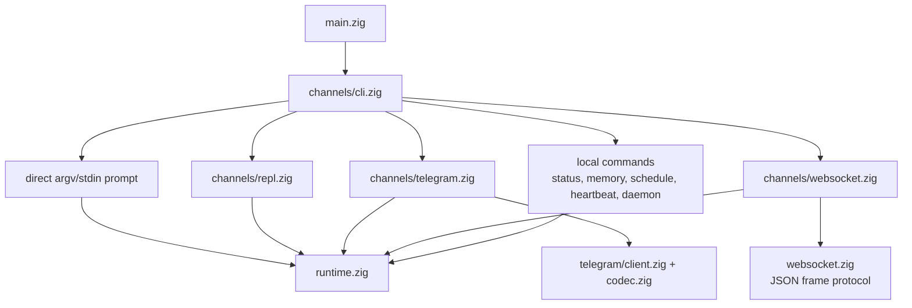
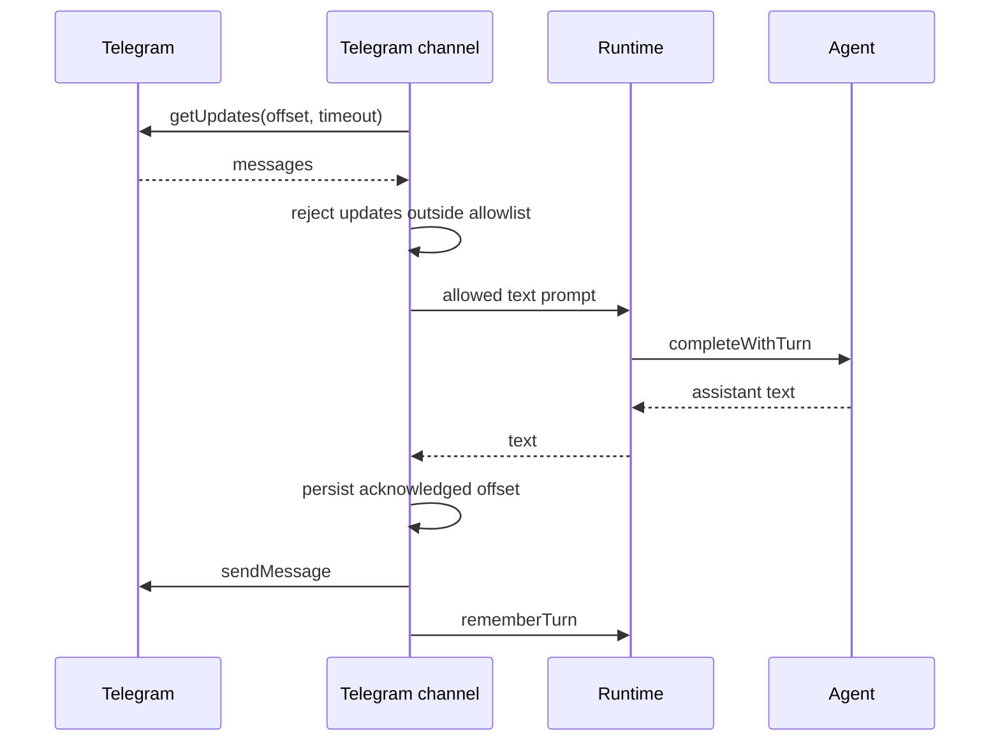
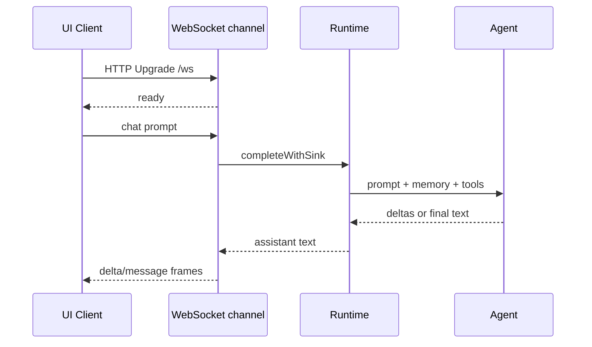

# Channels

Channels are the user-facing ways to talk to the same runtime and agent engine.
They parse input, own channel-specific I/O, and delegate completions to
`runtime.zig`.

## Channel Map



## Direct CLI

Prompt from argv:

```sh
nllclw "explain this repository in one paragraph"
```

Prompt from stdin:

```sh
printf 'summarize this text\n' | nllclw
```

`NLLCLW_STREAM=on` is the default:

```sh
NLLCLW_STREAM=on
```

The tool loop is also on by default, and tool output is non-streaming because
the agent must inspect complete tool calls before dispatching local functions.
For pure streaming chat, set `NLLCLW_TOOLS=off`.

Direct slash commands are handled locally:

```sh
nllclw /settings
nllclw /diag memory
nllclw /persona technical
```

These commands do not call the model.

## Interactive REPL

When stdin is a TTY and no prompt is provided, `nllclw` starts a small terminal
chat loop:

```sh
nllclw
```

Exit commands:

```text
:q
:quit
exit
```

Each turn uses the same runtime memory and tool configuration as direct CLI
mode.

## Telegram

Telegram mode uses Bot API long polling:

```sh
NLLCLW_TELEGRAM_TOKEN=123456:bot-token
NLLCLW_TELEGRAM_CHAT_ID=123456789
nllclw telegram
```

`NLLCLW_TELEGRAM_CHAT_ID` can also be a private-chat or public-chat Telegram
username, with or without `@`, for example `@donprus` or `donprus`.

Security properties:

- `NLLCLW_TELEGRAM_CHAT_ID` is required;
- messages outside the configured chat id or username allowlist are ignored;
- a local nonblocking lock stops a second `nllclw telegram` process on the
  same state directory before it reaches Bot API polling;
- accepted message text must be valid UTF-8 without binary control bytes;
  malformed text updates are skipped while the polling offset still advances;
- the last acknowledged update id is stored in the user state directory;
- restarts continue from the stored offset and do not replay handled messages.
- model-backed messages are rate-limited by `NLLCLW_TELEGRAM_RATE_LIMIT_PER_MINUTE`
  (default `20`, `0` disables); local slash commands are not rate-limited.

If another machine, deployment, or older binary is already using `getUpdates`
for the same bot token, Telegram returns HTTP `409`. `nllclw` prints a specific
hint for that conflict.

Flow:



## WebSocket

WebSocket mode starts a local RFC6455 server for custom browser, desktop, or
mobile UIs:

```sh
NLLCLW_WS_TOKEN=change-me nllclw websocket
```

Default bind settings:

```sh
NLLCLW_WS_HOST=127.0.0.1
NLLCLW_WS_PORT=8765
NLLCLW_WS_PATH=/ws
```

The default bind address is loopback-only, but the channel still requires
`NLLCLW_WS_TOKEN` so random browser pages cannot talk to the local agent.
Remote binds require both:

```sh
env NLLCLW_WS_HOST=0.0.0.0 \
  NLLCLW_WS_ALLOW_REMOTE=on \
  NLLCLW_WS_TOKEN=change-me \
  nllclw websocket
```

Loopback browser clients can pass the token as a query parameter:

```js
const socket = new WebSocket("ws://127.0.0.1:8765/ws?token=change-me");

socket.addEventListener("message", (event) => {
  const message = JSON.parse(event.data);
  console.log(message.type, message.content ?? message.message);
});

socket.addEventListener("open", () => {
  socket.send(JSON.stringify({
    type: "chat",
    prompt: "Explain this repository in one paragraph."
  }));
});
```

Query authentication accepts exactly one `token` parameter. Duplicate token
parameters are rejected as ambiguous.

Remote clients must use exactly one bearer token header. Browser-based remote
UIs should connect through a trusted local or reverse proxy that injects this
header.

```text
Authorization: Bearer change-me
```

Client messages:

```json
{ "type": "chat", "prompt": "hello" }
{ "type": "status" }
{ "type": "ping" }
{ "type": "close" }
```

Plain text frames are accepted as chat prompts for simple clients. Text frames
must be valid UTF-8 without binary control bytes.
JSON command frames are exact objects; unknown fields are rejected, and only
`chat`/`message` frames may include `prompt`.
The server handles one active WebSocket client at a time. Additional clients can
connect after the active client disconnects.

Server messages:

```json
{ "type": "ready", "version": 1, "channel": "websocket" }
{ "type": "delta", "content": "partial text" }
{ "type": "message", "content": "final text" }
{ "type": "status", "content": "nllclw: ok ..." }
{ "type": "pong", "content": "pong" }
{ "type": "error", "message": "request failed" }
```

`delta` frames are emitted only when `NLLCLW_STREAM=on` and
`NLLCLW_TOOLS=off`. With tools enabled, the model must complete tool-call
planning before the channel can send the final `message`.

Flow:



## Local Commands

Local commands do not ask the model unless the command explicitly runs a task:

```sh
nllclw status
nllclw doctor
nllclw memory list
nllclw memory get project.goal
nllclw memory forget project.goal
nllclw memory reset
nllclw schedule list
nllclw schedule delete 1
```

`status` prints the quick health line. `doctor` prints the full diagnostics report.

## Shared Slash Commands

REPL, Telegram, and direct CLI share the same slash parser:

| Command | Effect |
|---|---|
| `/start`, `/help` | Show local command help. |
| `/settings` | Show quick runtime status. |
| `/diag [scope]` | Show diagnostics for `quick`, `runtime`, `memory`, `rates`, `time`, or `all`. |
| `/persona [mode]` | Show or set runtime persona: `neutral`, `friendly`, `technical`, `witty`. |
| `/stop` | Pause Telegram intake for the current process. Other channels report that it is Telegram-only. |
| `/resume` | Resume Telegram intake. Other channels report that it is Telegram-only. |
| `/chatid` | Print Telegram chat id and username fields when available. Other channels report that it is Telegram-only. |

Persona changes are runtime-only for the current process. To choose a startup
persona, set `NLLCLW_PERSONA`.

## Heartbeat

`nllclw heartbeat` reads `HEARTBEAT.md` and turns pending items into one prompt.
Only conservative task syntax is considered actionable:

- unchecked markdown task lines;
- lines starting with `TODO:`.

```sh
nllclw heartbeat
```

If no pending task is found, the command prints a short message and exits
successfully.

## Daemon

`nllclw daemon` repeatedly:

1. claims due scheduled tasks from the user state directory;
2. runs each claimed task through the normal runtime;
3. commits only completed schedule entries;
4. periodically runs heartbeat prompts.

```sh
NLLCLW_DAEMON_INTERVAL_SECONDS=60
NLLCLW_HEARTBEAT_INTERVAL_SECONDS=1800
nllclw daemon
```

The daemon is local and file-backed. It does not coordinate across multiple
machines.

Claimed schedules use a local lease. If provider execution, destination
preflight, or delivery fails, the task is not committed; it becomes eligible
again after the lease expires.

When a schedule is created from Telegram, `cron_set` defaults to
`channel=telegram` and the current chat id. The daemon sends the completed
scheduled result back to that chat using `NLLCLW_TELEGRAM_TOKEN`. Local schedules
still write to stdout.
