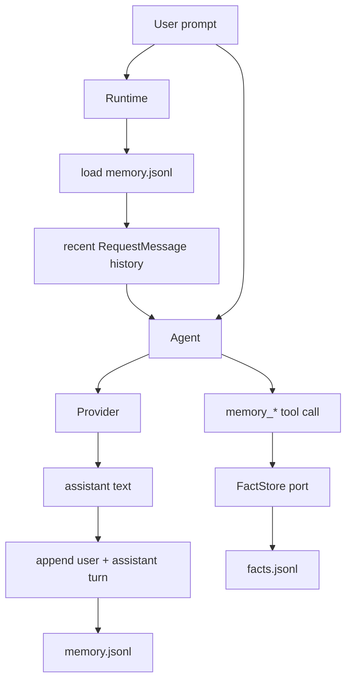
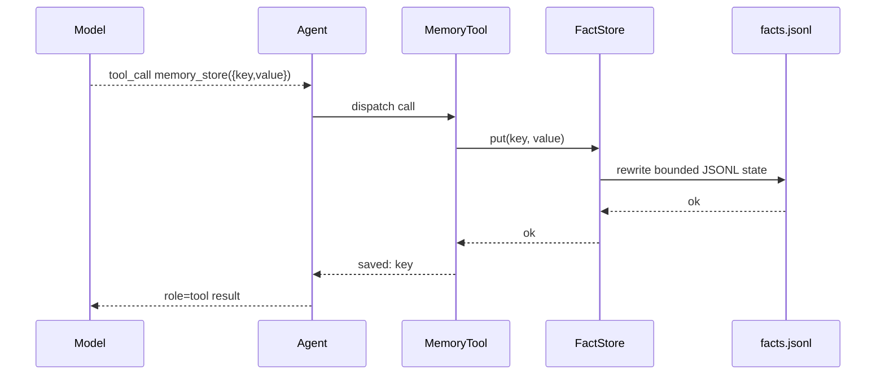

# Memory

`nllclw` has two memory systems:

1. transcript memory, which keeps recent user/assistant turns;
2. durable fact memory, which stores keyed facts through explicit tools.

Both are JSONL files in the user state directory by default, not beside the
binary or in the current project.

## Overview



## Transcript Memory

Transcript memory is enabled by default:

```sh
NLLCLW_MEMORY=on
# Default: user state dir/memory.jsonl
NLLCLW_MEMORY_MAX_MESSAGES=20
```

`NLLCLW_MEMORY_MAX_MESSAGES` must be at least 2 because transcript appends are
stored as user/assistant pairs.

Each line is one JSON object:

```json
{"role":"user","content":"remember that this project uses Zig 0.16"}
{"role":"assistant","content":"Got it."}
```

On startup for a turn:

1. `runtime.zig` opens the configured transcript store.
2. `memory.zig` parses JSONL lines.
3. Invalid roles, invalid JSON, invalid UTF-8, or binary control bytes produce
   a memory error.
4. Only the newest `NLLCLW_MEMORY_MAX_MESSAGES` entries are retained.
5. The entries are converted into Chat Completions request messages.

After a successful assistant response, `Runtime.appendMemory` appends the user
prompt and assistant text. If the append fails, the already produced assistant
answer is still printed and the channel reports a warning.

Transcript snapshots are capped at 256 KiB, the same limit used when loading
the JSONL file. Oversized turns are rejected before the atomic replace, so a
successful write cannot create a transcript that the next startup cannot read.

## Durable Fact Memory

Fact memory is for stable key/value facts. It is available through the default
local tool loop when:

```sh
NLLCLW_MEMORY=on
NLLCLW_TOOLS=on
```

Defaults:

```sh
# Default path: user state dir/facts.jsonl
NLLCLW_MEMORY_MAX_FACTS=64
```

`NLLCLW_MEMORY_MAX_FACTS` must be from 1 to 1024.

Each line is one JSON object:

```json
{"key":"project.language","value":"Zig 0.16"}
{"key":"user.prefers","value":"direct, pragmatic answers"}
```

Fact keys:

- must be non-empty;
- are limited to 64 bytes;
- may contain letters, digits, `_`, `-`, and `.`;
- are deduplicated by key, with the newest value winning.

Fact values:

- must be non-empty;
- must contain non-whitespace text;
- must be valid UTF-8;
- must not contain ASCII control bytes;
- are limited to 2048 bytes;
- must fit within `NLLCLW_TOOL_OUTPUT_MAX_BYTES` when returned by
  `memory_recall`.

The fact JSONL snapshot uses the same 256 KiB read/write cap as transcript
memory. If many retained facts would exceed that file limit, the write fails
instead of creating an unreadable facts file.

## Memory Tools

| Tool | Purpose |
|---|---|
| `memory_store` | Store or update a fact by key. |
| `memory_recall` | Read a fact by key. |
| `memory_list` | List known fact keys. |
| `memory_forget` | Delete a fact by key. |

Tool flow:



## CLI Memory Commands

These commands operate on durable facts:

```sh
nllclw memory list
nllclw memory get project.language
nllclw memory forget project.language
nllclw memory reset
```

`memory reset` clears both transcript memory and fact memory.

## Privacy and Safety Notes

- Memory files live in the user state directory by default.
- `.nllclw-*` files are denied by filesystem tools so the model cannot read or
  edit its own memory files through `read_file`, `write_file`, or `edit_file`.
- Memory is not encrypted. Do not store secrets in it.
- Fact memory should be used for durable user/project preferences, not for raw
  conversation logs.
