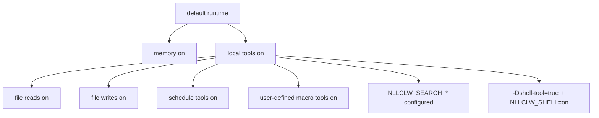

# Security Model

`nllclw` is a local AI assistant, not a sandbox. Its safety model is based on
small local-only defaults, explicit external capability gates, bounded local
outputs, and careful provider/config validation.

## Default Posture

Default build:

- no package dependencies;
- no external runtime programs;
- no `curl`;
- no shell execution;
- local tools enabled;
- filesystem tools enabled with relative-path and secret-path protections;
- scheduler tools enabled for local JSONL schedules;
- user-defined macro tools enabled and stored in local JSONL;
- web search disabled unless a search provider is configured;
- Telegram disabled unless launched explicitly and configured with an allowlist.
- WebSocket disabled unless launched explicitly; default bind is loopback-only.

Memory is enabled by default because it writes only local JSONL files in the
current working directory. You can disable it with:

```sh
NLLCLW_MEMORY=off
```

Disable all tools with:

```sh
NLLCLW_TOOLS=off
```

## Capability Gates



The model receives local tool definitions by default. External web search and
shell execution still require explicit setup.

## Provider-Key Handling

- API keys come from OS env, `config.json`, or `.env`.
- OS env overrides file config, and `config.json` overrides `.env`.
- Completion provider keys are sent only as `Authorization: Bearer ...`.
- Search provider keys are sent with each provider's documented auth header:
  bearer auth for Tavily and Firecrawl, `X-Subscription-Token` for Brave Search,
  and `x-api-key` for Exa.
- Header values reject ASCII control bytes.
- Provider model names reject invalid UTF-8 and control bytes before request JSON
  is built.
- Chat request content strings, assistant response text, and tool-call argument
  strings reject invalid UTF-8 and binary control bytes; normal newlines,
  carriage returns, and tabs remain valid text there. Request metadata such as
  model names, roles, tool-call ids, function names, and parameter names is
  additionally single-line.
- Provider response roles, when present, must be `assistant`.
- Provider and Telegram diagnostic messages that are empty, too large, or
  contain control bytes are not printed as trusted single-line errors.
- Raw diagnostic response bodies are printed only when they are valid text and
  are capped in terminal output.
- Default state files live in the user state directory. Configured state paths
  for memory, macro tools, and schedules must be
  relative `.jsonl` paths with valid UTF-8, no control bytes, `/` separators,
  no Windows-reserved filename characters or device names, and no empty, `.`,
  `..`, trailing-space, or trailing-dot path components.
- Local state files and their lock files are opened without following terminal
  symlinks. Writes use atomic replace and private file permissions where the
  host platform exposes them.
- Durable fact memory values reject ASCII control bytes before they are stored
  or printed by CLI/tool recall paths.
- User-defined macro tool descriptions and actions reject ASCII control bytes
  before they are stored or sent back as model-facing tool schema/output.
- Scheduled actions reject ASCII control bytes before they are stored or printed
  by schedule listing.
- Model-facing tool outputs reject invalid UTF-8 and binary control bytes.
- `.env`, `config.json`, and `.nllclw-*` paths are denied by filesystem tools.
- user-defined macro tools are stored in the user state directory by default.
- Do not paste real keys into prompts or context files.

## Compatible Provider Safety

Compatible providers must use HTTPS by default:

```json
{
  "provider": "compatible",
  "base_url": "https://example.com/v1",
  "api_key": "...",
  "model": "..."
}
```

HTTP is allowed only for exact loopback hosts and only when explicitly enabled:

```json
{
  "provider": "compatible",
  "base_url": "http://127.0.0.1:11434/v1",
  "allow_http_base_url": true,
  "api_key": "ollama",
  "model": "llama3.2"
}
```

Remote HTTP URLs are rejected.

## Filesystem Tool Boundary

Filesystem tools are not a full sandbox, but they enforce a conservative local
boundary:

- relative paths only;
- valid UTF-8, control-free paths no longer than 512 bytes;
- no `..`;
- no absolute POSIX paths;
- no absolute or drive-qualified Windows paths;
- no empty, `.`, or `..` path components, except that `list_dir` accepts
  literal `.` for the current directory;
- no symlink traversal for opened path components;
- no Windows-reserved filename characters, device names, trailing spaces, or
  trailing dots;
- no `.env`, `config.json`, `.nllclw-*`, `.git`, `.ssh`, `.gnupg`, `.aws`, `.npmrc`;
- no common private-key filenames or suffixes;
- UTF-8 text only, without binary control bytes;
- output-size caps;
- atomic writes.

Run with file tools only inside a directory where these permissions make sense.

## Telegram Boundary

Telegram mode is default-deny:

- `NLLCLW_TELEGRAM_TOKEN` is required;
- Telegram tokens are validated as `<bot-id>:<secret>` before being placed in
  Bot API URLs;
- `NLLCLW_TELEGRAM_CHAT_ID` is required;
- messages outside the configured chat id or username allowlist are ignored;
- a local nonblocking lock rejects a second `nllclw telegram` process using the
  same state directory;
- the last processed update is stored locally to avoid replay after restart.
- model-backed messages are rate-limited by
  `NLLCLW_TELEGRAM_RATE_LIMIT_PER_MINUTE`.

## WebSocket Boundary

WebSocket mode is intended for local custom UIs by default:

- it starts only when `nllclw websocket` is launched;
- the default bind is `127.0.0.1:8765`;
- `NLLCLW_WS_TOKEN` is required even for loopback binds;
- `NLLCLW_WS_PATH` must be single-line valid UTF-8 without query or fragment
  syntax;
- non-loopback bind addresses require `NLLCLW_WS_ALLOW_REMOTE=on`;
- loopback browser clients may pass the token as `?token=...`;
- loopback query authentication accepts exactly one `token` parameter;
- remote clients must use exactly one `Authorization: Bearer ...` header;
- model-backed chat messages are rate-limited by
  `NLLCLW_WS_RATE_LIMIT_PER_MINUTE`.
- the built-in server handles one active client at a time.

Do not expose the WebSocket port to an untrusted network without a reverse proxy
and transport security. The built-in channel is plain `ws://`, not TLS
termination.

## Shell Tool Boundary

The default binary does not include `shell_exec`.

To make shell execution possible, both conditions must be true:

```sh
zig build -Dshell-tool=true
NLLCLW_SHELL=on
```

The shell tool should be treated as equivalent to granting the model local
command execution. Use it only in trusted environments.

## Practical Checklist

Before using the default local capabilities:

1. Run in a dedicated project directory.
2. Keep secrets out of prompts and context files.
3. Set `NLLCLW_FILE_WRITE=off` if file mutation is not desired.
4. Use the default no-shell binary unless command execution is required.
5. Use `NLLCLW_TOOL_OUTPUT_MAX_BYTES` to keep tool output bounded.
6. Use `nllclw status` for a quick health line or `nllclw doctor` for full diagnostics.
