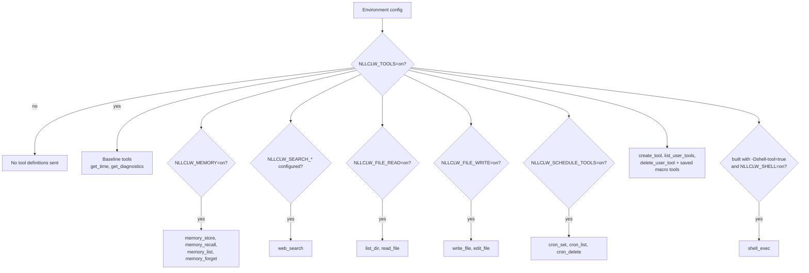
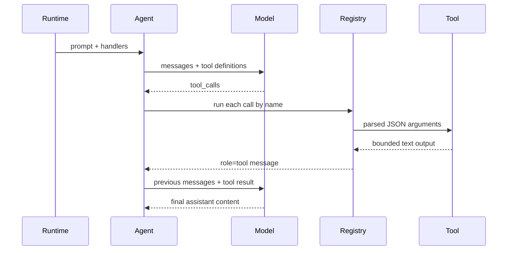

# Tools

Tools let the model ask `nllclw` to perform local actions. Local tools that do
not require external services are enabled by default. External web search and
optional shell execution still require explicit setup.

## Capability Model



The default binary does not contain `shell_exec`. Build it explicitly:

```sh
zig build -Dshell-tool=true
```

Then enable it at runtime:

```sh
NLLCLW_TOOLS=on
NLLCLW_SHELL=on
```

To disable all tools:

```sh
NLLCLW_TOOLS=off
```

## Tool Loop



`NLLCLW_TOOL_MAX_ROUNDS` limits how many assistant/tool exchange rounds can
happen before the agent returns `ToolRoundLimit`.

Built-in tool arguments are exact JSON objects. Invalid JSON, missing required
fields, unknown fields, invalid field types, and validation failures return a
tool error for the model to handle.

## Available Tools

| Tool | Gate | Effect |
|---|---|---|
| `get_time` | `NLLCLW_TOOLS=on` default | Returns local time using `NLLCLW_TIMEZONE_OFFSET_MINUTES`. |
| `get_diagnostics` | `NLLCLW_TOOLS=on` default | Reports runtime capability/config status. |
| `web_search` | `NLLCLW_TOOLS=on` and a configured `NLLCLW_SEARCH_*` provider | Calls the selected search provider through the HTTP port. |
| `memory_store` | `NLLCLW_TOOLS=on`, `NLLCLW_MEMORY=on` defaults | Stores a durable fact. |
| `memory_recall` | `NLLCLW_TOOLS=on`, `NLLCLW_MEMORY=on` defaults | Reads a durable fact. |
| `memory_list` | `NLLCLW_TOOLS=on`, `NLLCLW_MEMORY=on` defaults | Lists durable fact keys. |
| `memory_forget` | `NLLCLW_TOOLS=on`, `NLLCLW_MEMORY=on` defaults | Deletes a durable fact. |
| `list_dir` | `NLLCLW_FILE_READ=on` default | Lists a CWD-relative directory. |
| `read_file` | `NLLCLW_FILE_READ=on` default | Reads a UTF-8 CWD-relative file. |
| `write_file` | `NLLCLW_FILE_WRITE=on` default | Writes a UTF-8 CWD-relative file atomically. |
| `edit_file` | `NLLCLW_FILE_WRITE=on` default | Replaces the first exact text match in a file. |
| `cron_set` | `NLLCLW_SCHEDULE_TOOLS=on` default | Adds a local scheduled task. |
| `cron_list` | `NLLCLW_SCHEDULE_TOOLS=on` default | Lists scheduled tasks. |
| `cron_delete` | `NLLCLW_SCHEDULE_TOOLS=on` default | Deletes a scheduled task. |
| `create_tool` | `NLLCLW_TOOLS=on` default | Creates a persistent user-defined macro tool. |
| `list_user_tools` | `NLLCLW_TOOLS=on` default | Lists saved macro tools. |
| `delete_user_tool` | `NLLCLW_TOOLS=on` default | Deletes a saved macro tool. |
| saved macro tools | `NLLCLW_TOOLS=on` default | Return saved action text so the model can execute it through built-in tools. |
| `shell_exec` | optional shell build plus `NLLCLW_SHELL=on` | Runs a shell command with timeout, combined output cap, and UTF-8 text output without binary control bytes. |

## User-Defined Tools

User-defined tools are macro tools, not generated code. `create_tool` stores a
name, description, and natural-language action in `NLLCLW_USER_TOOLS_PATH`
(default `user-tools.jsonl` in the user state directory).
On later turns, saved tools are advertised as normal tool definitions. When the
model calls one, `nllclw` returns the saved action text and the model continues
the same tool loop using built-in tools.

Example:

```text
create_tool(name="daily_brief", description="Prepare a daily brief", action="Search for current project news, summarize it, and store the summary in memory.")
```

Tool names may contain only letters, digits, and underscores. Names that collide
with built-in tools are rejected. Descriptions and actions are trimmed, bounded,
valid UTF-8 text without ASCII control bytes. The user-tool JSONL file is capped
at 128 KiB on both read and write, is opened without following terminal
symlinks, and a saved action must fit within `NLLCLW_TOOL_OUTPUT_MAX_BYTES`
when wrapped as a tool result.

## Web Search Providers

`web_search` is one tool with a provider selected by `NLLCLW_SEARCH_PROVIDER`.
The default `auto` mode picks the first configured key in this order:
Tavily, Brave Search, Exa, Firecrawl, then DuckDuckGo only when explicitly
enabled.
Explicit key-based providers require their matching `NLLCLW_SEARCH_*_KEY`.
Search keys must not contain ASCII control bytes.
Queries are trimmed, valid UTF-8, control-free, and at most 512 bytes.
Provider result text is formatted as valid UTF-8 without binary control bytes;
ordinary tabs and newlines inside result fields are normalized to spaces.
Empty provider result objects are skipped, and a valid empty provider response
returns `no results` instead of a synthetic placeholder row. DuckDuckGo nested
related-topic groups are flattened up to a small bounded depth.

| Provider | Env | Notes |
|---|---|---|
| `tavily` | `NLLCLW_SEARCH_TAVILY_KEY=...` | POSTs to Tavily Search. |
| `brave` | `NLLCLW_SEARCH_BRAVE_KEY=...` | GETs Brave Web Search with `X-Subscription-Token`. |
| `exa` | `NLLCLW_SEARCH_EXA_KEY=...` | POSTs Exa Search with `x-api-key`. |
| `firecrawl` | `NLLCLW_SEARCH_FIRECRAWL_KEY=...` | POSTs Firecrawl Search with bearer auth. |
| `duckduckgo` | `NLLCLW_SEARCH_DUCKDUCKGO=on` or `NLLCLW_SEARCH_PROVIDER=duckduckgo` | No-key Instant Answer fallback, not a full web SERP API. |

Examples:

```sh
NLLCLW_TOOLS=on
NLLCLW_SEARCH_PROVIDER=auto
NLLCLW_SEARCH_BRAVE_KEY=...
```

```sh
NLLCLW_TOOLS=on
NLLCLW_SEARCH_PROVIDER=duckduckgo
```

## Scheduled Delivery

`cron_set` accepts `channel` and `chat_id` for delivery. In Telegram turns the
current chat becomes the default destination, so a prompt like "remind me here
tomorrow" can create a Telegram schedule without exposing a chat id to the
model-facing user text.

Scheduled actions are trimmed, must be valid UTF-8 without ASCII control bytes,
and are limited to 2048 bytes. The schedule JSONL file is capped at 128 KiB on
both read and write; oversized snapshots are rejected before atomic replacement.
`cron_set` accepts only the timing fields that match its `type`: `interval_*`
for periodic schedules, `delay_*` for one-shot schedules, and `hour`/`minute`
for daily schedules.
The daemon commits a schedule only after the scheduled prompt completes and any
configured delivery succeeds; failed or blocked deliveries retry after the local
lease expires.

Supported destinations:

| Channel | Behavior |
|---|---|
| `local` | Daemon writes the result to stdout. |
| `telegram` | Daemon sends the result to the stored Telegram chat id using `NLLCLW_TELEGRAM_TOKEN`. |

## Filesystem Safety Model

Filesystem tools are conservative:

- paths must be relative to the current working directory;
- paths must be valid UTF-8, control-free, and at most 512 bytes;
- absolute POSIX paths are rejected;
- absolute or drive-qualified Windows paths are rejected;
- empty, `.`, and `..` components are rejected, except that `list_dir` accepts
  literal `.` for the current directory;
- denied components include `.env`, `.env.*`, `config.json`, `.nllclw-*`,
  `.git`, `.ssh`, `.gnupg`, `.aws`, `.npmrc`, `id_rsa`, `id_ed25519`;
- denied Windows device names include `CON`, `PRN`, `AUX`, `NUL`, `CONIN$`,
  `CONOUT$`, `COM1` through `COM9`, and `LPT1` through `LPT9`, including with
  extensions;
- Windows-reserved filename punctuation (`<`, `>`, `:`, `"`, `|`, `?`, `*`) is
  rejected for portable behavior;
- path components ending in a space or dot are rejected for portable behavior;
- denied suffixes include `.pem`, `.key`, `.p12`, `.pfx`;
- intermediate directories are opened without following symlinks;
- terminal files are opened without following symlinks;
- reads and writes require valid UTF-8 text without binary control bytes;
- `list_dir` emits names in sorted order and omits denied, non-UTF-8, or
  control-character entry names;
- writes use atomic replacement and private file permissions where supported;
- output is capped by `NLLCLW_TOOL_OUTPUT_MAX_BYTES`.

This is a local safety boundary, not a sandbox. Run `nllclw` only in directories
where you are comfortable granting the enabled capabilities.

## Adding a Tool

The preferred shape is:

1. Add a focused module in `src/tools/<name>.zig`.
2. Define a `chat.ToolDefinition`.
3. Implement a small client struct that owns only the dependencies it needs.
4. Parse JSON arguments with `std.json.parseFromSlice`.
5. Return owned text output capped by `NLLCLW_TOOL_OUTPUT_MAX_BYTES`.
6. Register the handler in `src/tools/catalog.zig` behind an explicit config
   gate if it reads or mutates local state.
7. Add tests for success, invalid JSON/arguments, bounds, and denied access.

Do not put infrastructure adapters in `src/tools/`. If a tool needs persistence
or HTTP, define or reuse a port and inject it through the catalog.
