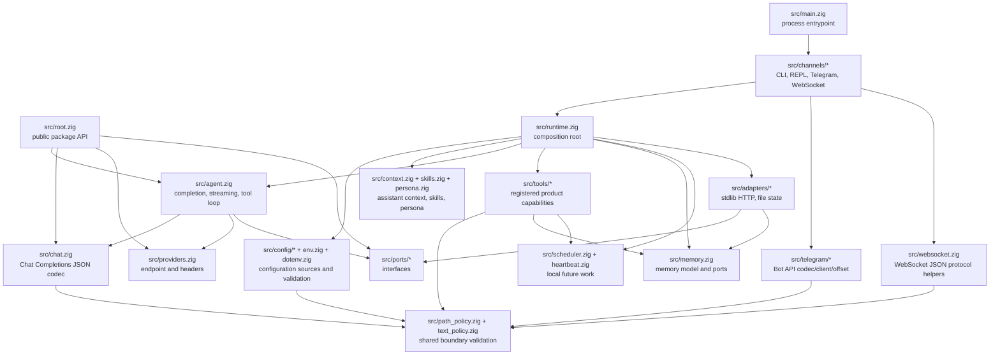
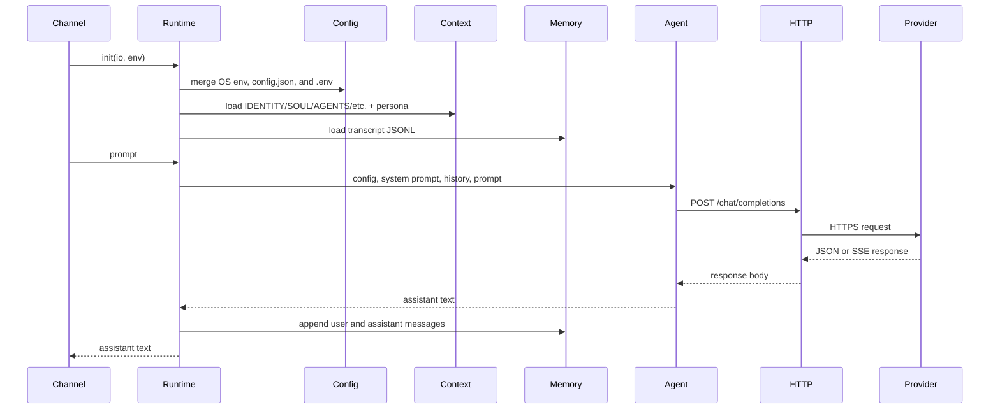
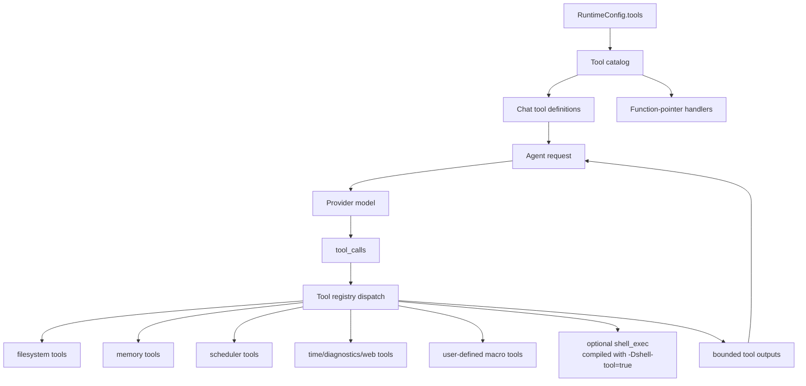
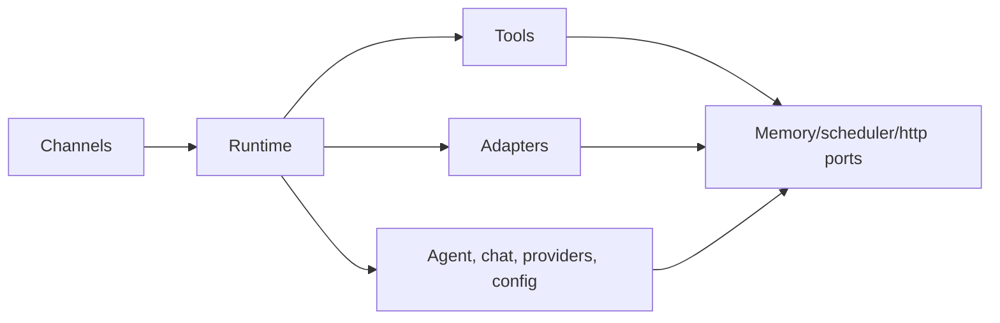

# Arquitectura

`nllclw` es un asistente de IA compacto construido como un paquete Zig más un
executable. El objetivo principal de diseño es mantener el agent engine
testeable y aun así entregar un standalone binary pequeño.

## Objetivos

- Mantener simple el provider wire contract: OpenAI-compatible Chat Completions.
- Mantener explícitas las dependencias de runtime: la compilación por defecto
  usa solo Zig stdlib.
- Mantener las capacidades locales detrás de capability gates y fáciles de
  auditar.
- Mantener canales delgados: CLI, REPL, Telegram, WebSocket, heartbeat y daemon
  llaman al mismo runtime y agent engine.
- Mantener la API pública del paquete lo bastante pequeña para enseñar con ella.

## Mapa de capas



## Flujo de solicitud

El mismo engine maneja argv prompts, stdin prompts, turnos REPL, mensajes de
Telegram, prompts WebSocket, tareas heartbeat y schedules vencidos.



## Flujo del Tool Loop

Las herramientas son product capabilities, no infrastructure adapters. Viven en
`src/tools/` y se exponen al modelo solo mediante `src/tools/catalog.zig`.



El agente repite este loop hasta que ocurre una de tres cosas:

- el modelo devuelve assistant content sin tool calls;
- se alcanza `NLLCLW_TOOL_MAX_ROUNDS`;
- ocurre un provider error, malformed provider response, allocation failure u
  otro fatal dispatch error.

Los non-fatal tool failures se devuelven al modelo como mensajes tool
`tool error: ...`, para que el modelo pueda recuperarse, elegir argumentos
distintos o explicar el fallo. Allocation failures siguen abortando el turno.

Streaming se deshabilita deliberadamente cuando las herramientas están
habilitadas. El asistente necesita una respuesta completa del modelo para saber
qué tool calls ejecutar.

`src/chat.zig` valida cada request string como texto UTF-8 sin binary control
bytes antes de codificar JSON. Esto mantiene los campos de Chat Completions como
JSON strings en vez de dejar que arbitrary byte slices se degraden en arrays.
Para SSE, `[DONE]` es terminal; los chunks posteriores se ignoran.

## Responsabilidades de módulos

| Ruta | Responsabilidad |
|---|---|
| `src/main.zig` | Entrypoint executable mínimo y process exit. |
| `src/root.zig` | API pública estable: config, chat types, HTTP port, streaming sink, `complete`. |
| `src/runtime.zig` | Composition root para operación tipo CLI: config, HTTP adapter, memory adapter, context, tools. |
| `src/agent.zig` | Assistant engine de un turno channel-neutral, streaming y tool loop. |
| `src/chat.zig` | Codec JSON request/response para Chat Completions, incluyendo tools y SSE chunks. |
| `src/providers.zig` | Provider presets y validación de endpoint compatible-provider. |
| `src/config/*` | Typed runtime config, source collection, validation y owned copies. |
| `src/channels/*` | Orquestación de user I/O para CLI, REPL, Telegram, WebSocket y daemon commands. |
| `src/tools/*` | Tool definitions, local capabilities y user-defined macro tools. |
| `src/skills.zig` | Índice compacto `skills/*.md` para on-demand local skill loading. |
| `src/persona.zig` | Runtime presentation modes añadidos al system prompt. |
| `src/memory.zig` | Transcript/fact models, JSONL parsers y memory store ports. |
| `src/adapters/*` | Adaptadores stdlib concretos para ports. |
| `src/ports/*` | Interfaces function-pointer para límites testeables. |
| `src/telegram/*` | Telegram Bot API wire helpers. |
| `src/websocket.zig` | Helpers testeables de mensajes/eventos JSON WebSocket. |

## API pública del paquete

Los consumidores importan el módulo de paquete como `nllclw`. La superficie
exportada es pequeña:

```zig
const nllclw = @import("nllclw");

const cfg: nllclw.Config = .{
    .provider = .openrouter,
    .api_key = "...",
    .model = "openai/gpt-chat-latest",
};

const text = try nllclw.complete(allocator, http_client, cfg, "hello");
```

La API pública expone:

- `ProviderKind`
- `PersonaKind`
- `Config`
- chat request/tool types
- `HttpClient`, `HttpResponse`, `HttpHeader`, `HttpStatusCode`
- `Diagnostic`
- `ToolOptions`, `ToolHandler`, `ToolRunError`, `CompleteOptions`
- `StreamError`, `StreamSink`
- `complete` y `completeWithOptions`

Los detalles runtime-only como carga de `config.json`/`.env`, file memory,
Telegram polling y el adaptador HTTP stdlib quedan fuera del public root. El
public tool handler es solo la abstracción function-pointer que necesita
`ToolOptions`; las built-in product tools y sus file-backed stores siguen
siendo internos.

## Dirección de dependencias

La dirección de dependencias es explícita:



Core code no sabe sobre process env, `config.json`, `.env`, filesystem paths,
Telegram polling ni `std.http.Client`. Esos detalles se ensamblan en
`runtime.zig` y en los canales.

## Propiedad de memoria

El código sigue el estilo de ownership explícito de Zig:

- Las funciones que asignan memoria devuelven owned slices y documentan
  ownership mediante patrones `defer`/`deinit` cerca de call sites.
- El estado runtime long-lived pertenece a `Runtime` y se libera en
  `Runtime.deinit`.
- La config parseada puede ser borrowed desde source buffers o copiada en
  `config.Owned` para runtime storage.
- Los tool outputs pertenecen al agente hasta que se envían de vuelta al modelo
  y luego se liberan después del loop.

## Modelo runtime multiplataforma

El default binary está pensado para ejecutarse donde Zig y la biblioteca
estándar de Zig puedan soportar el target:

- sin `curl`;
- sin provider SDK;
- sin package dependencies en `build.zig.zon`;
- sin shell process en la compilación por defecto;
- `std.http.Client` para HTTPS;
- `std.Io` para files, stdin/stdout/stderr y timers.

La optional shell tool es un build flavor separado:

```sh
zig build -Dshell-tool=true
```

Ese flavor no es el default porque puede lanzar `sh` o `cmd.exe` cuando se
habilita en runtime.
