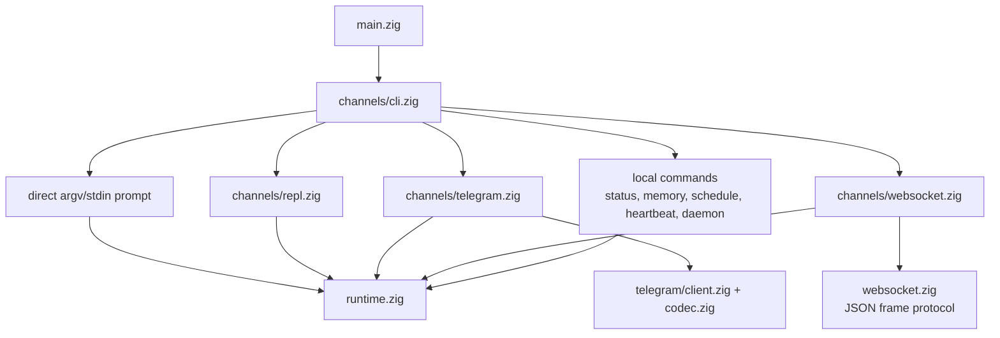
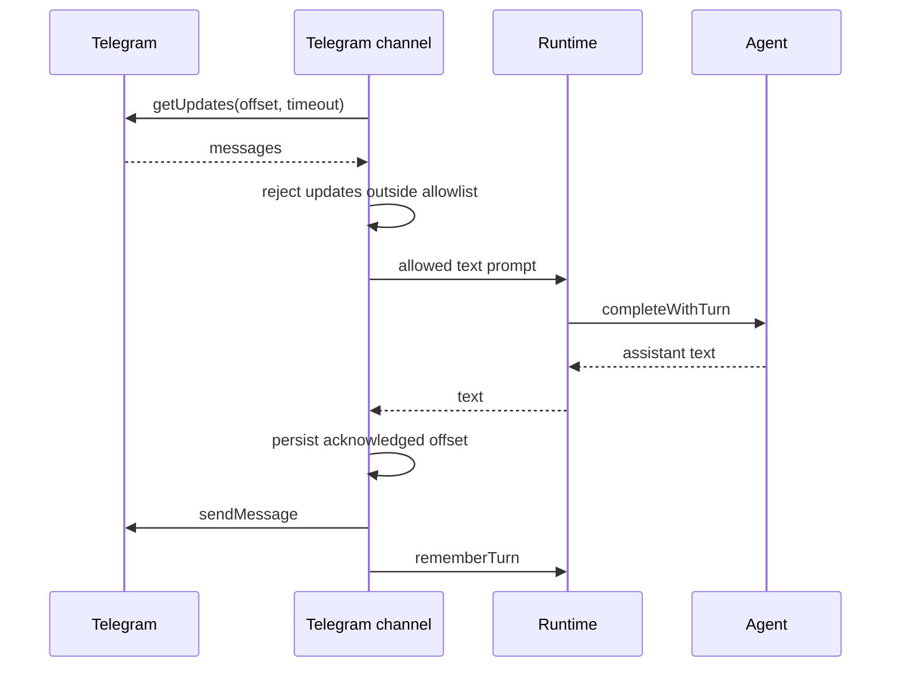
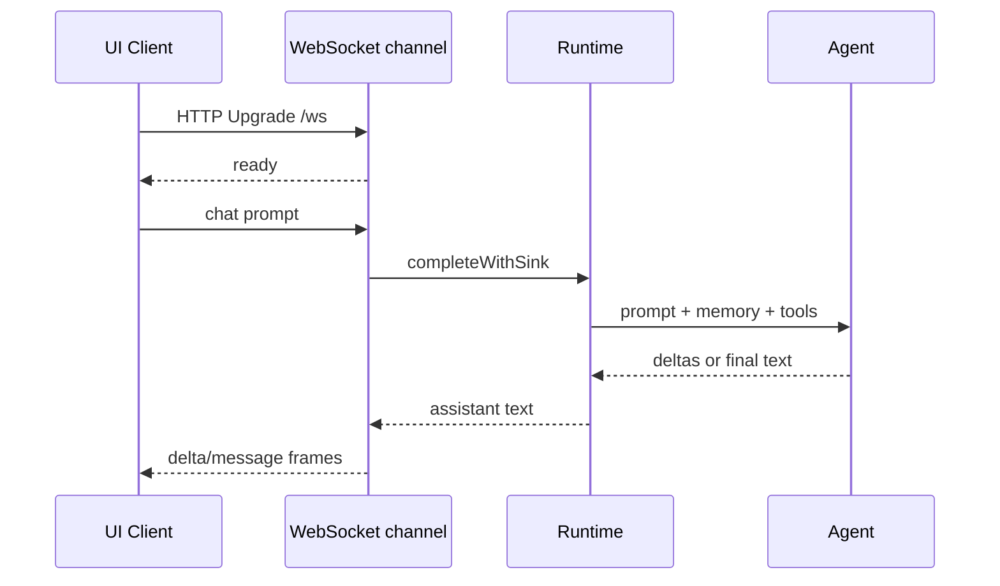

# Canales

Los canales son las formas de cara al usuario para hablar con el mismo runtime y
agent engine. Parsean input, poseen I/O específico del canal y delegan
completions a `runtime.zig`.

## Mapa de canales



## Direct CLI

Prompt from argv:

```sh
nllclw "explain this repository in one paragraph"
```

Prompt from stdin:

```sh
printf 'summarize this text\n' | nllclw
```

`NLLCLW_STREAM=on` es el default:

```sh
NLLCLW_STREAM=on
```

El tool loop también está habilitado por defecto, y tool output es
non-streaming porque el agente debe inspeccionar tool calls completas antes de
dispatch local functions. Para pure streaming chat, configura
`NLLCLW_TOOLS=off`.

Direct slash commands se manejan localmente:

```sh
nllclw /settings
nllclw /diag memory
nllclw /persona technical
```

Estos comandos no llaman al modelo.

## Interactive REPL

Cuando stdin es TTY y no se entrega un prompt, `nllclw` inicia un pequeño
terminal chat loop:

```sh
nllclw
```

Exit commands:

```text
:q
:quit
exit
```

Cada turno usa la misma runtime memory y tool configuration que direct CLI mode.

## Telegram

Telegram mode usa Bot API long polling:

```sh
NLLCLW_TELEGRAM_TOKEN=123456:bot-token
NLLCLW_TELEGRAM_CHAT_ID=123456789
nllclw telegram
```

`NLLCLW_TELEGRAM_CHAT_ID` también puede ser un username de Telegram private-chat
o public-chat, con o sin `@`, por ejemplo `@donprus` o `donprus`.

Security properties:

- `NLLCLW_TELEGRAM_CHAT_ID` es obligatorio;
- los mensajes fuera del chat id configurado o username allowlist se ignoran;
- un local nonblocking lock detiene un segundo proceso `nllclw telegram` en el
  mismo state directory antes de que alcance Bot API polling;
- accepted message text debe ser UTF-8 válido sin binary control bytes;
  malformed text updates se saltan mientras el polling offset todavía avanza;
- el last acknowledged update id se almacena en el user state directory;
- restarts continue from the stored offset y no replay handled messages.
- model-backed messages tienen rate limit por
  `NLLCLW_TELEGRAM_RATE_LIMIT_PER_MINUTE` (default `20`, `0` disables); local
  slash commands no tienen rate limit.

Si otra máquina, deployment o binary antiguo ya está usando `getUpdates` para el
mismo bot token, Telegram devuelve HTTP `409`. `nllclw` imprime una pista
específica para ese conflicto.

Flow:



## WebSocket

WebSocket mode inicia un servidor local RFC6455 para custom browser, desktop o
mobile UIs:

```sh
NLLCLW_WS_TOKEN=change-me nllclw websocket
```

Default bind settings:

```sh
NLLCLW_WS_HOST=127.0.0.1
NLLCLW_WS_PORT=8765
NLLCLW_WS_PATH=/ws
```

La dirección bind por defecto es solo loopback, pero el canal todavía requiere
`NLLCLW_WS_TOKEN` para que páginas aleatorias del navegador no puedan hablar con
el local agent. Remote binds requieren ambos:

```sh
env NLLCLW_WS_HOST=0.0.0.0 \
  NLLCLW_WS_ALLOW_REMOTE=on \
  NLLCLW_WS_TOKEN=change-me \
  nllclw websocket
```

Loopback browser clients pueden pasar el token como query parameter:

```js
const socket = new WebSocket("ws://127.0.0.1:8765/ws?token=change-me");

socket.addEventListener("message", (event) => {
  const message = JSON.parse(event.data);
  console.log(message.type, message.content ?? message.message);
});

socket.addEventListener("open", () => {
  socket.send(JSON.stringify({
    type: "chat",
    prompt: "Explain this repository in one paragraph."
  }));
});
```

Query authentication acepta exactamente un parámetro `token`. Parámetros token
duplicados se rechazan por ambiguous.

Remote clients deben usar exactamente un bearer token header. Browser-based
remote UIs deben conectarse mediante un trusted local o reverse proxy que
inyecte este header.

```text
Authorization: Bearer change-me
```

Client messages:

```json
{ "type": "chat", "prompt": "hello" }
{ "type": "status" }
{ "type": "ping" }
{ "type": "close" }
```

Plain text frames se aceptan como chat prompts para clientes simples. Text
frames deben ser UTF-8 válidos sin binary control bytes.
JSON command frames son objetos exactos; unknown fields se rechazan, y solo los
frames `chat`/`message` pueden incluir `prompt`.
El servidor maneja un active WebSocket client a la vez. Otros clients pueden
conectarse después de que el cliente activo se desconecte.

Server messages:

```json
{ "type": "ready", "version": 1, "channel": "websocket" }
{ "type": "delta", "content": "partial text" }
{ "type": "message", "content": "final text" }
{ "type": "status", "content": "nllclw: ok ..." }
{ "type": "pong", "content": "pong" }
{ "type": "error", "message": "request failed" }
```

Los frames `delta` se emiten solo cuando `NLLCLW_STREAM=on` y
`NLLCLW_TOOLS=off`. Con tools habilitadas, el modelo debe completar tool-call
planning antes de que el canal pueda enviar el `message` final.

Flow:



## Local Commands

Local commands no preguntan al modelo salvo que el comando ejecute
explícitamente una tarea:

```sh
nllclw status
nllclw doctor
nllclw memory list
nllclw memory get project.goal
nllclw memory forget project.goal
nllclw memory reset
nllclw schedule list
nllclw schedule delete 1
```

`status` imprime la quick health line. `doctor` imprime el diagnostics report
completo.

## Shared Slash Commands

REPL, Telegram y direct CLI comparten el mismo slash parser:

| Command | Effect |
|---|---|
| `/start`, `/help` | Muestra local command help. |
| `/settings` | Muestra quick runtime status. |
| `/diag [scope]` | Muestra diagnostics para `quick`, `runtime`, `memory`, `rates`, `time` o `all`. |
| `/persona [mode]` | Muestra o configura runtime persona: `neutral`, `friendly`, `technical`, `witty`. |
| `/stop` | Pausa Telegram intake para el proceso actual. Otros canales reportan que es solo para Telegram. |
| `/resume` | Reanuda Telegram intake. Otros canales reportan que es solo para Telegram. |
| `/chatid` | Imprime Telegram chat id y username fields cuando están disponibles. Otros canales reportan que es solo para Telegram. |

Persona changes son runtime-only para el proceso actual. Para elegir una startup
persona, configura `NLLCLW_PERSONA`.

## Heartbeat

`nllclw heartbeat` lee `HEARTBEAT.md` y convierte pending items en un prompt.
Solo conservative task syntax se considera actionable:

- unchecked markdown task lines;
- lines starting with `TODO:`.

```sh
nllclw heartbeat
```

Si no se encuentra ninguna pending task, el comando imprime un mensaje breve y
sale correctamente.

## Daemon

`nllclw daemon` repite:

1. claims due scheduled tasks from the user state directory;
2. runs each claimed task through the normal runtime;
3. commits only completed schedule entries;
4. periodically runs heartbeat prompts.

```sh
NLLCLW_DAEMON_INTERVAL_SECONDS=60
NLLCLW_HEARTBEAT_INTERVAL_SECONDS=1800
nllclw daemon
```

El daemon es local y file-backed. No coordina entre varias machines.

Claimed schedules usan un local lease. Si provider execution, destination
preflight o delivery falla, la tarea no se commitea; vuelve a ser eligible
después de que el lease expire.

Cuando un schedule se crea desde Telegram, `cron_set` usa por defecto
`channel=telegram` y el current chat id. El daemon envía el completed scheduled
result de vuelta a ese chat usando `NLLCLW_TELEGRAM_TOKEN`. Local schedules
siguen escribiendo en stdout.
