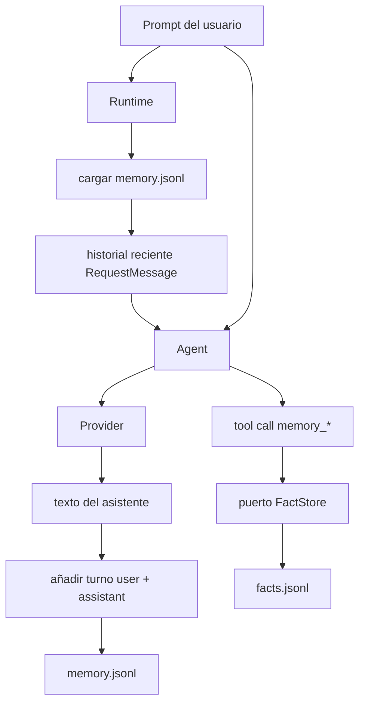
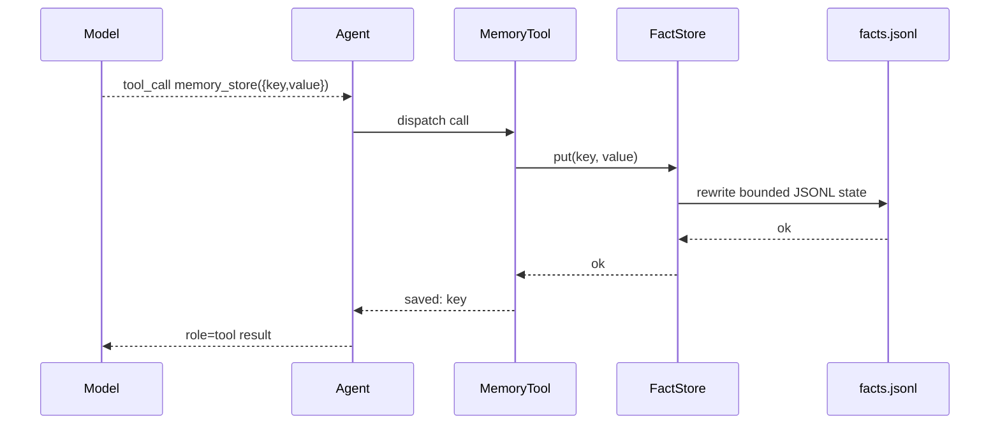

# Memoria

`nllclw` tiene dos sistemas de memoria:

1. transcript memory, que mantiene turnos recientes de user/assistant;
2. durable fact memory, que almacena hechos con clave mediante herramientas
   explícitas.

Ambos son archivos JSONL en el directorio de estado del usuario por defecto, no
junto al binario ni dentro del proyecto actual.

## Resumen



## Transcript Memory

Transcript memory está habilitada por defecto:

```sh
NLLCLW_MEMORY=on
# Default: user state dir/memory.jsonl
NLLCLW_MEMORY_MAX_MESSAGES=20
```

`NLLCLW_MEMORY_MAX_MESSAGES` debe ser al menos 2 porque los transcript appends
se almacenan como pares user/assistant.

Cada línea es un objeto JSON:

```json
{"role":"user","content":"remember that this project uses Zig 0.16"}
{"role":"assistant","content":"Got it."}
```

Al inicio de un turno:

1. `runtime.zig` abre el transcript store configurado.
2. `memory.zig` parsea líneas JSONL.
3. Roles inválidos, JSON inválido, UTF-8 inválido o binary control bytes
   producen un error de memoria.
4. Solo se retienen las entradas más nuevas hasta
   `NLLCLW_MEMORY_MAX_MESSAGES`.
5. Las entradas se convierten en request messages de Chat Completions.

Después de una respuesta correcta del asistente, `Runtime.appendMemory` añade
el prompt del usuario y el texto del asistente. Si el append falla, la respuesta
ya producida se imprime igualmente y el canal reporta una advertencia.

Los snapshots de transcript están limitados a 256 KiB, el mismo límite usado al
cargar el archivo JSONL. Los turnos sobredimensionados se rechazan antes del
atomic replace, así que una escritura correcta no puede crear un transcript que
el siguiente arranque no pueda leer.

## Durable Fact Memory

Fact memory es para hechos key/value estables. Está disponible mediante el tool
loop local por defecto cuando:

```sh
NLLCLW_MEMORY=on
NLLCLW_TOOLS=on
```

Defaults:

```sh
# Default path: user state dir/facts.jsonl
NLLCLW_MEMORY_MAX_FACTS=64
```

`NLLCLW_MEMORY_MAX_FACTS` debe estar entre 1 y 1024.

Cada línea es un objeto JSON:

```json
{"key":"project.language","value":"Zig 0.16"}
{"key":"user.prefers","value":"direct, pragmatic answers"}
```

Fact keys:

- deben ser no vacías;
- están limitadas a 64 bytes;
- pueden contener letras, dígitos, `_`, `-` y `.`;
- se deduplican por clave, con el valor más nuevo ganando.

Fact values:

- deben ser no vacíos;
- deben contener texto que no sea solo whitespace;
- deben ser UTF-8 válido;
- no deben contener ASCII control bytes;
- están limitados a 2048 bytes;
- deben caber dentro de `NLLCLW_TOOL_OUTPUT_MAX_BYTES` cuando los devuelva
  `memory_recall`.

El snapshot fact JSONL usa el mismo límite de lectura/escritura de 256 KiB que
transcript memory. Si muchos hechos retenidos excedieran ese límite de archivo,
la escritura falla en vez de crear un archivo facts ilegible.

## Herramientas de memoria

| Herramienta | Propósito |
|---|---|
| `memory_store` | Almacenar o actualizar un hecho por clave. |
| `memory_recall` | Leer un hecho por clave. |
| `memory_list` | Listar claves de hechos conocidas. |
| `memory_forget` | Eliminar un hecho por clave. |

Tool flow:



## Comandos CLI de memoria

Estos comandos operan sobre durable facts:

```sh
nllclw memory list
nllclw memory get project.language
nllclw memory forget project.language
nllclw memory reset
```

`memory reset` limpia tanto transcript memory como fact memory.

## Notas de privacidad y seguridad

- Los archivos de memoria viven en el directorio de estado del usuario por
  defecto.
- Los archivos `.nllclw-*` están denegados por las herramientas de sistema de
  archivos, así que el modelo no puede leer ni editar sus propios archivos de
  memoria mediante `read_file`, `write_file` o `edit_file`.
- La memoria no está cifrada. No almacenes secretos en ella.
- Fact memory debe usarse para preferencias durables de usuario/proyecto, no
  para logs crudos de conversación.
