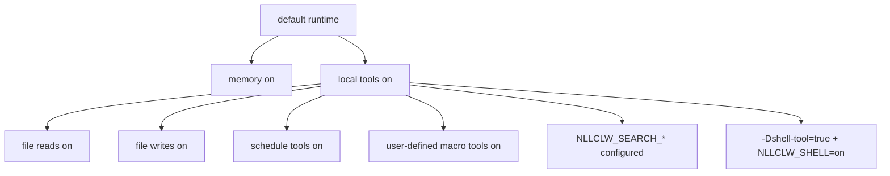

# Modelo de seguridad

`nllclw` es un asistente de IA local, no un sandbox. Su modelo de seguridad se
basa en valores por defecto pequeños y local-only, gates explícitos para
capacidades externas, salidas locales acotadas y validación cuidadosa de
provider/config.

## Postura por defecto

Default build:

- sin package dependencies;
- sin programas runtime externos;
- sin `curl`;
- sin shell execution;
- local tools habilitadas;
- filesystem tools habilitadas con protecciones de relative-path y secret-path;
- scheduler tools habilitadas para schedules JSONL locales;
- user-defined macro tools habilitadas y almacenadas en JSONL local;
- web search deshabilitado salvo que se configure un search provider;
- Telegram deshabilitado salvo que se lance explícitamente y se configure con
  una allowlist.
- WebSocket deshabilitado salvo que se lance explícitamente; el bind por defecto
  es solo loopback.

Memory está habilitada por defecto porque escribe solo archivos JSONL locales en
el directorio de trabajo actual. Puedes deshabilitarla con:

```sh
NLLCLW_MEMORY=off
```

Deshabilita todas las herramientas con:

```sh
NLLCLW_TOOLS=off
```

## Capability Gates



El modelo recibe definiciones de local tools por defecto. External web search y
shell execution todavía requieren configuración explícita.

## Manejo de claves de proveedor

- API keys vienen de OS env, `config.json` o `.env`.
- OS env sobreescribe file config, y `config.json` sobreescribe `.env`.
- Las completion provider keys se envían solo como `Authorization: Bearer ...`.
- Las search provider keys se envían con el auth header documentado de cada
  proveedor: bearer auth para Tavily y Firecrawl, `X-Subscription-Token` para
  Brave Search y `x-api-key` para Exa.
- Header values rechazan ASCII control bytes.
- Provider model names rechazan UTF-8 inválido y control bytes antes de construir
  el request JSON.
- Chat request content strings, assistant response text y tool-call argument
  strings rechazan UTF-8 inválido y binary control bytes; newlines, carriage
  returns y tabs normales siguen siendo texto válido allí. Request metadata como
  model names, roles, tool-call ids, function names y parameter names además es
  single-line.
- Provider response roles, cuando están presentes, deben ser `assistant`.
- Provider and Telegram diagnostic messages que estén vacíos, sean demasiado
  grandes o contengan control bytes no se imprimen como trusted single-line
  errors.
- Raw diagnostic response bodies se imprimen solo cuando son texto válido y
  están limitados en terminal output.
- Default state files viven en el user state directory. Configured state paths
  para memory, macro tools y schedules deben ser relative `.jsonl` paths con
  UTF-8 válido, sin control bytes, con `/` separators, sin Windows-reserved
  filename characters ni device names, y sin path components vacíos, `.`, `..`,
  trailing-space o trailing-dot.
- Local state files y sus lock files se abren sin seguir terminal symlinks. Las
  escrituras usan atomic replace y private file permissions donde la host
  platform los expone.
- Durable fact memory values rechazan ASCII control bytes antes de almacenarse o
  imprimirse por rutas CLI/tool recall.
- User-defined macro tool descriptions and actions rechazan ASCII control bytes
  antes de almacenarse o enviarse de vuelta como model-facing tool schema/output.
- Scheduled actions rechazan ASCII control bytes antes de almacenarse o
  imprimirse por schedule listing.
- Model-facing tool outputs rechazan UTF-8 inválido y binary control bytes.
- Las rutas `.env`, `config.json` y `.nllclw-*` están denegadas por filesystem
  tools.
- user-defined macro tools se almacenan en el user state directory por defecto.
- No pegues claves reales en prompts ni context files.

## Seguridad de compatible provider

Compatible providers deben usar HTTPS por defecto:

```json
{
  "provider": "compatible",
  "base_url": "https://example.com/v1",
  "api_key": "...",
  "model": "..."
}
```

HTTP se permite solo para hosts loopback exactos y solo cuando se habilita
explícitamente:

```json
{
  "provider": "compatible",
  "base_url": "http://127.0.0.1:11434/v1",
  "allow_http_base_url": true,
  "api_key": "ollama",
  "model": "llama3.2"
}
```

Remote HTTP URLs se rechazan.

## Límite de las filesystem tools

Filesystem tools no son un sandbox completo, pero aplican un límite local
conservador:

- solo relative paths;
- rutas UTF-8 válidas, sin controles y no mayores de 512 bytes;
- sin `..`;
- sin absolute POSIX paths;
- sin rutas Windows absolutas o drive-qualified;
- sin path components vacíos, `.` o `..`, excepto que `list_dir` acepta literal
  `.` para el directorio actual;
- sin symlink traversal para path components abiertos;
- sin Windows-reserved filename characters, device names, trailing spaces ni
  trailing dots;
- sin `.env`, `config.json`, `.nllclw-*`, `.git`, `.ssh`, `.gnupg`, `.aws`, `.npmrc`;
- sin common private-key filenames ni suffixes;
- solo texto UTF-8, sin binary control bytes;
- output-size caps;
- atomic writes.

Ejecuta con file tools solo dentro de un directorio donde estos permisos tengan
sentido.

## Límite de Telegram

Telegram mode es default-deny:

- `NLLCLW_TELEGRAM_TOKEN` es obligatorio;
- Telegram tokens se validan como `<bot-id>:<secret>` antes de colocarse en Bot
  API URLs;
- `NLLCLW_TELEGRAM_CHAT_ID` es obligatorio;
- mensajes fuera del chat id configurado o username allowlist se ignoran;
- un local nonblocking lock rechaza un segundo proceso `nllclw telegram` usando
  el mismo state directory;
- el último update procesado se almacena localmente para evitar replay tras
  restart.
- model-backed messages tienen rate limit mediante
  `NLLCLW_TELEGRAM_RATE_LIMIT_PER_MINUTE`.

## Límite de WebSocket

WebSocket mode está pensado por defecto para custom UIs locales:

- arranca solo cuando se lanza `nllclw websocket`;
- el bind por defecto es `127.0.0.1:8765`;
- `NLLCLW_WS_TOKEN` es obligatorio incluso para loopback binds;
- `NLLCLW_WS_PATH` debe ser UTF-8 válido single-line sin query ni fragment
  syntax;
- non-loopback bind addresses requieren `NLLCLW_WS_ALLOW_REMOTE=on`;
- loopback browser clients pueden pasar el token como `?token=...`;
- loopback query authentication acepta exactamente un parámetro `token`;
- remote clients deben usar exactamente un header
  `Authorization: Bearer ...`;
- model-backed chat messages tienen rate limit mediante
  `NLLCLW_WS_RATE_LIMIT_PER_MINUTE`.
- el servidor integrado maneja un active client a la vez.

No expongas el puerto WebSocket a una red no confiable sin reverse proxy y
transport security. El canal integrado es plain `ws://`, no TLS termination.

## Límite de la shell tool

El default binary no incluye `shell_exec`.

Para que shell execution sea posible, ambas condiciones deben ser verdaderas:

```sh
zig build -Dshell-tool=true
NLLCLW_SHELL=on
```

La shell tool debe tratarse como equivalente a conceder al modelo local command
execution. Úsala solo en trusted environments.

## Checklist práctico

Antes de usar las capacidades locales por defecto:

1. Ejecuta en un project directory dedicado.
2. Mantén secrets fuera de prompts y context files.
3. Configura `NLLCLW_FILE_WRITE=off` si no se desea file mutation.
4. Usa el default no-shell binary salvo que command execution sea necesario.
5. Usa `NLLCLW_TOOL_OUTPUT_MAX_BYTES` para mantener acotado tool output.
6. Usa `nllclw status` para una quick health line o `nllclw doctor` para
   diagnostics completos.
