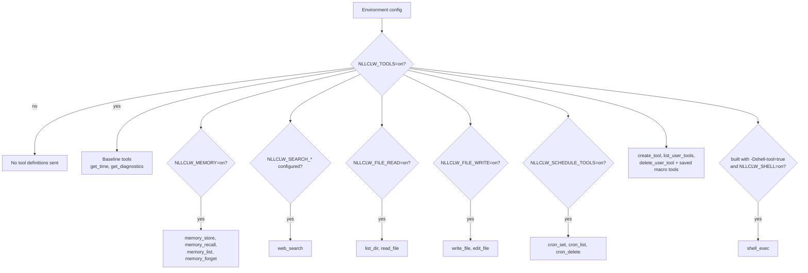
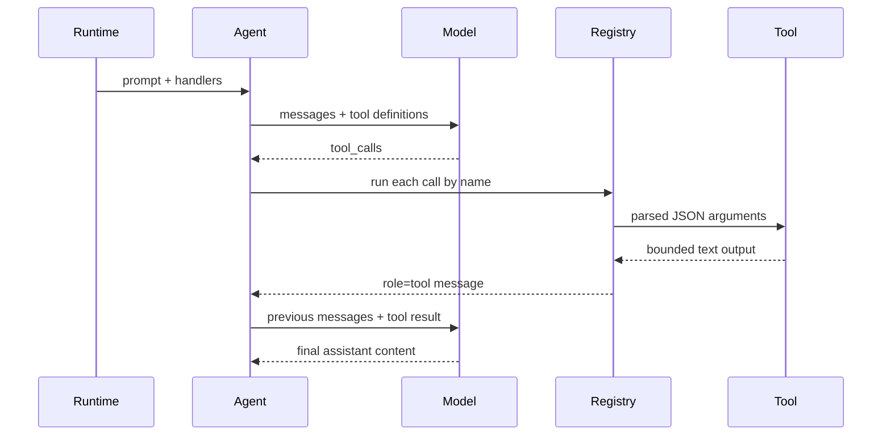

# Herramientas

Las herramientas permiten que el modelo pida a `nllclw` realizar acciones
locales. Las herramientas locales que no requieren servicios externos están
habilitadas por defecto. External web search y optional shell execution todavía
requieren configuración explícita.

## Capability Model



El default binary no contiene `shell_exec`. Compílalo explícitamente:

```sh
zig build -Dshell-tool=true
```

Luego habilítalo en runtime:

```sh
NLLCLW_TOOLS=on
NLLCLW_SHELL=on
```

Para deshabilitar todas las herramientas:

```sh
NLLCLW_TOOLS=off
```

## Tool Loop



`NLLCLW_TOOL_MAX_ROUNDS` limita cuántas rondas assistant/tool exchange pueden
ocurrir antes de que el agente devuelva `ToolRoundLimit`.

Los argumentos de built-in tools son objetos JSON exactos. JSON inválido,
campos requeridos ausentes, unknown fields, tipos de campo inválidos y fallos de
validación devuelven un tool error para que el modelo lo maneje.

## Herramientas disponibles

| Herramienta | Gate | Efecto |
|---|---|---|
| `get_time` | `NLLCLW_TOOLS=on` default | Devuelve local time usando `NLLCLW_TIMEZONE_OFFSET_MINUTES`. |
| `get_diagnostics` | `NLLCLW_TOOLS=on` default | Reporta runtime capability/config status. |
| `web_search` | `NLLCLW_TOOLS=on` y un provider `NLLCLW_SEARCH_*` configurado | Llama al search provider seleccionado mediante el HTTP port. |
| `memory_store` | `NLLCLW_TOOLS=on`, `NLLCLW_MEMORY=on` defaults | Almacena un durable fact. |
| `memory_recall` | `NLLCLW_TOOLS=on`, `NLLCLW_MEMORY=on` defaults | Lee un durable fact. |
| `memory_list` | `NLLCLW_TOOLS=on`, `NLLCLW_MEMORY=on` defaults | Lista durable fact keys. |
| `memory_forget` | `NLLCLW_TOOLS=on`, `NLLCLW_MEMORY=on` defaults | Elimina un durable fact. |
| `list_dir` | `NLLCLW_FILE_READ=on` default | Lista un directorio relativo al CWD. |
| `read_file` | `NLLCLW_FILE_READ=on` default | Lee un archivo UTF-8 relativo al CWD. |
| `write_file` | `NLLCLW_FILE_WRITE=on` default | Escribe atómicamente un archivo UTF-8 relativo al CWD. |
| `edit_file` | `NLLCLW_FILE_WRITE=on` default | Reemplaza la primera coincidencia exacta de texto en un archivo. |
| `cron_set` | `NLLCLW_SCHEDULE_TOOLS=on` default | Añade una tarea programada local. |
| `cron_list` | `NLLCLW_SCHEDULE_TOOLS=on` default | Lista tareas programadas. |
| `cron_delete` | `NLLCLW_SCHEDULE_TOOLS=on` default | Elimina una tarea programada. |
| `create_tool` | `NLLCLW_TOOLS=on` default | Crea una persistent user-defined macro tool. |
| `list_user_tools` | `NLLCLW_TOOLS=on` default | Lista saved macro tools. |
| `delete_user_tool` | `NLLCLW_TOOLS=on` default | Elimina una saved macro tool. |
| saved macro tools | `NLLCLW_TOOLS=on` default | Devuelven saved action text para que el modelo pueda ejecutarlo mediante built-in tools. |
| `shell_exec` | optional shell build plus `NLLCLW_SHELL=on` | Ejecuta un shell command con timeout, combined output cap y salida de texto UTF-8 sin binary control bytes. |

## User-Defined Tools

User-defined tools son macro tools, no generated code. `create_tool` almacena un
name, description y natural-language action en `NLLCLW_USER_TOOLS_PATH`
(default `user-tools.jsonl` en el user state directory).
En turnos posteriores, saved tools se anuncian como tool definitions normales.
Cuando el modelo llama una, `nllclw` devuelve el saved action text y el modelo
continúa el mismo tool loop usando built-in tools.

Example:

```text
create_tool(name="daily_brief", description="Prepare a daily brief", action="Search for current project news, summarize it, and store the summary in memory.")
```

Tool names pueden contener solo letras, dígitos y underscores. Los nombres que
colisionan con built-in tools se rechazan. Descriptions y actions se recortan,
se acotan y deben ser texto UTF-8 válido sin ASCII control bytes. El archivo
user-tool JSONL está limitado a 128 KiB tanto en lectura como escritura, se abre
sin seguir terminal symlinks, y una saved action debe caber dentro de
`NLLCLW_TOOL_OUTPUT_MAX_BYTES` cuando se envuelve como tool result.

## Proveedores de Web Search

`web_search` es una herramienta con un proveedor seleccionado por
`NLLCLW_SEARCH_PROVIDER`. El modo default `auto` elige la primera clave
configurada en este orden: Tavily, Brave Search, Exa, Firecrawl, luego
DuckDuckGo solo cuando se habilita explícitamente.
Los explicit key-based providers requieren su `NLLCLW_SEARCH_*_KEY`
correspondiente.
Search keys no deben contener ASCII control bytes.
Las queries se recortan, deben ser UTF-8 válidas, sin controles y de máximo 512
bytes.
Provider result text se formatea como UTF-8 válido sin binary control bytes; tabs
y newlines ordinarios dentro de result fields se normalizan a espacios.
Los empty provider result objects se omiten, y una valid empty provider response
devuelve `no results` en vez de una fila placeholder sintética. Los grupos
nested related-topic de DuckDuckGo se aplanan hasta una pequeña bounded depth.

| Provider | Env | Notes |
|---|---|---|
| `tavily` | `NLLCLW_SEARCH_TAVILY_KEY=...` | POSTs to Tavily Search. |
| `brave` | `NLLCLW_SEARCH_BRAVE_KEY=...` | GETs Brave Web Search with `X-Subscription-Token`. |
| `exa` | `NLLCLW_SEARCH_EXA_KEY=...` | POSTs Exa Search with `x-api-key`. |
| `firecrawl` | `NLLCLW_SEARCH_FIRECRAWL_KEY=...` | POSTs Firecrawl Search with bearer auth. |
| `duckduckgo` | `NLLCLW_SEARCH_DUCKDUCKGO=on` or `NLLCLW_SEARCH_PROVIDER=duckduckgo` | No-key Instant Answer fallback, not a full web SERP API. |

Examples:

```sh
NLLCLW_TOOLS=on
NLLCLW_SEARCH_PROVIDER=auto
NLLCLW_SEARCH_BRAVE_KEY=...
```

```sh
NLLCLW_TOOLS=on
NLLCLW_SEARCH_PROVIDER=duckduckgo
```

## Entrega programada

`cron_set` acepta `channel` y `chat_id` para entrega. En turnos Telegram, el
chat actual se vuelve el default destination, así que un prompt como "remind me
here tomorrow" puede crear un Telegram schedule sin exponer un chat id en el
model-facing user text.

Scheduled actions se recortan, deben ser UTF-8 válidas sin ASCII control bytes y
están limitadas a 2048 bytes. El archivo schedule JSONL está limitado a 128 KiB
en lectura y escritura; snapshots sobredimensionados se rechazan antes de
atomic replacement.
`cron_set` acepta solo los timing fields que coinciden con su `type`:
`interval_*` para periodic schedules, `delay_*` para one-shot schedules y
`hour`/`minute` para daily schedules.
El daemon commitea un schedule solo después de que el scheduled prompt termine y
cualquier delivery configurada tenga éxito; deliveries fallidas o bloqueadas se
reintentan después de que expire el local lease.

Destinos soportados:

| Canal | Comportamiento |
|---|---|
| `local` | Daemon escribe el resultado en stdout. |
| `telegram` | Daemon envía el resultado al Telegram chat id almacenado usando `NLLCLW_TELEGRAM_TOKEN`. |

## Modelo de seguridad del sistema de archivos

Filesystem tools son conservadoras:

- paths deben ser relativos al current working directory;
- paths deben ser UTF-8 válidos, sin controles y de máximo 512 bytes;
- absolute POSIX paths se rechazan;
- absolute o drive-qualified Windows paths se rechazan;
- components vacíos, `.` y `..` se rechazan, excepto que `list_dir` acepta
  literal `.` para el directorio actual;
- denied components incluyen `.env`, `.env.*`, `config.json`, `.nllclw-*`,
  `.git`, `.ssh`, `.gnupg`, `.aws`, `.npmrc`, `id_rsa`, `id_ed25519`;
- denied Windows device names incluyen `CON`, `PRN`, `AUX`, `NUL`, `CONIN$`,
  `CONOUT$`, `COM1` through `COM9` y `LPT1` through `LPT9`, incluso con
  extensions;
- Windows-reserved filename punctuation (`<`, `>`, `:`, `"`, `|`, `?`, `*`) se
  rechaza por portable behavior;
- path components que terminan en espacio o punto se rechazan por portable
  behavior;
- denied suffixes incluyen `.pem`, `.key`, `.p12`, `.pfx`;
- intermediate directories se abren sin seguir symlinks;
- terminal files se abren sin seguir symlinks;
- reads y writes requieren texto UTF-8 válido sin binary control bytes;
- `list_dir` emite nombres en sorted order y omite denied, non-UTF-8 o nombres
  de entrada con control characters;
- writes usan atomic replacement y private file permissions donde se soporta;
- output está limitado por `NLLCLW_TOOL_OUTPUT_MAX_BYTES`.

Esto es un límite local de seguridad, no un sandbox. Ejecuta `nllclw` solo en
directorios donde estés cómodo concediendo las capabilities habilitadas.

## Añadir una herramienta

La forma preferida es:

1. Añade un módulo enfocado en `src/tools/<name>.zig`.
2. Define un `chat.ToolDefinition`.
3. Implementa un client struct pequeño que posea solo las dependencias que
   necesita.
4. Parsea JSON arguments con `std.json.parseFromSlice`.
5. Devuelve owned text output limitado por `NLLCLW_TOOL_OUTPUT_MAX_BYTES`.
6. Registra el handler en `src/tools/catalog.zig` detrás de un config gate
   explícito si lee o muta local state.
7. Añade pruebas para success, invalid JSON/arguments, bounds y denied access.

No pongas infrastructure adapters en `src/tools/`. Si una herramienta necesita
persistence o HTTP, define o reutiliza un port e inyéctalo mediante el catalog.
