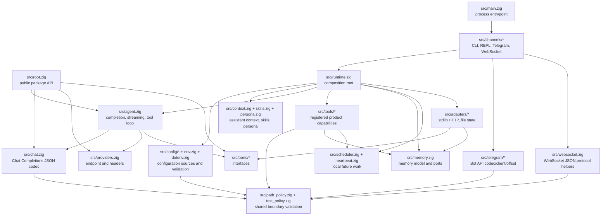
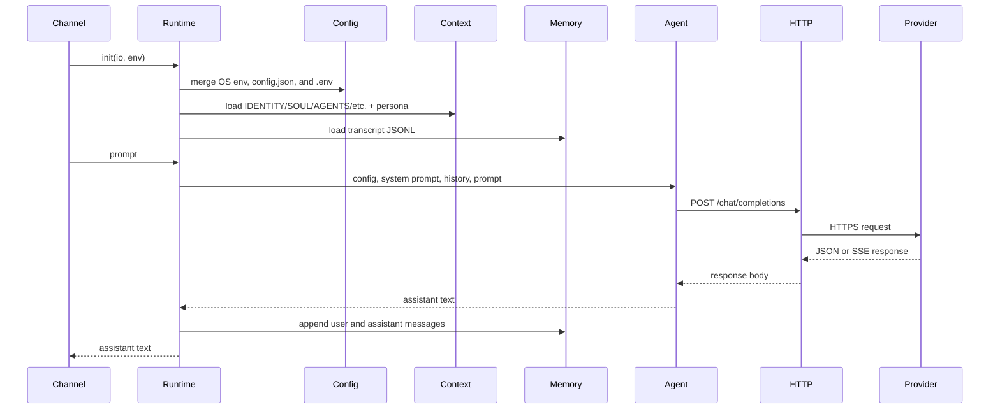
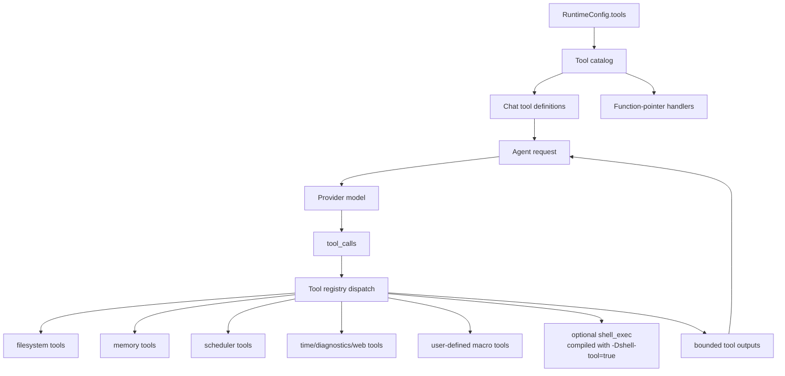
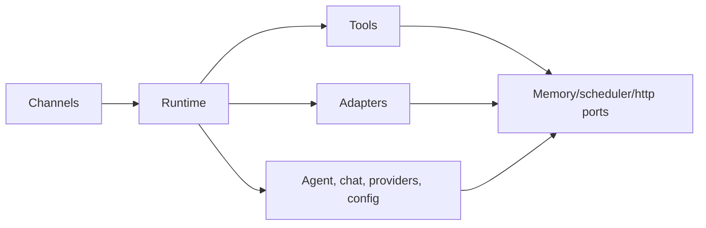

# Architecture

`nllclw` est un assistant IA compact construit comme un package Zig plus un
executable. Le principal objectif de design est de garder l'agent engine
testable tout en livrant un petit standalone binary.

## Objectifs

- Garder le provider wire contract simple: OpenAI-compatible Chat Completions.
- Garder les dépendances runtime explicites: le build par défaut n'utilise que
  Zig stdlib.
- Garder les capacités locales derrière des capability gates et faciles à
  auditer.
- Garder les canaux minces: CLI, REPL, Telegram, WebSocket, heartbeat et daemon
  appellent tous le même runtime et le même agent engine.
- Garder l'API publique du package assez petite pour servir de support
  pédagogique.

## Carte des couches



## Flux de requête

Le même engine traite les argv prompts, stdin prompts, tours REPL, messages
Telegram, prompts WebSocket, tâches heartbeat et schedules dus.



## Flux du Tool Loop

Les outils sont des product capabilities, pas des infrastructure adapters. Ils
vivent dans `src/tools/` et ne sont exposés au modèle que via
`src/tools/catalog.zig`.



L'agent répète cette boucle jusqu'à ce qu'une de ces trois choses arrive:

- le modèle retourne un assistant content sans tool calls;
- `NLLCLW_TOOL_MAX_ROUNDS` est atteint;
- un provider error, malformed provider response, allocation failure ou autre
  fatal dispatch error se produit.

Les non-fatal tool failures sont retournés au modèle comme messages tool
`tool error: ...`, afin que le modèle puisse récupérer, choisir d'autres
arguments ou expliquer l'échec. Les allocation failures interrompent toujours le
tour.

Le streaming est délibérément désactivé lorsque les outils sont activés.
L'assistant a besoin d'une réponse complète du modèle pour savoir quels tool
calls exécuter.

`src/chat.zig` valide chaque request string comme texte UTF-8 sans binary
control bytes avant l'encodage JSON. Cela garde les champs Chat Completions
comme JSON strings au lieu de laisser des arbitrary byte slices se dégrader en
arrays. Pour SSE, `[DONE]` est terminal; les chunks ultérieurs sont ignorés.

## Responsabilités des modules

| Chemin | Responsabilité |
|---|---|
| `src/main.zig` | Entrypoint executable minimal et process exit. |
| `src/root.zig` | API publique stable: config, chat types, HTTP port, streaming sink, `complete`. |
| `src/runtime.zig` | Composition root pour l'opération type CLI: config, HTTP adapter, memory adapter, context, tools. |
| `src/agent.zig` | Assistant engine channel-neutral pour un tour, streaming et tool loop. |
| `src/chat.zig` | Codec JSON request/response pour Chat Completions, y compris tools et SSE chunks. |
| `src/providers.zig` | Provider presets et validation endpoint compatible-provider. |
| `src/config/*` | Typed runtime config, source collection, validation et owned copies. |
| `src/channels/*` | Orchestration user I/O pour CLI, REPL, Telegram, WebSocket et daemon commands. |
| `src/tools/*` | Tool definitions, local capabilities et user-defined macro tools. |
| `src/skills.zig` | Index compact `skills/*.md` pour on-demand local skill loading. |
| `src/persona.zig` | Runtime presentation modes ajoutés au system prompt. |
| `src/memory.zig` | Transcript/fact models, JSONL parsers et memory store ports. |
| `src/adapters/*` | Adaptateurs stdlib concrets pour les ports. |
| `src/ports/*` | Interfaces function-pointer pour frontières testables. |
| `src/telegram/*` | Telegram Bot API wire helpers. |
| `src/websocket.zig` | Helpers testables de messages/événements JSON WebSocket. |

## API publique du package

Les consommateurs importent le module de package comme `nllclw`. La surface
exportée est petite:

```zig
const nllclw = @import("nllclw");

const cfg: nllclw.Config = .{
    .provider = .openrouter,
    .api_key = "...",
    .model = "openai/gpt-chat-latest",
};

const text = try nllclw.complete(allocator, http_client, cfg, "hello");
```

L'API publique expose:

- `ProviderKind`
- `PersonaKind`
- `Config`
- chat request/tool types
- `HttpClient`, `HttpResponse`, `HttpHeader`, `HttpStatusCode`
- `Diagnostic`
- `ToolOptions`, `ToolHandler`, `ToolRunError`, `CompleteOptions`
- `StreamError`, `StreamSink`
- `complete` et `completeWithOptions`

Les détails runtime-only comme le chargement `config.json`/`.env`, file memory,
Telegram polling et l'adaptateur HTTP stdlib restent hors du public root. Le
public tool handler n'est que l'abstraction function-pointer nécessaire à
`ToolOptions`; les built-in product tools et leurs file-backed stores restent
internes.

## Direction des dépendances

La direction des dépendances est explicite:



Core code ne connaît pas process env, `config.json`, `.env`, filesystem paths,
Telegram polling ou `std.http.Client`. Ces détails sont assemblés par
`runtime.zig` et les canaux.

## Propriété mémoire

Le code suit le style d'ownership explicite de Zig:

- Les fonctions qui allouent retournent des owned slices et documentent
  l'ownership via des patterns `defer`/`deinit` près des call sites.
- L'état runtime long-lived appartient à `Runtime` et est libéré dans
  `Runtime.deinit`.
- La config parsée peut être borrowed depuis des source buffers ou copiée dans
  `config.Owned` pour le runtime storage.
- Les tool outputs appartiennent à l'agent jusqu'à leur renvoi au modèle, puis
  sont libérés après la boucle.

## Modèle runtime multiplateforme

Le default binary est destiné à tourner partout où Zig et la bibliothèque
standard Zig peuvent prendre en charge la target:

- pas de `curl`;
- pas de provider SDK;
- pas de package dependencies dans `build.zig.zon`;
- pas de shell process dans le build par défaut;
- `std.http.Client` pour HTTPS;
- `std.Io` pour files, stdin/stdout/stderr et timers.

L'optional shell tool est un build flavor séparé:

```sh
zig build -Dshell-tool=true
```

Ce flavor n'est pas le default parce qu'il peut lancer `sh` ou `cmd.exe` lorsqu'il
est activé au runtime.
