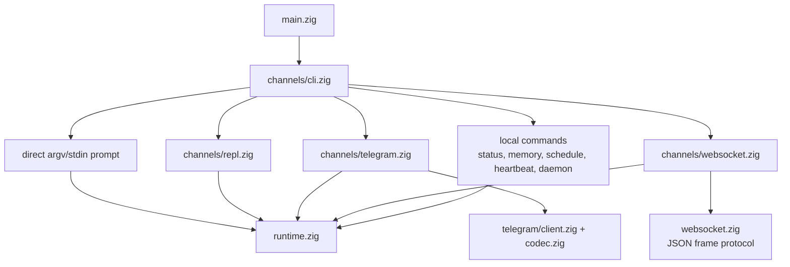
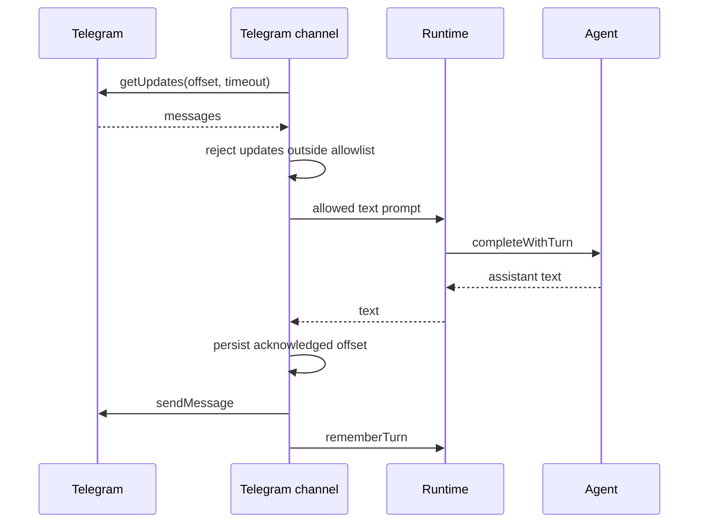
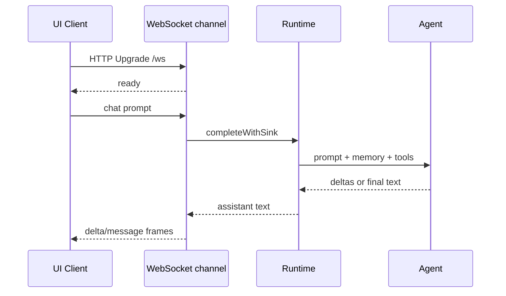

# Canaux

Les canaux sont les façons orientées utilisateur de parler au même runtime et au
même agent engine. Ils parsents l'input, possèdent l'I/O spécifique au canal et
délèguent les completions à `runtime.zig`.

## Carte des canaux



## Direct CLI

Prompt from argv:

```sh
nllclw "explain this repository in one paragraph"
```

Prompt from stdin:

```sh
printf 'summarize this text\n' | nllclw
```

`NLLCLW_STREAM=on` est le default:

```sh
NLLCLW_STREAM=on
```

Le tool loop est aussi activé par défaut, et le tool output est non-streaming
parce que l'agent doit inspecter des tool calls complètes avant de dispatcher
des local functions. Pour du pure streaming chat, définissez
`NLLCLW_TOOLS=off`.

Les direct slash commands sont traitées localement:

```sh
nllclw /settings
nllclw /diag memory
nllclw /persona technical
```

Ces commandes n'appellent pas le modèle.

## Interactive REPL

Lorsque stdin est un TTY et qu'aucun prompt n'est fourni, `nllclw` démarre une
petite boucle terminal chat:

```sh
nllclw
```

Exit commands:

```text
:q
:quit
exit
```

Chaque tour utilise la même runtime memory et tool configuration que le mode
direct CLI.

## Telegram

Telegram mode utilise Bot API long polling:

```sh
NLLCLW_TELEGRAM_TOKEN=123456:bot-token
NLLCLW_TELEGRAM_CHAT_ID=123456789
nllclw telegram
```

`NLLCLW_TELEGRAM_CHAT_ID` peut aussi être un username Telegram private-chat ou
public-chat, avec ou sans `@`, par exemple `@donprus` ou `donprus`.

Security properties:

- `NLLCLW_TELEGRAM_CHAT_ID` est obligatoire;
- les messages hors du chat id configuré ou de la username allowlist sont
  ignorés;
- un local nonblocking lock arrête un second processus `nllclw telegram` sur le
  même state directory avant qu'il atteigne Bot API polling;
- l'accepted message text doit être UTF-8 valide sans binary control bytes;
  les malformed text updates sont sautés tandis que le polling offset avance
  quand même;
- le last acknowledged update id est stocké dans le user state directory;
- les restarts continue from the stored offset et ne rejouent pas les handled
  messages.
- les model-backed messages sont rate-limited par
  `NLLCLW_TELEGRAM_RATE_LIMIT_PER_MINUTE` (default `20`, `0` disables); les
  local slash commands ne sont pas rate-limited.

Si une autre machine, un deployment ou un ancien binary utilise déjà
`getUpdates` pour le même bot token, Telegram retourne HTTP `409`. `nllclw`
affiche un indice spécifique pour ce conflit.

Flow:



## WebSocket

WebSocket mode démarre un serveur RFC6455 local pour des custom browser,
desktop ou mobile UIs:

```sh
NLLCLW_WS_TOKEN=change-me nllclw websocket
```

Default bind settings:

```sh
NLLCLW_WS_HOST=127.0.0.1
NLLCLW_WS_PORT=8765
NLLCLW_WS_PATH=/ws
```

L'adresse de bind par défaut est loopback-only, mais le canal exige quand même
`NLLCLW_WS_TOKEN` afin que des pages navigateur aléatoires ne puissent pas
parler au local agent. Les remote binds exigent les deux:

```sh
env NLLCLW_WS_HOST=0.0.0.0 \
  NLLCLW_WS_ALLOW_REMOTE=on \
  NLLCLW_WS_TOKEN=change-me \
  nllclw websocket
```

Les loopback browser clients peuvent passer le token comme query parameter:

```js
const socket = new WebSocket("ws://127.0.0.1:8765/ws?token=change-me");

socket.addEventListener("message", (event) => {
  const message = JSON.parse(event.data);
  console.log(message.type, message.content ?? message.message);
});

socket.addEventListener("open", () => {
  socket.send(JSON.stringify({
    type: "chat",
    prompt: "Explain this repository in one paragraph."
  }));
});
```

Query authentication accepte exactement un paramètre `token`. Les duplicate
token parameters sont rejetés comme ambiguous.

Les remote clients doivent utiliser exactement un bearer token header. Les
browser-based remote UIs doivent se connecter via un trusted local ou reverse
proxy qui injecte ce header.

```text
Authorization: Bearer change-me
```

Client messages:

```json
{ "type": "chat", "prompt": "hello" }
{ "type": "status" }
{ "type": "ping" }
{ "type": "close" }
```

Les plain text frames sont acceptées comme chat prompts pour les clients simples.
Les text frames doivent être UTF-8 valides sans binary control bytes.
Les JSON command frames sont des objets exacts; les unknown fields sont rejetés,
et seuls les frames `chat`/`message` peuvent inclure `prompt`.
Le serveur gère un active WebSocket client à la fois. Des clients supplémentaires
peuvent se connecter après la déconnexion du client actif.

Server messages:

```json
{ "type": "ready", "version": 1, "channel": "websocket" }
{ "type": "delta", "content": "partial text" }
{ "type": "message", "content": "final text" }
{ "type": "status", "content": "nllclw: ok ..." }
{ "type": "pong", "content": "pong" }
{ "type": "error", "message": "request failed" }
```

Les frames `delta` sont émises seulement lorsque `NLLCLW_STREAM=on` et
`NLLCLW_TOOLS=off`. Avec tools activé, le modèle doit terminer le tool-call
planning avant que le canal puisse envoyer le `message` final.

Flow:



## Local Commands

Les local commands ne demandent pas au modèle sauf si la commande exécute
explicitement une tâche:

```sh
nllclw status
nllclw doctor
nllclw memory list
nllclw memory get project.goal
nllclw memory forget project.goal
nllclw memory reset
nllclw schedule list
nllclw schedule delete 1
```

`status` affiche la quick health line. `doctor` affiche le full diagnostics
report.

## Shared Slash Commands

REPL, Telegram et direct CLI partagent le même slash parser:

| Command | Effect |
|---|---|
| `/start`, `/help` | Affiche l'aide local command. |
| `/settings` | Affiche le quick runtime status. |
| `/diag [scope]` | Affiche les diagnostics pour `quick`, `runtime`, `memory`, `rates`, `time` ou `all`. |
| `/persona [mode]` | Affiche ou définit la runtime persona: `neutral`, `friendly`, `technical`, `witty`. |
| `/stop` | Met en pause Telegram intake pour le processus courant. Les autres canaux signalent que c'est Telegram-only. |
| `/resume` | Reprend Telegram intake. Les autres canaux signalent que c'est Telegram-only. |
| `/chatid` | Imprime le Telegram chat id et les username fields lorsqu'ils sont disponibles. Les autres canaux signalent que c'est Telegram-only. |

Les persona changes sont runtime-only pour le processus courant. Pour choisir
une startup persona, définissez `NLLCLW_PERSONA`.

## Heartbeat

`nllclw heartbeat` lit `HEARTBEAT.md` et transforme les pending items en un
prompt. Seule une conservative task syntax est considérée actionable:

- unchecked markdown task lines;
- lines starting with `TODO:`.

```sh
nllclw heartbeat
```

Si aucune pending task n'est trouvée, la commande affiche un court message et
exit successfully.

## Daemon

`nllclw daemon` répète:

1. claims due scheduled tasks from the user state directory;
2. runs each claimed task through the normal runtime;
3. commits only completed schedule entries;
4. periodically runs heartbeat prompts.

```sh
NLLCLW_DAEMON_INTERVAL_SECONDS=60
NLLCLW_HEARTBEAT_INTERVAL_SECONDS=1800
nllclw daemon
```

Le daemon est local et file-backed. Il ne coordonne pas plusieurs machines.

Les claimed schedules utilisent un local lease. Si provider execution,
destination preflight ou delivery échoue, la tâche n'est pas committed; elle
redevient eligible après l'expiration du lease.

Lorsqu'un schedule est créé depuis Telegram, `cron_set` utilise par défaut
`channel=telegram` et le current chat id. Le daemon renvoie le completed
scheduled result à ce chat avec `NLLCLW_TELEGRAM_TOKEN`. Les local schedules
écrivent toujours sur stdout.
