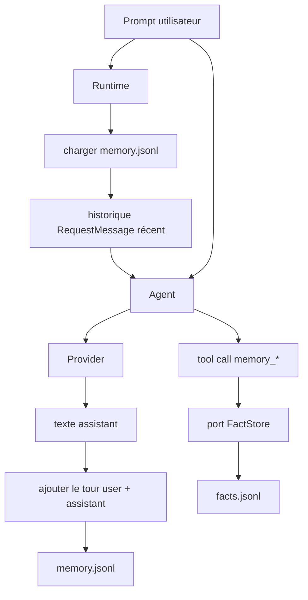
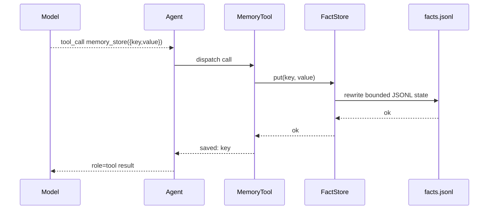

# Mémoire

`nllclw` possède deux systèmes de mémoire:

1. transcript memory, qui garde les tours user/assistant récents;
2. durable fact memory, qui stocke des faits clés via des outils explicites.

Les deux sont par défaut des fichiers JSONL dans le répertoire d'état
utilisateur, pas à côté du binaire ni dans le projet courant.

## Vue d'ensemble



## Transcript Memory

Transcript memory est activée par défaut:

```sh
NLLCLW_MEMORY=on
# Default: user state dir/memory.jsonl
NLLCLW_MEMORY_MAX_MESSAGES=20
```

`NLLCLW_MEMORY_MAX_MESSAGES` doit être au moins 2, car les transcript appends
sont stockés comme paires user/assistant.

Chaque ligne est un objet JSON:

```json
{"role":"user","content":"remember that this project uses Zig 0.16"}
{"role":"assistant","content":"Got it."}
```

Au démarrage d'un tour:

1. `runtime.zig` ouvre le transcript store configuré.
2. `memory.zig` parse les lignes JSONL.
3. Les rôles invalides, JSON invalide, UTF-8 invalide ou binary control bytes
   produisent une erreur mémoire.
4. Seules les entrées les plus récentes jusqu'à `NLLCLW_MEMORY_MAX_MESSAGES`
   sont retenues.
5. Les entrées sont converties en messages de requête Chat Completions.

Après une réponse assistant réussie, `Runtime.appendMemory` ajoute le prompt
utilisateur et le texte assistant. Si l'append échoue, la réponse assistant déjà
produite est quand même imprimée et le canal signale un avertissement.

Les snapshots de transcript sont plafonnés à 256 KiB, la même limite utilisée
lors du chargement du fichier JSONL. Les tours trop grands sont rejetés avant
l'atomic replace, donc une écriture réussie ne peut pas créer un transcript que
le prochain démarrage ne pourrait pas lire.

## Durable Fact Memory

Fact memory est destinée aux faits key/value stables. Elle est disponible via le
tool loop local par défaut lorsque:

```sh
NLLCLW_MEMORY=on
NLLCLW_TOOLS=on
```

Defaults:

```sh
# Default path: user state dir/facts.jsonl
NLLCLW_MEMORY_MAX_FACTS=64
```

`NLLCLW_MEMORY_MAX_FACTS` doit être entre 1 et 1024.

Chaque ligne est un objet JSON:

```json
{"key":"project.language","value":"Zig 0.16"}
{"key":"user.prefers","value":"direct, pragmatic answers"}
```

Fact keys:

- doivent être non vides;
- sont limitées à 64 bytes;
- peuvent contenir lettres, chiffres, `_`, `-` et `.`;
- sont dédupliquées par clé, la valeur la plus récente gagnant.

Fact values:

- doivent être non vides;
- doivent contenir du texte non-whitespace;
- doivent être en UTF-8 valide;
- ne doivent pas contenir d'ASCII control bytes;
- sont limitées à 2048 bytes;
- doivent tenir dans `NLLCLW_TOOL_OUTPUT_MAX_BYTES` lorsqu'elles sont retournées
  par `memory_recall`.

Le snapshot fact JSONL utilise le même plafond lecture/écriture de 256 KiB que
transcript memory. Si de nombreux faits retenus dépassaient cette limite de
fichier, l'écriture échoue au lieu de créer un fichier facts illisible.

## Outils de mémoire

| Outil | Objectif |
|---|---|
| `memory_store` | Stocker ou mettre à jour un fait par clé. |
| `memory_recall` | Lire un fait par clé. |
| `memory_list` | Lister les clés de faits connues. |
| `memory_forget` | Supprimer un fait par clé. |

Tool flow:



## Commandes CLI de mémoire

Ces commandes opèrent sur les durable facts:

```sh
nllclw memory list
nllclw memory get project.language
nllclw memory forget project.language
nllclw memory reset
```

`memory reset` efface transcript memory et fact memory.

## Notes de confidentialité et de sécurité

- Les fichiers mémoire vivent par défaut dans le répertoire d'état utilisateur.
- Les fichiers `.nllclw-*` sont refusés par les outils de système de fichiers,
  donc le modèle ne peut pas lire ou modifier ses propres fichiers mémoire via
  `read_file`, `write_file` ou `edit_file`.
- La mémoire n'est pas chiffrée. N'y stockez pas de secrets.
- Fact memory doit servir aux préférences durables utilisateur/projet, pas aux
  logs bruts de conversation.
