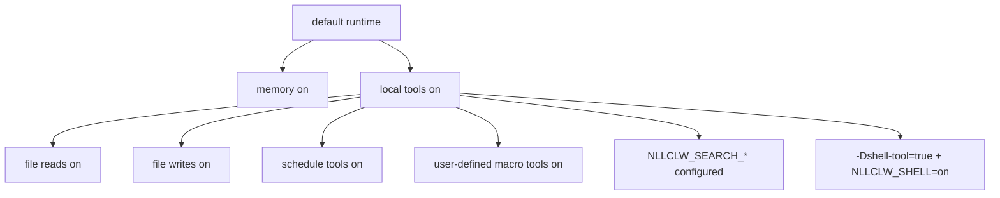

# Modèle de sécurité

`nllclw` est un assistant IA local, pas un sandbox. Son modèle de sécurité repose
sur de petits paramètres local-only par défaut, des gates explicites pour les
capacités externes, des sorties locales bornées et une validation prudente du
provider/config.

## Posture par défaut

Default build:

- aucune package dependency;
- aucun programme runtime externe;
- pas de `curl`;
- pas de shell execution;
- local tools activés;
- filesystem tools activés avec protections relative-path et secret-path;
- scheduler tools activés pour les schedules JSONL locaux;
- user-defined macro tools activés et stockés en JSONL local;
- web search désactivé sauf si un search provider est configuré;
- Telegram désactivé sauf s'il est lancé explicitement et configuré avec une
  allowlist.
- WebSocket désactivé sauf s'il est lancé explicitement; le bind par défaut est
  loopback-only.

Memory est activée par défaut parce qu'elle écrit seulement des fichiers JSONL
locaux dans le répertoire de travail courant. Vous pouvez la désactiver avec:

```sh
NLLCLW_MEMORY=off
```

Désactivez tous les outils avec:

```sh
NLLCLW_TOOLS=off
```

## Capability Gates



Le modèle reçoit les définitions de local tools par défaut. External web search
et shell execution nécessitent toujours une configuration explicite.

## Gestion des clés de fournisseur

- Les API keys viennent de OS env, `config.json` ou `.env`.
- OS env remplace file config, et `config.json` remplace `.env`.
- Les completion provider keys sont envoyées seulement comme
  `Authorization: Bearer ...`.
- Les search provider keys sont envoyées avec le header d'auth documenté par
  chaque fournisseur: bearer auth pour Tavily et Firecrawl,
  `X-Subscription-Token` pour Brave Search et `x-api-key` pour Exa.
- Les header values rejettent les ASCII control bytes.
- Les provider model names rejettent l'UTF-8 invalide et les control bytes avant
  la construction du request JSON.
- Chat request content strings, assistant response text et tool-call argument
  strings rejettent l'UTF-8 invalide et les binary control bytes; les newlines,
  carriage returns et tabs normaux restent du texte valide à cet endroit. Les
  request metadata comme model names, roles, tool-call ids, function names et
  parameter names sont en plus single-line.
- Les provider response roles, lorsqu'ils sont présents, doivent être
  `assistant`.
- Les Provider and Telegram diagnostic messages vides, trop grands ou contenant
  des control bytes ne sont pas imprimés comme trusted single-line errors.
- Les raw diagnostic response bodies ne sont imprimés que lorsqu'ils sont du
  texte valide et sont plafonnés dans la sortie terminal.
- Les default state files vivent dans le user state directory. Les configured
  state paths pour memory, macro tools et schedules doivent être des relative
  `.jsonl` paths avec UTF-8 valide, sans control bytes, séparateurs `/`, sans
  Windows-reserved filename characters ni device names, et sans path components
  vides, `.`, `..`, trailing-space ou trailing-dot.
- Les local state files et leurs lock files sont ouverts sans suivre les
  terminal symlinks. Les écritures utilisent atomic replace et private file
  permissions lorsque la host platform les expose.
- Les durable fact memory values rejettent les ASCII control bytes avant d'être
  stockées ou imprimées par les chemins CLI/tool recall.
- Les user-defined macro tool descriptions and actions rejettent les ASCII
  control bytes avant d'être stockées ou renvoyées comme model-facing tool
  schema/output.
- Les scheduled actions rejettent les ASCII control bytes avant d'être stockées
  ou imprimées par schedule listing.
- Les model-facing tool outputs rejettent l'UTF-8 invalide et les binary control
  bytes.
- Les chemins `.env`, `config.json` et `.nllclw-*` sont refusés par les
  filesystem tools.
- les user-defined macro tools sont stockés dans le user state directory par
  défaut.
- Ne collez pas de vraies clés dans les prompts ou context files.

## Sécurité du compatible provider

Les compatible providers doivent utiliser HTTPS par défaut:

```json
{
  "provider": "compatible",
  "base_url": "https://example.com/v1",
  "api_key": "...",
  "model": "..."
}
```

HTTP est autorisé seulement pour des hosts loopback exacts et seulement lorsqu'il
est activé explicitement:

```json
{
  "provider": "compatible",
  "base_url": "http://127.0.0.1:11434/v1",
  "allow_http_base_url": true,
  "api_key": "ollama",
  "model": "llama3.2"
}
```

Les remote HTTP URLs sont rejetées.

## Frontière des filesystem tools

Les filesystem tools ne sont pas un sandbox complet, mais elles appliquent une
frontière locale conservatrice:

- relative paths seulement;
- paths UTF-8 valides, sans contrôles, d'au plus 512 bytes;
- pas de `..`;
- pas d'absolute POSIX paths;
- pas d'absolute ou drive-qualified Windows paths;
- pas de path components vides, `.` ou `..`, sauf que `list_dir` accepte le
  literal `.` pour le répertoire courant;
- pas de symlink traversal pour les path components ouverts;
- pas de Windows-reserved filename characters, device names, trailing spaces ou
  trailing dots;
- pas de `.env`, `config.json`, `.nllclw-*`, `.git`, `.ssh`, `.gnupg`, `.aws`, `.npmrc`;
- pas de common private-key filenames ou suffixes;
- texte UTF-8 seulement, sans binary control bytes;
- output-size caps;
- atomic writes.

Exécutez avec file tools seulement dans un répertoire où ces permissions ont du
sens.

## Frontière Telegram

Telegram mode est default-deny:

- `NLLCLW_TELEGRAM_TOKEN` est obligatoire;
- les Telegram tokens sont validés comme `<bot-id>:<secret>` avant d'être placés
  dans les Bot API URLs;
- `NLLCLW_TELEGRAM_CHAT_ID` est obligatoire;
- les messages hors du chat id configuré ou de la username allowlist sont
  ignorés;
- un local nonblocking lock rejette un second processus `nllclw telegram`
  utilisant le même state directory;
- le dernier update traité est stocké localement pour éviter le replay après un
  restart.
- les model-backed messages sont rate-limited par
  `NLLCLW_TELEGRAM_RATE_LIMIT_PER_MINUTE`.

## Frontière WebSocket

WebSocket mode est prévu par défaut pour des custom UIs locales:

- il ne démarre que lorsque `nllclw websocket` est lancé;
- le bind par défaut est `127.0.0.1:8765`;
- `NLLCLW_WS_TOKEN` est obligatoire même pour les loopback binds;
- `NLLCLW_WS_PATH` doit être un UTF-8 valide single-line sans syntaxe query ou
  fragment;
- les non-loopback bind addresses nécessitent `NLLCLW_WS_ALLOW_REMOTE=on`;
- les loopback browser clients peuvent passer le token comme `?token=...`;
- loopback query authentication accepte exactement un paramètre `token`;
- les remote clients doivent utiliser exactement un header
  `Authorization: Bearer ...`;
- les model-backed chat messages sont rate-limited par
  `NLLCLW_WS_RATE_LIMIT_PER_MINUTE`.
- le serveur intégré gère un active client à la fois.

N'exposez pas le port WebSocket à un réseau non fiable sans reverse proxy et
transport security. Le canal intégré est plain `ws://`, pas une TLS termination.

## Frontière de la shell tool

Le default binary n'inclut pas `shell_exec`.

Pour rendre shell execution possible, les deux conditions doivent être vraies:

```sh
zig build -Dshell-tool=true
NLLCLW_SHELL=on
```

La shell tool doit être traitée comme équivalente à donner au modèle l'exécution
de commandes locales. Utilisez-la seulement dans des trusted environments.

## Checklist pratique

Avant d'utiliser les capacités locales par défaut:

1. Exécutez dans un project directory dédié.
2. Gardez les secrets hors des prompts et context files.
3. Définissez `NLLCLW_FILE_WRITE=off` si la file mutation n'est pas souhaitée.
4. Utilisez le default no-shell binary sauf si command execution est nécessaire.
5. Utilisez `NLLCLW_TOOL_OUTPUT_MAX_BYTES` pour garder le tool output borné.
6. Utilisez `nllclw status` pour une quick health line ou `nllclw doctor` pour
   les diagnostics complets.
