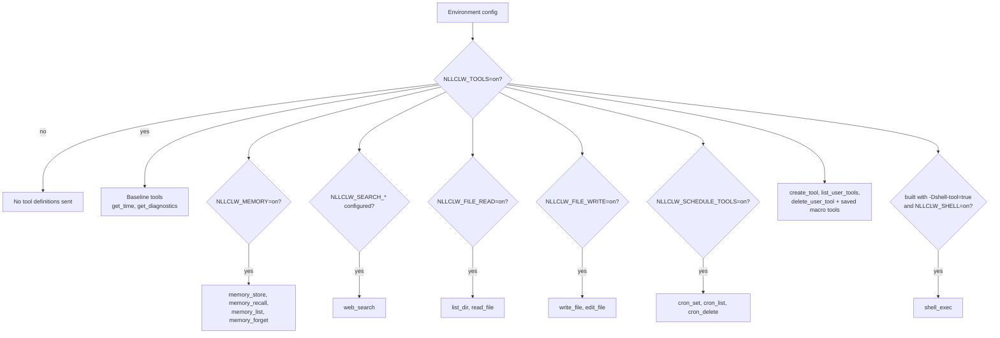
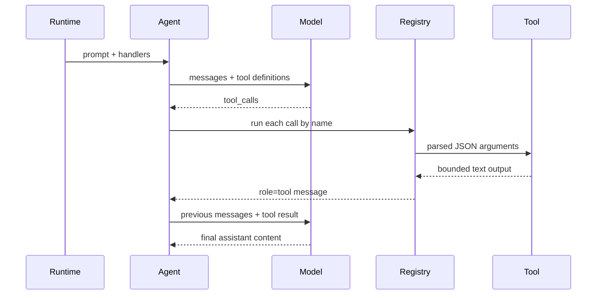

# Outils

Les outils permettent au modèle de demander à `nllclw` d'effectuer des actions
locales. Les outils locaux qui ne nécessitent pas de services externes sont
activés par défaut. External web search et optional shell execution nécessitent
toujours une configuration explicite.

## Capability Model



Le default binary ne contient pas `shell_exec`. Compilez-le explicitement:

```sh
zig build -Dshell-tool=true
```

Puis activez-le au runtime:

```sh
NLLCLW_TOOLS=on
NLLCLW_SHELL=on
```

Pour désactiver tous les outils:

```sh
NLLCLW_TOOLS=off
```

## Tool Loop



`NLLCLW_TOOL_MAX_ROUNDS` limite le nombre de tours assistant/tool exchange qui
peuvent se produire avant que l'agent retourne `ToolRoundLimit`.

Les arguments built-in tool sont des objets JSON exacts. JSON invalide, champs
requis manquants, unknown fields, types de champs invalides et échecs de
validation retournent un tool error que le modèle peut gérer.

## Outils disponibles

| Outil | Gate | Effet |
|---|---|---|
| `get_time` | `NLLCLW_TOOLS=on` default | Retourne local time avec `NLLCLW_TIMEZONE_OFFSET_MINUTES`. |
| `get_diagnostics` | `NLLCLW_TOOLS=on` default | Rapporte le runtime capability/config status. |
| `web_search` | `NLLCLW_TOOLS=on` et un provider `NLLCLW_SEARCH_*` configuré | Appelle le search provider sélectionné via le HTTP port. |
| `memory_store` | `NLLCLW_TOOLS=on`, `NLLCLW_MEMORY=on` defaults | Stocke un durable fact. |
| `memory_recall` | `NLLCLW_TOOLS=on`, `NLLCLW_MEMORY=on` defaults | Lit un durable fact. |
| `memory_list` | `NLLCLW_TOOLS=on`, `NLLCLW_MEMORY=on` defaults | Liste les durable fact keys. |
| `memory_forget` | `NLLCLW_TOOLS=on`, `NLLCLW_MEMORY=on` defaults | Supprime un durable fact. |
| `list_dir` | `NLLCLW_FILE_READ=on` default | Liste un répertoire relatif au CWD. |
| `read_file` | `NLLCLW_FILE_READ=on` default | Lit un fichier UTF-8 relatif au CWD. |
| `write_file` | `NLLCLW_FILE_WRITE=on` default | Écrit atomiquement un fichier UTF-8 relatif au CWD. |
| `edit_file` | `NLLCLW_FILE_WRITE=on` default | Remplace la première correspondance textuelle exacte dans un fichier. |
| `cron_set` | `NLLCLW_SCHEDULE_TOOLS=on` default | Ajoute une tâche planifiée locale. |
| `cron_list` | `NLLCLW_SCHEDULE_TOOLS=on` default | Liste les tâches planifiées. |
| `cron_delete` | `NLLCLW_SCHEDULE_TOOLS=on` default | Supprime une tâche planifiée. |
| `create_tool` | `NLLCLW_TOOLS=on` default | Crée une persistent user-defined macro tool. |
| `list_user_tools` | `NLLCLW_TOOLS=on` default | Liste les saved macro tools. |
| `delete_user_tool` | `NLLCLW_TOOLS=on` default | Supprime une saved macro tool. |
| saved macro tools | `NLLCLW_TOOLS=on` default | Retournent saved action text afin que le modèle puisse l'exécuter via built-in tools. |
| `shell_exec` | optional shell build plus `NLLCLW_SHELL=on` | Exécute une shell command avec timeout, combined output cap et sortie texte UTF-8 sans binary control bytes. |

## User-Defined Tools

Les user-defined tools sont des macro tools, pas du generated code.
`create_tool` stocke un name, une description et une natural-language action
dans `NLLCLW_USER_TOOLS_PATH` (default `user-tools.jsonl` dans le user state
directory).
Lors de tours ultérieurs, les saved tools sont annoncés comme des tool
definitions normales. Lorsque le modèle en appelle un, `nllclw` retourne le
saved action text et le modèle continue le même tool loop avec les built-in
tools.

Example:

```text
create_tool(name="daily_brief", description="Prepare a daily brief", action="Search for current project news, summarize it, and store the summary in memory.")
```

Les tool names ne peuvent contenir que des lettres, chiffres et underscores. Les
noms qui collisionnent avec des built-in tools sont rejetés. Les descriptions et
actions sont trimmed, bounded, du texte UTF-8 valide sans ASCII control bytes.
Le fichier user-tool JSONL est plafonné à 128 KiB en lecture et écriture, est
ouvert sans suivre les terminal symlinks, et une saved action doit tenir dans
`NLLCLW_TOOL_OUTPUT_MAX_BYTES` lorsqu'elle est enveloppée comme tool result.

## Fournisseurs Web Search

`web_search` est un outil avec un fournisseur sélectionné par
`NLLCLW_SEARCH_PROVIDER`. Le mode default `auto` choisit la première clé
configurée dans cet ordre: Tavily, Brave Search, Exa, Firecrawl, puis
DuckDuckGo seulement lorsqu'il est explicitement activé.
Les explicit key-based providers nécessitent leur `NLLCLW_SEARCH_*_KEY`
correspondante.
Les search keys ne doivent pas contenir d'ASCII control bytes.
Les queries sont trimmed, UTF-8 valides, control-free et d'au plus 512 bytes.
Le provider result text est formaté comme UTF-8 valide sans binary control bytes;
les tabs et newlines ordinaires dans les result fields sont normalisés en
espaces.
Les empty provider result objects sont ignorés, et une valid empty provider
response retourne `no results` au lieu d'une ligne placeholder synthétique. Les
groupes nested related-topic de DuckDuckGo sont aplatis jusqu'à une petite
bounded depth.

| Provider | Env | Notes |
|---|---|---|
| `tavily` | `NLLCLW_SEARCH_TAVILY_KEY=...` | POSTs to Tavily Search. |
| `brave` | `NLLCLW_SEARCH_BRAVE_KEY=...` | GETs Brave Web Search with `X-Subscription-Token`. |
| `exa` | `NLLCLW_SEARCH_EXA_KEY=...` | POSTs Exa Search with `x-api-key`. |
| `firecrawl` | `NLLCLW_SEARCH_FIRECRAWL_KEY=...` | POSTs Firecrawl Search with bearer auth. |
| `duckduckgo` | `NLLCLW_SEARCH_DUCKDUCKGO=on` or `NLLCLW_SEARCH_PROVIDER=duckduckgo` | No-key Instant Answer fallback, not a full web SERP API. |

Examples:

```sh
NLLCLW_TOOLS=on
NLLCLW_SEARCH_PROVIDER=auto
NLLCLW_SEARCH_BRAVE_KEY=...
```

```sh
NLLCLW_TOOLS=on
NLLCLW_SEARCH_PROVIDER=duckduckgo
```

## Livraison planifiée

`cron_set` accepte `channel` et `chat_id` pour la livraison. Dans les tours
Telegram, le chat courant devient le default destination, donc un prompt comme
"remind me here tomorrow" peut créer un Telegram schedule sans exposer un chat
id au model-facing user text.

Les scheduled actions sont trimmed, doivent être UTF-8 valides sans ASCII
control bytes et sont limitées à 2048 bytes. Le fichier schedule JSONL est
plafonné à 128 KiB en lecture et écriture; les snapshots surdimensionnés sont
rejetés avant atomic replacement.
`cron_set` n'accepte que les timing fields qui correspondent à son `type`:
`interval_*` pour les periodic schedules, `delay_*` pour les one-shot schedules
et `hour`/`minute` pour les daily schedules.
Le daemon commit un schedule seulement après la fin du scheduled prompt et la
réussite de toute delivery configurée; les deliveries failed ou blocked
réessaient après l'expiration du local lease.

Destinations prises en charge:

| Canal | Comportement |
|---|---|
| `local` | Daemon écrit le résultat sur stdout. |
| `telegram` | Daemon envoie le résultat au Telegram chat id stocké avec `NLLCLW_TELEGRAM_TOKEN`. |

## Modèle de sécurité du système de fichiers

Les filesystem tools sont conservatrices:

- les paths doivent être relatifs au current working directory;
- les paths doivent être UTF-8 valides, control-free et d'au plus 512 bytes;
- les absolute POSIX paths sont rejetés;
- les absolute ou drive-qualified Windows paths sont rejetés;
- les components vides, `.` et `..` sont rejetés, sauf que `list_dir` accepte le
  literal `.` pour le répertoire courant;
- les denied components incluent `.env`, `.env.*`, `config.json`, `.nllclw-*`,
  `.git`, `.ssh`, `.gnupg`, `.aws`, `.npmrc`, `id_rsa`, `id_ed25519`;
- les denied Windows device names incluent `CON`, `PRN`, `AUX`, `NUL`,
  `CONIN$`, `CONOUT$`, `COM1` through `COM9` et `LPT1` through `LPT9`, y compris
  avec extensions;
- la Windows-reserved filename punctuation (`<`, `>`, `:`, `"`, `|`, `?`, `*`)
  est rejetée pour portable behavior;
- les path components finissant par un espace ou un point sont rejetés pour
  portable behavior;
- les denied suffixes incluent `.pem`, `.key`, `.p12`, `.pfx`;
- les intermediate directories sont ouverts sans suivre les symlinks;
- les terminal files sont ouverts sans suivre les symlinks;
- reads et writes exigent du texte UTF-8 valide sans binary control bytes;
- `list_dir` émet les noms en sorted order et omet les noms denied, non-UTF-8
  ou contenant des control characters;
- writes utilisent atomic replacement et private file permissions lorsque pris
  en charge;
- output est plafonné par `NLLCLW_TOOL_OUTPUT_MAX_BYTES`.

Ceci est une frontière de sécurité locale, pas un sandbox. Exécutez `nllclw`
seulement dans des répertoires où vous acceptez d'accorder les capabilities
activées.

## Ajouter un outil

La forme préférée est:

1. Ajoutez un module ciblé dans `src/tools/<name>.zig`.
2. Définissez un `chat.ToolDefinition`.
3. Implémentez une petite client struct qui possède uniquement les dépendances
   nécessaires.
4. Parsez les JSON arguments avec `std.json.parseFromSlice`.
5. Retournez un owned text output plafonné par `NLLCLW_TOOL_OUTPUT_MAX_BYTES`.
6. Enregistrez le handler dans `src/tools/catalog.zig` derrière un config gate
   explicite s'il lit ou modifie du local state.
7. Ajoutez des tests pour success, invalid JSON/arguments, bounds et denied
   access.

Ne placez pas d'infrastructure adapters dans `src/tools/`. Si un outil a besoin
de persistence ou HTTP, définissez ou réutilisez un port et injectez-le via le
catalog.
