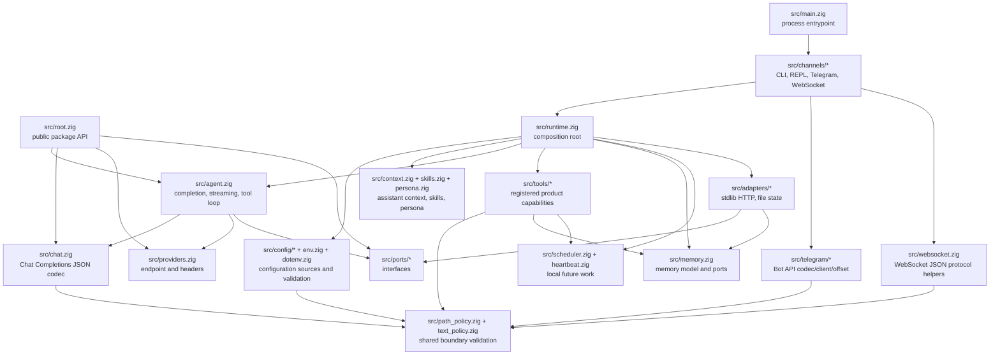
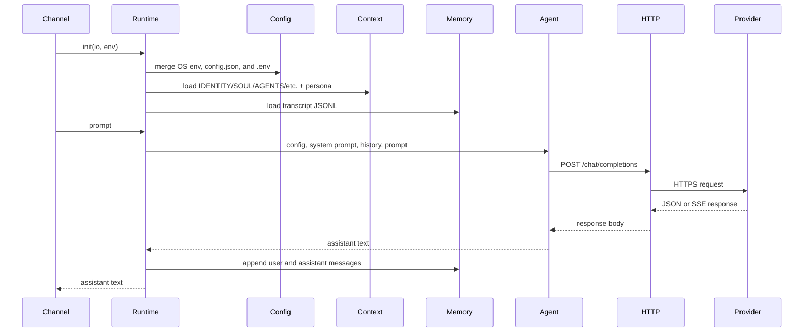
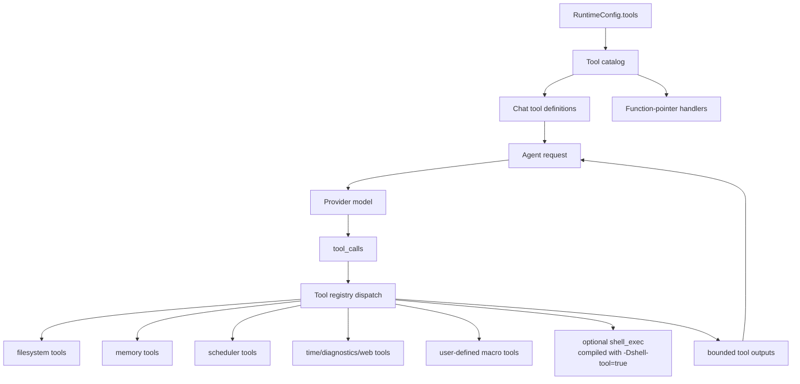
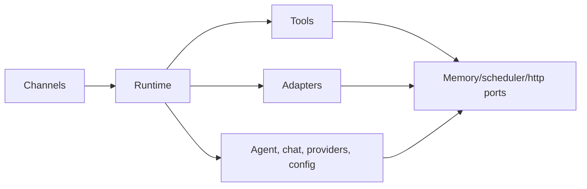

# Architecture

`nllclw` एक compact AI assistant है, जो Zig package और एक executable के रूप में
बना है। Main design goal agent engine को testable रखना है, और फिर भी छोटा
standalone binary ship करना है।

## Goals

- Provider wire contract simple रखें: OpenAI-compatible Chat Completions।
- Runtime dependencies explicit रखें: default build केवल Zig stdlib इस्तेमाल करता है।
- Local capabilities को capability-gated और audit करने में आसान रखें।
- Channels thin रखें: CLI, REPL, Telegram, WebSocket, heartbeat और daemon सभी
  उसी runtime और agent engine को call करते हैं।
- Public package API इतना छोटा रखें कि उससे सीखना आसान हो।

## Layer Map



## Request Flow

Same engine argv prompts, stdin prompts, REPL turns, Telegram messages,
WebSocket prompts, heartbeat tasks और due schedules handle करता है।



## Tool Loop Flow

Tools product capabilities हैं, infrastructure adapters नहीं। वे `src/tools/`
में रहते हैं और model को केवल `src/tools/catalog.zig` के माध्यम से exposed होते हैं।



Agent यह loop तब तक repeat करता है जब तक तीन में से एक बात न हो:

- model बिना tool calls के assistant content return करे;
- `NLLCLW_TOOL_MAX_ROUNDS` reach हो;
- provider error, malformed provider response, allocation failure या अन्य fatal
  dispatch error हो।

Non-fatal tool failures model को `tool error: ...` tool messages के रूप में लौटाए
जाते हैं ताकि model recover कर सके, अलग arguments चुन सके या failure समझा सके।
Allocation failures अभी भी turn abort करते हैं।

Tools enabled होने पर streaming जानबूझकर disabled है। Assistant को tool calls
चलाने के लिए complete model response चाहिए।

`src/chat.zig` JSON encoding से पहले हर request string को binary control bytes
के बिना UTF-8 text के रूप में validate करता है। इससे Chat Completions fields JSON
strings रहते हैं और arbitrary byte slices arrays में degrade नहीं होते। SSE के लिए,
`[DONE]` terminal है; बाद के chunks ignored हैं।

## Module Responsibilities

| Path | Responsibility |
|---|---|
| `src/main.zig` | Minimal executable entrypoint और process exit। |
| `src/root.zig` | Stable public API: config, chat types, HTTP port, streaming sink, `complete`। |
| `src/runtime.zig` | CLI-like operation के लिए composition root: config, HTTP adapter, memory adapter, context, tools। |
| `src/agent.zig` | Channel-neutral one-turn assistant engine, streaming और tool loop। |
| `src/chat.zig` | Chat Completions के लिए JSON request/response codec, tools और SSE chunks सहित। |
| `src/providers.zig` | Provider presets और compatible-provider endpoint validation। |
| `src/config/*` | Typed runtime config, source collection, validation और owned copies। |
| `src/channels/*` | CLI, REPL, Telegram, WebSocket और daemon commands के लिए user I/O orchestration। |
| `src/tools/*` | Tool definitions, local capabilities और user-defined macro tools। |
| `src/skills.zig` | On-demand local skill loading के लिए compact `skills/*.md` index। |
| `src/persona.zig` | System prompt में appended runtime presentation modes। |
| `src/memory.zig` | Transcript/fact models, JSONL parsers और memory store ports। |
| `src/adapters/*` | Ports के concrete stdlib adapters। |
| `src/ports/*` | Testable boundaries के लिए function-pointer interfaces। |
| `src/telegram/*` | Telegram Bot API wire helpers। |
| `src/websocket.zig` | Testable WebSocket JSON message/event helpers। |

## Public Package API

Consumers package module को `nllclw` के रूप में import करते हैं। Exported surface
छोटा है:

```zig
const nllclw = @import("nllclw");

const cfg: nllclw.Config = .{
    .provider = .openrouter,
    .api_key = "...",
    .model = "openai/gpt-chat-latest",
};

const text = try nllclw.complete(allocator, http_client, cfg, "hello");
```

Public API expose करता है:

- `ProviderKind`
- `PersonaKind`
- `Config`
- chat request/tool types
- `HttpClient`, `HttpResponse`, `HttpHeader`, `HttpStatusCode`
- `Diagnostic`
- `ToolOptions`, `ToolHandler`, `ToolRunError`, `CompleteOptions`
- `StreamError`, `StreamSink`
- `complete` और `completeWithOptions`

Runtime-only details जैसे `config.json`/`.env` loading, file memory, Telegram
polling और stdlib HTTP adapter public root से बाहर रहते हैं। Public tool handler
केवल `ToolOptions` के लिए जरूरी function-pointer abstraction है; built-in product
tools और उनके file-backed stores internal रहते हैं।

## Dependency Direction

Dependency direction explicit है:



Core code process env, `config.json`, `.env`, filesystem paths, Telegram polling
या `std.http.Client` के बारे में नहीं जानता। ये details `runtime.zig` और channels
द्वारा assembled होते हैं।

## Memory Ownership

Code Zig के explicit ownership style का पालन करता है:

- Allocate करने वाली functions owned slices return करती हैं और call sites के पास
  `defer`/`deinit` patterns से ownership document करती हैं।
- Long-lived runtime state `Runtime` own करता है और `Runtime.deinit` में release करता है।
- Parsed config source buffers से borrowed हो सकता है या runtime storage के लिए
  `config.Owned` में copied हो सकता है।
- Tool outputs agent के owned रहते हैं जब तक वे model को वापस भेजे नहीं जाते,
  फिर loop के बाद freed होते हैं।

## Cross-Platform Runtime Model

Default binary का लक्ष्य उन targets पर चलना है जिन्हें Zig और Zig standard
library support कर सकते हैं:

- no `curl`;
- no provider SDK;
- `build.zig.zon` में no package dependencies;
- default build में no shell process;
- HTTPS के लिए `std.http.Client`;
- files, stdin/stdout/stderr और timers के लिए `std.Io`।

Optional shell tool अलग build flavor है:

```sh
zig build -Dshell-tool=true
```

वह flavor default नहीं है क्योंकि runtime पर enabled होने पर वह `sh` या `cmd.exe`
launch कर सकता है।
