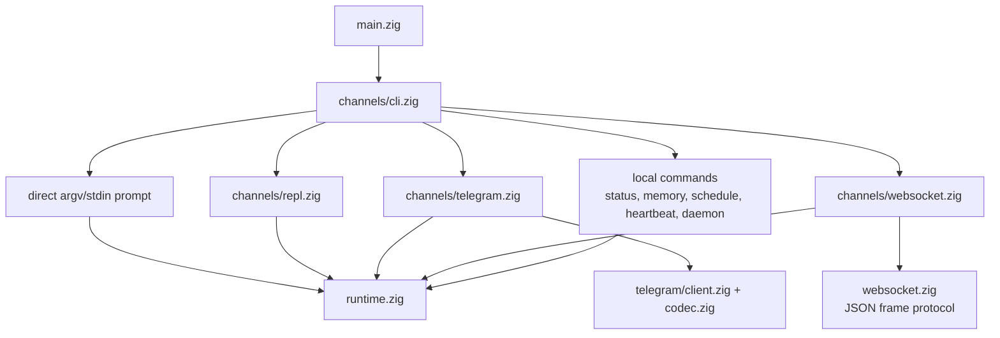
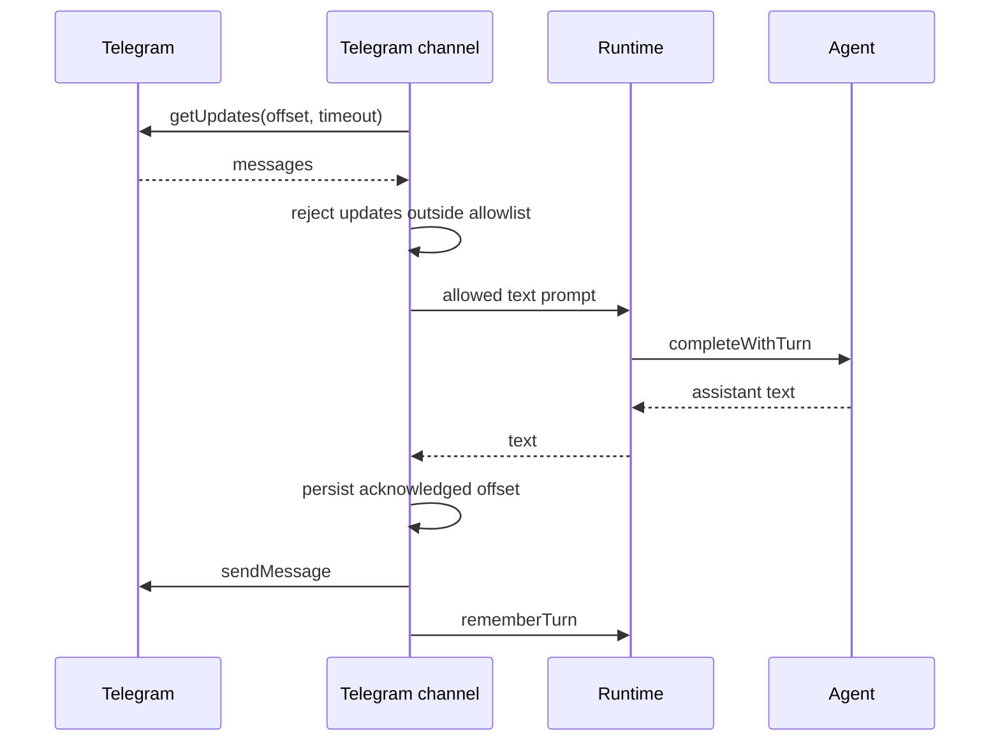
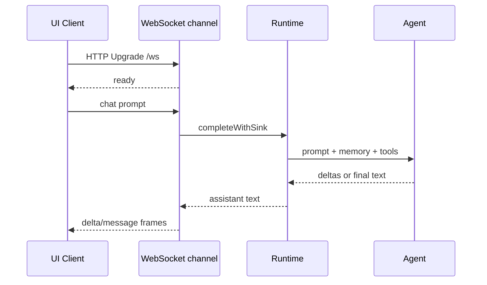

# Channels

Channels उसी runtime और agent engine से बात करने के user-facing तरीके हैं। वे input
parse करते हैं, channel-specific I/O own करते हैं, और completions को `runtime.zig`
पर delegate करते हैं।

## Channel Map



## Direct CLI

argv से prompt:

```sh
nllclw "explain this repository in one paragraph"
```

stdin से prompt:

```sh
printf 'summarize this text\n' | nllclw
```

`NLLCLW_STREAM=on` default है:

```sh
NLLCLW_STREAM=on
```

Tool loop भी default रूप से on है, और tool output non-streaming है क्योंकि agent
को local functions dispatch करने से पहले complete tool calls inspect करने होते हैं।
Pure streaming chat के लिए `NLLCLW_TOOLS=off` set करें।

Direct slash commands locally handled हैं:

```sh
nllclw /settings
nllclw /diag memory
nllclw /persona technical
```

ये commands model call नहीं करते।

## Interactive REPL

जब stdin TTY हो और कोई prompt न दिया गया हो, `nllclw` छोटा terminal chat loop
start करता है:

```sh
nllclw
```

Exit commands:

```text
:q
:quit
exit
```

हर turn direct CLI mode जैसी ही runtime memory और tool configuration use करता है।

## Telegram

Telegram mode Bot API long polling use करता है:

```sh
NLLCLW_TELEGRAM_TOKEN=123456:bot-token
NLLCLW_TELEGRAM_CHAT_ID=123456789
nllclw telegram
```

`NLLCLW_TELEGRAM_CHAT_ID` private-chat या public-chat Telegram username भी हो सकता
है, `@` के साथ या बिना, उदाहरण के लिए `@donprus` या `donprus`।

Security properties:

- `NLLCLW_TELEGRAM_CHAT_ID` required है;
- configured chat id या username allowlist के बाहर messages ignored हैं;
- local nonblocking lock same state directory पर दूसरे `nllclw telegram` process
  को Bot API polling तक पहुँचने से पहले रोकता है;
- accepted message text valid UTF-8 होना चाहिए, binary control bytes के बिना;
  malformed text updates skipped होते हैं, लेकिन polling offset आगे बढ़ता है;
- last acknowledged update id user state directory में stored है;
- restarts stored offset से continue करते हैं और handled messages replay नहीं करते।
- model-backed messages `NLLCLW_TELEGRAM_RATE_LIMIT_PER_MINUTE` से rate-limited हैं
  (default `20`, `0` disables); local slash commands rate-limited नहीं हैं।

अगर कोई दूसरी machine, deployment या पुराना binary उसी bot token के लिए पहले से
`getUpdates` use कर रहा है, Telegram HTTP `409` return करता है। `nllclw` उस conflict
के लिए specific hint print करता है।

Flow:



## WebSocket

WebSocket mode custom browser, desktop या mobile UIs के लिए local RFC6455 server
start करता है:

```sh
NLLCLW_WS_TOKEN=change-me nllclw websocket
```

Default bind settings:

```sh
NLLCLW_WS_HOST=127.0.0.1
NLLCLW_WS_PORT=8765
NLLCLW_WS_PATH=/ws
```

Default bind address loopback-only है, लेकिन channel फिर भी `NLLCLW_WS_TOKEN`
require करता है ताकि random browser pages local agent से बात न कर सकें। Remote
binds दोनों require करते हैं:

```sh
env NLLCLW_WS_HOST=0.0.0.0 \
  NLLCLW_WS_ALLOW_REMOTE=on \
  NLLCLW_WS_TOKEN=change-me \
  nllclw websocket
```

Loopback browser clients token को query parameter के रूप में pass कर सकते हैं:

```js
const socket = new WebSocket("ws://127.0.0.1:8765/ws?token=change-me");

socket.addEventListener("message", (event) => {
  const message = JSON.parse(event.data);
  console.log(message.type, message.content ?? message.message);
});

socket.addEventListener("open", () => {
  socket.send(JSON.stringify({
    type: "chat",
    prompt: "Explain this repository in one paragraph."
  }));
});
```

Query authentication exactly one `token` parameter accept करता है। Duplicate token
parameters ambiguous होने के कारण rejected हैं।

Remote clients exactly one bearer token header use करें। Browser-based remote UIs
trusted local या reverse proxy के माध्यम से connect करें जो यह header inject करे।

```text
Authorization: Bearer change-me
```

Client messages:

```json
{ "type": "chat", "prompt": "hello" }
{ "type": "status" }
{ "type": "ping" }
{ "type": "close" }
```

Plain text frames simple clients के लिए chat prompts के रूप में accepted हैं। Text
frames valid UTF-8 होने चाहिए, binary control bytes के बिना।
JSON command frames exact objects हैं; unknown fields rejected हैं, और केवल
`chat`/`message` frames में `prompt` हो सकता है।
Server एक समय में एक active WebSocket client handle करता है। Additional clients
active client disconnect होने के बाद connect कर सकते हैं।

Server messages:

```json
{ "type": "ready", "version": 1, "channel": "websocket" }
{ "type": "delta", "content": "partial text" }
{ "type": "message", "content": "final text" }
{ "type": "status", "content": "nllclw: ok ..." }
{ "type": "pong", "content": "pong" }
{ "type": "error", "message": "request failed" }
```

`delta` frames केवल तब emitted होते हैं जब `NLLCLW_STREAM=on` और
`NLLCLW_TOOLS=off` हो। Tools enabled होने पर, channel final `message` भेजने से
पहले model को tool-call planning complete करनी होती है।

Flow:



## Local Commands

Local commands model से नहीं पूछते, जब तक command explicitly task run न करे:

```sh
nllclw status
nllclw doctor
nllclw memory list
nllclw memory get project.goal
nllclw memory forget project.goal
nllclw memory reset
nllclw schedule list
nllclw schedule delete 1
```

`status` quick health line print करता है। `doctor` full diagnostics report print करता है।

## Shared Slash Commands

REPL, Telegram और direct CLI same slash parser share करते हैं:

| Command | Effect |
|---|---|
| `/start`, `/help` | Local command help दिखाएँ। |
| `/settings` | Quick runtime status दिखाएँ। |
| `/diag [scope]` | `quick`, `runtime`, `memory`, `rates`, `time`, या `all` के diagnostics दिखाएँ। |
| `/persona [mode]` | Runtime persona दिखाएँ या set करें: `neutral`, `friendly`, `technical`, `witty`। |
| `/stop` | Current process के लिए Telegram intake pause करें। Other channels report करते हैं कि यह Telegram-only है। |
| `/resume` | Telegram intake resume करें। Other channels report करते हैं कि यह Telegram-only है। |
| `/chatid` | Available होने पर Telegram chat id और username fields print करें। Other channels report करते हैं कि यह Telegram-only है। |

Persona changes current process के runtime-only हैं। Startup persona चुनने के लिए
`NLLCLW_PERSONA` set करें।

## Heartbeat

`nllclw heartbeat` `HEARTBEAT.md` read करता है और pending items को एक prompt में
बदलता है। केवल conservative task syntax actionable माना जाता है:

- unchecked markdown task lines;
- `TODO:` से शुरू होने वाली lines।

```sh
nllclw heartbeat
```

अगर कोई pending task नहीं मिलता, command short message print करके successfully exit करता है।

## Daemon

`nllclw daemon` repeatedly:

1. user state directory से due scheduled tasks claim करता है;
2. हर claimed task को normal runtime से run करता है;
3. केवल completed schedule entries commit करता है;
4. periodically heartbeat prompts run करता है।

```sh
NLLCLW_DAEMON_INTERVAL_SECONDS=60
NLLCLW_HEARTBEAT_INTERVAL_SECONDS=1800
nllclw daemon
```

Daemon local और file-backed है। यह multiple machines के across coordinate नहीं करता।

Claimed schedules local lease use करते हैं। अगर provider execution, destination
preflight या delivery fail हो, task committed नहीं होता; lease expire होने के बाद
वह फिर eligible हो जाता है।

जब Telegram से schedule created हो, `cron_set` default रूप से `channel=telegram`
और current chat id इस्तेमाल करता है। Daemon completed scheduled result को
`NLLCLW_TELEGRAM_TOKEN` से उसी chat में वापस भेजता है। Local schedules अभी भी
stdout में write करते हैं।
