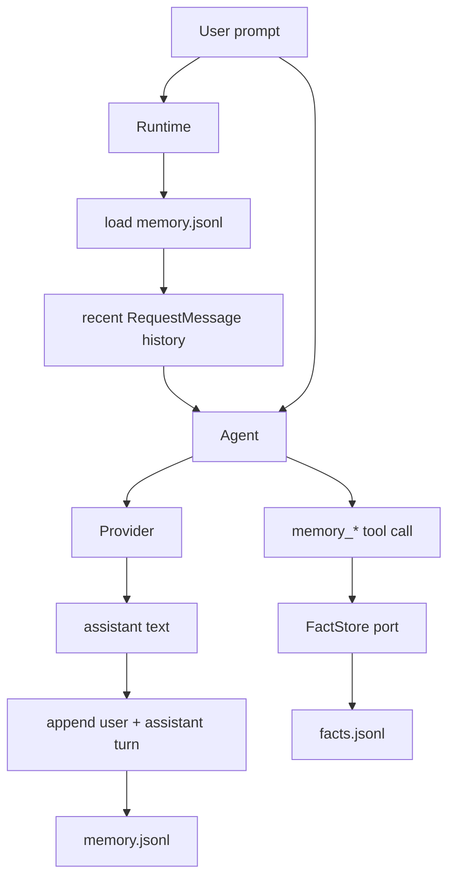
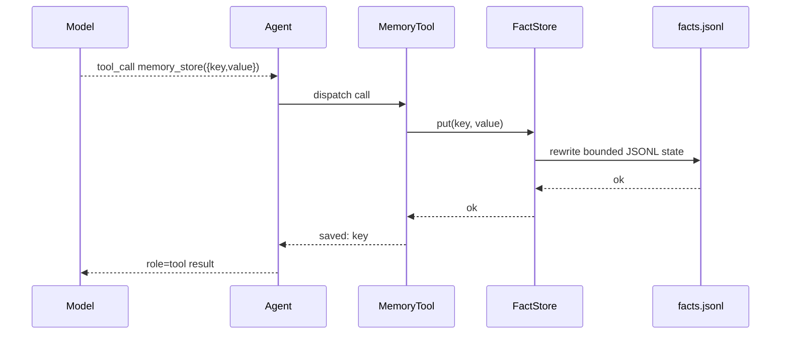

# Memory

`nllclw` में दो memory systems हैं:

1. transcript memory, जो हाल के user/assistant turns रखती है;
2. durable fact memory, जो explicit tools के माध्यम से keyed facts store करती है।

दोनों default रूप से user state directory में JSONL files हैं, binary के पास या
current project में नहीं।

## Overview



## Transcript Memory

Transcript memory default रूप से enabled है:

```sh
NLLCLW_MEMORY=on
# Default: user state dir/memory.jsonl
NLLCLW_MEMORY_MAX_MESSAGES=20
```

`NLLCLW_MEMORY_MAX_MESSAGES` कम से कम 2 होना चाहिए क्योंकि transcript appends
user/assistant pairs के रूप में stored होते हैं।

प्रत्येक line एक JSON object है:

```json
{"role":"user","content":"remember that this project uses Zig 0.16"}
{"role":"assistant","content":"Got it."}
```

एक turn के startup पर:

1. `runtime.zig` configured transcript store खोलता है।
2. `memory.zig` JSONL lines parse करता है।
3. Invalid roles, invalid JSON, invalid UTF-8 या binary control bytes memory error देते हैं।
4. केवल newest `NLLCLW_MEMORY_MAX_MESSAGES` entries रखी जाती हैं।
5. Entries Chat Completions request messages में convert होती हैं।

Successful assistant response के बाद, `Runtime.appendMemory` user prompt और
assistant text append करता है। Append fail हो जाए तो already produced assistant
answer फिर भी printed होता है और channel warning report करता है।

Transcript snapshots 256 KiB पर capped हैं, वही limit जो JSONL file load करते
समय इस्तेमाल होती है। Oversized turns atomic replace से पहले rejected होते हैं,
इसलिए successful write ऐसा transcript नहीं बना सकता जिसे next startup read न कर सके।

## Durable Fact Memory

Fact memory stable key/value facts के लिए है। यह default local tool loop के
माध्यम से available है जब:

```sh
NLLCLW_MEMORY=on
NLLCLW_TOOLS=on
```

Defaults:

```sh
# Default path: user state dir/facts.jsonl
NLLCLW_MEMORY_MAX_FACTS=64
```

`NLLCLW_MEMORY_MAX_FACTS` 1 से 1024 तक होना चाहिए।

प्रत्येक line एक JSON object है:

```json
{"key":"project.language","value":"Zig 0.16"}
{"key":"user.prefers","value":"direct, pragmatic answers"}
```

Fact keys:

- non-empty होना चाहिए;
- 64 bytes तक limited हैं;
- letters, digits, `_`, `-`, और `.` रख सकते हैं;
- key से deduplicated हैं, newest value जीतती है।

Fact values:

- non-empty होना चाहिए;
- non-whitespace text रखना चाहिए;
- valid UTF-8 होना चाहिए;
- ASCII control bytes नहीं होने चाहिए;
- 2048 bytes तक limited हैं;
- `memory_recall` द्वारा लौटाए जाने पर `NLLCLW_TOOL_OUTPUT_MAX_BYTES` में fit होना चाहिए।

Fact JSONL snapshot transcript memory जैसी ही 256 KiB read/write cap इस्तेमाल करता है।
अगर कई retained facts उस file limit से अधिक हो जाएँ, write unreadable facts file
बनाने के बजाय fail होता है।

## Memory Tools

| Tool | Purpose |
|---|---|
| `memory_store` | Key से fact store या update करें। |
| `memory_recall` | Key से fact read करें। |
| `memory_list` | Known fact keys list करें। |
| `memory_forget` | Key से fact delete करें। |

Tool flow:



## CLI Memory Commands

ये commands durable facts पर operate करते हैं:

```sh
nllclw memory list
nllclw memory get project.language
nllclw memory forget project.language
nllclw memory reset
```

`memory reset` transcript memory और fact memory दोनों clear करता है।

## Privacy and Safety Notes

- Memory files default रूप से user state directory में रहते हैं।
- `.nllclw-*` files filesystem tools से denied हैं ताकि model अपनी memory files
  को `read_file`, `write_file`, या `edit_file` से read या edit न कर सके।
- Memory encrypted नहीं है। इसमें secrets store न करें।
- Fact memory durable user/project preferences के लिए इस्तेमाल करें, raw
  conversation logs के लिए नहीं।
