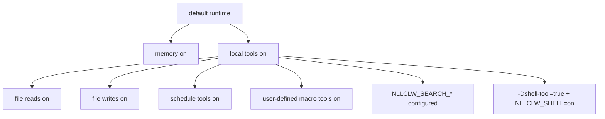

# Security Model

`nllclw` local AI assistant है, sandbox नहीं। इसका safety model छोटे local-only
defaults, explicit external capability gates, bounded local outputs और careful
provider/config validation पर आधारित है।

## Default Posture

Default build:

- no package dependencies;
- no external runtime programs;
- no `curl`;
- no shell execution;
- local tools enabled;
- filesystem tools enabled with relative-path and secret-path protections;
- scheduler tools enabled for local JSONL schedules;
- user-defined macro tools enabled and stored in local JSONL;
- search provider configured न हो तो web search disabled;
- Telegram disabled जब तक explicitly launch और allowlist से configured न हो।
- WebSocket disabled जब तक explicitly launch न हो; default bind loopback-only है।

Memory default रूप से enabled है क्योंकि यह current working directory में नहीं,
user state directory में केवल local JSONL files लिखती है। Disable करने के लिए:

```sh
NLLCLW_MEMORY=off
```

सभी tools disable करें:

```sh
NLLCLW_TOOLS=off
```

## Capability Gates



Model को default रूप से local tool definitions मिलते हैं। External web search और
shell execution के लिए अभी भी explicit setup चाहिए।

## Provider-Key Handling

- API keys OS env, `config.json`, या `.env` से आते हैं।
- OS env file config को override करता है, और `config.json` `.env` को override करता है।
- Completion provider keys केवल `Authorization: Bearer ...` के रूप में भेजे जाते हैं।
- Search provider keys हर provider के documented auth header से भेजे जाते हैं:
  Tavily और Firecrawl के लिए bearer auth, Brave Search के लिए `X-Subscription-Token`,
  और Exa के लिए `x-api-key`।
- Header values ASCII control bytes reject करते हैं।
- Request JSON बनने से पहले provider model names invalid UTF-8 और control bytes reject करते हैं।
- Chat request content strings, assistant response text और tool-call argument
  strings invalid UTF-8 और binary control bytes reject करते हैं; normal newlines,
  carriage returns और tabs वहाँ valid text रहते हैं। Request metadata जैसे model
  names, roles, tool-call ids, function names और parameter names additionally
  single-line हैं।
- Provider response roles, जब present हों, `assistant` होना चाहिए।
- Provider और Telegram diagnostic messages जो empty, too large, या control bytes
  रखते हैं, trusted single-line errors के रूप में print नहीं होते।
- Raw diagnostic response bodies केवल valid text होने पर print होते हैं और terminal
  output में capped रहते हैं।
- Default state files user state directory में रहते हैं। Memory, macro tools और
  schedules के configured state paths relative `.jsonl` paths होने चाहिए जिनमें
  valid UTF-8, no control bytes, `/` separators, no Windows-reserved filename
  characters या device names, और no empty, `.`, `..`, trailing-space, या
  trailing-dot path components हों।
- Local state files और उनकी lock files terminal symlinks follow किए बिना opened
  होती हैं। Writes atomic replace और private file permissions इस्तेमाल करते हैं जहाँ host platform expose करता है।
- Durable fact memory values store या CLI/tool recall paths से print होने से पहले
  ASCII control bytes reject करते हैं।
- User-defined macro tool descriptions और actions store या model-facing
  tool schema/output में भेजे जाने से पहले ASCII control bytes reject करते हैं।
- Scheduled actions store या schedule listing में print होने से पहले ASCII control bytes reject करते हैं।
- Model-facing tool outputs invalid UTF-8 और binary control bytes reject करते हैं।
- `.env`, `config.json`, और `.nllclw-*` paths filesystem tools से denied हैं।
- user-defined macro tools default रूप से user state directory में stored हैं।
- Real keys prompts या context files में paste न करें।

## Compatible Provider Safety

Compatible providers default रूप से HTTPS इस्तेमाल करते हैं:

```json
{
  "provider": "compatible",
  "base_url": "https://example.com/v1",
  "api_key": "...",
  "model": "..."
}
```

HTTP केवल exact loopback hosts के लिए और explicit enable होने पर allowed है:

```json
{
  "provider": "compatible",
  "base_url": "http://127.0.0.1:11434/v1",
  "allow_http_base_url": true,
  "api_key": "ollama",
  "model": "llama3.2"
}
```

Remote HTTP URLs rejected हैं।

## Filesystem Tool Boundary

Filesystem tools full sandbox नहीं हैं, लेकिन conservative local boundary enforce करते हैं:

- relative paths only;
- valid UTF-8, control-free paths no longer than 512 bytes;
- no `..`;
- no absolute POSIX paths;
- no absolute or drive-qualified Windows paths;
- no empty, `.`, या `..` path components, except that `list_dir` accepts
  literal `.` for the current directory;
- no symlink traversal for opened path components;
- no Windows-reserved filename characters, device names, trailing spaces, or
  trailing dots;
- no `.env`, `config.json`, `.nllclw-*`, `.git`, `.ssh`, `.gnupg`, `.aws`, `.npmrc`;
- no common private-key filenames or suffixes;
- UTF-8 text only, without binary control bytes;
- output-size caps;
- atomic writes।

File tools के साथ केवल ऐसी directory में चलाएँ जहाँ ये permissions उचित हों।

## Telegram Boundary

Telegram mode default-deny है:

- `NLLCLW_TELEGRAM_TOKEN` required है;
- Telegram tokens Bot API URLs में रखे जाने से पहले `<bot-id>:<secret>` के रूप में validated हैं;
- `NLLCLW_TELEGRAM_CHAT_ID` required है;
- configured chat id या username allowlist के बाहर messages ignored हैं;
- local nonblocking lock same state directory का उपयोग करने वाले दूसरे
  `nllclw telegram` process को reject करता है;
- restart के बाद replay से बचने के लिए last processed update locally stored है।
- model-backed messages `NLLCLW_TELEGRAM_RATE_LIMIT_PER_MINUTE` से rate-limited हैं।

## WebSocket Boundary

WebSocket mode default रूप से local custom UIs के लिए intended है:

- यह केवल `nllclw websocket` launch होने पर start होता है;
- default bind `127.0.0.1:8765` है;
- loopback binds के लिए भी `NLLCLW_WS_TOKEN` required है;
- `NLLCLW_WS_PATH` single-line valid UTF-8 होना चाहिए, query या fragment syntax के बिना;
- non-loopback bind addresses को `NLLCLW_WS_ALLOW_REMOTE=on` चाहिए;
- loopback browser clients token को `?token=...` के रूप में pass कर सकते हैं;
- loopback query authentication exactly one `token` parameter accept करता है;
- remote clients exactly one `Authorization: Bearer ...` header इस्तेमाल करें;
- model-backed chat messages `NLLCLW_WS_RATE_LIMIT_PER_MINUTE` से rate-limited हैं।
- built-in server एक समय में एक active client handle करता है।

Reverse proxy और transport security के बिना WebSocket port को untrusted network
पर expose न करें। Built-in channel plain `ws://` है, TLS termination नहीं।

## Shell Tool Boundary

Default binary में `shell_exec` शामिल नहीं है।

Shell execution संभव बनाने के लिए दोनों conditions true होनी चाहिए:

```sh
zig build -Dshell-tool=true
NLLCLW_SHELL=on
```

Shell tool को model को local command execution देने के बराबर मानें। इसे केवल
trusted environments में इस्तेमाल करें।

## Practical Checklist

Default local capabilities इस्तेमाल करने से पहले:

1. Dedicated project directory में run करें।
2. Secrets को prompts और context files से बाहर रखें।
3. File mutation न चाहिए तो `NLLCLW_FILE_WRITE=off` set करें।
4. Command execution required न हो तो default no-shell binary इस्तेमाल करें।
5. Tool output bounded रखने के लिए `NLLCLW_TOOL_OUTPUT_MAX_BYTES` इस्तेमाल करें।
6. Quick health line के लिए `nllclw status` या full diagnostics के लिए `nllclw doctor` इस्तेमाल करें।
