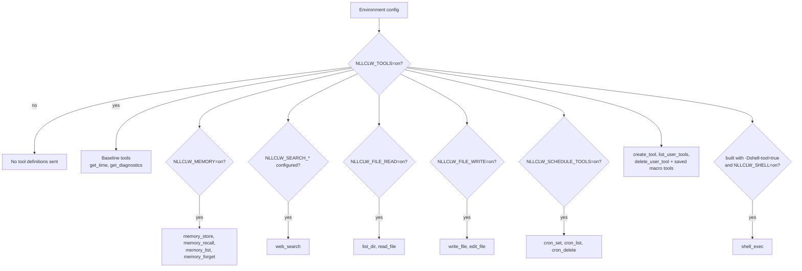
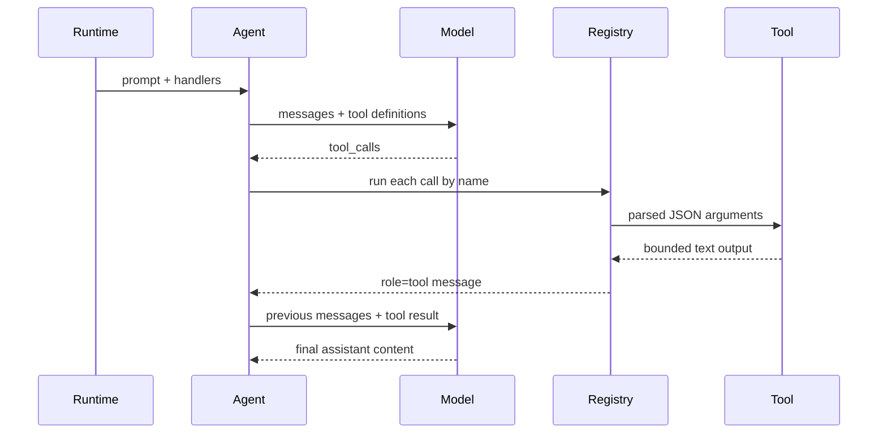

# Tools

Tools model को `nllclw` से local actions करवाने देते हैं। External services की
ज़रूरत न रखने वाले local tools default रूप से enabled हैं। External web search
और optional shell execution के लिए अभी भी explicit setup चाहिए।

## Capability Model



Default binary में `shell_exec` नहीं होता। इसे explicit build करें:

```sh
zig build -Dshell-tool=true
```

फिर runtime पर enable करें:

```sh
NLLCLW_TOOLS=on
NLLCLW_SHELL=on
```

सभी tools disable करने के लिए:

```sh
NLLCLW_TOOLS=off
```

## Tool Loop



`NLLCLW_TOOL_MAX_ROUNDS` यह limit करता है कि agent `ToolRoundLimit` return करने
से पहले कितने assistant/tool exchange rounds हो सकते हैं।

Built-in tool arguments exact JSON objects हैं। Invalid JSON, missing required
fields, unknown fields, invalid field types और validation failures model को handle
करने के लिए tool error return करते हैं।

## Available Tools

| Tool | Gate | Effect |
|---|---|---|
| `get_time` | `NLLCLW_TOOLS=on` default | `NLLCLW_TIMEZONE_OFFSET_MINUTES` इस्तेमाल करके local time return करता है। |
| `get_diagnostics` | `NLLCLW_TOOLS=on` default | Runtime capability/config status report करता है। |
| `web_search` | `NLLCLW_TOOLS=on` और configured `NLLCLW_SEARCH_*` provider | Selected search provider को HTTP port के माध्यम से call करता है। |
| `memory_store` | `NLLCLW_TOOLS=on`, `NLLCLW_MEMORY=on` defaults | Durable fact store करता है। |
| `memory_recall` | `NLLCLW_TOOLS=on`, `NLLCLW_MEMORY=on` defaults | Durable fact read करता है। |
| `memory_list` | `NLLCLW_TOOLS=on`, `NLLCLW_MEMORY=on` defaults | Durable fact keys list करता है। |
| `memory_forget` | `NLLCLW_TOOLS=on`, `NLLCLW_MEMORY=on` defaults | Durable fact delete करता है। |
| `list_dir` | `NLLCLW_FILE_READ=on` default | CWD-relative directory list करता है। |
| `read_file` | `NLLCLW_FILE_READ=on` default | UTF-8 CWD-relative file read करता है। |
| `write_file` | `NLLCLW_FILE_WRITE=on` default | UTF-8 CWD-relative file atomically write करता है। |
| `edit_file` | `NLLCLW_FILE_WRITE=on` default | File में first exact text match replace करता है। |
| `cron_set` | `NLLCLW_SCHEDULE_TOOLS=on` default | Local scheduled task जोड़ता है। |
| `cron_list` | `NLLCLW_SCHEDULE_TOOLS=on` default | Scheduled tasks list करता है। |
| `cron_delete` | `NLLCLW_SCHEDULE_TOOLS=on` default | Scheduled task delete करता है। |
| `create_tool` | `NLLCLW_TOOLS=on` default | Persistent user-defined macro tool बनाता है। |
| `list_user_tools` | `NLLCLW_TOOLS=on` default | Saved macro tools list करता है। |
| `delete_user_tool` | `NLLCLW_TOOLS=on` default | Saved macro tool delete करता है। |
| saved macro tools | `NLLCLW_TOOLS=on` default | Saved action text return करते हैं ताकि model built-in tools से उसे execute कर सके। |
| `shell_exec` | optional shell build plus `NLLCLW_SHELL=on` | Timeout, combined output cap और binary control bytes के बिना UTF-8 text output के साथ shell command run करता है। |

## User-Defined Tools

User-defined tools macro tools हैं, generated code नहीं। `create_tool` name,
description और natural-language action को `NLLCLW_USER_TOOLS_PATH` में store करता
है (default user state directory में `user-tools.jsonl`)।
बाद के turns में saved tools normal tool definitions की तरह advertised होते हैं।
जब model किसी को call करता है, `nllclw` saved action text return करता है और model
built-in tools का उपयोग करते हुए उसी tool loop में continue करता है।

Example:

```text
create_tool(name="daily_brief", description="Prepare a daily brief", action="Search for current project news, summarize it, and store the summary in memory.")
```

Tool names में केवल letters, digits और underscores हो सकते हैं। Built-in tools से
collide करने वाले names rejected हैं। Descriptions और actions trimmed, bounded,
valid UTF-8 text हैं जिनमें ASCII control bytes नहीं होते। User-tool JSONL file
read और write दोनों पर 128 KiB cap है, terminal symlinks follow किए बिना opened
होती है, और saved action tool result के रूप में wrapped होने पर
`NLLCLW_TOOL_OUTPUT_MAX_BYTES` में fit होना चाहिए।

## Web Search Providers

`web_search` एक tool है जिसमें provider `NLLCLW_SEARCH_PROVIDER` से selected होता
है। Default `auto` mode first configured key को इस order में चुनता है:
Tavily, Brave Search, Exa, Firecrawl, फिर DuckDuckGo केवल explicit enable होने पर।
Explicit key-based providers को matching `NLLCLW_SEARCH_*_KEY` चाहिए।
Search keys में ASCII control bytes नहीं होने चाहिए।
Queries trimmed, valid UTF-8, control-free और अधिकतम 512 bytes हैं।
Provider result text valid UTF-8 के रूप में formatted होता है, binary control bytes
के बिना; result fields के अंदर ordinary tabs और newlines spaces में normalized हैं।
Empty provider result objects skipped हैं, और valid empty provider response
synthetic placeholder row की जगह `no results` return करता है। DuckDuckGo nested
related-topic groups small bounded depth तक flattened हैं।

| Provider | Env | Notes |
|---|---|---|
| `tavily` | `NLLCLW_SEARCH_TAVILY_KEY=...` | Tavily Search को POST करता है। |
| `brave` | `NLLCLW_SEARCH_BRAVE_KEY=...` | `X-Subscription-Token` के साथ Brave Web Search को GET करता है। |
| `exa` | `NLLCLW_SEARCH_EXA_KEY=...` | `x-api-key` के साथ Exa Search को POST करता है। |
| `firecrawl` | `NLLCLW_SEARCH_FIRECRAWL_KEY=...` | Bearer auth के साथ Firecrawl Search को POST करता है। |
| `duckduckgo` | `NLLCLW_SEARCH_DUCKDUCKGO=on` या `NLLCLW_SEARCH_PROVIDER=duckduckgo` | No-key Instant Answer fallback, full web SERP API नहीं। |

Examples:

```sh
NLLCLW_TOOLS=on
NLLCLW_SEARCH_PROVIDER=auto
NLLCLW_SEARCH_BRAVE_KEY=...
```

```sh
NLLCLW_TOOLS=on
NLLCLW_SEARCH_PROVIDER=duckduckgo
```

## Scheduled Delivery

`cron_set` delivery के लिए `channel` और `chat_id` accept करता है। Telegram turns
में current chat default destination बन जाता है, इसलिए "remind me here tomorrow"
जैसा prompt model-facing user text में chat id expose किए बिना Telegram schedule
बना सकता है।

Scheduled actions trimmed हैं, valid UTF-8 होने चाहिए, ASCII control bytes के
बिना, और 2048 bytes तक limited हैं। Schedule JSONL file read और write दोनों पर
128 KiB cap है; oversized snapshots atomic replacement से पहले rejected हैं।
`cron_set` केवल अपने `type` से match करने वाले timing fields accept करता है:
periodic schedules के लिए `interval_*`, one-shot schedules के लिए `delay_*`, और
daily schedules के लिए `hour`/`minute`।
Daemon schedule को केवल scheduled prompt complete होने और configured delivery
successful होने के बाद commit करता है; failed या blocked deliveries local lease
expire होने के बाद retry होती हैं।

Supported destinations:

| Channel | Behavior |
|---|---|
| `local` | Daemon result को stdout में write करता है। |
| `telegram` | Daemon stored Telegram chat id को `NLLCLW_TELEGRAM_TOKEN` से result भेजता है। |

## Filesystem Safety Model

Filesystem tools conservative हैं:

- paths current working directory के relative होने चाहिए;
- paths valid UTF-8, control-free और अधिकतम 512 bytes होने चाहिए;
- absolute POSIX paths rejected हैं;
- absolute या drive-qualified Windows paths rejected हैं;
- empty, `.`, और `..` components rejected हैं, सिवाय इसके कि `list_dir` current
  directory के लिए literal `.` accept करता है;
- denied components में `.env`, `.env.*`, `config.json`, `.nllclw-*`,
  `.git`, `.ssh`, `.gnupg`, `.aws`, `.npmrc`, `id_rsa`, `id_ed25519` शामिल हैं;
- denied Windows device names में `CON`, `PRN`, `AUX`, `NUL`, `CONIN$`,
  `CONOUT$`, `COM1` through `COM9`, और `LPT1` through `LPT9`, extensions सहित, शामिल हैं;
- Windows-reserved filename punctuation (`<`, `>`, `:`, `"`, `|`, `?`, `*`) portable behavior के लिए rejected है;
- space या dot पर ending path components portable behavior के लिए rejected हैं;
- denied suffixes में `.pem`, `.key`, `.p12`, `.pfx` शामिल हैं;
- intermediate directories symlinks follow किए बिना opened हैं;
- terminal files symlinks follow किए बिना opened हैं;
- reads और writes valid UTF-8 text require करते हैं, binary control bytes के बिना;
- `list_dir` sorted order में names emit करता है और denied, non-UTF-8, या
  control-character entry names omit करता है;
- writes atomic replacement और supported होने पर private file permissions इस्तेमाल करते हैं;
- output `NLLCLW_TOOL_OUTPUT_MAX_BYTES` से capped है।

यह local safety boundary है, sandbox नहीं। `nllclw` केवल ऐसी directories में run
करें जहाँ enabled capabilities grant करना आपको स्वीकार हो।

## Adding a Tool

Preferred shape:

1. `src/tools/<name>.zig` में focused module जोड़ें।
2. `chat.ToolDefinition` define करें।
3. Small client struct implement करें जो केवल needed dependencies own करता है।
4. `std.json.parseFromSlice` से JSON arguments parse करें।
5. `NLLCLW_TOOL_OUTPUT_MAX_BYTES` से capped owned text output return करें।
6. अगर tool local state read या mutate करता है तो handler को explicit config gate
   के पीछे `src/tools/catalog.zig` में register करें।
7. Success, invalid JSON/arguments, bounds और denied access के tests जोड़ें।

Infrastructure adapters को `src/tools/` में न रखें। अगर tool को persistence या
HTTP चाहिए, port define या reuse करें और catalog के माध्यम से inject करें।
