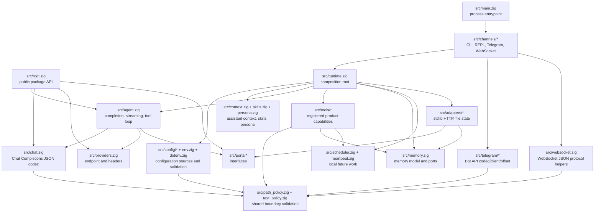
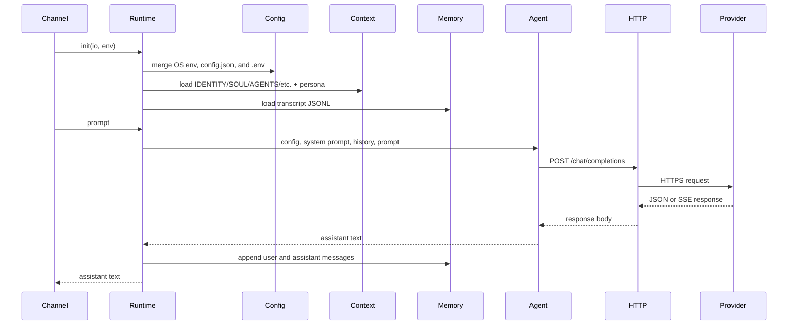
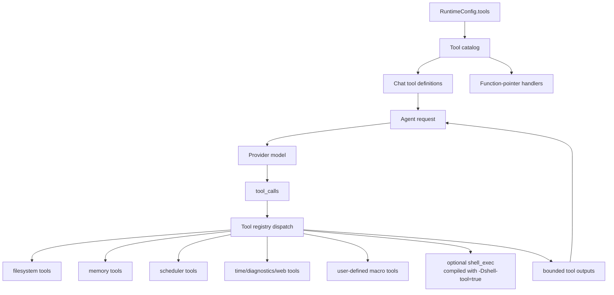
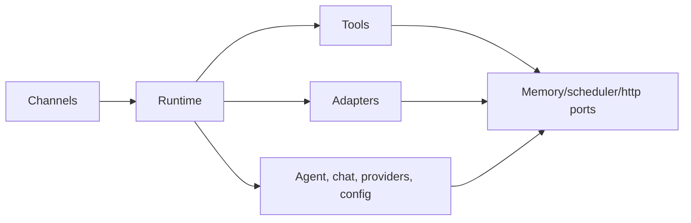

# Arsitektur

`nllclw` adalah asisten AI ringkas yang dibangun sebagai package Zig plus satu
executable. Tujuan desain utamanya adalah menjaga agent engine tetap dapat
ditest sambil tetap mengirim standalone binary kecil.

## Tujuan

- Menjaga provider wire contract sederhana: OpenAI-compatible Chat Completions.
- Menjaga runtime dependencies eksplisit: build default hanya memakai Zig
  stdlib.
- Menjaga capability lokal di balik capability gates dan mudah diaudit.
- Menjaga channel tetap tipis: CLI, REPL, Telegram, WebSocket, heartbeat, dan
  daemon semuanya memanggil runtime dan agent engine yang sama.
- Menjaga API package publik cukup kecil untuk dipelajari.

## Peta layer



## Alur request

Engine yang sama menangani argv prompts, stdin prompts, REPL turns, pesan
Telegram, WebSocket prompts, heartbeat tasks, dan due schedules.



## Alur Tool Loop

Tools adalah product capabilities, bukan infrastructure adapters. Tools berada
di `src/tools/` dan diekspos ke model hanya melalui `src/tools/catalog.zig`.



Agent mengulang loop ini hingga salah satu dari tiga hal terjadi:

- model mengembalikan assistant content tanpa tool calls;
- `NLLCLW_TOOL_MAX_ROUNDS` tercapai;
- terjadi provider error, malformed provider response, allocation failure, atau
  fatal dispatch error lain.

Non-fatal tool failures dikembalikan ke model sebagai pesan tool
`tool error: ...` agar model dapat pulih, memilih argument lain, atau
menjelaskan kegagalan. Allocation failures tetap membatalkan turn.

Streaming sengaja dinonaktifkan saat tools aktif. Assistant membutuhkan respons
model lengkap untuk mengetahui tool calls mana yang harus dijalankan.

`src/chat.zig` memvalidasi setiap request string sebagai UTF-8 text tanpa binary
control bytes sebelum JSON encoding. Ini menjaga field Chat Completions sebagai
JSON strings, bukan membiarkan arbitrary byte slices berubah menjadi arrays.
Untuk SSE, `[DONE]` bersifat terminal; chunk setelahnya diabaikan.

## Tanggung jawab modul

| Path | Tanggung jawab |
|---|---|
| `src/main.zig` | Entrypoint executable minimal dan process exit. |
| `src/root.zig` | API publik stabil: config, chat types, HTTP port, streaming sink, `complete`. |
| `src/runtime.zig` | Composition root untuk operasi seperti CLI: config, HTTP adapter, memory adapter, context, tools. |
| `src/agent.zig` | Assistant engine satu turn yang channel-neutral, streaming, dan tool loop. |
| `src/chat.zig` | Codec request/response JSON untuk Chat Completions, termasuk tools dan SSE chunks. |
| `src/providers.zig` | Provider presets dan validasi endpoint compatible-provider. |
| `src/config/*` | Typed runtime config, source collection, validation, dan owned copies. |
| `src/channels/*` | Orkestrasi user I/O untuk CLI, REPL, Telegram, WebSocket, dan daemon commands. |
| `src/tools/*` | Tool definitions, local capabilities, dan user-defined macro tools. |
| `src/skills.zig` | Indeks ringkas `skills/*.md` untuk on-demand local skill loading. |
| `src/persona.zig` | Runtime presentation modes yang ditambahkan ke system prompt. |
| `src/memory.zig` | Transcript/fact models, JSONL parsers, dan memory store ports. |
| `src/adapters/*` | Adapter stdlib konkret untuk ports. |
| `src/ports/*` | Interface function-pointer untuk boundary yang testable. |
| `src/telegram/*` | Telegram Bot API wire helpers. |
| `src/websocket.zig` | Helper pesan/event JSON WebSocket yang testable. |

## API package publik

Consumer mengimpor package module sebagai `nllclw`. Surface yang diekspor kecil:

```zig
const nllclw = @import("nllclw");

const cfg: nllclw.Config = .{
    .provider = .openrouter,
    .api_key = "...",
    .model = "openai/gpt-chat-latest",
};

const text = try nllclw.complete(allocator, http_client, cfg, "hello");
```

API publik mengekspos:

- `ProviderKind`
- `PersonaKind`
- `Config`
- chat request/tool types
- `HttpClient`, `HttpResponse`, `HttpHeader`, `HttpStatusCode`
- `Diagnostic`
- `ToolOptions`, `ToolHandler`, `ToolRunError`, `CompleteOptions`
- `StreamError`, `StreamSink`
- `complete` dan `completeWithOptions`

Detail runtime-only seperti loading `config.json`/`.env`, file memory, Telegram
polling, dan adapter HTTP stdlib tetap berada di luar public root. Public tool
handler hanyalah abstraksi function-pointer yang dibutuhkan oleh `ToolOptions`;
built-in product tools dan file-backed stores-nya tetap internal.

## Arah dependency

Arah dependency eksplisit:



Core code tidak mengetahui process env, `config.json`, `.env`, filesystem paths,
Telegram polling, atau `std.http.Client`. Detail tersebut disusun oleh
`runtime.zig` dan channel.

## Kepemilikan memory

Kode mengikuti gaya ownership eksplisit Zig:

- Function yang mengalokasikan mengembalikan owned slices dan mendokumentasikan
  ownership melalui pola `defer`/`deinit` di dekat call sites.
- Long-lived runtime state dimiliki oleh `Runtime` dan dilepas di
  `Runtime.deinit`.
- Parsed config dapat borrowed dari source buffers atau copied ke `config.Owned`
  untuk runtime storage.
- Tool outputs dimiliki oleh agent hingga dikirim kembali ke model, lalu
  dibebaskan setelah loop.

## Model runtime lintas platform

Default binary dimaksudkan berjalan di mana pun Zig dan Zig standard library
dapat mendukung target:

- tidak ada `curl`;
- tidak ada provider SDK;
- tidak ada package dependencies di `build.zig.zon`;
- tidak ada shell process dalam build default;
- `std.http.Client` untuk HTTPS;
- `std.Io` untuk files, stdin/stdout/stderr, dan timers.

Optional shell tool adalah build flavor terpisah:

```sh
zig build -Dshell-tool=true
```

Flavor tersebut bukan default karena dapat meluncurkan `sh` atau `cmd.exe` saat
diaktifkan pada runtime.
