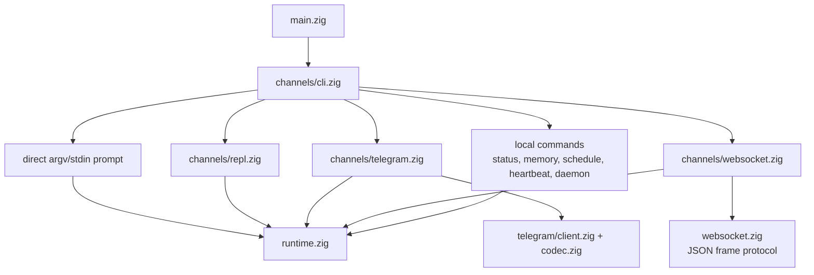
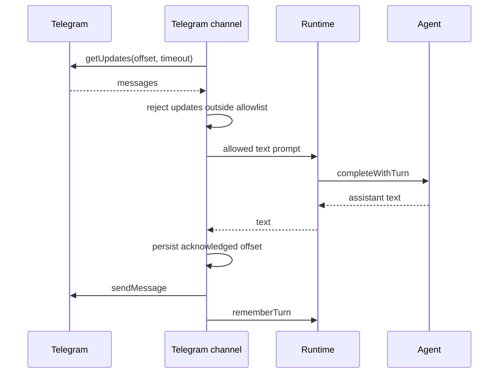
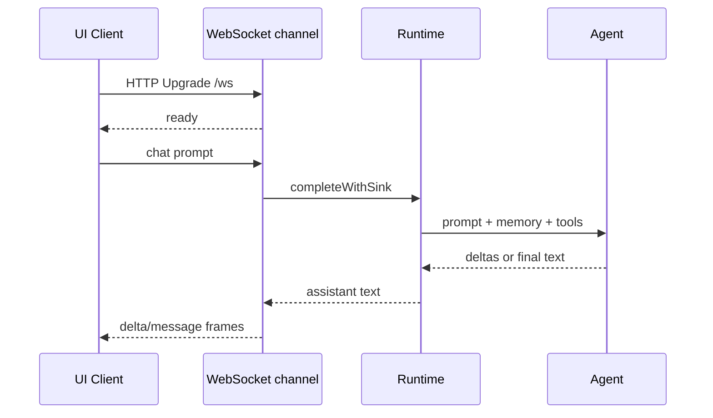

# Channels

Channels adalah cara yang menghadap pengguna untuk berbicara dengan runtime dan
agent engine yang sama. Channel mem-parse input, memiliki I/O khusus channel,
dan mendelegasikan completions ke `runtime.zig`.

## Peta channel



## Direct CLI

Prompt from argv:

```sh
nllclw "explain this repository in one paragraph"
```

Prompt from stdin:

```sh
printf 'summarize this text\n' | nllclw
```

`NLLCLW_STREAM=on` adalah default:

```sh
NLLCLW_STREAM=on
```

Tool loop juga aktif secara default, dan tool output bersifat non-streaming
karena agent harus memeriksa tool calls lengkap sebelum melakukan dispatch local
functions. Untuk pure streaming chat, set `NLLCLW_TOOLS=off`.

Direct slash commands ditangani lokal:

```sh
nllclw /settings
nllclw /diag memory
nllclw /persona technical
```

Command ini tidak memanggil model.

## Interactive REPL

Saat stdin adalah TTY dan tidak ada prompt diberikan, `nllclw` memulai terminal
chat loop kecil:

```sh
nllclw
```

Exit commands:

```text
:q
:quit
exit
```

Setiap turn memakai runtime memory dan tool configuration yang sama dengan mode
direct CLI.

## Telegram

Telegram mode memakai Bot API long polling:

```sh
NLLCLW_TELEGRAM_TOKEN=123456:bot-token
NLLCLW_TELEGRAM_CHAT_ID=123456789
nllclw telegram
```

`NLLCLW_TELEGRAM_CHAT_ID` juga dapat berupa username Telegram private-chat atau
public-chat, dengan atau tanpa `@`, misalnya `@donprus` atau `donprus`.

Security properties:

- `NLLCLW_TELEGRAM_CHAT_ID` wajib;
- pesan di luar chat id atau username allowlist yang dikonfigurasi diabaikan;
- local nonblocking lock menghentikan proses `nllclw telegram` kedua pada state
  directory yang sama sebelum mencapai Bot API polling;
- accepted message text harus valid UTF-8 tanpa binary control bytes; malformed
  text updates dilewati sementara polling offset tetap maju;
- last acknowledged update id disimpan di user state directory;
- restarts continue from the stored offset dan tidak replay handled messages.
- model-backed messages di-rate-limit oleh
  `NLLCLW_TELEGRAM_RATE_LIMIT_PER_MINUTE` (default `20`, `0` disables); local
  slash commands tidak di-rate-limit.

Jika mesin, deployment, atau binary lama lain sudah memakai `getUpdates` untuk
bot token yang sama, Telegram mengembalikan HTTP `409`. `nllclw` mencetak hint
spesifik untuk konflik tersebut.

Flow:



## WebSocket

WebSocket mode memulai server RFC6455 lokal untuk custom browser, desktop, atau
mobile UIs:

```sh
NLLCLW_WS_TOKEN=change-me nllclw websocket
```

Default bind settings:

```sh
NLLCLW_WS_HOST=127.0.0.1
NLLCLW_WS_PORT=8765
NLLCLW_WS_PATH=/ws
```

Alamat bind default hanya loopback, tetapi channel tetap memerlukan
`NLLCLW_WS_TOKEN` agar halaman browser acak tidak dapat berbicara dengan local
agent. Remote binds memerlukan keduanya:

```sh
env NLLCLW_WS_HOST=0.0.0.0 \
  NLLCLW_WS_ALLOW_REMOTE=on \
  NLLCLW_WS_TOKEN=change-me \
  nllclw websocket
```

Loopback browser clients dapat mengirim token sebagai query parameter:

```js
const socket = new WebSocket("ws://127.0.0.1:8765/ws?token=change-me");

socket.addEventListener("message", (event) => {
  const message = JSON.parse(event.data);
  console.log(message.type, message.content ?? message.message);
});

socket.addEventListener("open", () => {
  socket.send(JSON.stringify({
    type: "chat",
    prompt: "Explain this repository in one paragraph."
  }));
});
```

Query authentication menerima tepat satu parameter `token`. Duplicate token
parameters ditolak sebagai ambiguous.

Remote clients harus memakai tepat satu bearer token header. Browser-based
remote UIs sebaiknya terhubung melalui trusted local atau reverse proxy yang
menginjeksikan header ini.

```text
Authorization: Bearer change-me
```

Client messages:

```json
{ "type": "chat", "prompt": "hello" }
{ "type": "status" }
{ "type": "ping" }
{ "type": "close" }
```

Plain text frames diterima sebagai chat prompts untuk client sederhana. Text
frames harus valid UTF-8 tanpa binary control bytes.
JSON command frames adalah exact objects; unknown fields ditolak, dan hanya
frames `chat`/`message` yang boleh menyertakan `prompt`.
Server menangani satu active WebSocket client pada satu waktu. Client tambahan
dapat terhubung setelah client aktif disconnect.

Server messages:

```json
{ "type": "ready", "version": 1, "channel": "websocket" }
{ "type": "delta", "content": "partial text" }
{ "type": "message", "content": "final text" }
{ "type": "status", "content": "nllclw: ok ..." }
{ "type": "pong", "content": "pong" }
{ "type": "error", "message": "request failed" }
```

Frames `delta` hanya dikirim saat `NLLCLW_STREAM=on` dan `NLLCLW_TOOLS=off`.
Dengan tools aktif, model harus menyelesaikan tool-call planning sebelum channel
dapat mengirim final `message`.

Flow:



## Local Commands

Local commands tidak bertanya ke model kecuali command secara eksplisit
menjalankan task:

```sh
nllclw status
nllclw doctor
nllclw memory list
nllclw memory get project.goal
nllclw memory forget project.goal
nllclw memory reset
nllclw schedule list
nllclw schedule delete 1
```

`status` mencetak quick health line. `doctor` mencetak full diagnostics report.

## Shared Slash Commands

REPL, Telegram, dan direct CLI berbagi slash parser yang sama:

| Command | Effect |
|---|---|
| `/start`, `/help` | Menampilkan local command help. |
| `/settings` | Menampilkan quick runtime status. |
| `/diag [scope]` | Menampilkan diagnostics untuk `quick`, `runtime`, `memory`, `rates`, `time`, atau `all`. |
| `/persona [mode]` | Menampilkan atau mengatur runtime persona: `neutral`, `friendly`, `technical`, `witty`. |
| `/stop` | Menjeda Telegram intake untuk proses saat ini. Channel lain melaporkan bahwa ini Telegram-only. |
| `/resume` | Melanjutkan Telegram intake. Channel lain melaporkan bahwa ini Telegram-only. |
| `/chatid` | Mencetak Telegram chat id dan username fields jika tersedia. Channel lain melaporkan bahwa ini Telegram-only. |

Persona changes bersifat runtime-only untuk proses saat ini. Untuk memilih
startup persona, set `NLLCLW_PERSONA`.

## Heartbeat

`nllclw heartbeat` membaca `HEARTBEAT.md` dan mengubah pending items menjadi
satu prompt. Hanya conservative task syntax yang dianggap actionable:

- unchecked markdown task lines;
- lines starting with `TODO:`.

```sh
nllclw heartbeat
```

Jika tidak ada pending task ditemukan, command mencetak pesan pendek dan exits
successfully.

## Daemon

`nllclw daemon` berulang:

1. claims due scheduled tasks from the user state directory;
2. runs each claimed task through the normal runtime;
3. commits only completed schedule entries;
4. periodically runs heartbeat prompts.

```sh
NLLCLW_DAEMON_INTERVAL_SECONDS=60
NLLCLW_HEARTBEAT_INTERVAL_SECONDS=1800
nllclw daemon
```

Daemon bersifat lokal dan file-backed. Ia tidak berkoordinasi lintas beberapa
machines.

Claimed schedules memakai local lease. Jika provider execution, destination
preflight, atau delivery gagal, task tidak di-commit; task menjadi eligible lagi
setelah lease berakhir.

Saat schedule dibuat dari Telegram, `cron_set` secara default memakai
`channel=telegram` dan current chat id. Daemon mengirim completed scheduled
result kembali ke chat tersebut memakai `NLLCLW_TELEGRAM_TOKEN`. Local schedules
tetap menulis ke stdout.
