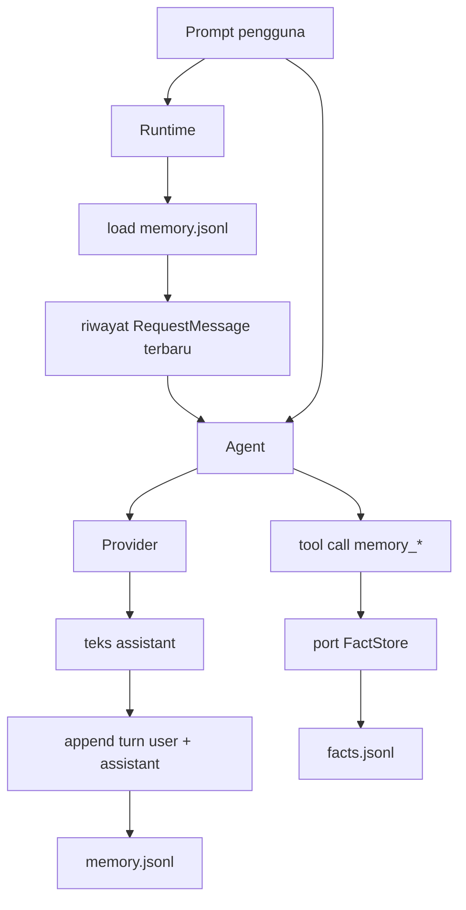
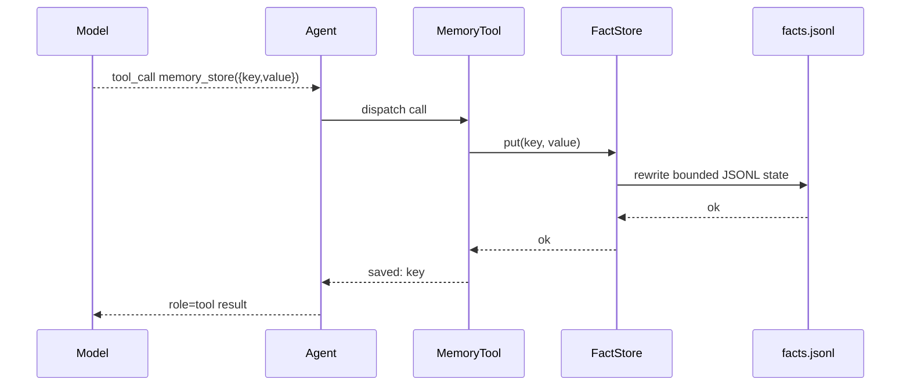

# Memory

`nllclw` memiliki dua sistem memory:

1. transcript memory, yang menyimpan turn user/assistant terbaru;
2. durable fact memory, yang menyimpan fact ber-key melalui tools eksplisit.

Keduanya secara default adalah file JSONL di direktori state pengguna, bukan di
sebelah binary atau di project saat ini.

## Ringkasan



## Transcript Memory

Transcript memory aktif secara default:

```sh
NLLCLW_MEMORY=on
# Default: user state dir/memory.jsonl
NLLCLW_MEMORY_MAX_MESSAGES=20
```

`NLLCLW_MEMORY_MAX_MESSAGES` harus minimal 2 karena transcript appends disimpan
sebagai pasangan user/assistant.

Setiap baris adalah satu object JSON:

```json
{"role":"user","content":"remember that this project uses Zig 0.16"}
{"role":"assistant","content":"Got it."}
```

Saat memulai satu turn:

1. `runtime.zig` membuka transcript store yang dikonfigurasi.
2. `memory.zig` mem-parse baris JSONL.
3. Role invalid, JSON invalid, UTF-8 invalid, atau binary control bytes
   menghasilkan memory error.
4. Hanya entry terbaru sebanyak `NLLCLW_MEMORY_MAX_MESSAGES` yang dipertahankan.
5. Entry dikonversi menjadi request messages Chat Completions.

Setelah respons assistant berhasil, `Runtime.appendMemory` menambahkan prompt
pengguna dan teks assistant. Jika append gagal, jawaban assistant yang sudah
dihasilkan tetap dicetak dan channel melaporkan warning.

Snapshot transcript dibatasi 256 KiB, limit yang sama dengan saat memuat file
JSONL. Turn yang terlalu besar ditolak sebelum atomic replace, sehingga write
yang berhasil tidak dapat membuat transcript yang tidak bisa dibaca pada startup
berikutnya.

## Durable Fact Memory

Fact memory ditujukan untuk fact key/value stabil. Ini tersedia melalui tool
loop lokal default ketika:

```sh
NLLCLW_MEMORY=on
NLLCLW_TOOLS=on
```

Defaults:

```sh
# Default path: user state dir/facts.jsonl
NLLCLW_MEMORY_MAX_FACTS=64
```

`NLLCLW_MEMORY_MAX_FACTS` harus berada dari 1 hingga 1024.

Setiap baris adalah satu object JSON:

```json
{"key":"project.language","value":"Zig 0.16"}
{"key":"user.prefers","value":"direct, pragmatic answers"}
```

Fact keys:

- harus tidak kosong;
- dibatasi 64 bytes;
- dapat berisi huruf, digit, `_`, `-`, dan `.`;
- dideduplicate berdasarkan key, dengan value terbaru menang.

Fact values:

- harus tidak kosong;
- harus mengandung teks non-whitespace;
- harus valid UTF-8;
- tidak boleh berisi ASCII control bytes;
- dibatasi 2048 bytes;
- harus muat dalam `NLLCLW_TOOL_OUTPUT_MAX_BYTES` saat dikembalikan oleh
  `memory_recall`.

Snapshot fact JSONL memakai limit read/write 256 KiB yang sama dengan transcript
memory. Jika banyak fact yang dipertahankan akan melampaui limit file tersebut,
write gagal, bukan membuat facts file yang tidak dapat dibaca.

## Tools memory

| Tool | Tujuan |
|---|---|
| `memory_store` | Menyimpan atau memperbarui fact berdasarkan key. |
| `memory_recall` | Membaca fact berdasarkan key. |
| `memory_list` | Mencantumkan fact keys yang diketahui. |
| `memory_forget` | Menghapus fact berdasarkan key. |

Tool flow:



## Command CLI memory

Command ini bekerja pada durable facts:

```sh
nllclw memory list
nllclw memory get project.language
nllclw memory forget project.language
nllclw memory reset
```

`memory reset` membersihkan transcript memory dan fact memory.

## Catatan privasi dan keamanan

- File memory secara default berada di direktori state pengguna.
- File `.nllclw-*` ditolak oleh filesystem tools, sehingga model tidak dapat
  membaca atau mengedit file memory-nya sendiri melalui `read_file`,
  `write_file`, atau `edit_file`.
- Memory tidak dienkripsi. Jangan simpan secret di dalamnya.
- Fact memory sebaiknya digunakan untuk preferensi pengguna/proyek yang durable,
  bukan untuk raw conversation logs.
