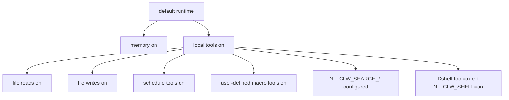

# Model keamanan

`nllclw` adalah asisten AI lokal, bukan sandbox. Model keamanannya didasarkan
pada default kecil yang local-only, external capability gates yang eksplisit,
output lokal yang dibatasi, dan validasi provider/config yang hati-hati.

## Postur default

Default build:

- tidak ada package dependencies;
- tidak ada program runtime eksternal;
- tidak ada `curl`;
- tidak ada shell execution;
- local tools aktif;
- filesystem tools aktif dengan perlindungan relative-path dan secret-path;
- scheduler tools aktif untuk schedule JSONL lokal;
- user-defined macro tools aktif dan disimpan dalam JSONL lokal;
- web search nonaktif kecuali search provider dikonfigurasi;
- Telegram nonaktif kecuali diluncurkan eksplisit dan dikonfigurasi dengan
  allowlist.
- WebSocket nonaktif kecuali diluncurkan eksplisit; bind default hanya loopback.

Memory aktif secara default karena hanya menulis file JSONL lokal di direktori
kerja saat ini. Anda dapat menonaktifkannya dengan:

```sh
NLLCLW_MEMORY=off
```

Nonaktifkan semua tools dengan:

```sh
NLLCLW_TOOLS=off
```

## Capability Gates



Model menerima definisi local tool secara default. External web search dan shell
execution tetap memerlukan konfigurasi eksplisit.

## Penanganan key provider

- API keys berasal dari OS env, `config.json`, atau `.env`.
- OS env menimpa file config, dan `config.json` menimpa `.env`.
- Completion provider keys hanya dikirim sebagai `Authorization: Bearer ...`.
- Search provider keys dikirim dengan auth header terdokumentasi milik tiap
  provider: bearer auth untuk Tavily dan Firecrawl, `X-Subscription-Token` untuk
  Brave Search, dan `x-api-key` untuk Exa.
- Header values menolak ASCII control bytes.
- Provider model names menolak UTF-8 invalid dan control bytes sebelum request
  JSON dibuat.
- Chat request content strings, assistant response text, dan tool-call argument
  strings menolak UTF-8 invalid dan binary control bytes; newlines, carriage
  returns, dan tabs normal tetap valid text di sana. Request metadata seperti
  model names, roles, tool-call ids, function names, dan parameter names juga
  single-line.
- Provider response roles, jika ada, harus `assistant`.
- Provider and Telegram diagnostic messages yang kosong, terlalu besar, atau
  mengandung control bytes tidak dicetak sebagai trusted single-line errors.
- Raw diagnostic response bodies hanya dicetak jika valid text dan dibatasi
  dalam terminal output.
- Default state files berada di user state directory. Configured state paths
  untuk memory, macro tools, dan schedules harus berupa relative `.jsonl` paths
  dengan UTF-8 valid, tanpa control bytes, separator `/`, tanpa Windows-reserved
  filename characters atau device names, dan tanpa path components kosong, `.`,
  `..`, trailing-space, atau trailing-dot.
- Local state files dan lock files-nya dibuka tanpa mengikuti terminal symlinks.
  Writes menggunakan atomic replace dan private file permissions jika host
  platform menyediakannya.
- Durable fact memory values menolak ASCII control bytes sebelum disimpan atau
  dicetak oleh jalur CLI/tool recall.
- User-defined macro tool descriptions and actions menolak ASCII control bytes
  sebelum disimpan atau dikirim kembali sebagai model-facing tool schema/output.
- Scheduled actions menolak ASCII control bytes sebelum disimpan atau dicetak
  oleh schedule listing.
- Model-facing tool outputs menolak UTF-8 invalid dan binary control bytes.
- Path `.env`, `config.json`, dan `.nllclw-*` ditolak oleh filesystem tools.
- user-defined macro tools disimpan di user state directory secara default.
- Jangan tempel key nyata ke prompts atau context files.

## Keamanan compatible provider

Compatible providers harus menggunakan HTTPS secara default:

```json
{
  "provider": "compatible",
  "base_url": "https://example.com/v1",
  "api_key": "...",
  "model": "..."
}
```

HTTP hanya diizinkan untuk exact loopback hosts dan hanya saat diaktifkan
eksplisit:

```json
{
  "provider": "compatible",
  "base_url": "http://127.0.0.1:11434/v1",
  "allow_http_base_url": true,
  "api_key": "ollama",
  "model": "llama3.2"
}
```

Remote HTTP URLs ditolak.

## Batas filesystem tool

Filesystem tools bukan sandbox penuh, tetapi menerapkan batas lokal yang
konservatif:

- hanya relative paths;
- path UTF-8 valid, control-free, dan tidak lebih dari 512 bytes;
- tidak ada `..`;
- tidak ada absolute POSIX paths;
- tidak ada absolute atau drive-qualified Windows paths;
- tidak ada path components kosong, `.`, atau `..`, kecuali `list_dir` menerima
  literal `.` untuk direktori saat ini;
- tidak ada symlink traversal untuk path components yang dibuka;
- tidak ada Windows-reserved filename characters, device names, trailing spaces,
  atau trailing dots;
- tidak ada `.env`, `config.json`, `.nllclw-*`, `.git`, `.ssh`, `.gnupg`, `.aws`, `.npmrc`;
- tidak ada common private-key filenames atau suffixes;
- hanya UTF-8 text, tanpa binary control bytes;
- output-size caps;
- atomic writes.

Jalankan dengan file tools hanya di direktori tempat permission ini masuk akal.

## Batas Telegram

Telegram mode bersifat default-deny:

- `NLLCLW_TELEGRAM_TOKEN` wajib;
- Telegram tokens divalidasi sebagai `<bot-id>:<secret>` sebelum ditempatkan di
  Bot API URLs;
- `NLLCLW_TELEGRAM_CHAT_ID` wajib;
- pesan di luar chat id yang dikonfigurasi atau username allowlist diabaikan;
- local nonblocking lock menolak proses `nllclw telegram` kedua yang memakai
  state directory yang sama;
- update terakhir yang diproses disimpan lokal untuk menghindari replay setelah
  restart.
- model-backed messages di-rate-limit oleh
  `NLLCLW_TELEGRAM_RATE_LIMIT_PER_MINUTE`.

## Batas WebSocket

WebSocket mode secara default ditujukan untuk custom UI lokal:

- mulai hanya saat `nllclw websocket` diluncurkan;
- bind default adalah `127.0.0.1:8765`;
- `NLLCLW_WS_TOKEN` wajib bahkan untuk loopback binds;
- `NLLCLW_WS_PATH` harus single-line valid UTF-8 tanpa query atau fragment
  syntax;
- non-loopback bind addresses memerlukan `NLLCLW_WS_ALLOW_REMOTE=on`;
- loopback browser clients dapat mengirim token sebagai `?token=...`;
- loopback query authentication menerima tepat satu parameter `token`;
- remote clients harus memakai tepat satu header `Authorization: Bearer ...`;
- model-backed chat messages di-rate-limit oleh
  `NLLCLW_WS_RATE_LIMIT_PER_MINUTE`.
- server bawaan menangani satu active client pada satu waktu.

Jangan expose port WebSocket ke jaringan tidak tepercaya tanpa reverse proxy dan
transport security. Channel bawaan adalah plain `ws://`, bukan TLS termination.

## Batas shell tool

Default binary tidak menyertakan `shell_exec`.

Agar shell execution mungkin, kedua kondisi harus benar:

```sh
zig build -Dshell-tool=true
NLLCLW_SHELL=on
```

Shell tool harus diperlakukan setara dengan memberi model local command
execution. Gunakan hanya di trusted environments.

## Checklist praktis

Sebelum memakai capability lokal default:

1. Jalankan dalam project directory khusus.
2. Jauhkan secrets dari prompts dan context files.
3. Set `NLLCLW_FILE_WRITE=off` jika file mutation tidak diinginkan.
4. Gunakan default no-shell binary kecuali command execution diperlukan.
5. Gunakan `NLLCLW_TOOL_OUTPUT_MAX_BYTES` untuk menjaga tool output tetap
   bounded.
6. Gunakan `nllclw status` untuk quick health line atau `nllclw doctor` untuk
   diagnostics lengkap.
