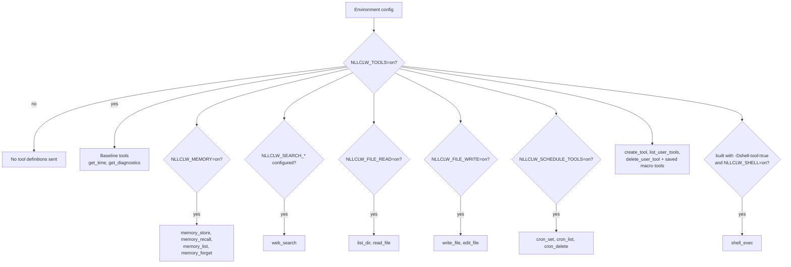
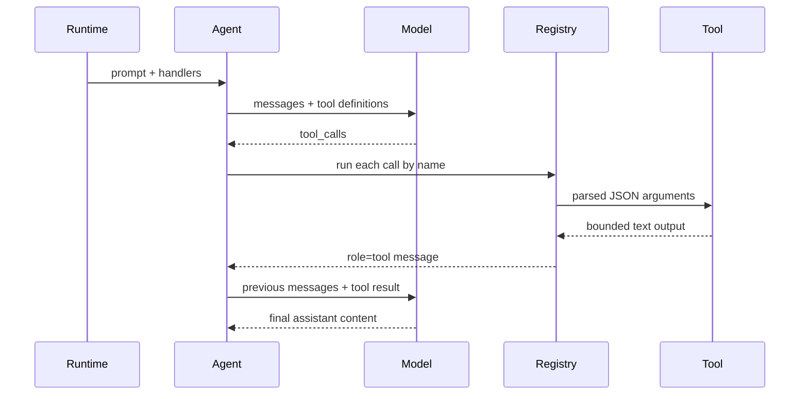

# Tools

Tools memungkinkan model meminta `nllclw` melakukan aksi lokal. Local tools yang
tidak memerlukan external services aktif secara default. External web search dan
optional shell execution tetap memerlukan setup eksplisit.

## Capability Model



Default binary tidak berisi `shell_exec`. Build secara eksplisit:

```sh
zig build -Dshell-tool=true
```

Lalu aktifkan saat runtime:

```sh
NLLCLW_TOOLS=on
NLLCLW_SHELL=on
```

Untuk menonaktifkan semua tools:

```sh
NLLCLW_TOOLS=off
```

## Tool Loop



`NLLCLW_TOOL_MAX_ROUNDS` membatasi berapa banyak assistant/tool exchange rounds
yang dapat terjadi sebelum agent mengembalikan `ToolRoundLimit`.

Argument built-in tool adalah JSON object yang exact. JSON invalid, required
fields yang hilang, unknown fields, invalid field types, dan validation failures
mengembalikan tool error untuk ditangani model.

## Tools yang tersedia

| Tool | Gate | Efek |
|---|---|---|
| `get_time` | `NLLCLW_TOOLS=on` default | Mengembalikan local time memakai `NLLCLW_TIMEZONE_OFFSET_MINUTES`. |
| `get_diagnostics` | `NLLCLW_TOOLS=on` default | Melaporkan runtime capability/config status. |
| `web_search` | `NLLCLW_TOOLS=on` dan provider `NLLCLW_SEARCH_*` terkonfigurasi | Memanggil search provider terpilih melalui HTTP port. |
| `memory_store` | `NLLCLW_TOOLS=on`, `NLLCLW_MEMORY=on` defaults | Menyimpan durable fact. |
| `memory_recall` | `NLLCLW_TOOLS=on`, `NLLCLW_MEMORY=on` defaults | Membaca durable fact. |
| `memory_list` | `NLLCLW_TOOLS=on`, `NLLCLW_MEMORY=on` defaults | Mencantumkan durable fact keys. |
| `memory_forget` | `NLLCLW_TOOLS=on`, `NLLCLW_MEMORY=on` defaults | Menghapus durable fact. |
| `list_dir` | `NLLCLW_FILE_READ=on` default | Mencantumkan direktori relatif CWD. |
| `read_file` | `NLLCLW_FILE_READ=on` default | Membaca file UTF-8 relatif CWD. |
| `write_file` | `NLLCLW_FILE_WRITE=on` default | Menulis file UTF-8 relatif CWD secara atomic. |
| `edit_file` | `NLLCLW_FILE_WRITE=on` default | Mengganti exact text match pertama dalam file. |
| `cron_set` | `NLLCLW_SCHEDULE_TOOLS=on` default | Menambahkan scheduled task lokal. |
| `cron_list` | `NLLCLW_SCHEDULE_TOOLS=on` default | Mencantumkan scheduled tasks. |
| `cron_delete` | `NLLCLW_SCHEDULE_TOOLS=on` default | Menghapus scheduled task. |
| `create_tool` | `NLLCLW_TOOLS=on` default | Membuat persistent user-defined macro tool. |
| `list_user_tools` | `NLLCLW_TOOLS=on` default | Mencantumkan saved macro tools. |
| `delete_user_tool` | `NLLCLW_TOOLS=on` default | Menghapus saved macro tool. |
| saved macro tools | `NLLCLW_TOOLS=on` default | Mengembalikan saved action text agar model dapat mengeksekusinya melalui built-in tools. |
| `shell_exec` | optional shell build plus `NLLCLW_SHELL=on` | Menjalankan shell command dengan timeout, combined output cap, dan output teks UTF-8 tanpa binary control bytes. |

## User-Defined Tools

User-defined tools adalah macro tools, bukan generated code. `create_tool`
menyimpan name, description, dan natural-language action di
`NLLCLW_USER_TOOLS_PATH` (default `user-tools.jsonl` di user state directory).
Pada turn berikutnya, saved tools diiklankan sebagai tool definitions biasa.
Saat model memanggil salah satunya, `nllclw` mengembalikan saved action text dan
model melanjutkan tool loop yang sama memakai built-in tools.

Example:

```text
create_tool(name="daily_brief", description="Prepare a daily brief", action="Search for current project news, summarize it, and store the summary in memory.")
```

Tool names hanya boleh berisi huruf, digit, dan underscores. Nama yang
bertabrakan dengan built-in tools ditolak. Descriptions dan actions di-trim,
bounded, valid UTF-8 text tanpa ASCII control bytes. File user-tool JSONL
dibatasi 128 KiB pada read dan write, dibuka tanpa mengikuti terminal symlinks,
dan saved action harus muat dalam `NLLCLW_TOOL_OUTPUT_MAX_BYTES` saat dibungkus
sebagai tool result.

## Provider Web Search

`web_search` adalah satu tool dengan provider yang dipilih oleh
`NLLCLW_SEARCH_PROVIDER`. Mode default `auto` memilih key terkonfigurasi pertama
dalam urutan ini: Tavily, Brave Search, Exa, Firecrawl, lalu DuckDuckGo hanya
saat diaktifkan eksplisit.
Explicit key-based providers memerlukan `NLLCLW_SEARCH_*_KEY` yang sesuai.
Search keys tidak boleh mengandung ASCII control bytes.
Queries di-trim, valid UTF-8, control-free, dan paling banyak 512 bytes.
Provider result text diformat sebagai valid UTF-8 tanpa binary control bytes;
tabs dan newlines biasa di dalam result fields dinormalisasi menjadi spaces.
Empty provider result objects dilewati, dan valid empty provider response
mengembalikan `no results`, bukan synthetic placeholder row. DuckDuckGo nested
related-topic groups di-flatten hingga bounded depth kecil.

| Provider | Env | Notes |
|---|---|---|
| `tavily` | `NLLCLW_SEARCH_TAVILY_KEY=...` | POSTs to Tavily Search. |
| `brave` | `NLLCLW_SEARCH_BRAVE_KEY=...` | GETs Brave Web Search with `X-Subscription-Token`. |
| `exa` | `NLLCLW_SEARCH_EXA_KEY=...` | POSTs Exa Search with `x-api-key`. |
| `firecrawl` | `NLLCLW_SEARCH_FIRECRAWL_KEY=...` | POSTs Firecrawl Search with bearer auth. |
| `duckduckgo` | `NLLCLW_SEARCH_DUCKDUCKGO=on` or `NLLCLW_SEARCH_PROVIDER=duckduckgo` | No-key Instant Answer fallback, not a full web SERP API. |

Examples:

```sh
NLLCLW_TOOLS=on
NLLCLW_SEARCH_PROVIDER=auto
NLLCLW_SEARCH_BRAVE_KEY=...
```

```sh
NLLCLW_TOOLS=on
NLLCLW_SEARCH_PROVIDER=duckduckgo
```

## Pengiriman terjadwal

`cron_set` menerima `channel` dan `chat_id` untuk delivery. Dalam turn Telegram,
chat saat ini menjadi default destination, sehingga prompt seperti "remind me
here tomorrow" dapat membuat Telegram schedule tanpa mengekspos chat id ke
model-facing user text.

Scheduled actions di-trim, harus valid UTF-8 tanpa ASCII control bytes, dan
dibatasi 2048 bytes. File schedule JSONL dibatasi 128 KiB pada read dan write;
oversized snapshots ditolak sebelum atomic replacement.
`cron_set` hanya menerima timing fields yang sesuai dengan `type`-nya:
`interval_*` untuk periodic schedules, `delay_*` untuk one-shot schedules, dan
`hour`/`minute` untuk daily schedules.
Daemon meng-commit schedule hanya setelah scheduled prompt selesai dan delivery
terkonfigurasi berhasil; delivery failed atau blocked mencoba lagi setelah
local lease berakhir.

Destination yang didukung:

| Channel | Perilaku |
|---|---|
| `local` | Daemon menulis hasil ke stdout. |
| `telegram` | Daemon mengirim hasil ke Telegram chat id tersimpan memakai `NLLCLW_TELEGRAM_TOKEN`. |

## Model keamanan filesystem

Filesystem tools bersifat konservatif:

- paths harus relatif ke current working directory;
- paths harus valid UTF-8, control-free, dan paling banyak 512 bytes;
- absolute POSIX paths ditolak;
- absolute atau drive-qualified Windows paths ditolak;
- components kosong, `.`, dan `..` ditolak, kecuali `list_dir` menerima literal
  `.` untuk direktori saat ini;
- denied components mencakup `.env`, `.env.*`, `config.json`, `.nllclw-*`,
  `.git`, `.ssh`, `.gnupg`, `.aws`, `.npmrc`, `id_rsa`, `id_ed25519`;
- denied Windows device names mencakup `CON`, `PRN`, `AUX`, `NUL`, `CONIN$`,
  `CONOUT$`, `COM1` through `COM9`, dan `LPT1` through `LPT9`, termasuk dengan
  extensions;
- Windows-reserved filename punctuation (`<`, `>`, `:`, `"`, `|`, `?`, `*`)
  ditolak untuk portable behavior;
- path components yang berakhir dengan space atau dot ditolak untuk portable
  behavior;
- denied suffixes mencakup `.pem`, `.key`, `.p12`, `.pfx`;
- intermediate directories dibuka tanpa mengikuti symlinks;
- terminal files dibuka tanpa mengikuti symlinks;
- reads dan writes memerlukan valid UTF-8 text tanpa binary control bytes;
- `list_dir` mengeluarkan nama dalam sorted order dan melewati entry names yang
  denied, non-UTF-8, atau mengandung control-character;
- writes menggunakan atomic replacement dan private file permissions jika
  didukung;
- output dibatasi oleh `NLLCLW_TOOL_OUTPUT_MAX_BYTES`.

Ini adalah safety boundary lokal, bukan sandbox. Jalankan `nllclw` hanya di
direktori tempat Anda nyaman memberikan capabilities yang aktif.

## Menambahkan tool

Bentuk yang disarankan:

1. Tambahkan modul terfokus di `src/tools/<name>.zig`.
2. Definisikan `chat.ToolDefinition`.
3. Implementasikan client struct kecil yang hanya memiliki dependency yang
   dibutuhkan.
4. Parse JSON arguments dengan `std.json.parseFromSlice`.
5. Kembalikan owned text output yang dibatasi oleh `NLLCLW_TOOL_OUTPUT_MAX_BYTES`.
6. Daftarkan handler di `src/tools/catalog.zig` di balik config gate eksplisit
   jika ia membaca atau mengubah local state.
7. Tambahkan test untuk success, invalid JSON/arguments, bounds, dan denied
   access.

Jangan letakkan infrastructure adapters di `src/tools/`. Jika tool memerlukan
persistence atau HTTP, definisikan atau gunakan ulang port dan inject melalui
catalog.
