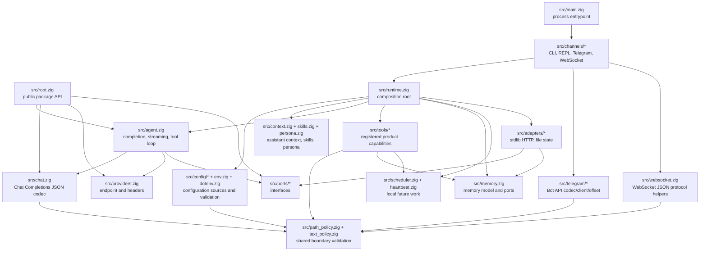
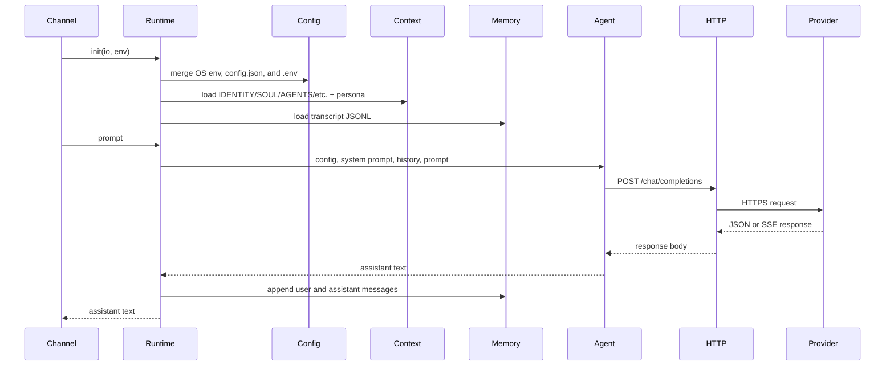
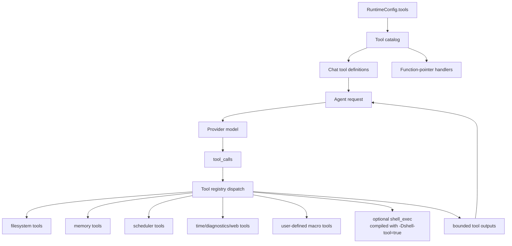
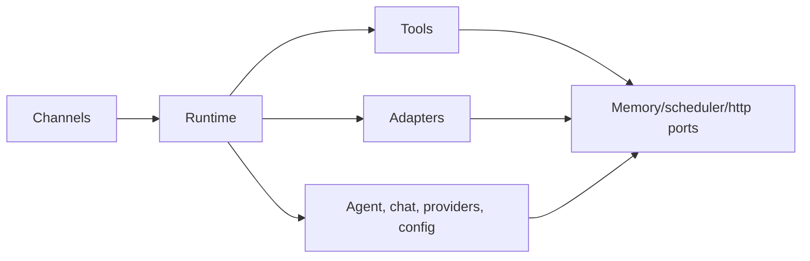

# Architecture

`nllclw` は Zig package と 1 つの executable として作られた compact AI
assistant です。主な design goal は、agent engine を testable に保ちながら、
小さな standalone binary を ship することです。

## Goals

- Provider wire contract を simple に保ちます: OpenAI-compatible Chat Completions。
- Runtime dependencies を explicit に保ちます: default build は Zig stdlib だけを使います。
- Local capabilities を capability-gated にし、audit しやすく保ちます。
- Channels を thin に保ちます: CLI、REPL、Telegram、WebSocket、heartbeat、daemon はすべて同じ runtime と agent engine を call します。
- Public package API を学習に使えるほど小さく保ちます。

## Layer Map



## Request Flow

同じ engine が argv prompts、stdin prompts、REPL turns、Telegram messages、
WebSocket prompts、heartbeat tasks、due schedules を handle します。



## Tool Loop Flow

Tools は product capabilities であり、infrastructure adapters ではありません。
`src/tools/` にあり、model には `src/tools/catalog.zig` だけを通じて exposed されます。



Agent は次のいずれかが起きるまでこの loop を repeat します:

- model が tool calls なしの assistant content を返す;
- `NLLCLW_TOOL_MAX_ROUNDS` に到達する;
- provider error、malformed provider response、allocation failure、その他の fatal dispatch error が起きる。

Non-fatal tool failures は `tool error: ...` tool messages として model に返され、
model は recover、別の arguments の選択、または failure の説明ができます。
Allocation failures は引き続き turn を abort します。

Tools が enabled の場合、streaming は意図的に disabled です。Assistant は、どの
tool calls を実行するか知るために complete model response を必要とします。

`src/chat.zig` は JSON encoding の前に、すべての request string を binary
control bytes のない UTF-8 text として validate します。これにより Chat
Completions fields は JSON strings のままで、arbitrary byte slices が arrays に
degrade しません。SSE では `[DONE]` が terminal で、それ以降の chunks は ignored です。

## Module Responsibilities

| Path | Responsibility |
|---|---|
| `src/main.zig` | Minimal executable entrypoint と process exit。 |
| `src/root.zig` | Stable public API: config、chat types、HTTP port、streaming sink、`complete`。 |
| `src/runtime.zig` | CLI-like operation の composition root: config、HTTP adapter、memory adapter、context、tools。 |
| `src/agent.zig` | Channel-neutral one-turn assistant engine、streaming、tool loop。 |
| `src/chat.zig` | Chat Completions の JSON request/response codec。tools と SSE chunks を含む。 |
| `src/providers.zig` | Provider presets と compatible-provider endpoint validation。 |
| `src/config/*` | Typed runtime config、source collection、validation、owned copies。 |
| `src/channels/*` | CLI、REPL、Telegram、WebSocket、daemon commands の user I/O orchestration。 |
| `src/tools/*` | Tool definitions、local capabilities、user-defined macro tools。 |
| `src/skills.zig` | On-demand local skill loading のための compact `skills/*.md` index。 |
| `src/persona.zig` | System prompt に appended される runtime presentation modes。 |
| `src/memory.zig` | Transcript/fact models、JSONL parsers、memory store ports。 |
| `src/adapters/*` | Ports の concrete stdlib adapters。 |
| `src/ports/*` | Testable boundaries の function-pointer interfaces。 |
| `src/telegram/*` | Telegram Bot API wire helpers。 |
| `src/websocket.zig` | Testable WebSocket JSON message/event helpers。 |

## Public Package API

Consumers は package module を `nllclw` として import します。Exported surface は小さいです:

```zig
const nllclw = @import("nllclw");

const cfg: nllclw.Config = .{
    .provider = .openrouter,
    .api_key = "...",
    .model = "openai/gpt-chat-latest",
};

const text = try nllclw.complete(allocator, http_client, cfg, "hello");
```

Public API は次を expose します:

- `ProviderKind`
- `PersonaKind`
- `Config`
- chat request/tool types
- `HttpClient`, `HttpResponse`, `HttpHeader`, `HttpStatusCode`
- `Diagnostic`
- `ToolOptions`, `ToolHandler`, `ToolRunError`, `CompleteOptions`
- `StreamError`, `StreamSink`
- `complete` と `completeWithOptions`

`config.json`/`.env` loading、file memory、Telegram polling、stdlib HTTP adapter
などの runtime-only details は public root の外にあります。Public tool handler
は `ToolOptions` に必要な function-pointer abstraction だけです。Built-in
product tools とそれらの file-backed stores は internal のままです。

## Dependency Direction

Dependency direction は explicit です:



Core code は process env、`config.json`、`.env`、filesystem paths、Telegram
polling、`std.http.Client` を知りません。これらの details は `runtime.zig` と
channels によって assembled されます。

## Memory Ownership

Code は Zig の explicit ownership style に従います:

- Allocate する functions は owned slices を return し、call sites 近くの
  `defer`/`deinit` patterns で ownership を document します。
- Long-lived runtime state は `Runtime` が own し、`Runtime.deinit` で release します。
- Parsed config は source buffers から borrowed されるか、runtime storage のために
  `config.Owned` に copied されます。
- Tool outputs は model に返されるまで agent が own し、その後 loop の後で freed されます。

## Cross-Platform Runtime Model

Default binary は Zig と Zig standard library が target を support できる場所で
run することを意図しています:

- no `curl`;
- no provider SDK;
- no package dependencies in `build.zig.zon`;
- no shell process in the default build;
- `std.http.Client` for HTTPS;
- `std.Io` for files, stdin/stdout/stderr, and timers.

Optional shell tool は separate build flavor です:

```sh
zig build -Dshell-tool=true
```

この flavor は default ではありません。Runtime で enabled されると `sh` または
`cmd.exe` を launch できるためです。
