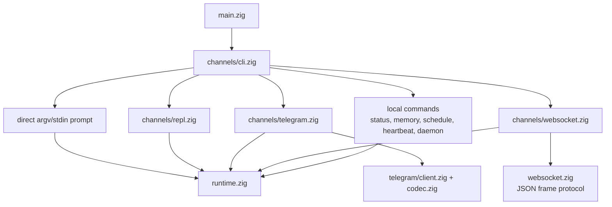
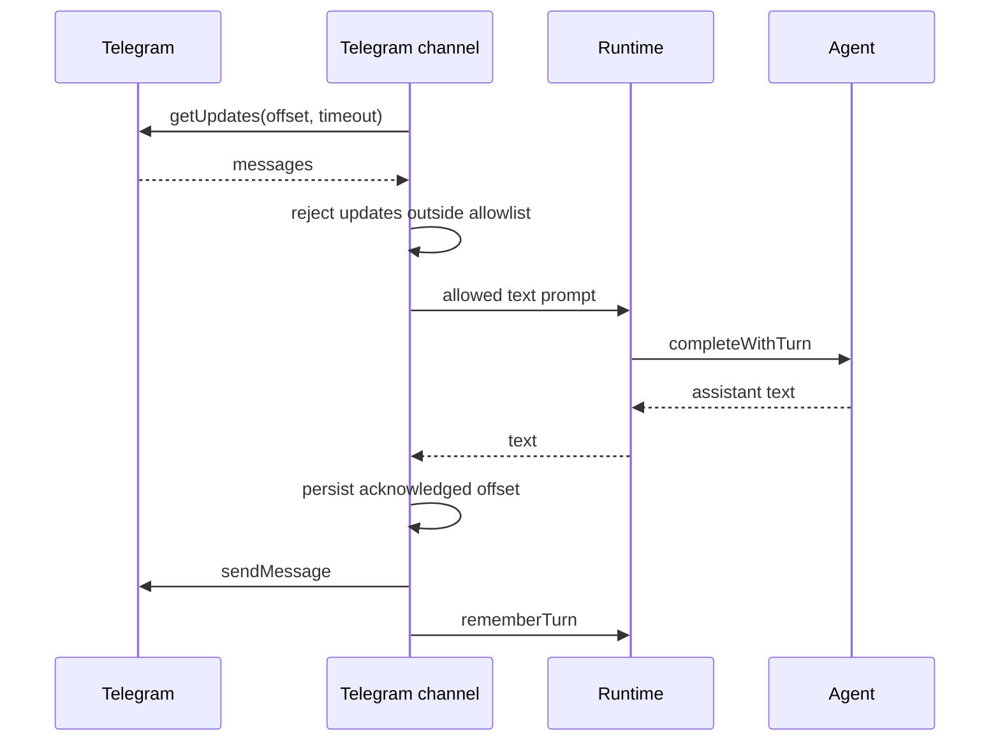
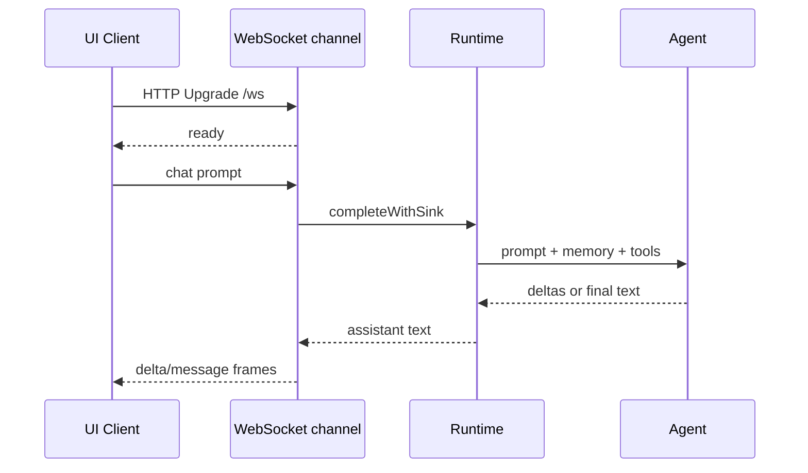

# Channels

Channels は、同じ runtime と agent engine とやり取りする user-facing な方法です。
Input を parse し、channel-specific I/O を own し、completions を `runtime.zig` に delegate します。

## Channel Map



## Direct CLI

argv から prompt:

```sh
nllclw "explain this repository in one paragraph"
```

stdin から prompt:

```sh
printf 'summarize this text\n' | nllclw
```

`NLLCLW_STREAM=on` が default です:

```sh
NLLCLW_STREAM=on
```

Tool loop も default で on です。Tool output は non-streaming です。Agent が
local functions を dispatch する前に complete tool calls を inspect する必要があるためです。
Pure streaming chat には `NLLCLW_TOOLS=off` を set します。

Direct slash commands は locally handled されます:

```sh
nllclw /settings
nllclw /diag memory
nllclw /persona technical
```

これらの commands は model を call しません。

## Interactive REPL

stdin が TTY で prompt がない場合、`nllclw` は小さな terminal chat loop を start します:

```sh
nllclw
```

Exit commands:

```text
:q
:quit
exit
```

各 turn は direct CLI mode と同じ runtime memory と tool configuration を使います。

## Telegram

Telegram mode は Bot API long polling を使います:

```sh
NLLCLW_TELEGRAM_TOKEN=123456:bot-token
NLLCLW_TELEGRAM_CHAT_ID=123456789
nllclw telegram
```

`NLLCLW_TELEGRAM_CHAT_ID` は private-chat または public-chat Telegram username
でもよく、`@` 付きでもなしでも構いません。例: `@donprus` または `donprus`。

Security properties:

- `NLLCLW_TELEGRAM_CHAT_ID` is required;
- configured chat id または username allowlist の外の messages は ignored されます;
- local nonblocking lock は、same state directory 上の 2 つ目の `nllclw telegram`
  process が Bot API polling に到達する前に止めます;
- accepted message text は binary control bytes のない valid UTF-8 である必要があります;
  malformed text updates は skipped されますが、polling offset は進みます;
- last acknowledged update id は user state directory に stored されます;
- restarts は stored offset から continue し、handled messages を replay しません。
- model-backed messages は `NLLCLW_TELEGRAM_RATE_LIMIT_PER_MINUTE` により rate-limited
  です (default `20`, `0` disables)。Local slash commands は rate-limited ではありません。

別の machine、deployment、または older binary が同じ bot token で `getUpdates` を
already using している場合、Telegram は HTTP `409` を返します。`nllclw` はその
conflict に specific hint を print します。

Flow:



## WebSocket

WebSocket mode は custom browser、desktop、mobile UIs のための local RFC6455 server を start します:

```sh
NLLCLW_WS_TOKEN=change-me nllclw websocket
```

Default bind settings:

```sh
NLLCLW_WS_HOST=127.0.0.1
NLLCLW_WS_PORT=8765
NLLCLW_WS_PATH=/ws
```

Default bind address は loopback-only ですが、random browser pages が local agent
と話せないよう channel は引き続き `NLLCLW_WS_TOKEN` を require します。
Remote binds は両方を require します:

```sh
env NLLCLW_WS_HOST=0.0.0.0 \
  NLLCLW_WS_ALLOW_REMOTE=on \
  NLLCLW_WS_TOKEN=change-me \
  nllclw websocket
```

Loopback browser clients は token を query parameter として渡せます:

```js
const socket = new WebSocket("ws://127.0.0.1:8765/ws?token=change-me");

socket.addEventListener("message", (event) => {
  const message = JSON.parse(event.data);
  console.log(message.type, message.content ?? message.message);
});

socket.addEventListener("open", () => {
  socket.send(JSON.stringify({
    type: "chat",
    prompt: "Explain this repository in one paragraph."
  }));
});
```

Query authentication は exactly one `token` parameter を accept します。Duplicate
token parameters は ambiguous として rejected されます。

Remote clients は exactly one bearer token header を使う必要があります。
Browser-based remote UIs は、この header を inject する trusted local または
reverse proxy を通じて connect するべきです。

```text
Authorization: Bearer change-me
```

Client messages:

```json
{ "type": "chat", "prompt": "hello" }
{ "type": "status" }
{ "type": "ping" }
{ "type": "close" }
```

Plain text frames は simple clients の chat prompts として accepted されます。
Text frames は binary control bytes のない valid UTF-8 である必要があります。
JSON command frames は exact objects です。Unknown fields は rejected され、
`chat`/`message` frames だけが `prompt` を含められます。
Server は一度に 1 つの active WebSocket client を handle します。Additional clients
は active client が disconnect した後に connect できます。

Server messages:

```json
{ "type": "ready", "version": 1, "channel": "websocket" }
{ "type": "delta", "content": "partial text" }
{ "type": "message", "content": "final text" }
{ "type": "status", "content": "nllclw: ok ..." }
{ "type": "pong", "content": "pong" }
{ "type": "error", "message": "request failed" }
```

`delta` frames は `NLLCLW_STREAM=on` かつ `NLLCLW_TOOLS=off` の場合だけ emitted
されます。Tools enabled の場合、channel が final `message` を send する前に
model は tool-call planning を complete する必要があります。

Flow:



## Local Commands

Local commands は、その command が明示的に task を run する場合を除き、model に尋ねません:

```sh
nllclw status
nllclw doctor
nllclw memory list
nllclw memory get project.goal
nllclw memory forget project.goal
nllclw memory reset
nllclw schedule list
nllclw schedule delete 1
```

`status` は quick health line を print します。`doctor` は full diagnostics report を print します。

## Shared Slash Commands

REPL、Telegram、direct CLI は同じ slash parser を share します:

| Command | Effect |
|---|---|
| `/start`, `/help` | Local command help を表示します。 |
| `/settings` | Quick runtime status を表示します。 |
| `/diag [scope]` | `quick`、`runtime`、`memory`、`rates`、`time`、`all` の diagnostics を表示します。 |
| `/persona [mode]` | Runtime persona を表示または set します: `neutral`、`friendly`、`technical`、`witty`。 |
| `/stop` | Current process の Telegram intake を pause します。Other channels は Telegram-only であると report します。 |
| `/resume` | Telegram intake を resume します。Other channels は Telegram-only であると report します。 |
| `/chatid` | Available な場合、Telegram chat id と username fields を print します。Other channels は Telegram-only であると report します。 |

Persona changes は current process の runtime-only です。Startup persona を選ぶには
`NLLCLW_PERSONA` を set します。

## Heartbeat

`nllclw heartbeat` は `HEARTBEAT.md` を read し、pending items を 1 つの prompt
に変換します。Conservative task syntax だけが actionable とみなされます:

- unchecked markdown task lines;
- lines starting with `TODO:`.

```sh
nllclw heartbeat
```

Pending task が見つからない場合、command は short message を print して successfully exit します。

## Daemon

`nllclw daemon` は繰り返し次を行います:

1. user state directory から due scheduled tasks を claim する;
2. 各 claimed task を normal runtime で run する;
3. completed schedule entries だけを commit する;
4. periodically heartbeat prompts を run する。

```sh
NLLCLW_DAEMON_INTERVAL_SECONDS=60
NLLCLW_HEARTBEAT_INTERVAL_SECONDS=1800
nllclw daemon
```

Daemon は local で file-backed です。Multiple machines 間では coordinate しません。

Claimed schedules は local lease を使います。Provider execution、destination
preflight、delivery が fail した場合、task は committed されません。Lease が
expire した後に再び eligible になります。

Schedule が Telegram から created された場合、`cron_set` は default で
`channel=telegram` と current chat id を使います。Daemon は completed scheduled
result を `NLLCLW_TELEGRAM_TOKEN` でその chat に送り返します。Local schedules は引き続き stdout に write します。
