# Assistant Context Files

`nllclw` は current working directory から local markdown instruction files を load
し、system prompt に append できます。これにより repository または project は、
identity、operating rules、user preferences、tool policy、heartbeat tasks を軽量に定義できます。

また `skills/*.md` files も index します。Skills は compact summary として advertised
されます。Full file は、task がそれに match した場合だけ後で `read_file` により
loaded されます。大きな skill file が system prompt index を dominate しないよう、
各 summary line は inline title と description を cap します。

## Load Order

Files が存在する場合、次の order で loaded されます:

1. `IDENTITY.md`
2. `SOUL.md`
3. `USER.md`
4. `AGENTS.md`
5. `MEMORY.md`
6. `TOOLS.md`
7. `HEARTBEAT.md`
8. `BOOTSTRAP.md`
9. `skills/*.md` summary, sorted by filename

```mermaid
flowchart LR
    Base["built-in system prompt"] --> Identity["IDENTITY.md"]
    Identity --> Soul["SOUL.md"]
    Soul --> User["USER.md"]
    User --> Agents["AGENTS.md"]
    Agents --> Memory["MEMORY.md"]
    Memory --> Tools["TOOLS.md"]
    Tools --> Heartbeat["HEARTBEAT.md"]
    Heartbeat --> Bootstrap["BOOTSTRAP.md"]
    Bootstrap --> Skills["skills/*.md summary"]
    Skills --> Persona["runtime persona"]
    Persona --> Final["final system prompt"]
```



Files は trusted local instructions として treated されます。Remote service から
fetched されることはありません。

各 context file は valid UTF-8 markdown で、binary control bytes を含まず、16 KiB
以下である必要があります。Invalid bytes は provider JSON に embedded される代わりに
startup を fail させます。Skill files も valid UTF-8 markdown で、binary control
bytes を含まず、8 KiB 以下である必要があります。

## Runtime Persona

`NLLCLW_PERSONA` と `/persona` は system prompt に小さな final style instruction を追加します。
Supported modes:

- `neutral`: direct and balanced;
- `friendly`: warm but concise;
- `technical`: precise, assumption-aware engineering tone;
- `witty`: light wit without sacrificing usefulness.

Persona は presentation だけを control します。`SOUL.md`、`TOOLS.md`、memory
policy、safety boundaries、provider configuration を override しません。

## File Roles

| File | Role |
|---|---|
| `IDENTITY.md` | Stable assistant identity と high-level project role。 |
| `SOUL.md` | Behavioral constitution: tone、priorities、non-negotiable rules。 |
| `USER.md` | Private local user preferences。Git に ignored されます。 |
| `AGENTS.md` | Coding agents と共有される canonical repository-level instructions。 |
| `MEMORY.md` | Human-maintained long-term notes。JSONL runtime memory とは separate。 |
| `TOOLS.md` | Human-readable tool policy と available capability notes。 |
| `HEARTBEAT.md` | `nllclw heartbeat` と daemon mode の local recurring work/task source。 |
| `BOOTSTRAP.md` | Private local startup/bootstrap notes。Git に ignored されます。 |
| `skills/*.md` | Compact skill index として advertised される optional task-specific instructions。 |

Separate tool-specific instruction files を維持する代わりに、shared agent guidance
には `AGENTS.md` を使います。

## Runtime Memory vs Markdown Memory

2 つの distinct concepts があります:

| Mechanism | File | Written by | Purpose |
|---|---|---|---|
| Markdown context | `MEMORY.md` | Humans または normal file edits | System prompt に含まれる curated project/user notes。 |
| Transcript memory | user state dir `memory.jsonl` | Runtime | Chat history として送られる recent user/assistant turns。 |
| Fact memory | user state dir `facts.jsonl` | Memory tools | Model が store または recall できる durable key/value facts。 |

JSONL memory systems は [memory.md](memory.md) を参照してください。

## Trust Model

Context files は assistant を steer できます。それらの files が prompt に影響することを許容できない場合、
untrusted directory で `nllclw` を run しないでください。

Recommended practice:

- `IDENTITY.md`、`SOUL.md`、`AGENTS.md`、`MEMORY.md`、`TOOLS.md` などの shared
  project instructions を commit します;
- private local preference files は `USER.md` と `BOOTSTRAP.md` として保ちます;
- すべての context files で secrets を避けます。

## Heartbeat Tasks

`HEARTBEAT.md` は context file であり local task source でもあります。Heartbeat
parser は conservative です。Unchecked markdown tasks と `TODO:` lines だけが prompts になります。

Example:

```md
- [ ] Review pending schedule items.
TODO: Summarize new memory facts.
```

1 回の heartbeat pass を実行します:

```sh
nllclw heartbeat
```

Due schedules とともに heartbeat を繰り返し実行します:

```sh
nllclw daemon
```

## Skills

`skills/` の下に markdown files を作成します:

```md
# Deploy
Use this skill for deployment checks and release verification.
```

Startup で、`nllclw` は次のような summary を追加します:

```text
- Deploy: Use this skill for deployment checks and release verification. (read with read_file: skills/deploy.md)
```

Full skill は local に残り、model が relevant と判断し、file-read tools が enabled
である場合だけ read されます。

Skill filenames と contents は valid UTF-8 markdown で binary control bytes を含まない必要があります。
Skill summaries は title と description の whitespace を 1 つの compact line に collapse します。
Hidden files、non-`.md` files、nested paths、32 を超える skill files は ignored されます。
