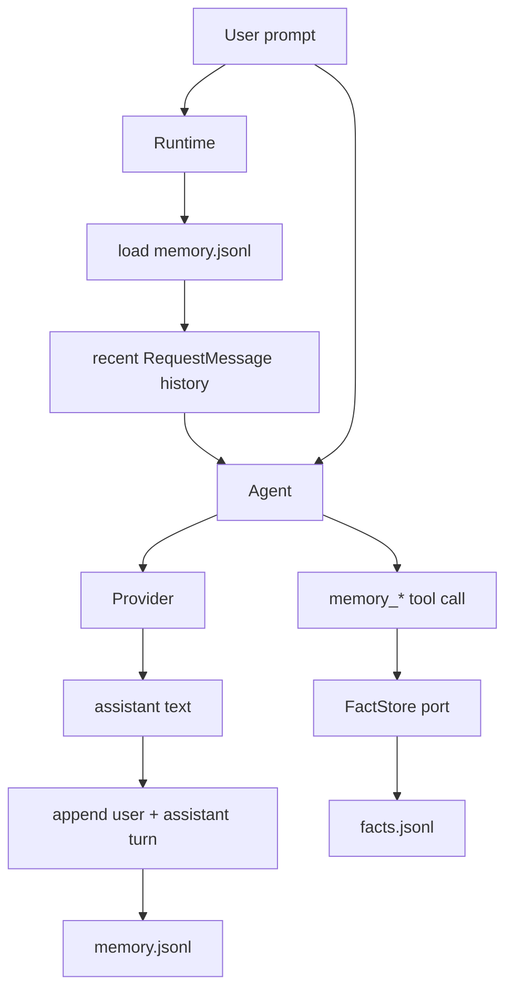
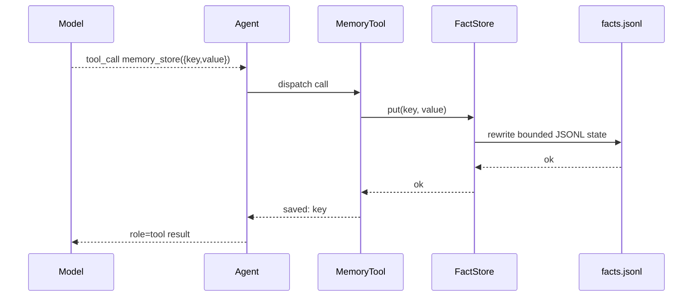

# Memory

`nllclw` には 2 つの memory systems があります:

1. 最近の user/assistant turns を保持する transcript memory;
2. explicit tools を通じて keyed facts を保存する durable fact memory。

どちらも default では user state directory にある JSONL files で、binary の隣や
current project の中ではありません。

## Overview



## Transcript Memory

Transcript memory は default で enabled です:

```sh
NLLCLW_MEMORY=on
# Default: user state dir/memory.jsonl
NLLCLW_MEMORY_MAX_MESSAGES=20
```

`NLLCLW_MEMORY_MAX_MESSAGES` は少なくとも 2 である必要があります。Transcript
appends は user/assistant pairs として stored されるためです。

各 line は 1 つの JSON object です:

```json
{"role":"user","content":"remember that this project uses Zig 0.16"}
{"role":"assistant","content":"Got it."}
```

Turn の startup では:

1. `runtime.zig` が configured transcript store を開きます。
2. `memory.zig` が JSONL lines を parse します。
3. Invalid roles、invalid JSON、invalid UTF-8、binary control bytes は memory error を発生させます。
4. Newest `NLLCLW_MEMORY_MAX_MESSAGES` entries だけが retained されます。
5. Entries は Chat Completions request messages に converted されます。

Successful assistant response の後、`Runtime.appendMemory` は user prompt と
assistant text を append します。Append が fail しても、すでに生成された
assistant answer は printed され、channel は warning を report します。

Transcript snapshots は 256 KiB で capped されます。これは JSONL file を load
するときと同じ limit です。Oversized turns は atomic replace の前に rejected
されるため、successful write が next startup で read できない transcript を作ることはありません。

## Durable Fact Memory

Fact memory は stable key/value facts のためのものです。次の場合、default
local tool loop を通じて available です:

```sh
NLLCLW_MEMORY=on
NLLCLW_TOOLS=on
```

Defaults:

```sh
# Default path: user state dir/facts.jsonl
NLLCLW_MEMORY_MAX_FACTS=64
```

`NLLCLW_MEMORY_MAX_FACTS` は 1 から 1024 である必要があります。

各 line は 1 つの JSON object です:

```json
{"key":"project.language","value":"Zig 0.16"}
{"key":"user.prefers","value":"direct, pragmatic answers"}
```

Fact keys:

- non-empty である必要があります;
- 64 bytes に limited されています;
- letters、digits、`_`、`-`、`.` を含められます;
- key により deduplicated され、newest value が勝ちます。

Fact values:

- non-empty である必要があります;
- non-whitespace text を含む必要があります;
- valid UTF-8 である必要があります;
- ASCII control bytes を含んではいけません;
- 2048 bytes に limited されています;
- `memory_recall` で returned されるとき `NLLCLW_TOOL_OUTPUT_MAX_BYTES` に fit する必要があります。

Fact JSONL snapshot は transcript memory と同じ 256 KiB read/write cap を使います。
Retained facts が多すぎて file limit を超える場合、unreadable facts file を作る代わりに write が fail します。

## Memory Tools

| Tool | Purpose |
|---|---|
| `memory_store` | Key によって fact を store または update します。 |
| `memory_recall` | Key によって fact を read します。 |
| `memory_list` | Known fact keys を list します。 |
| `memory_forget` | Key によって fact を delete します。 |

Tool flow:



## CLI Memory Commands

これらの commands は durable facts に operate します:

```sh
nllclw memory list
nllclw memory get project.language
nllclw memory forget project.language
nllclw memory reset
```

`memory reset` は transcript memory と fact memory の両方を clear します。

## Privacy and Safety Notes

- Memory files は default で user state directory にあります。
- `.nllclw-*` files は filesystem tools から denied されるため、model は
  `read_file`、`write_file`、`edit_file` で自分の memory files を read または edit できません。
- Memory は encrypted されません。Secrets を保存しないでください。
- Fact memory は durable user/project preferences のために使い、raw conversation logs には使わないでください。
