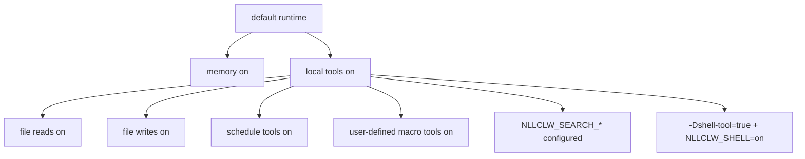

# Security Model

`nllclw` は local AI assistant であり、sandbox ではありません。Safety model は、
小さな local-only defaults、explicit external capability gates、bounded local
outputs、慎重な provider/config validation に基づいています。

## Default Posture

Default build:

- no package dependencies;
- no external runtime programs;
- no `curl`;
- no shell execution;
- local tools enabled;
- filesystem tools enabled with relative-path and secret-path protections;
- scheduler tools enabled for local JSONL schedules;
- user-defined macro tools enabled and stored in local JSONL;
- search provider が configured されていなければ web search disabled;
- Telegram は explicitly launched され、allowlist で configured されない限り disabled。
- WebSocket は explicitly launched されない限り disabled。Default bind は loopback-only。

Memory は default で enabled です。Current working directory ではなく user state
directory に local JSONL files だけを書きます。Disable するには:

```sh
NLLCLW_MEMORY=off
```

すべての tools を disable するには:

```sh
NLLCLW_TOOLS=off
```

## Capability Gates



Model は default で local tool definitions を受け取ります。External web search
と shell execution には引き続き explicit setup が必要です。

## Provider-Key Handling

- API keys は OS env、`config.json`、または `.env` から来ます。
- OS env は file config を override し、`config.json` は `.env` を override します。
- Completion provider keys は `Authorization: Bearer ...` としてだけ送信されます。
- Search provider keys は各 provider の documented auth header で送信されます:
  Tavily と Firecrawl は bearer auth、Brave Search は `X-Subscription-Token`、
  Exa は `x-api-key`。
- Header values は ASCII control bytes を reject します。
- Provider model names は request JSON が build される前に invalid UTF-8 と control bytes を reject します。
- Chat request content strings、assistant response text、tool-call argument strings
  は invalid UTF-8 と binary control bytes を reject します。Normal newlines、
  carriage returns、tabs はそこでは valid text のままです。Model names、roles、
  tool-call ids、function names、parameter names などの request metadata はさらに single-line です。
- Provider response roles は present の場合 `assistant` でなければなりません。
- Empty、too large、または control bytes を含む provider と Telegram diagnostic
  messages は trusted single-line errors として printed されません。
- Raw diagnostic response bodies は valid text の場合だけ printed され、terminal output で capped されます。
- Default state files は user state directory にあります。Memory、macro tools、
  schedules の configured state paths は relative `.jsonl` paths で、valid UTF-8、
  no control bytes、`/` separators、Windows-reserved filename characters や device
  names なし、empty、`.`、`..`、trailing-space、trailing-dot path components なしである必要があります。
- Local state files とそれらの lock files は terminal symlinks を follow せずに opened されます。
  Writes は host platform が expose する場合、atomic replace と private file permissions を使います。
- Durable fact memory values は stored または CLI/tool recall paths で printed される前に ASCII control bytes を reject します。
- User-defined macro tool descriptions と actions は stored または model-facing
  tool schema/output として返される前に ASCII control bytes を reject します。
- Scheduled actions は stored または schedule listing で printed される前に ASCII control bytes を reject します。
- Model-facing tool outputs は invalid UTF-8 と binary control bytes を reject します。
- `.env`、`config.json`、`.nllclw-*` paths は filesystem tools から denied されます。
- user-defined macro tools は default で user state directory に stored されます。
- Real keys を prompts や context files に paste しないでください。

## Compatible Provider Safety

Compatible providers は default で HTTPS を使う必要があります:

```json
{
  "provider": "compatible",
  "base_url": "https://example.com/v1",
  "api_key": "...",
  "model": "..."
}
```

HTTP は exact loopback hosts だけに、かつ explicitly enabled の場合だけ allowed です:

```json
{
  "provider": "compatible",
  "base_url": "http://127.0.0.1:11434/v1",
  "allow_http_base_url": true,
  "api_key": "ollama",
  "model": "llama3.2"
}
```

Remote HTTP URLs は rejected です。

## Filesystem Tool Boundary

Filesystem tools は full sandbox ではありませんが、conservative local boundary を enforce します:

- relative paths only;
- valid UTF-8, control-free paths no longer than 512 bytes;
- no `..`;
- no absolute POSIX paths;
- no absolute or drive-qualified Windows paths;
- no empty, `.`, or `..` path components, except that `list_dir` accepts
  literal `.` for the current directory;
- no symlink traversal for opened path components;
- no Windows-reserved filename characters, device names, trailing spaces, or
  trailing dots;
- no `.env`, `config.json`, `.nllclw-*`, `.git`, `.ssh`, `.gnupg`, `.aws`, `.npmrc`;
- no common private-key filenames or suffixes;
- UTF-8 text only, without binary control bytes;
- output-size caps;
- atomic writes.

File tools は、これらの permissions が妥当な directory の中だけで使ってください。

## Telegram Boundary

Telegram mode は default-deny です:

- `NLLCLW_TELEGRAM_TOKEN` is required;
- Telegram tokens は Bot API URLs に置かれる前に `<bot-id>:<secret>` として validated されます;
- `NLLCLW_TELEGRAM_CHAT_ID` is required;
- configured chat id または username allowlist の外にある messages は ignored されます;
- local nonblocking lock は same state directory を使う 2 つ目の `nllclw telegram` process を reject します;
- last processed update は restart 後の replay を避けるため local に stored されます。
- model-backed messages は `NLLCLW_TELEGRAM_RATE_LIMIT_PER_MINUTE` により rate-limited です。

## WebSocket Boundary

WebSocket mode は default で local custom UIs のためのものです:

- `nllclw websocket` が launched されたときだけ start します;
- default bind は `127.0.0.1:8765`;
- loopback binds でも `NLLCLW_WS_TOKEN` is required;
- `NLLCLW_WS_PATH` は query や fragment syntax のない single-line valid UTF-8 である必要があります;
- non-loopback bind addresses には `NLLCLW_WS_ALLOW_REMOTE=on` が必要です;
- loopback browser clients は token を `?token=...` として渡せます;
- loopback query authentication は exactly one `token` parameter を accept します;
- remote clients は exactly one `Authorization: Bearer ...` header を使う必要があります;
- model-backed chat messages は `NLLCLW_WS_RATE_LIMIT_PER_MINUTE` で rate-limited です。
- built-in server は一度に 1 つの active client を handle します。

Reverse proxy と transport security なしに WebSocket port を untrusted network
へ expose しないでください。Built-in channel は plain `ws://` であり、TLS termination ではありません。

## Shell Tool Boundary

Default binary は `shell_exec` を含みません。

Shell execution を可能にするには、次の両方が true である必要があります:

```sh
zig build -Dshell-tool=true
NLLCLW_SHELL=on
```

Shell tool は model に local command execution を与えるのと同等として扱ってください。
Trusted environments でだけ使ってください。

## Practical Checklist

Default local capabilities を使う前に:

1. Dedicated project directory で run します。
2. Secrets を prompts と context files から外します。
3. File mutation が望ましくない場合は `NLLCLW_FILE_WRITE=off` を set します。
4. Command execution が必要でない限り default no-shell binary を使います。
5. Tool output を bounded に保つため `NLLCLW_TOOL_OUTPUT_MAX_BYTES` を使います。
6. Quick health line には `nllclw status`、full diagnostics には `nllclw doctor` を使います。
