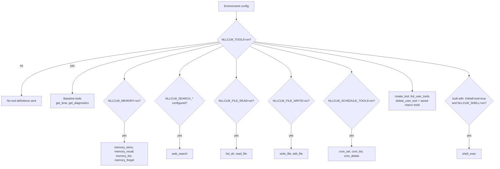
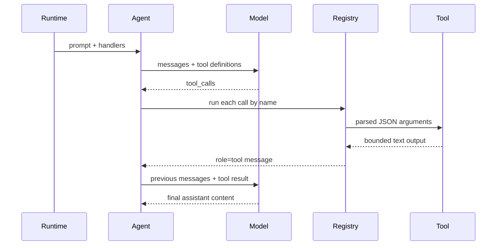

# Tools

Tools により、model は `nllclw` に local actions を実行するよう依頼できます。
External services を必要としない local tools は default で enabled です。
External web search と optional shell execution には引き続き explicit setup が必要です。

## Capability Model



Default binary は `shell_exec` を含みません。Explicitly build します:

```sh
zig build -Dshell-tool=true
```

その後 runtime で enable します:

```sh
NLLCLW_TOOLS=on
NLLCLW_SHELL=on
```

すべての tools を disable するには:

```sh
NLLCLW_TOOLS=off
```

## Tool Loop



`NLLCLW_TOOL_MAX_ROUNDS` は、agent が `ToolRoundLimit` を返す前に発生できる
assistant/tool exchange rounds の数を制限します。

Built-in tool arguments は exact JSON objects です。Invalid JSON、missing
required fields、unknown fields、invalid field types、validation failures は、
model が handle するための tool error を返します。

## Available Tools

| Tool | Gate | Effect |
|---|---|---|
| `get_time` | `NLLCLW_TOOLS=on` default | `NLLCLW_TIMEZONE_OFFSET_MINUTES` を使って local time を返します。 |
| `get_diagnostics` | `NLLCLW_TOOLS=on` default | Runtime capability/config status を report します。 |
| `web_search` | `NLLCLW_TOOLS=on` and a configured `NLLCLW_SEARCH_*` provider | Selected search provider を HTTP port 経由で call します。 |
| `memory_store` | `NLLCLW_TOOLS=on`, `NLLCLW_MEMORY=on` defaults | Durable fact を store します。 |
| `memory_recall` | `NLLCLW_TOOLS=on`, `NLLCLW_MEMORY=on` defaults | Durable fact を read します。 |
| `memory_list` | `NLLCLW_TOOLS=on`, `NLLCLW_MEMORY=on` defaults | Durable fact keys を list します。 |
| `memory_forget` | `NLLCLW_TOOLS=on`, `NLLCLW_MEMORY=on` defaults | Durable fact を delete します。 |
| `list_dir` | `NLLCLW_FILE_READ=on` default | CWD-relative directory を list します。 |
| `read_file` | `NLLCLW_FILE_READ=on` default | UTF-8 CWD-relative file を read します。 |
| `write_file` | `NLLCLW_FILE_WRITE=on` default | UTF-8 CWD-relative file を atomically write します。 |
| `edit_file` | `NLLCLW_FILE_WRITE=on` default | File 内の first exact text match を replace します。 |
| `cron_set` | `NLLCLW_SCHEDULE_TOOLS=on` default | Local scheduled task を追加します。 |
| `cron_list` | `NLLCLW_SCHEDULE_TOOLS=on` default | Scheduled tasks を list します。 |
| `cron_delete` | `NLLCLW_SCHEDULE_TOOLS=on` default | Scheduled task を delete します。 |
| `create_tool` | `NLLCLW_TOOLS=on` default | Persistent user-defined macro tool を作成します。 |
| `list_user_tools` | `NLLCLW_TOOLS=on` default | Saved macro tools を list します。 |
| `delete_user_tool` | `NLLCLW_TOOLS=on` default | Saved macro tool を delete します。 |
| saved macro tools | `NLLCLW_TOOLS=on` default | Model が built-in tools で実行できるよう saved action text を返します。 |
| `shell_exec` | optional shell build plus `NLLCLW_SHELL=on` | Timeout、combined output cap、binary control bytes のない UTF-8 text output で shell command を run します。 |

## User-Defined Tools

User-defined tools は macro tools であり、generated code ではありません。
`create_tool` は name、description、natural-language action を `NLLCLW_USER_TOOLS_PATH`
に store します (default は user state directory の `user-tools.jsonl`)。
Later turns では saved tools が normal tool definitions として advertised されます。
Model がそれを call すると、`nllclw` は saved action text を返し、model は built-in
tools を使って同じ tool loop を continue します。

Example:

```text
create_tool(name="daily_brief", description="Prepare a daily brief", action="Search for current project news, summarize it, and store the summary in memory.")
```

Tool names は letters、digits、underscores だけを含められます。Built-in tools
と collide する names は rejected されます。Descriptions と actions は trimmed、
bounded、valid UTF-8 text で、ASCII control bytes を含みません。User-tool JSONL
file は read と write の両方で 128 KiB に capped され、terminal symlinks を follow
せずに opened されます。Saved action は tool result として wrapped されたとき
`NLLCLW_TOOL_OUTPUT_MAX_BYTES` に fit する必要があります。

## Web Search Providers

`web_search` は 1 つの tool で、provider は `NLLCLW_SEARCH_PROVIDER` によって selected
されます。Default `auto` mode は次の order で最初の configured key を選びます:
Tavily、Brave Search、Exa、Firecrawl、そして DuckDuckGo は explicitly enabled の場合だけ。
Explicit key-based providers は対応する `NLLCLW_SEARCH_*_KEY` を require します。
Search keys は ASCII control bytes を含んではいけません。
Queries は trimmed、valid UTF-8、control-free、最大 512 bytes です。
Provider result text は binary control bytes のない valid UTF-8 として formatted されます。
Result fields 内の ordinary tabs と newlines は spaces に normalized されます。
Empty provider result objects は skipped され、valid empty provider response は
synthetic placeholder row の代わりに `no results` を返します。DuckDuckGo nested
related-topic groups は small bounded depth まで flattened されます。

| Provider | Env | Notes |
|---|---|---|
| `tavily` | `NLLCLW_SEARCH_TAVILY_KEY=...` | Tavily Search に POST します。 |
| `brave` | `NLLCLW_SEARCH_BRAVE_KEY=...` | `X-Subscription-Token` で Brave Web Search を GET します。 |
| `exa` | `NLLCLW_SEARCH_EXA_KEY=...` | `x-api-key` で Exa Search に POST します。 |
| `firecrawl` | `NLLCLW_SEARCH_FIRECRAWL_KEY=...` | Bearer auth で Firecrawl Search に POST します。 |
| `duckduckgo` | `NLLCLW_SEARCH_DUCKDUCKGO=on` or `NLLCLW_SEARCH_PROVIDER=duckduckgo` | No-key Instant Answer fallback。Full web SERP API ではありません。 |

Examples:

```sh
NLLCLW_TOOLS=on
NLLCLW_SEARCH_PROVIDER=auto
NLLCLW_SEARCH_BRAVE_KEY=...
```

```sh
NLLCLW_TOOLS=on
NLLCLW_SEARCH_PROVIDER=duckduckgo
```

## Scheduled Delivery

`cron_set` は delivery のために `channel` と `chat_id` を accept します。Telegram
turns では current chat が default destination になるため、"remind me here tomorrow"
のような prompt は chat id を model-facing user text に expose せず Telegram schedule を作成できます。

Scheduled actions は trimmed され、valid UTF-8 で ASCII control bytes を含まず、
2048 bytes に limited されます。Schedule JSONL file は read と write の両方で
128 KiB に capped され、oversized snapshots は atomic replacement の前に rejected されます。
`cron_set` はその `type` に合う timing fields だけを accept します: periodic
schedules には `interval_*`、one-shot schedules には `delay_*`、daily schedules には `hour`/`minute`。
Daemon は scheduled prompt が complete し、configured delivery が successful
になった後だけ schedule を commit します。Failed または blocked deliveries は local
lease が expire した後 retry されます。

Supported destinations:

| Channel | Behavior |
|---|---|
| `local` | Daemon は result を stdout に write します。 |
| `telegram` | Daemon は `NLLCLW_TELEGRAM_TOKEN` を使って stored Telegram chat id に result を送ります。 |

## Filesystem Safety Model

Filesystem tools は conservative です:

- paths は current working directory からの relative である必要があります;
- paths は valid UTF-8、control-free、最大 512 bytes である必要があります;
- absolute POSIX paths are rejected;
- absolute or drive-qualified Windows paths are rejected;
- empty、`.`、`..` components are rejected。ただし `list_dir` は current directory のために literal `.` を accept します;
- denied components include `.env`, `.env.*`, `config.json`, `.nllclw-*`,
  `.git`, `.ssh`, `.gnupg`, `.aws`, `.npmrc`, `id_rsa`, `id_ed25519`;
- denied Windows device names include `CON`, `PRN`, `AUX`, `NUL`, `CONIN$`,
  `CONOUT$`, `COM1` through `COM9`, and `LPT1` through `LPT9`, including with
  extensions;
- Windows-reserved filename punctuation (`<`, `>`, `:`, `"`, `|`, `?`, `*`) は portable behavior のため rejected されます;
- Space または dot で終わる path components は portable behavior のため rejected されます;
- denied suffixes include `.pem`, `.key`, `.p12`, `.pfx`;
- intermediate directories are opened without following symlinks;
- terminal files are opened without following symlinks;
- reads and writes require valid UTF-8 text without binary control bytes;
- `list_dir` は sorted order で names を emit し、denied、non-UTF-8、control-character entry names を omit します;
- writes use atomic replacement and private file permissions where supported;
- output is capped by `NLLCLW_TOOL_OUTPUT_MAX_BYTES`.

これは local safety boundary であり、sandbox ではありません。Enabled capabilities
を与えてよい directories でだけ `nllclw` を run してください。

## Adding a Tool

Preferred shape:

1. `src/tools/<name>.zig` に focused module を追加します。
2. `chat.ToolDefinition` を define します。
3. 必要な dependencies だけを own する small client struct を implement します。
4. `std.json.parseFromSlice` で JSON arguments を parse します。
5. `NLLCLW_TOOL_OUTPUT_MAX_BYTES` で capped された owned text output を return します。
6. Local state を read または mutate する場合、handler を explicit config gate の後ろで `src/tools/catalog.zig` に register します。
7. Success、invalid JSON/arguments、bounds、denied access の tests を追加します。

Infrastructure adapters を `src/tools/` に置かないでください。Tool が persistence
または HTTP を必要とする場合は、port を define または reuse し、catalog を通じて inject します。
