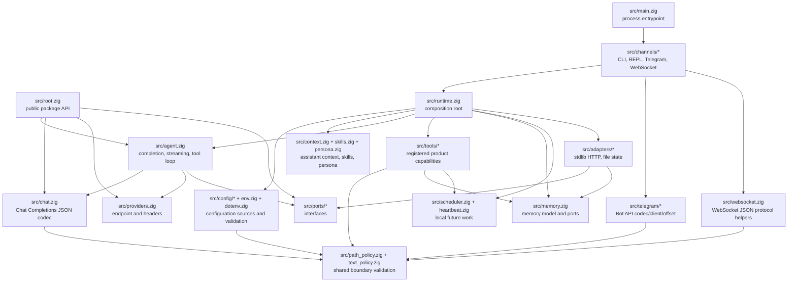
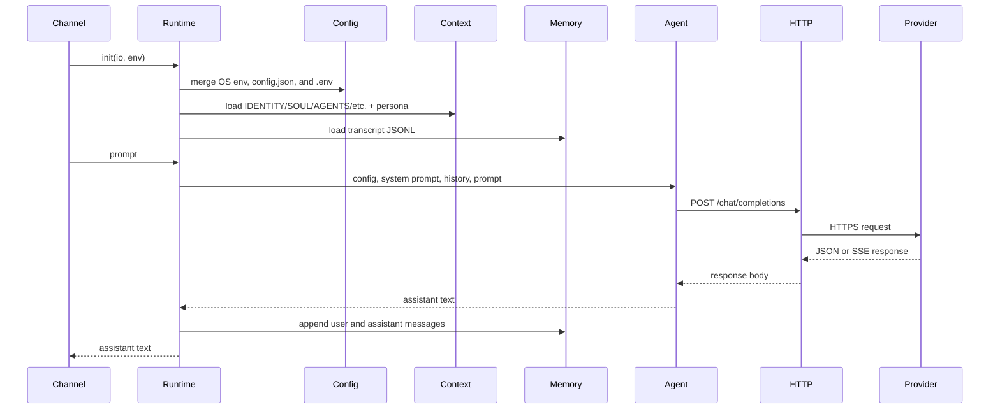
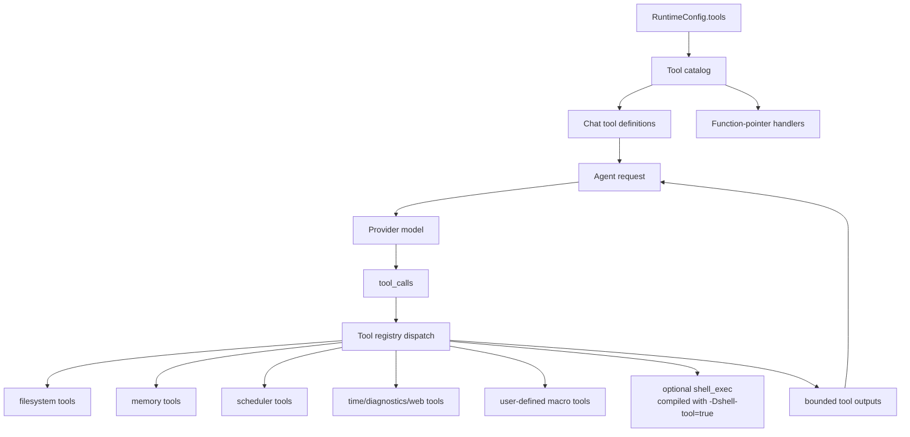
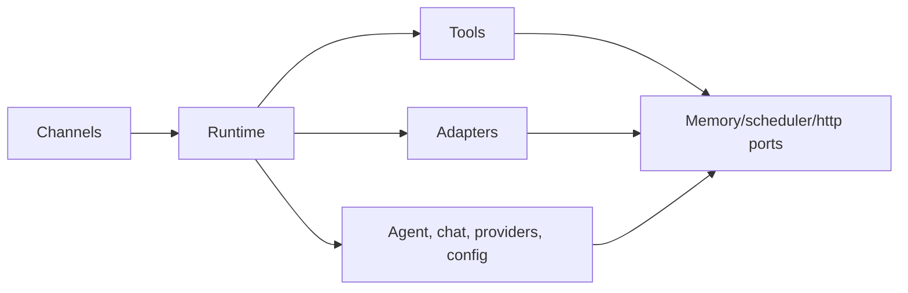

# Arquitetura

`nllclw` é um assistente de IA compacto construído como um pacote Zig mais um
executable. O principal objetivo de design é manter o agent engine testável e
ainda entregar um standalone binary pequeno.

## Objetivos

- Manter o provider wire contract simples: OpenAI-compatible Chat Completions.
- Manter dependências de runtime explícitas: o build padrão usa apenas Zig
  stdlib.
- Manter capacidades locais atrás de capability gates e fáceis de auditar.
- Manter canais finos: CLI, REPL, Telegram, WebSocket, heartbeat e daemon chamam
  o mesmo runtime e agent engine.
- Manter a API pública do pacote pequena o suficiente para ensinar a partir dela.

## Mapa de camadas



## Fluxo de requisição

O mesmo engine trata argv prompts, stdin prompts, turnos REPL, mensagens
Telegram, prompts WebSocket, tarefas heartbeat e schedules vencidos.



## Fluxo do Tool Loop

Ferramentas são product capabilities, não infrastructure adapters. Elas vivem em
`src/tools/` e são expostas ao modelo apenas por `src/tools/catalog.zig`.



O agente repete esse loop até que uma de três coisas aconteça:

- o modelo retorna assistant content sem tool calls;
- `NLLCLW_TOOL_MAX_ROUNDS` é alcançado;
- ocorre um provider error, malformed provider response, allocation failure ou
  outro fatal dispatch error.

Non-fatal tool failures são devolvidos ao modelo como mensagens tool
`tool error: ...`, para que o modelo possa se recuperar, escolher argumentos
diferentes ou explicar a falha. Allocation failures ainda abortam o turno.

Streaming é deliberadamente desabilitado quando ferramentas estão habilitadas.
O assistente precisa de uma resposta completa do modelo para saber quais tool
calls executar.

`src/chat.zig` valida cada request string como texto UTF-8 sem binary control
bytes antes da codificação JSON. Isso mantém os campos Chat Completions como
JSON strings em vez de deixar arbitrary byte slices degradarem para arrays. Para
SSE, `[DONE]` é terminal; chunks posteriores são ignorados.

## Responsabilidades dos módulos

| Caminho | Responsabilidade |
|---|---|
| `src/main.zig` | Entrypoint executable mínimo e process exit. |
| `src/root.zig` | API pública estável: config, chat types, HTTP port, streaming sink, `complete`. |
| `src/runtime.zig` | Composition root para operação tipo CLI: config, HTTP adapter, memory adapter, context, tools. |
| `src/agent.zig` | Assistant engine de um turno channel-neutral, streaming e tool loop. |
| `src/chat.zig` | Codec JSON request/response para Chat Completions, incluindo tools e SSE chunks. |
| `src/providers.zig` | Provider presets e validação de endpoint compatible-provider. |
| `src/config/*` | Typed runtime config, source collection, validation e owned copies. |
| `src/channels/*` | Orquestração de user I/O para CLI, REPL, Telegram, WebSocket e daemon commands. |
| `src/tools/*` | Tool definitions, local capabilities e user-defined macro tools. |
| `src/skills.zig` | Índice compacto `skills/*.md` para on-demand local skill loading. |
| `src/persona.zig` | Runtime presentation modes acrescentados ao system prompt. |
| `src/memory.zig` | Transcript/fact models, JSONL parsers e memory store ports. |
| `src/adapters/*` | Adaptadores stdlib concretos para ports. |
| `src/ports/*` | Interfaces function-pointer para limites testáveis. |
| `src/telegram/*` | Telegram Bot API wire helpers. |
| `src/websocket.zig` | Helpers testáveis de mensagens/eventos JSON WebSocket. |

## API pública do pacote

Consumidores importam o módulo do pacote como `nllclw`. A superfície exportada é
pequena:

```zig
const nllclw = @import("nllclw");

const cfg: nllclw.Config = .{
    .provider = .openrouter,
    .api_key = "...",
    .model = "openai/gpt-chat-latest",
};

const text = try nllclw.complete(allocator, http_client, cfg, "hello");
```

A API pública expõe:

- `ProviderKind`
- `PersonaKind`
- `Config`
- chat request/tool types
- `HttpClient`, `HttpResponse`, `HttpHeader`, `HttpStatusCode`
- `Diagnostic`
- `ToolOptions`, `ToolHandler`, `ToolRunError`, `CompleteOptions`
- `StreamError`, `StreamSink`
- `complete` e `completeWithOptions`

Detalhes runtime-only como carregamento de `config.json`/`.env`, file memory,
Telegram polling e o adaptador HTTP stdlib ficam fora da public root. O public
tool handler é apenas a abstração function-pointer necessária por
`ToolOptions`; built-in product tools e seus file-backed stores permanecem
internos.

## Direção de dependências

A direção de dependências é explícita:



Core code não sabe sobre process env, `config.json`, `.env`, filesystem paths,
Telegram polling ou `std.http.Client`. Esses detalhes são montados por
`runtime.zig` e pelos canais.

## Propriedade de memória

O código segue o estilo de ownership explícito do Zig:

- Funções que alocam retornam owned slices e documentam ownership por padrões
  `defer`/`deinit` perto dos call sites.
- Estado runtime long-lived pertence a `Runtime` e é liberado em
  `Runtime.deinit`.
- Config parseada pode ser borrowed de source buffers ou copiada para
  `config.Owned` para runtime storage.
- Tool outputs pertencem ao agente até serem enviados de volta ao modelo e
  então liberados depois do loop.

## Modelo runtime multiplataforma

O default binary deve rodar onde quer que Zig e a biblioteca padrão do Zig
consigam dar suporte ao target:

- sem `curl`;
- sem provider SDK;
- sem package dependencies em `build.zig.zon`;
- sem shell process no build padrão;
- `std.http.Client` para HTTPS;
- `std.Io` para files, stdin/stdout/stderr e timers.

A optional shell tool é um build flavor separado:

```sh
zig build -Dshell-tool=true
```

Esse flavor não é o default porque pode iniciar `sh` ou `cmd.exe` quando
habilitado em runtime.
