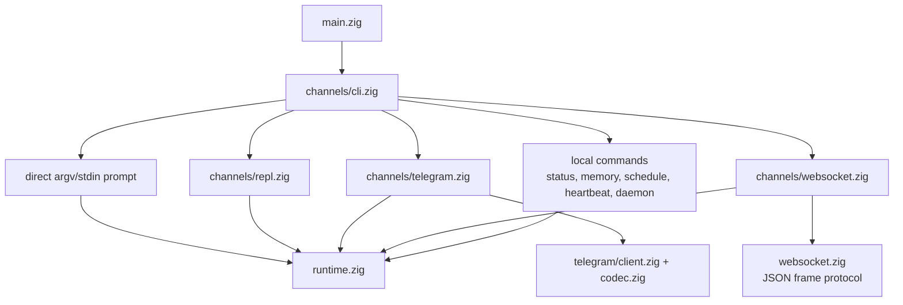
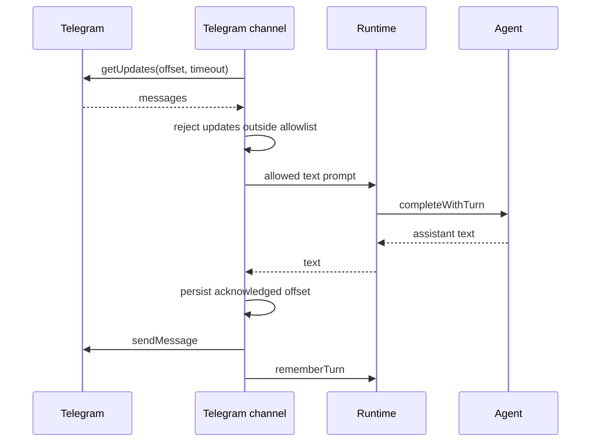
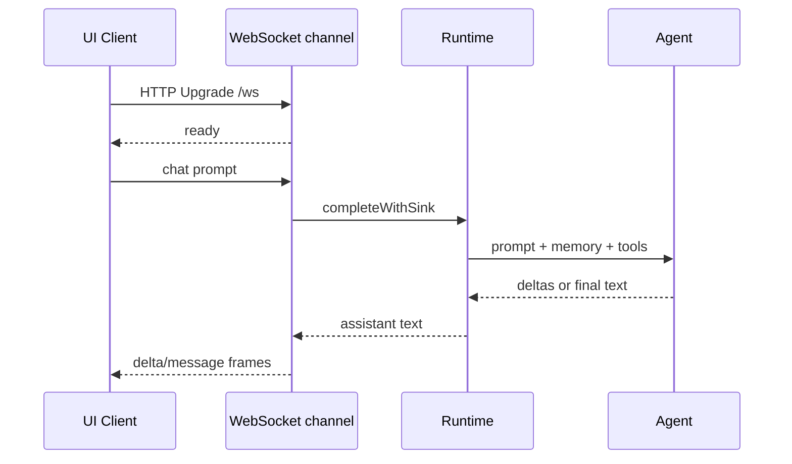

# Canais

Canais são as formas voltadas ao usuário de falar com o mesmo runtime e agent
engine. Eles fazem parse da entrada, possuem I/O específico de canal e delegam
completions a `runtime.zig`.

## Mapa de canais



## Direct CLI

Prompt from argv:

```sh
nllclw "explain this repository in one paragraph"
```

Prompt from stdin:

```sh
printf 'summarize this text\n' | nllclw
```

`NLLCLW_STREAM=on` é o default:

```sh
NLLCLW_STREAM=on
```

O tool loop também fica ligado por padrão, e tool output é non-streaming porque
o agente precisa inspecionar tool calls completas antes de fazer dispatch de
local functions. Para pure streaming chat, defina `NLLCLW_TOOLS=off`.

Direct slash commands são tratadas localmente:

```sh
nllclw /settings
nllclw /diag memory
nllclw /persona technical
```

Esses comandos não chamam o modelo.

## Interactive REPL

Quando stdin é um TTY e nenhum prompt é fornecido, `nllclw` inicia um pequeno
terminal chat loop:

```sh
nllclw
```

Exit commands:

```text
:q
:quit
exit
```

Cada turno usa a mesma runtime memory e tool configuration do modo direct CLI.

## Telegram

Telegram mode usa Bot API long polling:

```sh
NLLCLW_TELEGRAM_TOKEN=123456:bot-token
NLLCLW_TELEGRAM_CHAT_ID=123456789
nllclw telegram
```

`NLLCLW_TELEGRAM_CHAT_ID` também pode ser um Telegram username de private-chat
ou public-chat, com ou sem `@`, por exemplo `@donprus` ou `donprus`.

Security properties:

- `NLLCLW_TELEGRAM_CHAT_ID` é obrigatório;
- mensagens fora do chat id configurado ou da username allowlist são ignoradas;
- um local nonblocking lock impede um segundo processo `nllclw telegram` no
  mesmo state directory antes que ele chegue ao Bot API polling;
- accepted message text deve ser UTF-8 válido sem binary control bytes;
  malformed text updates são puladas enquanto o polling offset ainda avança;
- o last acknowledged update id é armazenado no user state directory;
- restarts continue from the stored offset e não replay handled messages.
- model-backed messages são rate-limited por
  `NLLCLW_TELEGRAM_RATE_LIMIT_PER_MINUTE` (default `20`, `0` disables); local
  slash commands não são rate-limited.

Se outra máquina, deployment ou binary antigo já estiver usando `getUpdates`
para o mesmo bot token, Telegram retorna HTTP `409`. `nllclw` imprime uma dica
específica para esse conflito.

Flow:



## WebSocket

WebSocket mode inicia um servidor local RFC6455 para custom browser, desktop ou
mobile UIs:

```sh
NLLCLW_WS_TOKEN=change-me nllclw websocket
```

Default bind settings:

```sh
NLLCLW_WS_HOST=127.0.0.1
NLLCLW_WS_PORT=8765
NLLCLW_WS_PATH=/ws
```

O endereço de bind padrão é loopback-only, mas o canal ainda exige
`NLLCLW_WS_TOKEN` para que páginas aleatórias de navegador não consigam falar
com o local agent. Remote binds exigem ambos:

```sh
env NLLCLW_WS_HOST=0.0.0.0 \
  NLLCLW_WS_ALLOW_REMOTE=on \
  NLLCLW_WS_TOKEN=change-me \
  nllclw websocket
```

Loopback browser clients podem passar o token como query parameter:

```js
const socket = new WebSocket("ws://127.0.0.1:8765/ws?token=change-me");

socket.addEventListener("message", (event) => {
  const message = JSON.parse(event.data);
  console.log(message.type, message.content ?? message.message);
});

socket.addEventListener("open", () => {
  socket.send(JSON.stringify({
    type: "chat",
    prompt: "Explain this repository in one paragraph."
  }));
});
```

Query authentication aceita exatamente um parâmetro `token`. Duplicate token
parameters são rejeitados como ambiguous.

Remote clients devem usar exatamente um bearer token header. Browser-based
remote UIs devem se conectar por meio de um trusted local ou reverse proxy que
injete esse header.

```text
Authorization: Bearer change-me
```

Client messages:

```json
{ "type": "chat", "prompt": "hello" }
{ "type": "status" }
{ "type": "ping" }
{ "type": "close" }
```

Plain text frames são aceitos como chat prompts para clients simples. Text
frames devem ser UTF-8 válidos sem binary control bytes.
JSON command frames são objetos exatos; unknown fields são rejeitados, e apenas
frames `chat`/`message` podem incluir `prompt`.
O servidor lida com um active WebSocket client por vez. Clients adicionais podem
conectar depois que o client ativo desconecta.

Server messages:

```json
{ "type": "ready", "version": 1, "channel": "websocket" }
{ "type": "delta", "content": "partial text" }
{ "type": "message", "content": "final text" }
{ "type": "status", "content": "nllclw: ok ..." }
{ "type": "pong", "content": "pong" }
{ "type": "error", "message": "request failed" }
```

Frames `delta` são emitidos apenas quando `NLLCLW_STREAM=on` e
`NLLCLW_TOOLS=off`. Com tools habilitadas, o modelo precisa completar tool-call
planning antes de o canal enviar a `message` final.

Flow:



## Local Commands

Local commands não perguntam ao modelo, exceto quando o comando executa uma
tarefa explicitamente:

```sh
nllclw status
nllclw doctor
nllclw memory list
nllclw memory get project.goal
nllclw memory forget project.goal
nllclw memory reset
nllclw schedule list
nllclw schedule delete 1
```

`status` imprime a quick health line. `doctor` imprime o full diagnostics
report.

## Shared Slash Commands

REPL, Telegram e direct CLI compartilham o mesmo slash parser:

| Command | Effect |
|---|---|
| `/start`, `/help` | Mostra local command help. |
| `/settings` | Mostra quick runtime status. |
| `/diag [scope]` | Mostra diagnostics para `quick`, `runtime`, `memory`, `rates`, `time` ou `all`. |
| `/persona [mode]` | Mostra ou define runtime persona: `neutral`, `friendly`, `technical`, `witty`. |
| `/stop` | Pausa Telegram intake para o processo atual. Outros canais relatam que é Telegram-only. |
| `/resume` | Retoma Telegram intake. Outros canais relatam que é Telegram-only. |
| `/chatid` | Imprime Telegram chat id e username fields quando disponíveis. Outros canais relatam que é Telegram-only. |

Persona changes são runtime-only para o processo atual. Para escolher uma
startup persona, defina `NLLCLW_PERSONA`.

## Heartbeat

`nllclw heartbeat` lê `HEARTBEAT.md` e transforma pending items em um prompt.
Apenas conservative task syntax é considerada actionable:

- unchecked markdown task lines;
- lines starting with `TODO:`.

```sh
nllclw heartbeat
```

Se nenhuma pending task for encontrada, o comando imprime uma mensagem curta e
exits successfully.

## Daemon

`nllclw daemon` repete:

1. claims due scheduled tasks from the user state directory;
2. runs each claimed task through the normal runtime;
3. commits only completed schedule entries;
4. periodically runs heartbeat prompts.

```sh
NLLCLW_DAEMON_INTERVAL_SECONDS=60
NLLCLW_HEARTBEAT_INTERVAL_SECONDS=1800
nllclw daemon
```

O daemon é local e file-backed. Ele não coordena várias machines.

Claimed schedules usam um local lease. Se provider execution, destination
preflight ou delivery falhar, a tarefa não é committed; ela fica eligible de
novo depois que o lease expira.

Quando um schedule é criado pelo Telegram, `cron_set` usa por padrão
`channel=telegram` e o current chat id. O daemon envia o completed scheduled
result de volta a esse chat usando `NLLCLW_TELEGRAM_TOKEN`. Local schedules
ainda escrevem em stdout.
