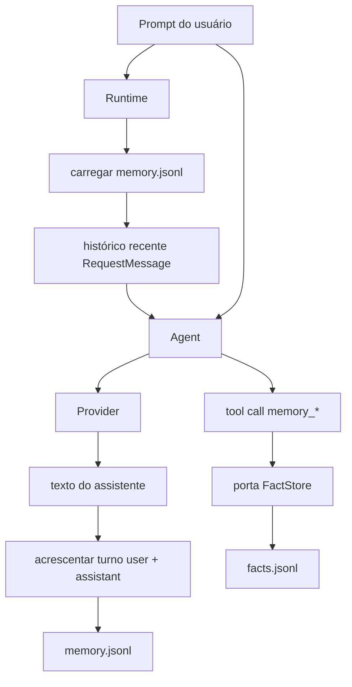
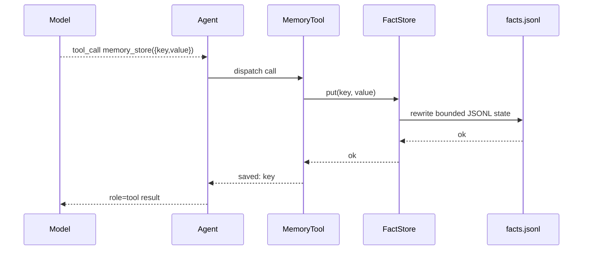

# Memória

`nllclw` tem dois sistemas de memória:

1. transcript memory, que mantém turnos recentes de user/assistant;
2. durable fact memory, que armazena fatos com chave por meio de ferramentas
   explícitas.

Ambos são arquivos JSONL no diretório de estado do usuário por padrão, não ao
lado do binário nem no projeto atual.

## Visão geral



## Transcript Memory

Transcript memory fica habilitada por padrão:

```sh
NLLCLW_MEMORY=on
# Default: user state dir/memory.jsonl
NLLCLW_MEMORY_MAX_MESSAGES=20
```

`NLLCLW_MEMORY_MAX_MESSAGES` deve ser pelo menos 2, porque transcript appends
são armazenados como pares user/assistant.

Cada linha é um objeto JSON:

```json
{"role":"user","content":"remember that this project uses Zig 0.16"}
{"role":"assistant","content":"Got it."}
```

No início de um turno:

1. `runtime.zig` abre o transcript store configurado.
2. `memory.zig` faz parse das linhas JSONL.
3. Roles inválidos, JSON inválido, UTF-8 inválido ou binary control bytes geram
   erro de memória.
4. Apenas as entradas mais novas até `NLLCLW_MEMORY_MAX_MESSAGES` são retidas.
5. As entradas são convertidas em mensagens de requisição Chat Completions.

Depois de uma resposta bem-sucedida do assistente, `Runtime.appendMemory`
acrescenta o prompt do usuário e o texto do assistente. Se o append falhar, a
resposta do assistente já produzida ainda é impressa e o canal relata um aviso.

Snapshots de transcript são limitados a 256 KiB, o mesmo limite usado ao
carregar o arquivo JSONL. Turnos grandes demais são rejeitados antes do atomic
replace, então uma escrita bem-sucedida não pode criar um transcript que o
próximo startup não consiga ler.

## Durable Fact Memory

Fact memory serve para fatos key/value estáveis. Ela fica disponível pelo tool
loop local padrão quando:

```sh
NLLCLW_MEMORY=on
NLLCLW_TOOLS=on
```

Defaults:

```sh
# Default path: user state dir/facts.jsonl
NLLCLW_MEMORY_MAX_FACTS=64
```

`NLLCLW_MEMORY_MAX_FACTS` deve ficar entre 1 e 1024.

Cada linha é um objeto JSON:

```json
{"key":"project.language","value":"Zig 0.16"}
{"key":"user.prefers","value":"direct, pragmatic answers"}
```

Fact keys:

- devem ser não vazias;
- são limitadas a 64 bytes;
- podem conter letras, dígitos, `_`, `-` e `.`;
- são deduplicadas por chave, com o valor mais novo vencendo.

Fact values:

- devem ser não vazios;
- devem conter texto que não seja apenas whitespace;
- devem ser UTF-8 válido;
- não devem conter ASCII control bytes;
- são limitados a 2048 bytes;
- devem caber em `NLLCLW_TOOL_OUTPUT_MAX_BYTES` quando retornados por
  `memory_recall`.

O snapshot fact JSONL usa o mesmo limite de leitura/escrita de 256 KiB da
transcript memory. Se muitos fatos retidos excederem esse limite de arquivo, a
escrita falha em vez de criar um arquivo facts ilegível.

## Ferramentas de memória

| Ferramenta | Objetivo |
|---|---|
| `memory_store` | Armazenar ou atualizar um fato por chave. |
| `memory_recall` | Ler um fato por chave. |
| `memory_list` | Listar chaves de fatos conhecidas. |
| `memory_forget` | Apagar um fato por chave. |

Tool flow:



## Comandos CLI de memória

Estes comandos operam sobre durable facts:

```sh
nllclw memory list
nllclw memory get project.language
nllclw memory forget project.language
nllclw memory reset
```

`memory reset` limpa transcript memory e fact memory.

## Notas de privacidade e segurança

- Arquivos de memória vivem no diretório de estado do usuário por padrão.
- Arquivos `.nllclw-*` são negados pelas ferramentas de sistema de arquivos,
  então o modelo não consegue ler nem editar seus próprios arquivos de memória
  por `read_file`, `write_file` ou `edit_file`.
- A memória não é criptografada. Não armazene segredos nela.
- Fact memory deve ser usada para preferências duráveis de usuário/projeto, não
  para logs crus de conversa.
