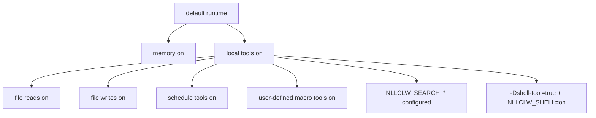

# Modelo de segurança

`nllclw` é um assistente de IA local, não um sandbox. Seu modelo de segurança se
baseia em padrões pequenos e local-only, gates explícitos para capacidades
externas, saídas locais limitadas e validação cuidadosa de provider/config.

## Postura padrão

Default build:

- nenhuma package dependency;
- nenhum programa runtime externo;
- nenhum `curl`;
- nenhuma shell execution;
- local tools habilitadas;
- filesystem tools habilitadas com proteções de relative-path e secret-path;
- scheduler tools habilitadas para schedules JSONL locais;
- user-defined macro tools habilitadas e armazenadas em JSONL local;
- web search desabilitado, exceto quando um search provider é configurado;
- Telegram desabilitado, exceto quando iniciado explicitamente e configurado com
  uma allowlist.
- WebSocket desabilitado, exceto quando iniciado explicitamente; o bind padrão é
  loopback-only.

Memory é habilitada por padrão porque escreve apenas arquivos JSONL locais no
diretório de trabalho atual. Você pode desabilitá-la com:

```sh
NLLCLW_MEMORY=off
```

Desabilite todas as ferramentas com:

```sh
NLLCLW_TOOLS=off
```

## Capability Gates



O modelo recebe definições de local tools por padrão. External web search e
shell execution ainda exigem configuração explícita.

## Tratamento de chaves de provedor

- API keys vêm de OS env, `config.json` ou `.env`.
- OS env sobrescreve file config, e `config.json` sobrescreve `.env`.
- Completion provider keys são enviadas apenas como
  `Authorization: Bearer ...`.
- Search provider keys são enviadas com o auth header documentado de cada
  provedor: bearer auth para Tavily e Firecrawl, `X-Subscription-Token` para
  Brave Search e `x-api-key` para Exa.
- Header values rejeitam ASCII control bytes.
- Provider model names rejeitam UTF-8 inválido e control bytes antes de o
  request JSON ser construído.
- Chat request content strings, assistant response text e tool-call argument
  strings rejeitam UTF-8 inválido e binary control bytes; newlines, carriage
  returns e tabs normais continuam sendo texto válido ali. Request metadata como
  model names, roles, tool-call ids, function names e parameter names também é
  single-line.
- Provider response roles, quando presentes, devem ser `assistant`.
- Provider and Telegram diagnostic messages vazias, grandes demais ou contendo
  control bytes não são impressas como trusted single-line errors.
- Raw diagnostic response bodies são impressos apenas quando são texto válido e
  são limitados na saída do terminal.
- Default state files vivem no user state directory. Configured state paths para
  memory, macro tools e schedules devem ser relative `.jsonl` paths com UTF-8
  válido, sem control bytes, separadores `/`, sem Windows-reserved filename
  characters ou device names, e sem path components vazios, `.`, `..`,
  trailing-space ou trailing-dot.
- Local state files e seus lock files são abertos sem seguir terminal symlinks.
  Escritas usam atomic replace e private file permissions onde a host platform
  os expõe.
- Durable fact memory values rejeitam ASCII control bytes antes de serem
  armazenados ou impressos por caminhos CLI/tool recall.
- User-defined macro tool descriptions and actions rejeitam ASCII control bytes
  antes de serem armazenados ou enviados de volta como model-facing tool
  schema/output.
- Scheduled actions rejeitam ASCII control bytes antes de serem armazenadas ou
  impressas por schedule listing.
- Model-facing tool outputs rejeitam UTF-8 inválido e binary control bytes.
- Caminhos `.env`, `config.json` e `.nllclw-*` são negados pelas filesystem
  tools.
- user-defined macro tools são armazenadas no user state directory por padrão.
- Não cole chaves reais em prompts ou context files.

## Segurança do compatible provider

Compatible providers devem usar HTTPS por padrão:

```json
{
  "provider": "compatible",
  "base_url": "https://example.com/v1",
  "api_key": "...",
  "model": "..."
}
```

HTTP é permitido apenas para hosts loopback exatos e apenas quando habilitado
explicitamente:

```json
{
  "provider": "compatible",
  "base_url": "http://127.0.0.1:11434/v1",
  "allow_http_base_url": true,
  "api_key": "ollama",
  "model": "llama3.2"
}
```

Remote HTTP URLs são rejeitadas.

## Limite das filesystem tools

Filesystem tools não são um sandbox completo, mas impõem um limite local
conservador:

- apenas relative paths;
- caminhos UTF-8 válidos, control-free e com no máximo 512 bytes;
- sem `..`;
- sem absolute POSIX paths;
- sem absolute ou drive-qualified Windows paths;
- sem path components vazios, `.` ou `..`, exceto que `list_dir` aceita literal
  `.` para o diretório atual;
- sem symlink traversal para path components abertos;
- sem Windows-reserved filename characters, device names, trailing spaces ou
  trailing dots;
- sem `.env`, `config.json`, `.nllclw-*`, `.git`, `.ssh`, `.gnupg`, `.aws`, `.npmrc`;
- sem common private-key filenames ou suffixes;
- apenas texto UTF-8, sem binary control bytes;
- output-size caps;
- atomic writes.

Execute com file tools apenas dentro de um diretório onde essas permissões façam
sentido.

## Limite do Telegram

Telegram mode é default-deny:

- `NLLCLW_TELEGRAM_TOKEN` é obrigatório;
- Telegram tokens são validados como `<bot-id>:<secret>` antes de serem
  colocados em Bot API URLs;
- `NLLCLW_TELEGRAM_CHAT_ID` é obrigatório;
- mensagens fora do chat id configurado ou da username allowlist são ignoradas;
- um local nonblocking lock rejeita um segundo processo `nllclw telegram` usando
  o mesmo state directory;
- o último update processado é armazenado localmente para evitar replay após
  restart.
- model-backed messages são rate-limited por
  `NLLCLW_TELEGRAM_RATE_LIMIT_PER_MINUTE`.

## Limite do WebSocket

WebSocket mode é voltado por padrão a custom UIs locais:

- ele inicia apenas quando `nllclw websocket` é lançado;
- o bind padrão é `127.0.0.1:8765`;
- `NLLCLW_WS_TOKEN` é obrigatório mesmo para loopback binds;
- `NLLCLW_WS_PATH` deve ser UTF-8 válido single-line sem sintaxe de query ou
  fragment;
- non-loopback bind addresses exigem `NLLCLW_WS_ALLOW_REMOTE=on`;
- loopback browser clients podem passar o token como `?token=...`;
- loopback query authentication aceita exatamente um parâmetro `token`;
- remote clients devem usar exatamente um header `Authorization: Bearer ...`;
- model-backed chat messages são rate-limited por
  `NLLCLW_WS_RATE_LIMIT_PER_MINUTE`.
- o servidor embutido lida com um active client por vez.

Não exponha a porta WebSocket a uma rede não confiável sem reverse proxy e
transport security. O canal embutido é plain `ws://`, não TLS termination.

## Limite da shell tool

O default binary não inclui `shell_exec`.

Para tornar shell execution possível, ambas as condições devem ser verdadeiras:

```sh
zig build -Dshell-tool=true
NLLCLW_SHELL=on
```

A shell tool deve ser tratada como equivalente a conceder ao modelo local
command execution. Use-a apenas em trusted environments.

## Checklist prático

Antes de usar as capacidades locais padrão:

1. Execute em um project directory dedicado.
2. Mantenha secrets fora de prompts e context files.
3. Defina `NLLCLW_FILE_WRITE=off` se file mutation não for desejada.
4. Use o default no-shell binary, exceto quando command execution for
   necessária.
5. Use `NLLCLW_TOOL_OUTPUT_MAX_BYTES` para manter tool output limitado.
6. Use `nllclw status` para uma quick health line ou `nllclw doctor` para
   diagnostics completos.
