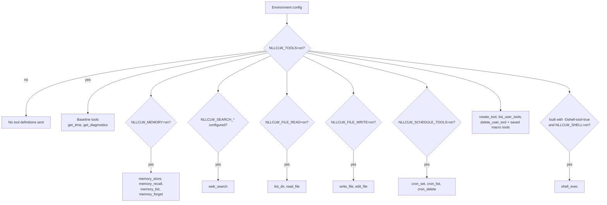
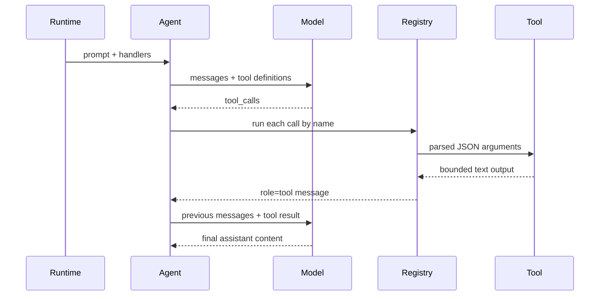

# Ferramentas

Ferramentas permitem que o modelo peça ao `nllclw` para executar ações locais.
Ferramentas locais que não exigem serviços externos são habilitadas por padrão.
External web search e optional shell execution ainda exigem configuração
explícita.

## Capability Model



O default binary não contém `shell_exec`. Compile explicitamente:

```sh
zig build -Dshell-tool=true
```

Depois habilite em runtime:

```sh
NLLCLW_TOOLS=on
NLLCLW_SHELL=on
```

Para desabilitar todas as ferramentas:

```sh
NLLCLW_TOOLS=off
```

## Tool Loop



`NLLCLW_TOOL_MAX_ROUNDS` limita quantas rodadas assistant/tool exchange podem
acontecer antes de o agente retornar `ToolRoundLimit`.

Argumentos de built-in tools são objetos JSON exatos. JSON inválido, campos
obrigatórios ausentes, unknown fields, tipos de campo inválidos e falhas de
validação retornam um tool error para o modelo tratar.

## Ferramentas disponíveis

| Ferramenta | Gate | Efeito |
|---|---|---|
| `get_time` | `NLLCLW_TOOLS=on` default | Retorna local time usando `NLLCLW_TIMEZONE_OFFSET_MINUTES`. |
| `get_diagnostics` | `NLLCLW_TOOLS=on` default | Relata runtime capability/config status. |
| `web_search` | `NLLCLW_TOOLS=on` e um provider `NLLCLW_SEARCH_*` configurado | Chama o search provider selecionado pelo HTTP port. |
| `memory_store` | `NLLCLW_TOOLS=on`, `NLLCLW_MEMORY=on` defaults | Armazena um durable fact. |
| `memory_recall` | `NLLCLW_TOOLS=on`, `NLLCLW_MEMORY=on` defaults | Lê um durable fact. |
| `memory_list` | `NLLCLW_TOOLS=on`, `NLLCLW_MEMORY=on` defaults | Lista durable fact keys. |
| `memory_forget` | `NLLCLW_TOOLS=on`, `NLLCLW_MEMORY=on` defaults | Apaga um durable fact. |
| `list_dir` | `NLLCLW_FILE_READ=on` default | Lista um diretório relativo ao CWD. |
| `read_file` | `NLLCLW_FILE_READ=on` default | Lê um arquivo UTF-8 relativo ao CWD. |
| `write_file` | `NLLCLW_FILE_WRITE=on` default | Escreve atomicamente um arquivo UTF-8 relativo ao CWD. |
| `edit_file` | `NLLCLW_FILE_WRITE=on` default | Substitui a primeira correspondência exata de texto em um arquivo. |
| `cron_set` | `NLLCLW_SCHEDULE_TOOLS=on` default | Adiciona uma tarefa agendada local. |
| `cron_list` | `NLLCLW_SCHEDULE_TOOLS=on` default | Lista tarefas agendadas. |
| `cron_delete` | `NLLCLW_SCHEDULE_TOOLS=on` default | Apaga uma tarefa agendada. |
| `create_tool` | `NLLCLW_TOOLS=on` default | Cria uma persistent user-defined macro tool. |
| `list_user_tools` | `NLLCLW_TOOLS=on` default | Lista saved macro tools. |
| `delete_user_tool` | `NLLCLW_TOOLS=on` default | Apaga uma saved macro tool. |
| saved macro tools | `NLLCLW_TOOLS=on` default | Retornam saved action text para que o modelo possa executá-lo por built-in tools. |
| `shell_exec` | optional shell build plus `NLLCLW_SHELL=on` | Executa um shell command com timeout, combined output cap e saída de texto UTF-8 sem binary control bytes. |

## User-Defined Tools

User-defined tools são macro tools, não generated code. `create_tool` armazena
um name, description e natural-language action em `NLLCLW_USER_TOOLS_PATH`
(default `user-tools.jsonl` no user state directory).
Em turnos posteriores, saved tools são anunciadas como tool definitions normais.
Quando o modelo chama uma delas, `nllclw` retorna o saved action text e o modelo
continua o mesmo tool loop usando built-in tools.

Example:

```text
create_tool(name="daily_brief", description="Prepare a daily brief", action="Search for current project news, summarize it, and store the summary in memory.")
```

Tool names podem conter apenas letras, dígitos e underscores. Nomes que colidem
com built-in tools são rejeitados. Descriptions e actions são trimmed, bounded,
texto UTF-8 válido sem ASCII control bytes. O arquivo user-tool JSONL é limitado
a 128 KiB na leitura e na escrita, é aberto sem seguir terminal symlinks, e uma
saved action deve caber em `NLLCLW_TOOL_OUTPUT_MAX_BYTES` quando embrulhada como
tool result.

## Provedores de Web Search

`web_search` é uma ferramenta com um provedor selecionado por
`NLLCLW_SEARCH_PROVIDER`. O modo default `auto` escolhe a primeira chave
configurada nesta ordem: Tavily, Brave Search, Exa, Firecrawl, depois DuckDuckGo
apenas quando explicitamente habilitado.
Explicit key-based providers exigem sua `NLLCLW_SEARCH_*_KEY` correspondente.
Search keys não devem conter ASCII control bytes.
Queries são trimmed, UTF-8 válidas, control-free e têm no máximo 512 bytes.
Provider result text é formatado como UTF-8 válido sem binary control bytes;
tabs e newlines comuns dentro de result fields são normalizados para espaços.
Empty provider result objects são ignorados, e uma valid empty provider response
retorna `no results` em vez de uma linha placeholder sintética. Grupos nested
related-topic do DuckDuckGo são achatados até uma pequena bounded depth.

| Provider | Env | Notes |
|---|---|---|
| `tavily` | `NLLCLW_SEARCH_TAVILY_KEY=...` | POSTs to Tavily Search. |
| `brave` | `NLLCLW_SEARCH_BRAVE_KEY=...` | GETs Brave Web Search with `X-Subscription-Token`. |
| `exa` | `NLLCLW_SEARCH_EXA_KEY=...` | POSTs Exa Search with `x-api-key`. |
| `firecrawl` | `NLLCLW_SEARCH_FIRECRAWL_KEY=...` | POSTs Firecrawl Search with bearer auth. |
| `duckduckgo` | `NLLCLW_SEARCH_DUCKDUCKGO=on` or `NLLCLW_SEARCH_PROVIDER=duckduckgo` | No-key Instant Answer fallback, not a full web SERP API. |

Examples:

```sh
NLLCLW_TOOLS=on
NLLCLW_SEARCH_PROVIDER=auto
NLLCLW_SEARCH_BRAVE_KEY=...
```

```sh
NLLCLW_TOOLS=on
NLLCLW_SEARCH_PROVIDER=duckduckgo
```

## Entrega agendada

`cron_set` aceita `channel` e `chat_id` para entrega. Em turnos Telegram, o chat
atual se torna o default destination, então um prompt como "remind me here
tomorrow" pode criar um Telegram schedule sem expor um chat id no model-facing
user text.

Scheduled actions são trimmed, devem ser UTF-8 válidas sem ASCII control bytes e
são limitadas a 2048 bytes. O arquivo schedule JSONL é limitado a 128 KiB na
leitura e na escrita; oversized snapshots são rejeitados antes de atomic
replacement.
`cron_set` aceita apenas os timing fields que correspondem ao seu `type`:
`interval_*` para periodic schedules, `delay_*` para one-shot schedules e
`hour`/`minute` para daily schedules.
O daemon commita um schedule apenas depois que o scheduled prompt termina e
qualquer delivery configurada tem sucesso; deliveries failed ou blocked tentam
novamente depois que o local lease expira.

Destinos suportados:

| Canal | Comportamento |
|---|---|
| `local` | Daemon escreve o resultado em stdout. |
| `telegram` | Daemon envia o resultado ao Telegram chat id armazenado usando `NLLCLW_TELEGRAM_TOKEN`. |

## Modelo de segurança do sistema de arquivos

Filesystem tools são conservadoras:

- paths devem ser relativos ao current working directory;
- paths devem ser UTF-8 válidos, control-free e ter no máximo 512 bytes;
- absolute POSIX paths são rejeitados;
- absolute ou drive-qualified Windows paths são rejeitados;
- components vazios, `.` e `..` são rejeitados, exceto que `list_dir` aceita
  literal `.` para o diretório atual;
- denied components incluem `.env`, `.env.*`, `config.json`, `.nllclw-*`,
  `.git`, `.ssh`, `.gnupg`, `.aws`, `.npmrc`, `id_rsa`, `id_ed25519`;
- denied Windows device names incluem `CON`, `PRN`, `AUX`, `NUL`, `CONIN$`,
  `CONOUT$`, `COM1` through `COM9` e `LPT1` through `LPT9`, inclusive com
  extensions;
- Windows-reserved filename punctuation (`<`, `>`, `:`, `"`, `|`, `?`, `*`) é
  rejeitada para portable behavior;
- path components terminados em espaço ou ponto são rejeitados para portable
  behavior;
- denied suffixes incluem `.pem`, `.key`, `.p12`, `.pfx`;
- intermediate directories são abertos sem seguir symlinks;
- terminal files são abertos sem seguir symlinks;
- reads e writes exigem texto UTF-8 válido sem binary control bytes;
- `list_dir` emite nomes em sorted order e omite nomes denied, non-UTF-8 ou com
  control-character;
- writes usam atomic replacement e private file permissions onde houver suporte;
- output é limitado por `NLLCLW_TOOL_OUTPUT_MAX_BYTES`.

Isto é um limite local de segurança, não um sandbox. Execute `nllclw` apenas em
diretórios onde você aceita conceder as capabilities habilitadas.

## Adicionar uma ferramenta

A forma preferida é:

1. Adicione um módulo focado em `src/tools/<name>.zig`.
2. Defina um `chat.ToolDefinition`.
3. Implemente uma pequena client struct que possui apenas as dependências de que
   precisa.
4. Faça parse de JSON arguments com `std.json.parseFromSlice`.
5. Retorne owned text output limitado por `NLLCLW_TOOL_OUTPUT_MAX_BYTES`.
6. Registre o handler em `src/tools/catalog.zig` atrás de um config gate
   explícito se ele lê ou altera local state.
7. Adicione testes para success, invalid JSON/arguments, bounds e denied access.

Não coloque infrastructure adapters em `src/tools/`. Se uma ferramenta precisar
de persistence ou HTTP, defina ou reutilize uma port e injete-a pelo catalog.
