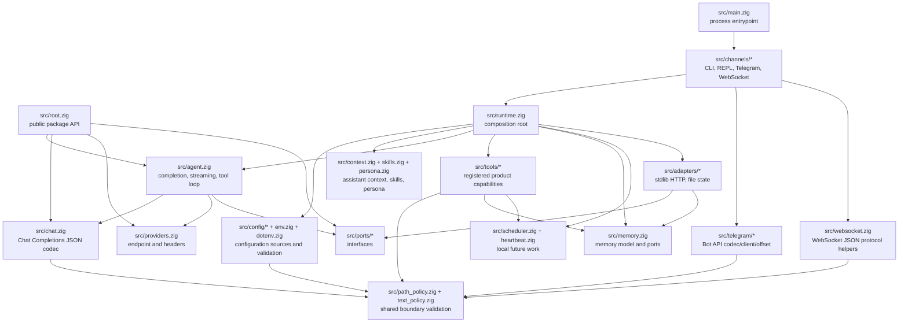
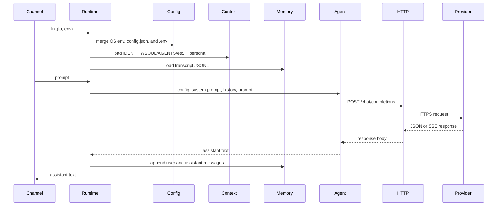
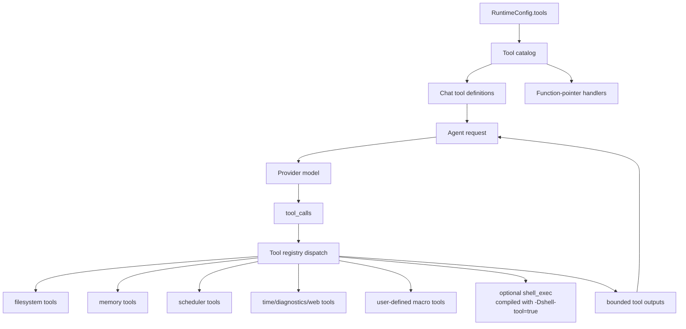
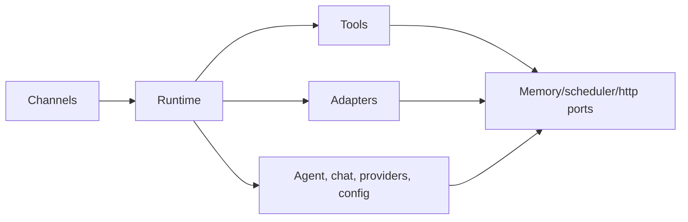

# Архитектура

`nllclw` — компактный AI assistant, собранный как Zig package плюс один
executable. Главная цель дизайна — сохранить agent engine тестируемым и при
этом поставлять небольшой standalone binary.

## Цели

- Держать provider wire contract простым: OpenAI-compatible Chat Completions.
- Держать runtime dependencies явными: default build использует только Zig
  stdlib.
- Держать локальные capabilities за capability gates и простыми для аудита.
- Держать каналы тонкими: CLI, REPL, Telegram, WebSocket, heartbeat и daemon
  вызывают один и тот же runtime и agent engine.
- Держать public package API достаточно маленьким, чтобы по нему было удобно
  учиться.

## Карта слоев



## Поток запроса

Один и тот же engine обрабатывает argv prompts, stdin prompts, REPL turns,
Telegram messages, WebSocket prompts, heartbeat tasks и due schedules.



## Поток Tool Loop

Tools являются product capabilities, а не infrastructure adapters. Они живут в
`src/tools/` и предоставляются модели только через `src/tools/catalog.zig`.



Агент повторяет этот loop, пока не произойдет одно из трех событий:

- модель вернет assistant content без tool calls;
- достигнут `NLLCLW_TOOL_MAX_ROUNDS`;
- произойдет provider error, malformed provider response, allocation failure
  или другая fatal dispatch error.

Non-fatal tool failures возвращаются модели как tool messages вида
`tool error: ...`, чтобы модель могла восстановиться, выбрать другие аргументы
или объяснить ошибку. Allocation failures все равно прерывают turn.

Streaming намеренно выключается, когда tools включены. Ассистенту нужен полный
ответ модели, чтобы знать, какие tool calls запускать.

`src/chat.zig` валидирует каждую request string как UTF-8 text без binary
control bytes до JSON encoding. Это держит поля Chat Completions как JSON
strings вместо того, чтобы arbitrary byte slices деградировали в arrays. Для
SSE `[DONE]` является terminal; последующие chunks игнорируются.

## Ответственность модулей

| Путь | Ответственность |
|---|---|
| `src/main.zig` | Минимальный executable entrypoint и process exit. |
| `src/root.zig` | Stable public API: config, chat types, HTTP port, streaming sink, `complete`. |
| `src/runtime.zig` | Composition root для CLI-like operation: config, HTTP adapter, memory adapter, context, tools. |
| `src/agent.zig` | Channel-neutral one-turn assistant engine, streaming и tool loop. |
| `src/chat.zig` | JSON request/response codec для Chat Completions, включая tools и SSE chunks. |
| `src/providers.zig` | Provider presets и compatible-provider endpoint validation. |
| `src/config/*` | Typed runtime config, source collection, validation и owned copies. |
| `src/channels/*` | User I/O orchestration для CLI, REPL, Telegram, WebSocket и daemon commands. |
| `src/tools/*` | Tool definitions, local capabilities и user-defined macro tools. |
| `src/skills.zig` | Компактный index `skills/*.md` для on-demand local skill loading. |
| `src/persona.zig` | Runtime presentation modes, добавляемые в system prompt. |
| `src/memory.zig` | Transcript/fact models, JSONL parsers и memory store ports. |
| `src/adapters/*` | Конкретные stdlib adapters для ports. |
| `src/ports/*` | Function-pointer interfaces для testable boundaries. |
| `src/telegram/*` | Telegram Bot API wire helpers. |
| `src/websocket.zig` | Testable WebSocket JSON message/event helpers. |

## Public Package API

Consumers импортируют package module как `nllclw`. Exported surface маленький:

```zig
const nllclw = @import("nllclw");

const cfg: nllclw.Config = .{
    .provider = .openrouter,
    .api_key = "...",
    .model = "openai/gpt-chat-latest",
};

const text = try nllclw.complete(allocator, http_client, cfg, "hello");
```

Public API предоставляет:

- `ProviderKind`
- `PersonaKind`
- `Config`
- chat request/tool types
- `HttpClient`, `HttpResponse`, `HttpHeader`, `HttpStatusCode`
- `Diagnostic`
- `ToolOptions`, `ToolHandler`, `ToolRunError`, `CompleteOptions`
- `StreamError`, `StreamSink`
- `complete` и `completeWithOptions`

Runtime-only details, такие как загрузка `config.json`/`.env`, file memory,
Telegram polling и stdlib HTTP adapter, остаются вне public root. Public tool
handler является только function-pointer abstraction, нужной `ToolOptions`;
built-in product tools и их file-backed stores остаются internal.

## Направление зависимостей

Направление зависимостей явное:



Core code не знает о process env, `config.json`, `.env`, filesystem paths,
Telegram polling или `std.http.Client`. Эти детали собираются в `runtime.zig` и
каналах.

## Владение памятью

Код следует Zig-стилю явного ownership:

- Functions, которые выделяют память, возвращают owned slices и документируют
  ownership через `defer`/`deinit` patterns рядом с call sites.
- Long-lived runtime state принадлежит `Runtime` и освобождается в
  `Runtime.deinit`.
- Parsed config может быть borrowed из source buffers или copied в
  `config.Owned` для runtime storage.
- Tool outputs принадлежат агенту, пока не будут отправлены обратно модели, а
  затем освобождаются после loop.

## Cross-Platform Runtime Model

Default binary предназначен для запуска везде, где Zig и Zig standard library
могут поддерживать target:

- нет `curl`;
- нет provider SDK;
- нет package dependencies в `build.zig.zon`;
- нет shell process в default build;
- `std.http.Client` для HTTPS;
- `std.Io` для files, stdin/stdout/stderr и timers.

Optional shell tool является отдельным build flavor:

```sh
zig build -Dshell-tool=true
```

Этот flavor не является default, потому что может запускать `sh` или `cmd.exe`
при включении во время выполнения.
