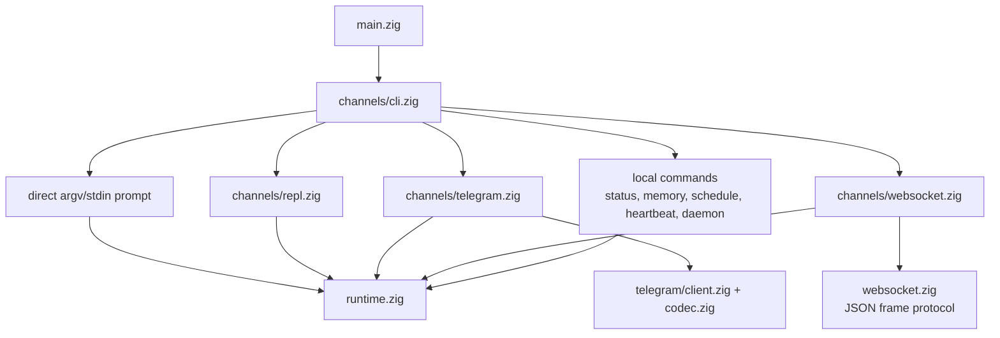
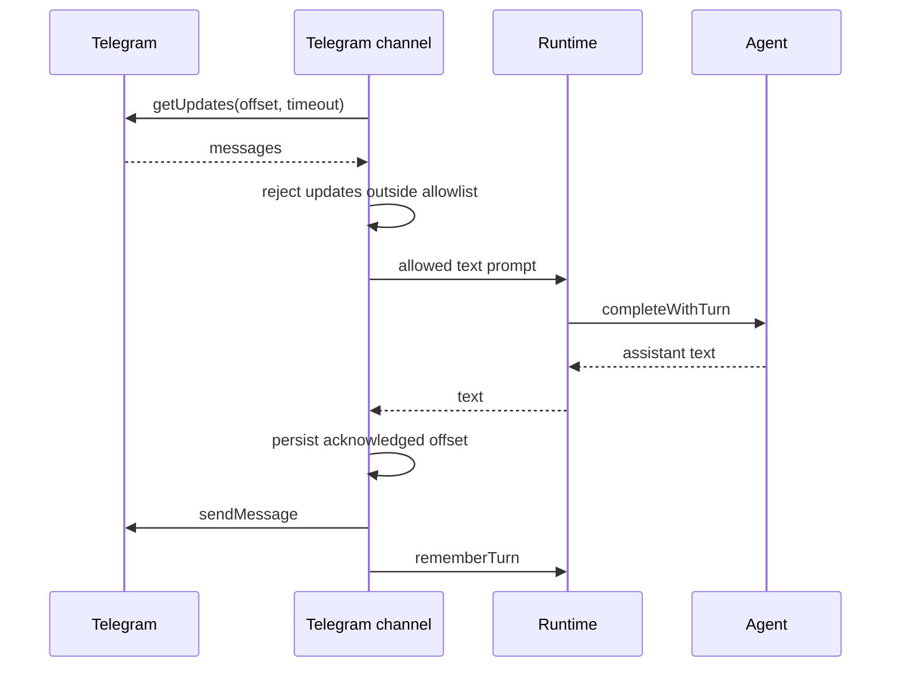
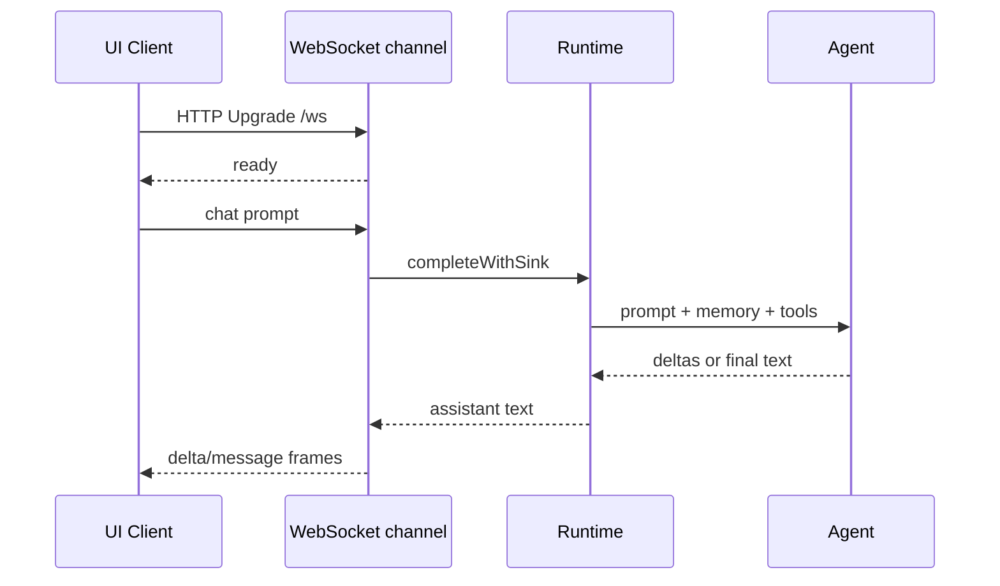

# Каналы

Каналы — это пользовательские способы говорить с одним и тем же runtime и
agent engine. Они разбирают input, владеют channel-specific I/O и делегируют
completions в `runtime.zig`.

## Карта каналов



## Direct CLI

Prompt from argv:

```sh
nllclw "explain this repository in one paragraph"
```

Prompt from stdin:

```sh
printf 'summarize this text\n' | nllclw
```

`NLLCLW_STREAM=on` является default:

```sh
NLLCLW_STREAM=on
```

Tool loop также включен по умолчанию, а tool output не streaming, потому что
agent должен проверить полные tool calls перед dispatch local functions. Для
pure streaming chat задайте `NLLCLW_TOOLS=off`.

Direct slash commands обрабатываются локально:

```sh
nllclw /settings
nllclw /diag memory
nllclw /persona technical
```

Эти команды не вызывают model.

## Interactive REPL

Когда stdin является TTY и prompt не передан, `nllclw` запускает маленький
terminal chat loop:

```sh
nllclw
```

Exit commands:

```text
:q
:quit
exit
```

Каждый turn использует ту же runtime memory и tool configuration, что и direct
CLI mode.

## Telegram

Telegram mode использует Bot API long polling:

```sh
NLLCLW_TELEGRAM_TOKEN=123456:bot-token
NLLCLW_TELEGRAM_CHAT_ID=123456789
nllclw telegram
```

`NLLCLW_TELEGRAM_CHAT_ID` также может быть private-chat или public-chat
Telegram username, с `@` или без, например `@donprus` или `donprus`.

Security properties:

- `NLLCLW_TELEGRAM_CHAT_ID` обязателен;
- messages outside configured chat id или username allowlist игнорируются;
- local nonblocking lock останавливает второй процесс `nllclw telegram` на том
  же state directory до Bot API polling;
- accepted message text должен быть valid UTF-8 без binary control bytes;
  malformed text updates пропускаются, но polling offset все равно advances;
- last acknowledged update id хранится в user state directory;
- restarts continue from stored offset и не replay handled messages.
- model-backed messages ограничены rate limit через
  `NLLCLW_TELEGRAM_RATE_LIMIT_PER_MINUTE` (default `20`, `0` disables); local
  slash commands не rate-limited.

Если другая машина, deployment или старый binary уже использует `getUpdates`
для того же bot token, Telegram возвращает HTTP `409`. `nllclw` печатает
конкретную подсказку для этого конфликта.

Flow:



## WebSocket

WebSocket mode запускает локальный RFC6455 server для custom browser, desktop
или mobile UIs:

```sh
NLLCLW_WS_TOKEN=change-me nllclw websocket
```

Default bind settings:

```sh
NLLCLW_WS_HOST=127.0.0.1
NLLCLW_WS_PORT=8765
NLLCLW_WS_PATH=/ws
```

Default bind address только loopback, но канал все равно требует
`NLLCLW_WS_TOKEN`, чтобы случайные browser pages не могли говорить с local
agent. Remote binds требуют оба флага:

```sh
env NLLCLW_WS_HOST=0.0.0.0 \
  NLLCLW_WS_ALLOW_REMOTE=on \
  NLLCLW_WS_TOKEN=change-me \
  nllclw websocket
```

Loopback browser clients могут передать token как query parameter:

```js
const socket = new WebSocket("ws://127.0.0.1:8765/ws?token=change-me");

socket.addEventListener("message", (event) => {
  const message = JSON.parse(event.data);
  console.log(message.type, message.content ?? message.message);
});

socket.addEventListener("open", () => {
  socket.send(JSON.stringify({
    type: "chat",
    prompt: "Explain this repository in one paragraph."
  }));
});
```

Query authentication принимает ровно один параметр `token`. Duplicate token
parameters отклоняются как ambiguous.

Remote clients должны использовать ровно один bearer token header. Browser-based
remote UIs должны подключаться через trusted local или reverse proxy, который
вставляет этот header.

```text
Authorization: Bearer change-me
```

Client messages:

```json
{ "type": "chat", "prompt": "hello" }
{ "type": "status" }
{ "type": "ping" }
{ "type": "close" }
```

Plain text frames принимаются как chat prompts для простых clients. Text frames
должны быть valid UTF-8 без binary control bytes.
JSON command frames являются exact objects; unknown fields отклоняются, и
только `chat`/`message` frames могут включать `prompt`.
Server handles one active WebSocket client at a time. Additional clients can
connect after the active client disconnects.

Server messages:

```json
{ "type": "ready", "version": 1, "channel": "websocket" }
{ "type": "delta", "content": "partial text" }
{ "type": "message", "content": "final text" }
{ "type": "status", "content": "nllclw: ok ..." }
{ "type": "pong", "content": "pong" }
{ "type": "error", "message": "request failed" }
```

`delta` frames отправляются только когда `NLLCLW_STREAM=on` и
`NLLCLW_TOOLS=off`. С включенными tools model должна завершить tool-call
planning, прежде чем channel сможет отправить final `message`.

Flow:



## Local Commands

Local commands не спрашивают model, если команда явно не запускает task:

```sh
nllclw status
nllclw doctor
nllclw memory list
nllclw memory get project.goal
nllclw memory forget project.goal
nllclw memory reset
nllclw schedule list
nllclw schedule delete 1
```

`status` печатает quick health line. `doctor` печатает full diagnostics report.

## Shared Slash Commands

REPL, Telegram и direct CLI используют один slash parser:

| Command | Effect |
|---|---|
| `/start`, `/help` | Показывает local command help. |
| `/settings` | Показывает quick runtime status. |
| `/diag [scope]` | Показывает diagnostics для `quick`, `runtime`, `memory`, `rates`, `time` или `all`. |
| `/persona [mode]` | Показывает или задает runtime persona: `neutral`, `friendly`, `technical`, `witty`. |
| `/stop` | Приостанавливает Telegram intake для текущего процесса. Другие каналы сообщают, что это только для Telegram. |
| `/resume` | Возобновляет Telegram intake. Другие каналы сообщают, что это только для Telegram. |
| `/chatid` | Печатает Telegram chat id и username fields, когда доступны. Другие каналы сообщают, что это только для Telegram. |

Persona changes являются runtime-only для текущего процесса. Чтобы выбрать
startup persona, задайте `NLLCLW_PERSONA`.

## Heartbeat

`nllclw heartbeat` читает `HEARTBEAT.md` и превращает pending items в один
prompt. Только conservative task syntax считается actionable:

- unchecked markdown task lines;
- lines starting with `TODO:`.

```sh
nllclw heartbeat
```

Если pending task не найдена, command печатает короткое сообщение и exits
successfully.

## Daemon

`nllclw daemon` повторяет:

1. claims due scheduled tasks from the user state directory;
2. runs each claimed task through the normal runtime;
3. commits only completed schedule entries;
4. periodically runs heartbeat prompts.

```sh
NLLCLW_DAEMON_INTERVAL_SECONDS=60
NLLCLW_HEARTBEAT_INTERVAL_SECONDS=1800
nllclw daemon
```

Daemon является local и file-backed. Он не координируется между несколькими
machines.

Claimed schedules используют local lease. Если provider execution, destination
preflight или delivery fails, task не committed; она снова становится eligible
после lease expires.

Когда schedule создается из Telegram, `cron_set` по умолчанию использует
`channel=telegram` и current chat id. Daemon отправляет completed scheduled
result обратно в этот chat через `NLLCLW_TELEGRAM_TOKEN`. Local schedules все
равно пишут в stdout.
